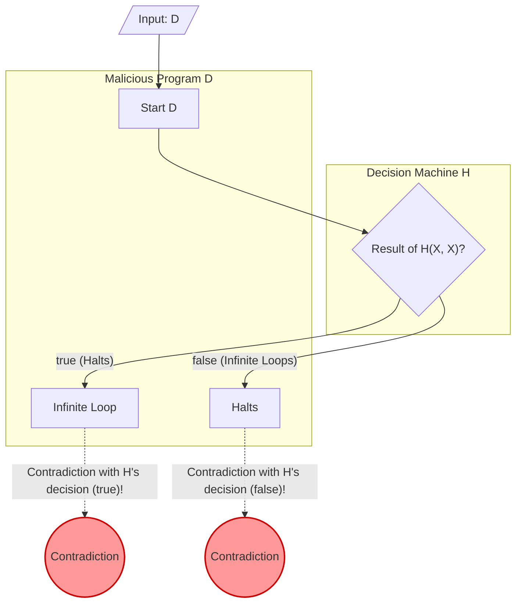

When programming, you might sometimes feel anxious, wondering, "Is this program falling into an infinite loop somewhere?" If there were a tool that could **reliably determine whether any given program will fall into an infinite loop**, development and debugging would become dramatically easier.

However, in the field of computer science, it has been mathematically proven that such a dream tool **"can never be created."** This is the famous **"[Halting Problem](https://kenji.blog/en/p/turing-machine-computability/)."**

In this article, we will explain this problem, which was proven by [Alan Turing](https://kenji.blog/en/p/turing/) in 1936, in an easy-to-understand manner using intuitive concrete examples, mathematical formulas (KaTeX), and diagrams (Mermaid).

## What is the [Halting Problem](https://kenji.blog/en/p/turing-machine-computability/)?

[The Halting Problem](https://kenji.blog/en/p/halting-problem/) refers to the following problem:

> Given an arbitrary computer program and an input, does a general algorithm exist that can determine whether the program will finish (halt) in a finite amount of time, or run forever (infinite loop)?

If this were possible, a function like `Halt(P, I)` below could be implemented.

```python
def Halt(P, I):
    """
    When program P is given input I,
    returns true if it halts,
    and returns false if it falls into an infinite loop.
    """
    # The dream universal algorithm...
```

At first glance, it feels like it could be created by performing static analysis on the source code or simulating its execution. Let's look at some simple examples.

### Intuitive Concrete Examples

**Example 1: A program that clearly halts**

```python
def example1(x):
    return x * 2
```
This program `example1` will immediately return a number and halt, regardless of the input. Therefore, `Halt(example1, input)` should be `true`.

**Example 2: A program that clearly infinite loops**

```python
def example2(x):
    while True:
        pass
```
This program `example2` will never break out of the loop process. Therefore, `Halt(example2, input)` should be `false`.

**Example 3: A program that is difficult to determine (Collatz conjecture)**

```python
def collatz(n):
    while n > 1:
        if n % 2 == 0:
            n = n // 2
        else:
            n = 3 * n + 1
```
This function repeats the operation of halving the given number if it is even, or tripling it and adding 1 if it is odd, until it becomes 1. Whether this program halts for all positive integers is an unsolved problem in mathematics called the "Collatz conjecture." If a universal `Halt` function existed, even unsolved mathematical problems could be solved just by passing the program to it.

## Proof by Mathematical Formulas and Contradiction

Turing proved that a universal `Halt` function does not exist by using **"Proof by Contradiction."** Proof by contradiction is a proof method that shows that assuming a certain proposition is true leads to a contradiction, thereby concluding that the original assumption was wrong.

To begin the proof, first, assume that a universal decision algorithm $H$ exists. The function $H(P, I)$, which takes a program $P$ and its input $I$, is defined as follows:

$$
H(P, I) =
\begin{cases}
\text{true} & (\text{if program } P \text{ halts with input } I) \\
\text{false} & (\text{if program } P \text{ infinite loops with input } I)
\end{cases}
$$

We assume that this $H$ will always return `true` or `false` in a finite amount of time for any program and input.

Next, using the result of this $H$, we create a malicious program $D$ (Deceiver). The program $D$ takes another program $X$ as input and behaves as follows:

```python
def D(X):
    if H(X, X) == True:
        while True:
            pass  # Infinite loops
    else:
        return  # Halts
```

The behavior of program $D(X)$ is as follows:
1. It uses $H(X, X)$ to determine whether program $X$ halts when given $X$ itself as input.
2. If $H(X, X)$ is `true` (i.e., $X(X)$ halts), it deliberately goes into an **infinite loop**.
3. If $H(X, X)$ is `false` (i.e., $X(X)$ infinite loops), it deliberately **halts**.

Here is the core of the proof. **What happens if we give this malicious program $D$ itself as input to $D$?** In other words, let's consider the behavior when $D(D)$ is executed.

Let's break it down by cases.

### Case 1: Assume $D(D)$ halts

If we assume $D(D)$ halts, the decision algorithm $H(D, D)$ should return `true`.
However, looking at the definition of $D$, if $H(D, D)$ is `true`, $D$ enters `while True` and **infinite loops**.
This contradicts the premise that "$D(D)$ halts."

### Case 2: Assume $D(D)$ infinite loops

If we assume $D(D)$ infinite loops, the decision algorithm $H(D, D)$ should return `false`.
However, looking at the definition of $D$, if $H(D, D)$ is `false`, $D$ immediately `return`s and **halts**.
This contradicts the premise that "$D(D)$ infinite loops."

### Conclusion

A contradiction occurs no matter which way you go. This contradiction arose because the initial assumption, "a universal decision algorithm $H$ exists," was wrong.

Therefore, it is proven that **a universal algorithm that determines the halting of any arbitrary program does not exist**.

## Diagram: The Mechanism of the Contradiction

Let's illustrate the logic of this proof by contradiction using Mermaid.



As the diagram shows, the moment $D$ itself is provided as input, a loop (paradox) occurs where the determination result and the actual behavior reverse, causing logic to break down. It has a structure very similar to the liar paradox, "This statement is false."

## History of Computers and the [Turing Machine](https://kenji.blog/en/p/turing-machine-computability/)

[Alan Turing](https://kenji.blog/en/p/turing/) raised and proved this problem in 1936, an era before modern electronic computers existed. To rigorously define mathematically "what computation is," he devised a hypothetical machine called the **"[Turing Machine](https://kenji.blog/en/p/turing-machine-computability/)."**

A Turing Machine consists of an infinitely long tape, a head that reads and writes information on the tape, and a state transition table that manages the state of the machine. It is known that no matter how complex a modern program is, it can theoretically be reduced to this Turing Machine. This is called the **"Church-Turing Thesis."**

Turing attempted to draw a line between "computable problems" and "uncomputable problems" using this simple model. [The Halting Problem](https://kenji.blog/en/p/halting-problem/), a prime example of an undecidable problem, was discovered as a result.

## Deep Connection with [Gödel's Incompleteness Theorems](https://kenji.blog/en/p/godels-incompleteness-theorems/)

The "paradox of self-reference" that underlies the proof of the [Halting Problem](https://kenji.blog/en/p/turing-machine-computability/) is deeply connected to the **"Incompleteness Theorems"** published by [Kurt Gödel](https://kenji.blog/en/p/godel/) in 1931, slightly before Turing.

Gödel's First Incompleteness Theorem states that "in any sufficiently powerful axiomatic system that includes the theory of natural numbers, there always exists a true statement that can neither be proven nor disproven." When proving this theorem, Gödel mathematically constructed a self-referential proposition stating, "This proposition cannot be proven."

The malicious program $D$ in Turing's [Halting Problem](https://kenji.blog/en/p/turing-machine-computability/) makes a self-reference in the form of "infinite looping if the decision machine $H$ determines it halts, and halting if it determines it infinite loops." In other words, the Halting Problem can also be interpreted as the **programming version of the Incompleteness Theorem** on the stage of computer science. These two great proofs, which indicate the limits of logic, share the exact same paradox structure.

## The Meaning This Theorem Brings Today

The fact that the Halting Problem is "Undecidable" holds significant meaning even in modern software engineering.

### Extension to Rice's Theorem

[The Halting Problem](https://kenji.blog/en/p/halting-problem/) developed further into the more general **"Rice's Theorem."** Rice's Theorem states that "there is no general algorithm that determines whether a program possesses any non-trivial semantic property."

In other words, it is generally undecidable not only whether a program will fall into an infinite loop, but also questions like the following:
- "Does this function always return 0?"
- "Does a specific bug exist in this program?"
- "Will this system cause an invalid memory access?"

### Compromises in the Practical World

Software engineers haven't given up just because something "generally cannot be solved."
Modern compilers, static code analysis tools, and antivirus software that detects malware provide practical benefits by making the following compromises:

- **Heuristics**: Giving up on 100% certainty, they deduce "this is probably a bug" or "this is probably malicious behavior" from common patterns.
- **Restricted Languages**: Guaranteeing specific safety by using restricted languages or type systems that are not Turing complete (where infinite loops cannot even be written in the first place).
- **Timeouts**: If a calculation doesn't finish after a certain amount of time, it is treated as a "timeout" and the process is forcefully terminated.

## Conclusion

In this article, we explained the **[Halting Problem](https://kenji.blog/en/p/turing-machine-computability/)** proven by Turing.

- There is no algorithm that can reliably determine whether any arbitrary program will halt in a finite amount of time.
- Assuming a decision machine $H$ exists leads to a contradiction due to a malicious program $D$ that betrays the decision result (Proof by Contradiction).
- This theorem illustrates the "logical limits" that computers possess and is the fundamental reason why modern software development tools require "guessing" and "compromise."

Because a perfect program analysis tool cannot be mathematically created, testing and design by programmers themselves are still considered crucial today. When coding, don't forget to think about the possibility of infinite loops with your own head.
