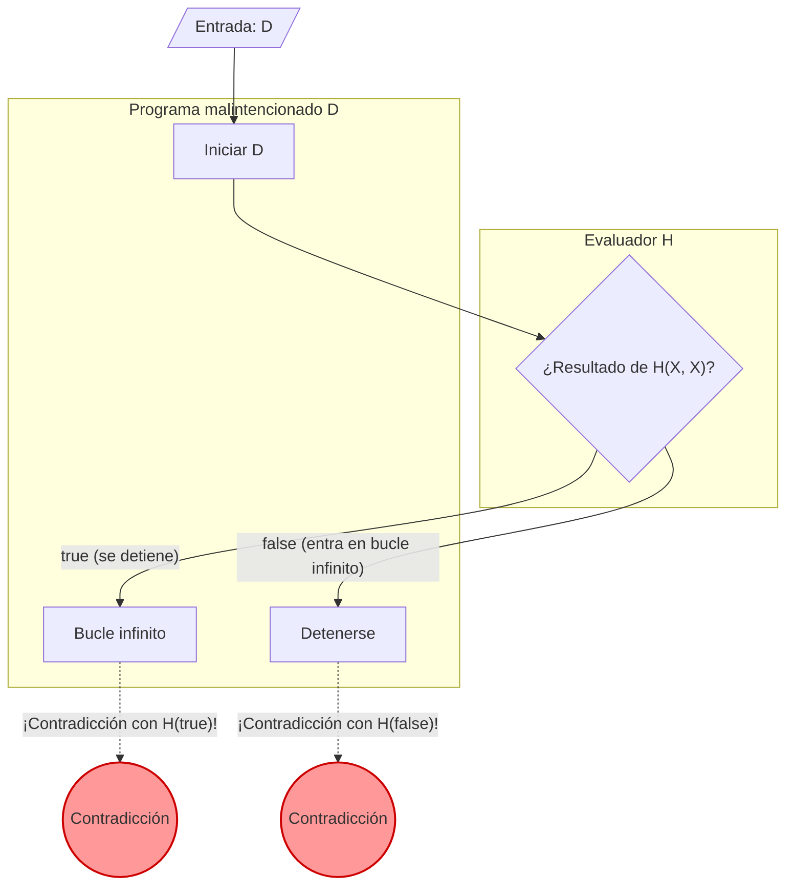

Cuando programamos, a veces nos preocupamos: "¿Habrá entrado este programa en un bucle infinito en algún lugar?". Si existiera una **herramienta que determinara con certeza si cualquier programa dado va a entrar en un bucle infinito**, el desarrollo y la depuración serían drásticamente más fáciles.

Sin embargo, en el campo de la informática, está matemáticamente demostrado que crear tal herramienta soñada es **"absolutamente imposible"**. Este es el famoso **"Problema de la Parada" (Halting Problem)**.

En este artículo, explicaremos de forma clara este problema, demostrado en 1936 por Alan Turing, utilizando ejemplos intuitivos, fórmulas (KaTeX) y diagramas (Mermaid).

## ¿Qué es el Problema de la Parada?

El Problema de la Parada se refiere a la siguiente cuestión:

> Dado un programa de ordenador arbitrario y su entrada, ¿existe un algoritmo general para determinar si ese programa terminará (se detendrá) en un tiempo finito o seguirá ejecutándose para siempre (entrará en un bucle infinito)?

Si esto fuera posible, deberíamos poder implementar una función como `Halt(P, I)`.

```python
def Halt(P, I):
    """
    Cuando se da una entrada I al programa P,
    devuelve true si se detiene,
    devuelve false si entra en un bucle infinito.
    """
    # El algoritmo universal soñado...
```

A simple vista, parece que podría crearse haciendo un análisis estático del código fuente o simulando su ejecución. Veamos unos ejemplos simples.

### Ejemplos intuitivos

**Ejemplo 1: Un programa que claramente se detiene**

```python
def example1(x):
    return x * 2
```
Este programa `example1` devuelve un número y se detiene inmediatamente, sea cual sea la entrada. Por lo tanto, `Halt(example1, input)` debería ser `true`.

**Ejemplo 2: Un programa que claramente entra en bucle infinito**

```python
def example2(x):
    while True:
        pass
```
Este programa `example2` nunca saldrá del bucle para siempre. Por lo tanto, `Halt(example2, input)` debería ser `false`.

**Ejemplo 3: Un programa difícil de juzgar (Conjetura de Collatz)**

```python
def collatz(n):
    while n > 1:
        if n % 2 == 0:
            n = n // 2
        else:
            n = 3 * n + 1
```
Esta función repite la operación de dividir el número por la mitad si es par, o triplicarlo y sumarle 1 si es impar, hasta que se convierte en 1. Si este programa se detiene para todos los números enteros positivos es un problema matemático sin resolver conocido como la "Conjetura de Collatz". Si existiera una función `Halt` universal, podríamos resolver incluso problemas matemáticos no resueltos simplemente pasándole el programa.

## Fórmulas y demostración por reducción al absurdo

Turing demostró que no existe una función universal `Halt` utilizando la **"Reducción al absurdo" (Proof by Contradiction)**. La reducción al absurdo es un método de demostración que muestra que asumir que una proposición es cierta lleva a una contradicción, concluyendo que la suposición original era incorrecta.

Para comenzar la demostración, primero asumimos que existe un algoritmo de evaluación universal $H$. La función $H(P, I)$ que recibe el programa $P$ y su entrada $I$, se define de la siguiente manera:

$$
H(P, I) =
\begin{cases}
\text{true} & (\text{Si el programa } P \text{ se detiene con la entrada } I) \\
\text{false} & (\text{Si el programa } P \text{ entra en bucle infinito con la entrada } I)
\end{cases}
$$

Asumimos que este $H$ siempre devuelve `true` o `false` en tiempo finito para cualquier programa y entrada.

A continuación, utilizando el resultado de este $H$, creamos un programa malintencionado $D$ (Deceiver, el que engaña). El programa $D$ recibe otro programa $X$ como entrada y se comporta de la siguiente manera:

```python
def D(X):
    if H(X, X) == True:
        while True:
            pass  # Entra en bucle infinito
    else:
        return  # Se detiene
```

El comportamiento del programa $D(X)$ es el siguiente:
1. Evalúa con $H(X, X)$ si el programa $X$ se detiene cuando se le da $X$ mismo como entrada.
2. Si $H(X, X)$ es `true` (es decir, $X(X)$ se detiene), $D$ **entra a propósito en un bucle infinito**.
3. Si $H(X, X)$ es `false` (es decir, $X(X)$ entra en bucle infinito), $D$ **se detiene a propósito**.

Aquí está el núcleo de la demostración. **¿Qué pasaría si le damos a este programa malintencionado $D$ a sí mismo como entrada?** En otras palabras, consideramos el comportamiento cuando se ejecuta $D(D)$.

Considerémoslo analizando los casos.

### Caso 1: Asumimos que $D(D)$ se detiene

Si asumimos que $D(D)$ se detiene, el algoritmo de evaluación $H(D, D)$ debería devolver `true`.
Sin embargo, mirando la definición de $D$, si $H(D, D)$ es `true`, $D$ entra en el `while True` y **entra en un bucle infinito**.
Esto contradice la premisa de que "$D(D)$ se detiene".

### Caso 2: Asumimos que $D(D)$ entra en bucle infinito

Si asumimos que $D(D)$ entra en un bucle infinito, el algoritmo de evaluación $H(D, D)$ debería devolver `false`.
Sin embargo, mirando la definición de $D$, si $H(D, D)$ es `false`, $D$ ejecuta inmediatamente el `return` y **se detiene**.
Esto contradice la premisa de que "$D(D)$ entra en un bucle infinito".

### Conclusión

En ambos casos, hemos llegado a una contradicción. Esta contradicción surgió porque la suposición inicial de que "existe un algoritmo de evaluación universal $H$" era incorrecta.

Por lo tanto, se ha demostrado que **no existe un algoritmo universal que determine si un programa arbitrario se detendrá**.

## Diagrama: El mecanismo de la contradicción

Vamos a ilustrar la lógica de esta reducción al absurdo utilizando Mermaid.



Como se puede ver en el diagrama, en el momento en que se da $D$ a sí mismo como entrada, se produce un bucle en el que el resultado de la evaluación y la acción real se invierten (una paradoja), y la lógica colapsa. Tiene una estructura muy similar a la Paradoja del Mentiroso: "Esta oración es falsa".

## La historia de la informática y la máquina de Turing

Alan Turing planteó y demostró este problema en 1936, una época en la que los ordenadores electrónicos modernos (computadoras) aún no existían. Para definir matemáticamente y de manera estricta "¿qué es el cálculo?", inventó una máquina virtual llamada **"Máquina de Turing" (Turing Machine)**.

La Máquina de Turing consta de una cinta infinita, un cabezal que lee y escribe información en la cinta, y una tabla de transición de estados que gestiona el estado de la máquina. Se sabe que por muy complejo que sea un programa moderno, en teoría se puede reducir a esta Máquina de Turing. A esto se le llama la **"Tesis de Church-Turing" (Church-Turing Thesis)**.

Turing intentó trazar la línea entre los "problemas computables" y los "problemas no computables" utilizando este modelo simple. El resultado de este descubrimiento es el Problema de la Parada, el representante por excelencia de los problemas indecidibles.

## Profunda relación con el Teorema de Incompletitud de Gödel

La "paradoja de autorreferencia" que subyace en la demostración del Problema de la Parada tiene una profunda conexión con los **"Teoremas de Incompletitud" (Incompleteness Theorems)** publicados por Kurt Gödel en 1931, poco antes de Turing.

El Primer Teorema de Incompletitud de Gödel establece que "en cualquier sistema axiomático lo suficientemente poderoso como para incluir la teoría de números naturales, siempre habrá proposiciones verdaderas que no pueden ser probadas ni refutadas dentro del sistema". Gödel construyó matemáticamente una proposición autorreferencial como "Esta proposición no puede ser probada" al demostrar este teorema.

El programa malintencionado $D$ en el Problema de la Parada de Turing hace una autorreferencia de la forma: "si la máquina $H$ dictamina que se detiene, entonces entra en un bucle infinito, y si dictamina que entra en un bucle infinito, entonces se detiene". En otras palabras, el Problema de la Parada también puede interpretarse como la **versión programática del Teorema de Incompletitud** en el escenario de la informática. Estas dos grandes demostraciones que muestran los límites de la lógica comparten la misma estructura paradójica.

## Lo que este teorema significa hoy

El hecho de que el Problema de la Parada sea "indecidible (Undecidable)" tiene implicaciones muy importantes en la ingeniería de software actual.

### Extensión al Teorema de Rice

El Problema de la Parada evolucionó hacia un teorema aún más general, el **"Teorema de Rice" (Rice's Theorem)**. El teorema de Rice establece que "no existe un algoritmo general para determinar si un programa tiene propiedades semánticas no triviales".

En otras palabras, no solo si entrará en un bucle infinito, sino también se sabe que preguntas como las siguientes son generalmente indecidibles:
- "¿Esta función devuelve siempre 0?"
- "¿Existe un error (bug) específico en este programa?"
- "¿Este sistema causará un acceso a memoria inválido?"

### Compromisos en el mundo práctico

El hecho de que "generalmente no se puede resolver" no significa que los ingenieros de software se hayan rendido.
Los compiladores modernos, las herramientas de análisis de código estático y los programas antivirus que detectan malware ofrecen beneficios prácticos haciendo los siguientes compromisos:

- **Heurísticas**: Se renuncia al 100% de certeza y se infiere, a partir de patrones comunes, que "probablemente sea un bug" o "probablemente sea un comportamiento malicioso".
- **Lenguajes restringidos**: Al utilizar lenguajes o sistemas de tipos restringidos que no son Turing completos (donde no se pueden escribir bucles infinitos en primer lugar), se garantizan ciertas seguridades.
- **Tiempos de espera (Timeout)**: Si no termina de calcular en un tiempo determinado, se detiene forzosamente el proceso por un "timeout".

## Resumen

En este artículo, hemos explicado el **Problema de la Parada** demostrado por Turing.

- No existe un algoritmo que determine de manera fiable si un programa arbitrario se detendrá en un tiempo finito.
- Si asumimos que existe una máquina evaluadora $H$, un programa malicioso $D$ que traiciona el resultado de la evaluación generará una contradicción (reducción al absurdo).
- Este teorema muestra las "limitaciones lógicas" de las computadoras, y es la razón fundamental por la cual las modernas herramientas de desarrollo de software necesitan recurrir a "suposiciones" y "compromisos".

Es precisamente porque no se puede crear matemáticamente la herramienta de análisis de programas perfecta, que el diseño y las pruebas realizadas por los propios programadores siguen siendo tan importantes hoy en día. Al escribir código, no olvides pensar con tu propia cabeza en la posibilidad de bucles infinitos.
