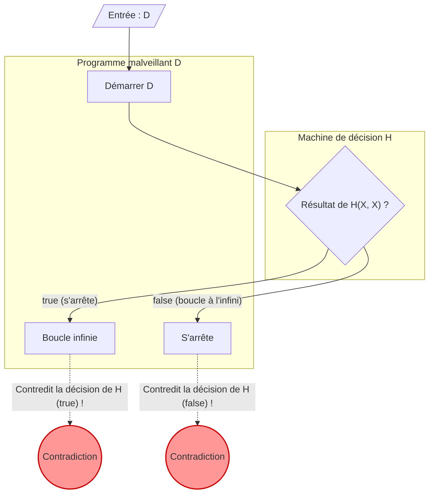

Lorsque l'on programme, il arrive d'être inquiet et de se demander : « Ce programme ne va-t-il pas finir en boucle infinie quelque part ? » S'il existait un **outil capable de déterminer avec certitude si n'importe quel programme finira par boucler à l'infini ou non**, le développement et le débogage deviendraient incroyablement plus simples.

Cependant, dans le domaine de l'informatique, il a été mathématiquement prouvé qu'un tel outil de rêve est **« absolument impossible à créer »**. C'est le célèbre **« problème de l'arrêt ([Halting Problem](https://kenji.blog/fr/p/turing-machine-computability/)) »**.

Cet article explique clairement, à l'aide d'exemples concrets intuitifs, de formules mathématiques (KaTeX) et de schémas (Mermaid), ce problème dont la solution a été prouvée par [Alan Turing](https://kenji.blog/fr/p/turing/) en 1936.

## Qu'est-ce que le problème de l'arrêt ?

Le problème de l'arrêt désigne la question suivante :

> Étant donné un programme informatique quelconque et son entrée, existe-t-il un algorithme général permettant de déterminer si ce programme va s'arrêter dans un temps fini (se terminer) ou s'il va continuer à s'exécuter éternellement (boucle infinie) ?

Si cela était possible, nous devrions être capables d'implémenter la fonction suivante `Halt(P, I)` :

```python
def Halt(P, I):
    """
    Lorsqu'on donne l'entrée I au programme P,
    renvoie true s'il s'arrête,
    renvoie false s'il fait une boucle infinie.
    """
    # L'algorithme universel de rêve...
```

À première vue, on pourrait penser qu'il suffit de faire une analyse statique du code source ou d'en simuler l'exécution pour y parvenir. Regardons quelques exemples simples.

### Exemples concrets intuitifs

**Exemple 1 : Un programme qui s'arrête manifestement**

```python
def example1(x):
    return x * 2
```
Ce programme `example1` renvoie une valeur numérique et s'arrête immédiatement, quelle que soit son entrée. Ainsi, `Halt(example1, input)` devrait valoir `true`.

**Exemple 2 : Un programme qui boucle manifestement à l'infini**

```python
def example2(x):
    while True:
        pass
```
Ce programme `example2` ne sortira jamais de sa boucle. Ainsi, `Halt(example2, input)` devrait valoir `false`.

**Exemple 3 : Un programme dont l'évaluation est difficile (la conjecture de Syracuse/Collatz)**

```python
def collatz(n):
    while n > 1:
        if n % 2 == 0:
            n = n // 2
        else:
            n = 3 * n + 1
```
Cette fonction répète une opération sur un nombre donné : s'il est pair, elle le divise par deux ; s'il est impair, elle le multiplie par 3 et ajoute 1, et ce, jusqu'à ce qu'il devienne 1. Savoir si ce programme s'arrête pour tous les entiers positifs est un problème mathématique non résolu appelé la « conjecture de Collatz ». S'il existait une fonction `Halt` universelle, nous pourrions même résoudre des problèmes mathématiques non résolus simplement en passant le programme à cette fonction.

## La preuve par l'absurde avec des formules

Turing a utilisé la **« preuve par l'absurde (Proof by Contradiction) »** pour démontrer qu'une fonction `Halt` universelle n'existe pas. La preuve par l'absurde est une méthode de démonstration qui consiste à supposer qu'une certaine proposition est vraie, puis à montrer que cela conduit à une contradiction, ce qui permet de conclure que l'hypothèse de départ était fausse.

Pour commencer la preuve, on suppose d'abord qu'il existe un algorithme de décision universel $H$. La fonction $H(P, I)$, qui reçoit le programme $P$ et son entrée $I$, est définie comme suit :

$$
H(P, I) =
\begin{cases}
\text{true} & (\text{si le programme } P \text{ s'arrête pour l'entrée } I) \\
\text{false} & (\text{si le programme } P \text{ boucle à l'infini pour l'entrée } I)
\end{cases}
$$

On suppose que cette fonction $H$ renverra toujours `true` ou `false` dans un temps fini pour n'importe quel programme et entrée.

Ensuite, en utilisant le résultat de cette fonction $H$, nous créons un programme malveillant $D$ (Deceiver, le trompeur). Le programme $D$ prend un autre programme $X$ comme entrée et se comporte comme suit :

```python
def D(X):
    if H(X, X) == True:
        while True:
            pass  # boucle infinie
    else:
        return  # s'arrête
```

Le comportement du programme $D(X)$ est le suivant :
1. Il évalue avec $H(X, X)$ si le programme $X$ s'arrête lorsqu'on lui donne $X$ lui-même comme entrée.
2. Si $H(X, X)$ est `true` (c'est-à-dire que $X(X)$ s'arrête), il entre exprès dans une **boucle infinie**.
3. Si $H(X, X)$ est `false` (c'est-à-dire que $X(X)$ boucle à l'infini), il **s'arrête** exprès.

Voici le cœur de la preuve. **Que se passera-t-il si l'on donne ce programme malveillant $D$ lui-même comme entrée à $D$ ?** En d'autres termes, nous allons considérer le comportement lorsque $D(D)$ est exécuté.

Séparons la réflexion en différents cas.

### Cas 1 : Supposons que $D(D)$ s'arrête

Si on suppose que $D(D)$ s'arrête, l'algorithme de décision $H(D, D)$ devrait renvoyer `true`.
Cependant, en regardant la définition de $D$, si $H(D, D)$ est `true`, $D$ entre dans la boucle `while True` et se met à **boucler à l'infini**.
Cela contredit l'hypothèse de départ selon laquelle « $D(D)$ s'arrête ».

### Cas 2 : Supposons que $D(D)$ boucle à l'infini

Si on suppose que $D(D)$ boucle à l'infini, l'algorithme de décision $H(D, D)$ devrait renvoyer `false`.
Cependant, en regardant la définition de $D$, si $H(D, D)$ est `false`, $D$ fait immédiatement un `return` et **s'arrête**.
Cela contredit l'hypothèse de départ selon laquelle « $D(D)$ boucle à l'infini ».

### Conclusion

Peu importe la tournure que prennent les événements, une contradiction apparaît. Cette contradiction provient du fait que la première hypothèse, à savoir « l'existence d'un algorithme de décision universel $H$ », était fausse.

Il est par conséquent prouvé qu'**il n'existe pas d'algorithme universel capable de déterminer si un programme arbitraire s'arrêtera**.

## Schéma : Le mécanisme de la contradiction

Illustrons la logique de cette preuve par l'absurde avec Mermaid.



Comme le montre le schéma, dès l'instant où l'on donne $D$ lui-même en entrée, une boucle s'inverse où le résultat de la décision et l'action réelle entrent en contradiction (paradoxe), brisant ainsi la logique. Cela possède une structure très semblable au paradoxe du menteur avec sa fameuse phrase « Cette phrase est fausse ».

## L'histoire des ordinateurs et la machine de Turing

C'est en 1936, à une époque où les ordinateurs électroniques modernes n'existaient pas encore, qu'[Alan Turing](https://kenji.blog/fr/p/turing/) a soulevé et prouvé ce problème. Afin de définir mathématiquement et rigoureusement « qu'est-ce qu'un calcul ? », il a inventé une machine conceptuelle appelée **« la machine de Turing ([Turing Machine](https://kenji.blog/fr/p/turing-machine-computability/)) »**.

Une machine de Turing se compose d'un ruban infiniment long, d'une tête de lecture/écriture pour lire et écrire les informations sur le ruban, et d'un tableau de transition d'états gérant l'état de la machine. Il est admis que même les programmes modernes les plus complexes peuvent théoriquement être réduits à cette machine de Turing. C'est ce que l'on appelle la **« thèse de Church-Turing (Church-Turing Thesis) »**.

Turing a tenté de tracer la limite entre « les problèmes calculables » et « les problèmes non calculables » à l'aide de ce modèle simple. Le problème de l'arrêt, qui est le représentant par excellence des problèmes indécidables, a été découvert comme le résultat de cette tentative.

## Une profonde connexion avec les théorèmes d'incomplétude de Gödel

Le « paradoxe de l'autoréférence » qui sous-tend la preuve du problème de l'arrêt est intimement lié aux **« théorèmes d'incomplétude (Incompleteness Theorems) »** publiés par [Kurt Gödel](https://kenji.blog/fr/p/godel/) en 1931, juste avant Turing.

Le premier théorème d'incomplétude de Gödel stipule que « dans un système axiomatique suffisamment puissant comprenant l'arithmétique des nombres entiers, il existera toujours des propositions vraies qui ne peuvent être ni prouvées ni réfutées ». Pour prouver ce théorème, Gödel a construit mathématiquement une proposition autoréférentielle du type « Cette proposition est indémontrable ».

Le programme malveillant $D$ dans le problème de l'arrêt de Turing effectue une autoréférence sous la forme « boucle à l'infini si la machine d'évaluation $H$ décide qu'il s'arrête, et s'arrête si la machine décide qu'il boucle à l'infini ». En d'autres termes, on peut considérer le problème de l'arrêt comme la **version informatique du théorème d'incomplétude**. Ces deux grandes démonstrations exposant les limites de la logique partagent la structure d'un même paradoxe.

## Ce que signifie ce théorème aujourd'hui

Le fait que le problème de l'arrêt soit « indécidable (Undecidable) » revêt une très grande importance dans l'ingénierie logicielle contemporaine.

### L'extension vers le théorème de Rice

Le problème de l'arrêt a évolué vers le **« théorème de Rice (Rice's Theorem) »**, qui est encore plus général. Le théorème de Rice stipule qu'« il n'existe pas d'algorithme général permettant de déterminer si un programme possède une propriété sémantique non triviale ».

Cela signifie qu'au-delà de savoir si un programme boucle à l'infini, des questions telles que les suivantes sont aussi généralement indécidables :
- « Cette fonction renvoie-t-elle toujours 0 ? »
- « Y a-t-il un bug spécifique dans ce programme ? »
- « Ce système provoque-t-il un accès illégal à la mémoire ? »

### Les compromis dans le monde pratique

Le fait qu'on « ne puisse généralement pas le résoudre » ne signifie pas pour autant que les ingénieurs logiciels ont baissé les bras.
Les compilateurs modernes, les outils d'analyse de code statique ou les logiciels antivirus détectant les malwares offrent des avantages pratiques en faisant les compromis suivants :

- **Heuristiques** : Abandon de la certitude à 100 %, on déduit à partir de schémas fréquents qu'il y a « probablement un bug » ou qu'il s'agit « probablement d'un comportement malveillant ».
- **Langages restreints** : L'utilisation de langages non Turing-complet (où il est impossible d'écrire une boucle infinie) ou de systèmes de types pour garantir certaines sécurités.
- **Dépassement de délai (Timeout)** : Si le calcul n'est pas terminé après un certain temps, le traitement est forcé de s'interrompre (Timeout).

## Résumé

Dans cet article, nous avons expliqué le **problème de l'arrêt**, prouvé par Turing.

- Il n'existe aucun algorithme permettant de déterminer avec certitude si n'importe quel programme s'arrêtera dans un délai défini.
- Si l'on suppose qu'une machine d'évaluation $H$ existe, un programme malveillant $D$ qui trahit le résultat de l'évaluation provoquera une contradiction (preuve par l'absurde).
- Ce théorème montre la « limite logique » inhérente aux ordinateurs, et c'est la raison fondamentale pour laquelle les outils de développement logiciel d'aujourd'hui nécessitent des « conjectures » et des « compromis ».

C'est précisément parce qu'il est mathématiquement impossible de créer l'outil d'analyse de programme parfait que les tests et la conception par le programmeur lui-même restent aujourd'hui essentiels. N'oubliez pas, lorsque vous codez, d'utiliser votre propre tête pour envisager les possibilités de boucle infinie.
