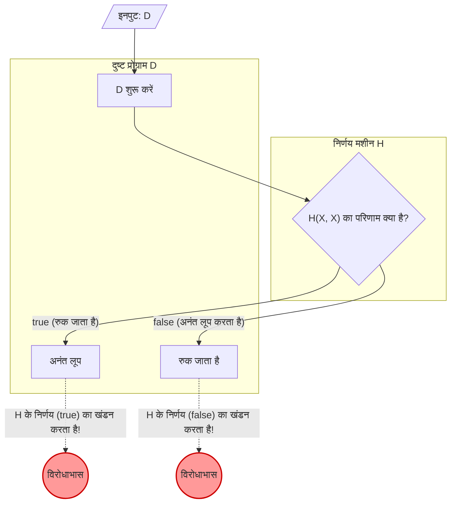

प्रोग्रामिंग करते समय, आप कभी-कभी चिंतित हो सकते हैं, "क्या यह प्रोग्राम कहीं एक अनंत लूप (infinite loop) में फंस गया है?" यदि कोई ऐसा उपकरण होता जो **यह निश्चित रूप से निर्धारित कर सके कि कोई प्रोग्राम अनंत लूप में जाएगा या नहीं**, तो विकास और डिबगिंग नाटकीय रूप से आसान हो जाएगी।

हालांकि, कंप्यूटर विज्ञान के क्षेत्र में, यह गणितीय रूप से सिद्ध हो चुका है कि ऐसा सपनों का उपकरण **"कभी नहीं बनाया जा सकता"** है। यही प्रसिद्ध **"[हाल्टिंग प्रॉब्लम (Halting Problem)](https://kenji.blog/hi/p/halting-problem/)"** है।

इस लेख में, हम इस समस्या की व्याख्या करेंगे, जिसे 1936 में [एलन ट्यूरिंग](https://kenji.blog/hi/p/turing/) ([Alan Turing](https://kenji.blog/hi/p/turing/)) द्वारा सहज विशिष्ट उदाहरणों, गणितीय सूत्रों (KaTeX) और आरेखों (Mermaid) का उपयोग करके आसानी से समझने वाले तरीके से सिद्ध किया गया था।

## हाल्टिंग प्रॉब्लम क्या है?

हाल्टिंग प्रॉब्लम निम्नलिखित समस्या को संदर्भित करता है:

> कोई भी कंप्यूटर प्रोग्राम और उसका इनपुट दिए जाने पर, क्या यह निर्धारित करने के लिए कोई सामान्य एल्गोरिदम है कि क्या प्रोग्राम एक सीमित समय में पूरा हो जाएगा (रुक जाएगा) या हमेशा के लिए चलता रहेगा (अनंत लूप)?

यदि यह संभव होता, तो निम्नलिखित फ़ंक्शन `Halt(P, I)` को लागू किया जा सकता था।

```python
def Halt(P, I):
    """
    जब प्रोग्राम P को इनपुट I दिया जाता है,
    यदि यह रुक जाता है तो true लौटाता है,
    यदि यह अनंत लूप में जाता है तो false लौटाता है।
    """
    # सपनों का सार्वभौमिक एल्गोरिदम...
```

पहली नज़र में, ऐसा लगता है कि हम स्रोत कोड का स्थैतिक रूप से (statically) विश्लेषण करके या इसके निष्पादन का अनुकरण करके इसे बना सकते हैं। आइए एक सरल उदाहरण देखें।

### सहज विशिष्ट उदाहरण

**उदाहरण 1: एक प्रोग्राम जो स्पष्ट रूप से रुक जाता है**

```python
def example1(x):
    return x * 2
```
यह प्रोग्राम `example1` तुरंत एक संख्या लौटाता है और इनपुट की परवाह किए बिना रुक जाता है। इसलिए `Halt(example1, input)` को `true` होना चाहिए।

**उदाहरण 2: एक प्रोग्राम जो स्पष्ट रूप से अनंत लूप में जाता है**

```python
def example2(x):
    while True:
        pass
```
यह प्रोग्राम `example2` कभी भी लूपिंग प्रक्रिया से बाहर नहीं निकलता है। इसलिए `Halt(example2, input)` को `false` होना चाहिए।

**उदाहरण 3: एक प्रोग्राम जिसका न्याय करना मुश्किल है (कोलैट्ज़ कंजेक्चर)**

```python
def collatz(n):
    while n > 1:
        if n % 2 == 0:
            n = n // 2
        else:
            n = 3 * n + 1
```
यह फ़ंक्शन इस प्रक्रिया को दोहराता है कि यदि दी गई संख्या सम (even) है तो उसे आधा कर दें, और यदि यह विषम (odd) है तो इसे 3 से गुणा करें और 1 जोड़ें, जब तक कि यह 1 न हो जाए। क्या यह प्रोग्राम सभी सकारात्मक पूर्णांकों के लिए रुक जाता है, यह गणित में एक अनसुलझी समस्या है जिसे "कोलैट्ज़ कंजेक्चर (Collatz conjecture)" कहा जाता है। यदि एक सार्वभौमिक `Halt` फ़ंक्शन मौजूद होता, तो अनसुलझी गणित की समस्याओं को भी केवल प्रोग्राम पास करके ही हल किया जा सकता था।

## गणितीय सूत्र और विरोधाभास द्वारा प्रमाण

ट्यूरिंग ने **"विरोधाभास द्वारा प्रमाण (Proof by Contradiction)"** का उपयोग करके साबित किया कि कोई सार्वभौमिक `Halt` फ़ंक्शन मौजूद नहीं है। विरोधाभास द्वारा प्रमाण एक प्रमाण पद्धति है जो यह दिखाती है कि यदि कोई निश्चित प्रस्ताव सही माना जाता है, तो एक विरोधाभास उत्पन्न होता है, और यह निष्कर्ष निकालता है कि मूल धारणा गलत थी।

प्रमाण शुरू करने के लिए, हम सबसे पहले यह मानते हैं कि एक सार्वभौमिक निर्णय एल्गोरिदम $H$ मौजूद है। प्रोग्राम $P$ और उसके इनपुट $I$ को स्वीकार करने वाले फ़ंक्शन $H(P, I)$ को इस प्रकार परिभाषित किया गया है:

$$
H(P, I) =
\begin{cases}
\text{true} & (\text{यदि प्रोग्राम } P \text{ इनपुट } I \text{ पर रुक जाता है}) \\
\text{false} & (\text{यदि प्रोग्राम } P \text{ इनपुट } I \text{ पर अनंत लूप में चला जाता है})
\end{cases}
$$

यह माना जाता है कि यह $H$ हमेशा एक सीमित समय में किसी भी प्रोग्राम और इनपुट के लिए `true` या `false` लौटाएगा।

इसके बाद, हम इस $H$ के परिणाम का उपयोग एक दुष्ट प्रोग्राम $D$ (Deceiver, धोखा देने वाला) बनाने के लिए करते हैं। प्रोग्राम $D$ इनपुट के रूप में एक अन्य प्रोग्राम $X$ लेता है और इस प्रकार व्यवहार करता है:

```python
def D(X):
    if H(X, X) == True:
        while True:
            pass  # अनंत लूप में जाना
    else:
        return  # रुक जाना
```

प्रोग्राम $D(X)$ का व्यवहार इस प्रकार है।
1. $H(X, X)$ का उपयोग यह निर्धारित करने के लिए करें कि क्या प्रोग्राम $X$ रुक जाता है जब $X$ स्वयं को इनपुट के रूप में दिया जाता है।
2. यदि $H(X, X)$ `true` है (अर्थात $X(X)$ रुक जाता है), तो यह जानबूझकर **अनंत लूप** में चला जाता है।
3. यदि $H(X, X)$ `false` है (अर्थात $X(X)$ अनंत लूप में चला जाता है), तो यह जानबूझकर **रुक जाता है**।

यहीं से प्रमाण का मूल आता है। **क्या होगा यदि हम इस दुष्ट प्रोग्राम $D$ को इनपुट के रूप में $D$ ही दें?** दूसरे शब्दों में, हम $D(D)$ निष्पादित होने पर व्यवहार पर विचार करेंगे।

आइए अलग-अलग मामलों पर विचार करें।

### पैटर्न 1: मान लें कि $D(D)$ रुक जाता है

यदि हम मानते हैं कि $D(D)$ रुक जाता है, तो निर्णय एल्गोरिदम $H(D, D)$ को `true` लौटना चाहिए।
हालाँकि, $D$ की परिभाषा को देखते हुए, यदि $H(D, D)$ `true` है, तो $D$, `while True` में प्रवेश करेगा और **अनंत लूप** में जाएगा।
यह इस आधार का खंडन करता है कि "$D(D)$ रुक जाता है।"

### पैटर्न 2: मान लें कि $D(D)$ अनंत लूप में चला जाता है

यदि हम मानते हैं कि $D(D)$ एक अनंत लूप में जाता है, तो निर्णय एल्गोरिदम $H(D, D)$ को `false` लौटना चाहिए।
हालाँकि, $D$ की परिभाषा को देखते हुए, यदि $H(D, D)$ `false` है, तो $D$ तुरंत `return` करेगा और **रुक जाएगा**।
यह इस आधार का खंडन करता है कि "$D(D)$ अनंत लूप में चला जाता है।"

### निष्कर्ष

चाहे जो भी हो, एक विरोधाभास उत्पन्न होता है। यह विरोधाभास इस तथ्य के कारण उत्पन्न हुआ कि प्रारंभिक धारणा, "एक सार्वभौमिक निर्णय एल्गोरिदम $H$ मौजूद है", गलत थी।

इसलिए, यह सिद्ध हो गया है कि **किसी भी प्रोग्राम के रुकने (halting) को निर्धारित करने के लिए कोई सार्वभौमिक एल्गोरिदम मौजूद नहीं है**।

## आरेख: विरोधाभास का तंत्र

आइए मर्मेड (Mermaid) का उपयोग करके विरोधाभास द्वारा प्रमाण के इस तर्क को चित्रित करें।



जैसा कि आप आरेख से देख सकते हैं, जिस क्षण $D$ स्वयं को इनपुट के रूप में दिया जाता है, एक लूप (विरोधाभास) होता है जिसमें निर्णय का परिणाम और वास्तविक व्यवहार उलट जाता है, और तर्क विफल हो जाता है। इसकी संरचना लायर के विरोधाभास (Liar's paradox) के समान है, "यह वाक्य झूठ है।"

## कंप्यूटर का इतिहास और ट्यूरिंग मशीन

[एलन ट्यूरिंग](https://kenji.blog/hi/p/turing/) ने 1936 में इस समस्या को प्रस्तावित और सिद्ध किया था, जब आधुनिक अर्थों में इलेक्ट्रॉनिक कैलकुलेटर (कंप्यूटर) मौजूद नहीं थे। गणितीय रूप से "गणना क्या है?" को कड़ाई से परिभाषित करने के लिए, उन्होंने एक आभासी मशीन तैयार की जिसे **"ट्यूरिंग मशीन (Turing Machine)"** कहा जाता है।

एक ट्यूरिंग मशीन में एक अनंत टेप, टेप पर जानकारी पढ़ने और लिखने के लिए एक हेड और मशीन की स्थिति को प्रबंधित करने के लिए एक राज्य संक्रमण तालिका (state transition table) होती है। आधुनिक प्रोग्राम चाहे कितना भी जटिल क्यों न हो, ऐसा माना जाता है कि इसे सैद्धांतिक रूप से इस ट्यूरिंग मशीन में बदला जा सकता है। इसे **"चर्च-ट्यूरिंग थीसिस (Church-Turing Thesis)"** कहा जाता है।

ट्यूरिंग ने इस सरल मॉडल का उपयोग करके "संगणनीय समस्याओं (computable problems)" और "असंगणनीय समस्याओं (uncomputable problems)" के बीच एक रेखा खींचने का प्रयास किया। परिणाम हाल्टिंग प्रॉब्लम की खोज थी, जो कि अनिर्णीत समस्याओं (undecidable problems) का प्रतिनिधि है।

## गोडेल के अपूर्णता प्रमेय के साथ गहरा संबंध

हाल्टिंग प्रॉब्लम के प्रमाण के मूल में "स्व-संदर्भ विरोधाभास (self-referential paradox)", [कर्ट गोडेल](https://kenji.blog/hi/p/godel/) ([Kurt Gödel](https://kenji.blog/hi/p/godel/)) द्वारा ट्यूरिंग से कुछ समय पहले 1931 में प्रकाशित **"अपूर्णता प्रमेय (Incompleteness Theorems)"** से गहराई से जुड़ा हुआ है।

गोडेल का पहला अपूर्णता प्रमेय बताता है कि "प्राकृतिक संख्या सिद्धांत (number theory) सहित किसी भी पर्याप्त शक्तिशाली स्वयंसिद्ध प्रणाली (axiomatic system) में, हमेशा सच्चे प्रस्ताव होंगे जिन्हें न तो सिद्ध किया जा सकता है और न ही अस्वीकृत किया जा सकता है।" इस प्रमेय को सिद्ध करने में, गोडेल ने गणितीय रूप से एक स्व-संदर्भित प्रस्ताव का निर्माण किया कि "यह प्रस्ताव सिद्ध नहीं किया जा सकता है।"

ट्यूरिंग के हाल्टिंग प्रॉब्लम में दुष्ट प्रोग्राम $D$ इस रूप में स्व-संदर्भ बनाता है, "यदि निर्णय मशीन $H$ यह निर्धारित करती है कि यह रुक जाता है, तो यह एक अनंत लूप में चला जाता है, और यदि यह निर्धारित करता है कि यह अनंत लूप में चला जाता है, तो यह रुक जाता है।" दूसरे शब्दों में, हाल्टिंग प्रॉब्लम की व्याख्या कंप्यूटर विज्ञान के मंच पर **अपूर्णता प्रमेय के प्रोग्रामिंग संस्करण** के रूप में की जा सकती है। तर्क की सीमाओं को दर्शाने वाले ये दो महान प्रमाण एक ही विरोधाभासी संरचना को साझा करते हैं।

## आज इस प्रमेय का अर्थ

यह तथ्य कि हाल्टिंग प्रॉब्लम "अनिर्णीत (Undecidable)" है, आधुनिक सॉफ्टवेयर इंजीनियरिंग में बहुत महत्वपूर्ण अर्थ रखती है।

### राइस की प्रमेय का विस्तार

हाल्टिंग प्रॉब्लम को अधिक सामान्य **"राइस की प्रमेय (Rice's Theorem)"** में विकसित किया गया है। राइस की प्रमेय में कहा गया है कि "यह निर्धारित करने के लिए कोई सामान्य एल्गोरिदम नहीं है कि किसी प्रोग्राम में कोई गैर-तुच्छ अर्थ संबंधी संपत्ति (non-trivial semantic property) है या नहीं।"

दूसरे शब्दों में, यह ज्ञात है कि न केवल यह सवाल अनिर्णीत है कि क्या यह अनंत लूप में जाएगा, बल्कि सामान्य तौर पर निम्नलिखित प्रश्न भी अनिर्णीत हैं।
- "क्या यह फ़ंक्शन हमेशा 0 लौटाता है?"
- "क्या इस प्रोग्राम में कोई विशिष्ट बग है?"
- "क्या यह सिस्टम अमान्य मेमोरी एक्सेस का कारण बनेगा?"

### व्यावहारिक दुनिया में समझौते

सिर्फ इसलिए कि "इसे सामान्य तौर पर हल नहीं किया जा सकता है" इसका मतलब यह नहीं है कि सॉफ्टवेयर इंजीनियरों ने हार मान ली है।
आधुनिक कंपाइलर, स्थैतिक कोड विश्लेषण (static code analysis) उपकरण, और एंटी-वायरस सॉफ़्टवेयर जो मैलवेयर का पता लगाते हैं, निम्नलिखित समझौते करके व्यावहारिक लाभ प्रदान करते हैं।

- **ह्यूरिस्टिक्स (Heuristics)** : 100% निश्चितता छोड़ दी जाती है, और यह निष्कर्ष निकाला जाता है कि "यह संभवतः एक बग है" या "यह संभवतः सामान्य पैटर्न से दुर्भावनापूर्ण व्यवहार है।"
- **प्रतिबंधित भाषाएँ** : ट्यूरिंग पूर्ण (Turing complete) न होने वाली प्रतिबंधित भाषाओं या टाइप सिस्टम का उपयोग करके विशिष्ट सुरक्षा की गारंटी दी जाती है (ताकि अनंत लूप लिखे ही न जा सकें)।
- **समय समाप्त (Timeout)** : यदि गणना एक निश्चित अवधि के बाद समाप्त नहीं होती है, तो इसे "समय समाप्त" के रूप में माना जाता है और प्रक्रिया को जबरन समाप्त कर दिया जाता है।

## निष्कर्ष

इस लेख में, हमने ट्यूरिंग द्वारा प्रमाणित **हाल्टिंग प्रॉब्लम** के बारे में बताया है।

- यह निश्चित रूप से निर्धारित करने के लिए कोई एल्गोरिदम मौजूद नहीं है कि कोई भी प्रोग्राम सीमित समय में रुक जाएगा या नहीं।
- यह मानते हुए कि निर्णय मशीन $H$ मौजूद है, दुष्ट प्रोग्राम $D$ जो निर्णय परिणाम को धोखा देता है, एक विरोधाभास (विरोधाभास द्वारा प्रमाण) का कारण बनता है।
- यह प्रमेय कंप्यूटरों की "तार्किक सीमाओं" को दर्शाता है, और यही मूल कारण है कि आधुनिक सॉफ्टवेयर विकास उपकरणों को "अनुमान" और "समझौते" की आवश्यकता होती है।

चूँकि एक उत्तम प्रोग्राम विश्लेषण उपकरण को गणितीय रूप से नहीं बनाया जा सकता है, इसलिए प्रोग्रामर द्वारा स्वयं परीक्षण और डिज़ाइन को अभी भी महत्वपूर्ण माना जाता है। कोडिंग करते समय, अपने दिमाग में अनंत लूप की संभावना के बारे में सोचना न भूलें।
