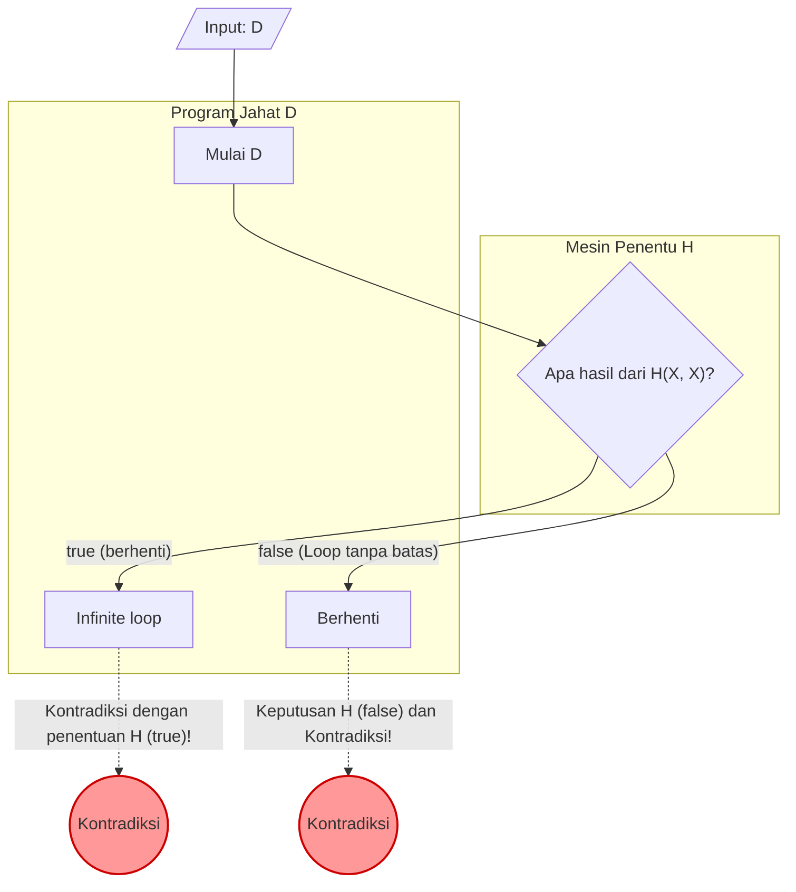

Saat melakukan pemrograman, kita kadang merasa cemas, "Apakah program ini akan terjebak dalam infinite loop di suatu tempat?" Jika ada **sebuah alat yang dapat secara pasti menentukan apakah program apa pun akan mengalami infinite loop**, maka pengembangan dan debugging akan menjadi jauh lebih mudah secara drastis.

Namun, di bidang ilmu komputer, telah dibuktikan secara matematis bahwa alat impian semacam itu **"mustahil dibuat"**. Inilah yang dikenal sebagai **"Masalah Penghentian (Halting Problem)"**.

Artikel ini akan menjelaskan masalah yang dibuktikan oleh Alan Turing pada tahun 1936 ini dengan cara yang mudah dipahami, menggunakan contoh konkret yang intuitif, rumus matematika (KaTeX), dan diagram (Mermaid).

## Apa itu Masalah Penghentian?

Masalah Penghentian merujuk pada masalah berikut:

> Diberikan sembarang program komputer beserta inputnya, apakah ada algoritma umum yang dapat menentukan apakah program tersebut akan selesai (berhenti) dalam waktu yang terbatas, atau akan terus berjalan selamanya (infinite loop)?

Jika hal ini memungkinkan, maka fungsi `Halt(P, I)` seperti berikut seharusnya bisa diimplementasikan:

```python
def Halt(P, I):
    """
    Ketika program P diberikan input I,
    mengembalikan true jika berhenti,
    mengembalikan false jika terjadi infinite loop.
    """
    # Algoritma universal impian...
```

Sekilas, kita mungkin merasa bisa membuatnya dengan melakukan analisis statis pada kode sumber atau mensimulasikan eksekusinya. Mari kita lihat beberapa contoh sederhana.

### Contoh Konkret yang Intuitif

**Contoh 1: Program yang Jelas Berhenti**

```python
def example1(x):
    return x * 2
```
Program `example1` ini akan segera mengembalikan nilai dan berhenti, apa pun inputnya. Oleh karena itu, `Halt(example1, input)` seharusnya bernilai `true`.

**Contoh 2: Program yang Jelas Mengalami Infinite Loop**

```python
def example2(x):
    while True:
        pass
```
Program `example2` ini tidak akan pernah keluar dari proses perulangan selamanya. Oleh karena itu, `Halt(example2, input)` seharusnya bernilai `false`.

**Contoh 3: Program yang Sulit Ditentukan (Konjektur Collatz)**

```python
def collatz(n):
    while n > 1:
        if n % 2 == 0:
            n = n // 2
        else:
            n = 3 * n + 1
```
Fungsi ini mengambil angka yang diberikan; jika genap dibagi dua, jika ganjil dikalikan tiga ditambah satu, dan terus mengulangi operasi tersebut hingga angkanya menjadi 1. Apakah program ini akan berhenti untuk semua bilangan bulat positif masih menjadi masalah matematika yang belum terpecahkan yang disebut "Konjektur Collatz". Jika fungsi `Halt` yang universal itu ada, maka bahkan masalah matematika yang belum terpecahkan pun dapat diselesaikan hanya dengan meneruskannya ke program tersebut.

## Pembuktian dengan Rumus Matematika dan Kontradiksi

Turing menggunakan **"Pembuktian melalui Kontradiksi (Proof by Contradiction)"** untuk membuktikan bahwa fungsi `Halt` yang universal itu tidak ada. Pembuktian melalui kontradiksi adalah metode pembuktian yang menunjukkan bahwa jika kita mengasumsikan suatu proposisi bernilai benar, maka akan muncul kontradiksi, sehingga disimpulkan bahwa asumsi awal tersebut salah.

Untuk memulai pembuktian, pertama-tama kita asumsikan bahwa algoritma penentu universal $H$ itu ada. Fungsi $H(P, I)$ yang menerima program $P$ dan inputnya $I$ didefinisikan sebagai berikut:

$$
H(P, I) =
\begin{cases}
\text{true} & (\text{Jika program } P \text{ berhenti pada masukan } I) \\
\text{false} & (\text{Jika program } P \text{ berulang tanpa batas pada masukan } I)
\end{cases}
$$

Diasumsikan bahwa $H$ ini akan selalu mengembalikan `true` atau `false` dalam waktu terbatas untuk program dan input apa pun.

Selanjutnya, dengan menggunakan hasil dari $H$ ini, kita akan membuat sebuah program licik $D$ (Deceiver, si penipu). Program $D$ menerima program lain $X$ sebagai input dan berperilaku sebagai berikut:

```python
def D(X):
    if H(X, X) == True:
        while True:
            pass  # Infinite loop
    else:
        return  # Berhenti
```

Cara kerja program $D(X)$ adalah sebagai berikut:
1. Menentukan sifat penghentian dari program $X$ ketika diberikan $X$ itu sendiri sebagai input menggunakan $H(X, X)$.
2. Jika $H(X, X)$ bernilai `true` (artinya $X(X)$ berhenti), maka ia dengan sengaja melakukan **infinite loop**.
3. Jika $H(X, X)$ bernilai `false` (artinya $X(X)$ mengalami infinite loop), maka ia dengan sengaja **berhenti**.

Inilah inti dari pembuktian tersebut. **Apa yang akan terjadi jika kita memberikan program $D$ itu sendiri sebagai input kepada program $D$ yang licik ini?** Dengan kata lain, mari kita pertimbangkan perilaku ketika $D(D)$ dieksekusi.

Mari kita bagi menjadi dua kasus dan memikirkannya.

### Kasus 1: Mengasumsikan $D(D)$ berhenti

Jika kita berasumsi bahwa $D(D)$ berhenti, maka algoritma penentu $H(D, D)$ seharusnya mengembalikan `true`.
Namun, melihat pada definisi $D$, jika $H(D, D)$ bernilai `true`, maka $D$ akan masuk ke `while True` dan mengalami **infinite loop**.
Hal ini bertentangan dengan asumsi awal bahwa "$D(D)$ berhenti".

### Kasus 2: Mengasumsikan $D(D)$ mengalami infinite loop

Jika kita berasumsi bahwa $D(D)$ mengalami infinite loop, maka algoritma penentu $H(D, D)$ seharusnya mengembalikan `false`.
Namun, melihat pada definisi $D$, jika $H(D, D)$ bernilai `false`, maka $D$ akan segera melakukan `return` dan **berhenti**.
Hal ini bertentangan dengan asumsi awal bahwa "$D(D)$ mengalami infinite loop".

### Kesimpulan

Ke arah mana pun kita melangkah, sebuah kontradiksi akan terjadi. Kontradiksi ini muncul karena asumsi awal kita, yaitu "terdapat algoritma penentu universal $H$", adalah salah.

Oleh karena itu, telah terbukti bahwa **tidak ada algoritma universal yang dapat menentukan sifat penghentian dari sembarang program**.

## Diagram Ilustrasi: Mekanisme Kontradiksi

Mari kita ilustrasikan logika pembuktian melalui kontradiksi ini menggunakan diagram Mermaid.



Seperti yang dapat dilihat dari diagram, pada saat $D$ itu sendiri diberikan sebagai input, muncul sebuah loop (paradoks) di mana hasil penentuan dan tindakan yang sebenarnya berbalik arah, sehingga logikanya menjadi runtuh. Struktur ini sangat mirip dengan Paradoks Pembohong yang berbunyi, "Kalimat ini adalah kebohongan".

## Sejarah Komputer dan Mesin Turing

Alan Turing mengajukan dan membuktikan masalah ini pada tahun 1936, di era ketika komputer elektronik modern seperti sekarang belum ada. Untuk mendefinisikan secara matematis dan ketat "apa itu komputasi?", ia merancang sebuah mesin virtual yang disebut **"Mesin Turing (Turing Machine)"**.

Mesin Turing terdiri dari sebuah pita yang tak terbatas panjangnya, sebuah head yang dapat membaca dan menulis informasi pada pita tersebut, serta tabel transisi status yang mengatur status mesin. Telah diketahui bahwa sekompleks apa pun program modern, secara teori program tersebut dapat disederhanakan ke dalam bentuk Mesin Turing. Hal ini disebut **"Tesis Church-Turing (Church-Turing Thesis)"**.

Turing mencoba menarik garis batas antara "masalah yang dapat dihitung" dan "masalah yang tidak dapat dihitung" menggunakan model sederhana ini. Hasil penemuannya adalah Masalah Penghentian, yang merupakan representasi utama dari masalah-masalah yang tak dapat diputuskan (undecidable problems).

## Hubungan Erat dengan Teorema Ketidaklengkapan Gödel

"Paradoks rujukan diri" yang menjadi akar pembuktian Masalah Penghentian memiliki kaitan yang sangat erat dengan **"Teorema Ketidaklengkapan (Incompleteness Theorems)"** yang dikemukakan oleh Kurt Gödel pada tahun 1931, beberapa waktu sebelum Turing.

Teorema Ketidaklengkapan Pertama Gödel menyatakan bahwa, "Dalam sistem aksioma mana pun yang cukup kuat untuk mencakup aritmatika bilangan asli, pasti akan selalu ada proposisi benar yang tidak dapat dibuktikan maupun dibantah." Saat membuktikan teorema ini, Gödel menyusun proposisi rujukan diri secara matematis yang menyatakan, "Proposisi ini tidak dapat dibuktikan."

Program licik $D$ dalam Masalah Penghentian Turing melakukan rujukan diri dalam bentuk, "Jika mesin penentu $H$ memutuskan bahwa ia berhenti, maka lakukan infinite loop; namun jika mesin memutuskan ia mengalami infinite loop, maka berhentilah." Dengan kata lain, Masalah Penghentian dapat ditafsirkan sebagai **versi pemrograman dari Teorema Ketidaklengkapan** di panggung ilmu komputer. Dua pembuktian agung yang menunjukkan batas-batas logika ini menggunakan struktur paradoks yang sama.

## Makna Teorema Ini di Era Modern

Fakta bahwa Masalah Penghentian bersifat "Tak Dapat Diputuskan (Undecidable)" membawa makna yang sangat penting, bahkan dalam rekayasa perangkat lunak modern.

### Perluasan ke Teorema Rice

Masalah Penghentian berkembang lebih jauh menjadi **"Teorema Rice (Rice's Theorem)"** yang lebih umum. Teorema Rice menyatakan bahwa, "Tidak ada algoritma umum yang dapat menentukan apakah suatu program memiliki sifat semantik yang tidak sepele (non-trivial)."

Singkatnya, bukan hanya soal apakah program akan mengalami infinite loop atau tidak, tetapi pertanyaan-pertanyaan berikut ini pada umumnya juga terbukti tidak dapat diputuskan:
- "Apakah fungsi ini akan selalu mengembalikan nilai 0?"
- "Apakah terdapat bug tertentu di dalam program ini?"
- "Apakah sistem ini akan menyebabkan akses memori yang tidak sah?"

### Kompromi di Dunia Praktis

Hanya karena "secara umum tidak dapat dipecahkan", bukan berarti para insinyur perangkat lunak menyerah begitu saja.
Kompiler modern, alat analisis kode statis, perangkat software antivirus pendeteksi malware, dan sejenisnya, memberikan manfaat praktis dengan melakukan kompromi-kompromi berikut:

- **Heuristik**: Melepas kepastian 100%, lalu menyimpulkan "kemungkinan ini bug" atau "kemungkinan ini perilaku jahat" dari pola-pola yang sering muncul.
- **Bahasa yang Dibatasi**: Menjamin tingkat keamanan tertentu dengan menggunakan bahasa atau sistem tipe yang tidak Turing-complete (contoh: di mana infinite loop sama sekali tidak bisa ditulis).
- **Waktu Habis (Timeout)**: Jika komputasi tidak kunjung selesai setelah kurun waktu tertentu, maka eksekusi akan dihentikan secara paksa sebagai "timeout".

## Kesimpulan

Artikel ini telah menjelaskan **Masalah Penghentian** yang dibuktikan oleh Turing.

- Tidak ada algoritma yang dapat memastikan apakah sembarang program akan berhenti dalam waktu terbatas.
- Jika kita mengasumsikan adanya mesin penentu $H$, maka akan timbul kontradiksi yang disebabkan oleh program licik $D$ yang berlawanan dengan hasil penentuan tersebut (Pembuktian melalui Kontradiksi).
- Teorema ini menunjukkan "batas-batas logika" yang dimiliki komputer, dan menjadi alasan mendasar mengapa alat pengembangan perangkat lunak modern masih membutuhkan "asumsi" dan "kompromi".

Karena alat analisis program yang sempurna secara matematis tidak mungkin dibuat, itulah sebabnya pengujian dan perancangan oleh pemrogram itu sendiri tetap menjadi sangat krusial hingga hari ini. Saat Anda menulis kode, jangan lupa untuk selalu menggunakan pikiran Anda sendiri guna mengantisipasi kemungkinan terjadinya infinite loop.
