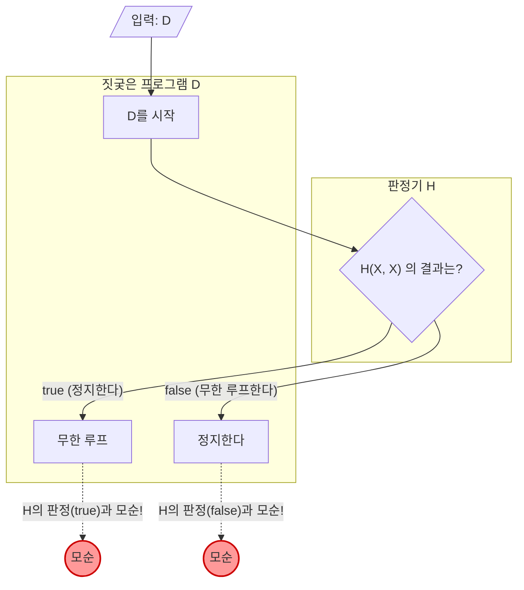

프로그래밍을 하다 보면 '이 프로그램, 어딘가에서 무한 루프에 빠져 있지 않을까?' 하고 불안해질 때가 있습니다. 만약 ** 임의의 프로그램이 무한 루프하는지 여부를 확실하게 판정해 주는 툴 ** 이 있다면 개발이나 디버그는 극적으로 쉬워질 것입니다.

하지만 컴퓨터 과학 분야에서는 그러한 꿈의 툴은 ** '절대로 만들 수 없다' ** 는 것이 수학적으로 증명되어 있습니다. 이것이 유명한 ** '[정지 문제(Halting Problem)](https://kenji.blog/ko/p/halting-problem/)' ** 입니다.

본 기사에서는 1936년 [앨런 튜링](https://kenji.blog/ko/p/turing/)([Alan Turing](https://kenji.blog/ko/p/turing/))에 의해 증명된 이 문제에 대해 직관적인 구체적 예시, 수식(KaTeX), 그리고 도해(Mermaid)를 사용하여 알기 쉽게 해설합니다.

## 정지 문제란 무엇인가?

정지 문제란 다음과 같은 문제를 가리킵니다.

> 임의의 컴퓨터 프로그램과 그 입력이 주어졌을 때, 그 프로그램이 유한 시간 내에 종료(정지)할지, 아니면 영원히 계속 실행될지(무한 루프할지)를 판정하는 일반적인 알고리즘이 존재하는가?

만약 이것이 가능하다면 다음과 같은 함수 `Halt(P, I)` 를 구현할 수 있을 것입니다.

```python
def Halt(P, I):
    """
    프로그램 P에 입력 I를 주었을 때,
    정지한다면 true를,
    무한 루프한다면 false를 반환한다.
    """
    # 꿈의 만능 알고리즘...
```

언뜻 보면 소스 코드를 정적 분석하거나 실행을 시뮬레이션하면 만들 수 있을 것 같은 느낌이 듭니다. 단순한 예시를 살펴보겠습니다.

### 직관적인 구체적 예시

** 예시 1: 명백하게 정지하는 프로그램 **

```python
def example1(x):
    return x * 2
```
이 프로그램 `example1` 은 입력이 무엇이든 즉시 수치를 반환하고 정지합니다. 따라서 `Halt(example1, input)` 은 `true` 가 되어야 합니다.

** 예시 2: 명백하게 무한 루프하는 프로그램 **

```python
def example2(x):
    while True:
        pass
```
이 프로그램 `example2` 는 영원히 루프 처리를 빠져나오지 않습니다. 따라서 `Halt(example2, input)` 은 `false` 가 되어야 합니다.

** 예시 3: 판정이 어려운 프로그램(콜라츠 추측) **

```python
def collatz(n):
    while n > 1:
        if n % 2 == 0:
            n = n // 2
        else:
            n = 3 * n + 1
```
이 함수는 주어진 수가 짝수면 반으로 나누고, 홀수면 3배를 한 뒤 1을 더하는 조작을 1이 될 때까지 반복합니다. 모든 양의 정수에 대해 이 프로그램이 정지할지 여부는 '콜라츠 추측'이라고 불리는 수학의 미해결 문제입니ek. 만약 만능 `Halt` 함수가 존재한다면 미해결 수학 문제조차도 프로그램을 넘기기만 하면 풀려버리게 됩니다.

## 수식과 귀류법을 통한 증명

튜링은 ** '귀류법(Proof by Contradiction)' ** 을 사용하여 만능 `Halt` 함수가 존재하지 않음을 증명했습니다. 귀류법이란 어떤 명제가 성립한다고 가정하면 모순이 발생함을 보여주고, 원래의 가정이 틀렸다고 결론짓는 증명 수법입니다.

증명을 시작하기 위해 먼저 만능 판정 알고리즘 $H$ 가 존재한다고 가정합니다. 프로그램 $P$ 와 그 입력 $I$ 를 받는 함수 $H(P, I)$ 는 다음과 같이 정의됩니다.

$$
H(P, I) =
\begin{cases}
\text{true} & (\text{프로그램 } P \text{ 가 입력 } I \text{ 에서 정지하는 경우}) \\
\text{false} & (\text{프로그램 } P \text{ 가 입력 } I \text{ 에서 무한 루프하는 경우})
\end{cases}
$$

이 $H$ 는 어떤 프로그램과 입력에 대해서도 반드시 유한 시간 내에 `true` 나 `false` 를 반환한다고 가정합니다.

다음으로 이 $H$ 의 결과를 이용하여 짓궂은 프로그램 $D$(Deceiver, 속이는 자)를 만듭니다. 프로그램 $D$ 는 다른 프로그램 $X$ 를 입력으로 받아 다음과 같이 행동합니다.

```python
def D(X):
    if H(X, X) == True:
        while True:
            pass  # 무한 루프한다
    else:
        return  # 정지한다
```

프로그램 $D(X)$ 의 동작은 다음과 같습니다.
1. 프로그램 $X$ 에 입력으로 $X$ 자신을 주었을 때의 정지 여부를 $H(X, X)$ 로 판정합니다.
2. 만약 $H(X, X)$ 가 `true`(즉 $X(X)$ 가 정지한다)라면, 굳이 ** 무한 루프 ** 합니다.
3. 만약 $H(X, X)$ 가 `false`(즉 $X(X)$ 가 무한 루프한다)라면, 굳이 ** 정지 ** 합니다.

여기서부터가 증명의 핵심입니다. ** 이 짓궂은 프로그램 $D$ 에 입력으로 $D$ 자신을 주면 어떻게 될까요? ** 즉, $D(D)$ 를 실행했을 때의 행동을 생각해 봅니다.

경우를 나누어 생각해 보겠습니다.

### 패턴 1: $D(D)$ 가 정지한다고 가정한다

만약 $D(D)$ 가 정지한다고 가정했을 경우, 판정 알고리즘 $H(D, D)$ 는 `true` 를 반환할 것입니다.
하지만 $D$ 의 정의를 보면 $H(D, D)$ 가 `true` 일 경우 $D$ 는 `while True` 에 들어가 ** 무한 루프 ** 해 버립니다.
이것은 "$D(D)$ 가 정지한다"는 전제와 모순됩니다.

### 패턴 2: $D(D)$ 가 무한 루프한다고 가정한다

만약 $D(D)$ 가 무한 루프한다고 가정했을 경우, 판정 알고리즘 $H(D, D)$ 는 `false` 를 반환할 것입니다.
하지만 $D$ 의 정의를 보면 $H(D, D)$ 가 `false` 일 경우 $D$ 는 즉시 `return` 하여 ** 정지 ** 해 버립니다.
이것은 "$D(D)$ 가 무한 루프한다"는 전제와 모순됩니다.

### 결론

어느 쪽으로 가든 모순이 발생해 버렸습니다. 이 모순은 최초의 가정인 '만능 판정 알고리즘 $H$ 가 존재한다'는 전제가 틀렸기 때문에 발생한 것입니다.

따라서 ** 임의의 프로그램의 정지 여부를 판정하는 만능 알고리즘은 존재하지 않음 ** 이 증명되었습니다.

## 도해: 모순의 메커니즘

이 귀류법의 로직을 Mermaid를 사용하여 도해해 보겠습니다.



그림을 보면 알 수 있듯이 입력으로 $D$ 자신을 주는 순간 판정 결과와 실제 행동이 반전되는 루프(역설)가 발생하여 논리가 파탄납니다. '이 문장은 거짓이다'라는 거짓말쟁이의 역설과 매우 비슷한 구조를 가지고 있습니다.

## 컴퓨터의 역사와 튜링 머신

[앨런 튜링](https://kenji.blog/ko/p/turing/)이 이 문제를 제기하고 증명한 것은 1936년, 아직 현대와 같은 전자 계산기(컴퓨터)가 존재하지 않던 시대였습니다. 그는 '계산이란 무엇인가?'를 수학적으로 엄밀하게 정의하기 위해 ** '튜링 머신([Turing Machine](https://kenji.blog/ko/p/turing-machine-computability/))' ** 이라는 가상의 기계를 고안했습니다.

튜링 머신은 무한히 이어지는 테이프, 테이프의 정보를 읽고 쓰는 헤드, 그리고 기계의 상태를 관리하는 상태 전이표로 구성됩니다. 아무리 복잡한 현대의 프로그램이라 하더라도 이론상으로는 이 튜링 머신으로 환원할 수 있음이 알려져 있습니다. 이를 ** '처치-튜링 명제(Church-Turing Thesis)' ** 라고 부릅니다.

튜링은 이 단순한 모델을 사용하여 '계산 가능한 문제'와 '계산 불가능한 문제'의 경계선을 그으려고 시도했습니다. 그 결과로 발견된 것이 결정 불가능한 문제의 대표격인 정지 문제입니다.

## [괴델의 불완전성 정리](https://kenji.blog/ko/p/godels-incompleteness-theorems/)와의 깊은 관계

정지 문제 증명의 근저에 있는 '자기 언급의 역설'은 튜링보다 조금 앞서 1931년 [쿠르트 괴델](https://kenji.blog/ko/p/godel/)([Kurt Gödel](https://kenji.blog/ko/p/godel/))이 발표한 ** '불완전성 정리(Incompleteness Theorems)' ** 와 깊은 연관을 맺고 있습니다.

괴델의 제1불완전성 정리는 "자연수론을 포함하는 충분히 강력한 공리계 안에는 증명도 반증도 할 수 없는 참인 명제가 반드시 존재한다"는 것입니다. 괴델은 이 정리를 증명할 때 '이 명제는 증명할 수 없다'는 자기 언급적인 명제를 수학적으로 구성했습니다.

튜링의 정지 문제에서의 짓궂은 프로그램 $D$ 는 '판정기 $H$ 가 정지한다고 판정하면 무한 루프하고, 무한 루프한다고 판정하면 정지한다'는 형태로 자기 언급을 하고 있습니다. 즉, 정지 문제는 컴퓨터 과학이라는 무대에서의 ** 불완전성 정리의 프로그래밍 버전 ** 이라고 해석할 수도 있습니다. 논리의 한계를 보여주는 이 두 가지 위대한 증명은 같은 역설의 구조를 공유하고 있는 것입니다.

## 이 정리가 현대에 가져다주는 의미

정지 문제가 '결정 불가능(Undecidable)'하다는 사실은 현대의 소프트웨어 공학에서도 매우 중요한 의미를 갖습니다.

### 라이스의 정리로의 확장

정지 문제는 더 일반적인 ** '라이스의 정리(Rice's Theorem)' ** 로 발전했습니다. 라이스의 정리는 '프로그램이 자명하지 않은 의미적 성질을 가지는지 여부를 판정하는 일반적인 알고리즘은 존재하지 않는다'는 것입니다.

즉, 무한 루프하는지 여부뿐만 아니라 다음과 같은 질문도 일반적으로는 결정 불가능함이 알려져 있습니다.
- "이 함수는 항상 0을 반환하는가?"
- "이 프로그램에는 특정 버그가 존재하는가?"
- "이 시스템은 잘못된 메모리 액세스를 일으키는가?"

### 실용 세계에서의 타협

'일반적으로는 풀 수 없다'고 해서 소프트웨어 엔지니어가 포기하고 있는 것은 아닙니다.
현대의 컴파일러나 정적 코드 분석 툴, 멀웨어를 탐지하는 안티바이러스 소프트웨어 등은 다음과 같은 타협을 함으로써 실용적인 혜택을 가져다주고 있습니다.

- ** 휴리스틱 ** : 100%의 확실성은 포기하고 자주 있는 패턴으로부터 '아마 버그일 것이다', '아마 악의적인 움직임일 것이다'라고 추론합니다.
- ** 제한된 언어 ** : 튜링 완전하지 않은(애초에 무한 루프를 쓸 수 없는) 제한된 언어나 타입 시스템을 사용함으로써 특정 안전성을 보장합니다.
- ** 타임아웃 ** : 일정 시간 계산해서 끝나지 않으면 '타임아웃'으로 처리를 강제 종료합니다.

## 정리

본 기사에서는 튜링이 증명한 ** 정지 문제 ** 에 대해 해설했습니다.

- 임의의 프로그램이 유한 시간 내에 정지할지 여부를 확실하게 판정하는 알고리즘은 존재하지 않는다.
- 판정기 $H$ 가 존재한다고 가정하면 판정 결과를 배신하는 짓궂은 프로그램 $D$ 에 의해 모순이 발생한다(귀류법).
- 이 정리는 컴퓨터가 가진 '논리적 한계'를 나타내고 있으며, 현대의 소프트웨어 개발 툴이 '추측'이나 '타협'을 필요로 하는 근본적인 이유가 되고 있다.

완벽한 프로그램 분석 툴은 수학적으로 만들 수 없기 때문에 프로그래머 자신에 의한 테스트나 설계가 지금도 중요하게 여겨지고 있는 것입니다. 코딩을 할 때는 스스로의 머리로 무한 루프의 가능성을 생각하는 것을 잊지 않도록 합시다.
