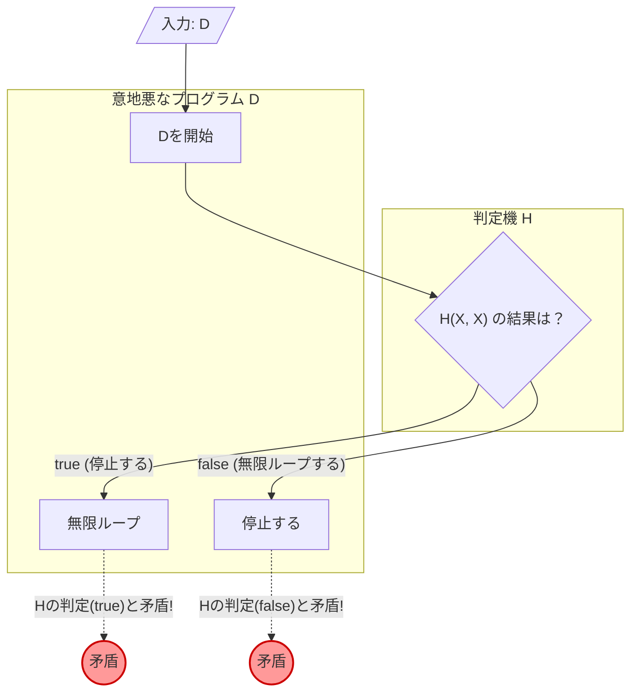

プログラミングをしていると、「このプログラム、どこかで無限ループになっていないかな？」と不安になることがあります。もし、 **任意のプログラムが無限ループするかどうかを確実に判定してくれるツール** があれば、開発やデバッグは劇的に簡単になるでしょう。

しかし、計算機科学の分野では、そのような夢のツールは **「絶対に作れない」** ことが数学的に証明されています。これが有名な **「[停止性問題（Halting Problem）](https://kenji.blog/p/halting-problem/)」** です。

本記事では、1936年に[アラン・チューリング](https://kenji.blog/p/turing/)（[Alan Turing](https://kenji.blog/p/turing/)）によって証明されたこの問題について、直感的な具体例、数式（KaTeX）、そして図解（Mermaid）を用いて、わかりやすく解説します。

## [停止性問題](https://kenji.blog/p/turing-machine-computability/)とは何か？

停止性問題とは、次のような問題を指します。

> 任意のコンピュータプログラムとその入力を与えられたとき、そのプログラムが有限時間で終了（停止）するか、あるいは永遠に走り続ける（無限ループする）かを判定する一般的なアルゴリズムは存在するか？

もし、これが可能であるならば、以下のような関数 `Halt(P, I)` が実装できるはずです。

```python
def Halt(P, I):
    """
    プログラム P に入力 I を与えたとき、
    停止するなら true を、
    無限ループするなら false を返す。
    """
    # 夢の万能アルゴリズム...
```

一見すると、ソースコードを静的解析したり、実行をシミュレーションしたりすれば作れそうな気がします。単純な例を見てみましょう。

### 直感的な具体例

**例1：明らかに停止するプログラム**

```python
def example1(x):
    return x * 2
```
このプログラム `example1` は、入力が何であれすぐに数値を返して停止します。したがって `Halt(example1, input)` は `true` になるべきです。

**例2：明らかに無限ループするプログラム**

```python
def example2(x):
    while True:
        pass
```
このプログラム `example2` は、永遠にループ処理を抜けません。したがって `Halt(example2, input)` は `false` になるべきです。

**例3：判定が難しいプログラム（コラッツ予想）**

```python
def collatz(n):
    while n > 1:
        if n % 2 == 0:
            n = n // 2
        else:
            n = 3 * n + 1
```
この関数は、与えられた数が偶数なら半分にし、奇数なら3倍して1を足す、という操作を1になるまで繰り返します。すべての正の整数についてこのプログラムが停止するかどうかは、「コラッツ予想」と呼ばれる数学の未解決問題です。もし万能な `Halt` 関数が存在するなら、未解決の数学の問題さえもプログラムを渡すだけで解けてしまうことになります。

## 数式と背理法による証明

[チューリング](https://kenji.blog/p/turing/)は、 **「背理法（Proof by Contradiction）」** を用いて、万能な `Halt` 関数が存在しないことを証明しました。背理法とは、ある命題が成り立つと仮定すると矛盾が生じることを示し、もとの仮定が間違っていたと結論づける証明手法です。

証明を始めるために、まず万能な判定アルゴリズム $H$ が存在すると仮定します。プログラム $P$ とその入力 $I$ を受け取る関数 $H(P, I)$ は、以下のように定義されます。

$$
H(P, I) =
\begin{cases}
\text{true} & (\text{プログラム } P \text{ が入力 } I \text{ で停止する場合}) \\
\text{false} & (\text{プログラム } P \text{ が入力 } I \text{ で無限ループする場合})
\end{cases}
$$

この $H$ は、どんなプログラムと入力に対しても、必ず有限時間で `true` か `false` を返すと仮定します。

次に、この $H$ の結果を利用して、意地悪なプログラム $D$（Deceiver, 騙す者）を作ります。プログラム $D$ は、別のプログラム $X$ を入力として受け取り、次のように振る舞います。

```python
def D(X):
    if H(X, X) == True:
        while True:
            pass  # 無限ループする
    else:
        return  # 停止する
```

プログラム $D(X)$ の動作は以下の通りです。
1. プログラム $X$ に入力として $X$ 自身を与えたときの停止性を $H(X, X)$ で判定します。
2. もし $H(X, X)$ が `true`（すなわち $X(X)$ が停止する）なら、あえて **無限ループ** します。
3. もし $H(X, X)$ が `false`（すなわち $X(X)$ が無限ループする）なら、あえて **停止** します。

ここからが証明の核心です。 **この意地悪なプログラム $D$ に、入力として $D$ 自身を与えたらどうなるでしょうか？** つまり、$D(D)$ を実行したときの振る舞いを考えます。

場合分けをして考えてみましょう。

### パターン1： $D(D)$ が停止すると仮定する

もし $D(D)$ が停止すると仮定した場合、判定アルゴリズム $H(D, D)$ は `true` を返すはずです。
しかし、$D$ の定義を見ると、$H(D, D)$ が `true` の場合、$D$ は `while True` に入り、 **無限ループ** してしまいます。
これは「 $D(D)$ が停止する」という前提と矛盾します。

### パターン2： $D(D)$ が無限ループすると仮定する

もし $D(D)$ が無限ループすると仮定した場合、判定アルゴリズム $H(D, D)$ は `false` を返すはずです。
しかし、$D$ の定義を見ると、$H(D, D)$ が `false` の場合、$D$ はすぐに `return` して **停止** してしまいます。
これは「 $D(D)$ が無限ループする」という前提と矛盾します。

### 結論

どちらに転んでも矛盾が生じてしまいました。この矛盾は、最初の仮定である「万能な判定アルゴリズム $H$ が存在する」という前提が間違っていたために生じたものです。

したがって、 **任意のプログラムの停止性を判定する万能なアルゴリズムは存在しない** ことが証明されました。

## 図解：矛盾のメカニズム

この背理法のロジックを、Mermaidを用いて図解してみましょう。



図を見るとわかるように、入力として $D$ 自身を与えた瞬間、判定結果と実際の行動が反転するループ（パラドックス）が発生し、論理が破綻します。「この文は嘘である」という嘘つきのパラドックスと非常によく似た構造を持っています。

## コンピュータの歴史と[チューリング](https://kenji.blog/p/turing/)マシン

[アラン・チューリング](https://kenji.blog/p/turing/)がこの問題を提起し、証明したのは1936年、まだ現代のような電子計算機（コンピュータ）が存在しない時代でした。彼は「計算とは何か？」を数学的に厳密に定義するため、 **「[チューリング](https://kenji.blog/p/turing/)マシン（[Turing Machine](https://kenji.blog/p/turing-machine-computability/)）」** という仮想的な機械を考案しました。

[チューリング](https://kenji.blog/p/turing/)マシンは、無限に続くテープ、テープの情報を読み書きするヘッド、そして機械の状態を管理する状態遷移表から構成されます。どんなに複雑な現代のプログラムであっても、理論上はこの[チューリング](https://kenji.blog/p/turing/)マシンに還元できることが知られています。これを **「チャーチ＝[チューリング](https://kenji.blog/p/turing/)のテーゼ（Church-Turing Thesis）」** と呼びます。

[チューリング](https://kenji.blog/p/turing/)は、この単純なモデルを使って「計算可能な問題」と「計算不可能な問題」の境界線を引こうと試みました。その結果として発見されたのが、決定不能な問題の代表格である[停止性問題](https://kenji.blog/p/turing-machine-computability/)です。

## [ゲーデルの不完全性定理](https://kenji.blog/p/godels-incompleteness-theorems/)との深い関係

[停止性問題](https://kenji.blog/p/turing-machine-computability/)の証明の根底にある「自己言及のパラドックス」は、[チューリング](https://kenji.blog/p/turing/)の少し前、1931年に[クルト・ゲーデル](https://kenji.blog/p/godel/)（[Kurt Gödel](https://kenji.blog/p/godel/)）が発表した **「[不完全性定理](https://kenji.blog/p/godels-incompleteness-theorems/)（Incompleteness Theorems）」** と深い繋がりを持っています。

[ゲーデル](https://kenji.blog/p/godel/)の第一[不完全性定理](https://kenji.blog/p/godels-incompleteness-theorems/)は、「自然数論を含む十分に強力な公理系の中には、証明も反証もできない真の命題が必ず存在する」というものです。[ゲーデル](https://kenji.blog/p/godel/)はこの定理を証明する際に、「この命題は証明できない」という自己言及的な命題を数学的に構成しました。

[チューリング](https://kenji.blog/p/turing/)の[停止性問題](https://kenji.blog/p/turing-machine-computability/)における意地悪なプログラム $D$ は、「判定機 $H$ が停止すると判定するなら無限ループし、無限ループすると判定するなら停止する」という形で自己言及を行っています。つまり、停止性問題は、計算機科学という舞台における **[不完全性定理](https://kenji.blog/p/godels-incompleteness-theorems/)のプログラミング版** と解釈することもできます。論理の限界を示すこの二つの偉大な証明は、同じパラドックスの構造を共有しているのです。

## この定理が現代にもたらす意味

[停止性問題](https://kenji.blog/p/turing-machine-computability/)が「決定不能（Undecidable）」であるという事実は、現代のソフトウェア工学においても非常に重要な意味を持っています。

### ライスの定理への拡張

停止性問題は、さらに一般的な **「ライスの定理（Rice's Theorem）」** へと発展しました。ライスの定理は、「プログラムが非自明な意味的性質を持つかどうかを判定する一般的なアルゴリズムは存在しない」というものです。

つまり、無限ループするかどうかだけでなく、以下のような問いも一般的には決定不能であることがわかっています。
- 「この関数は常に 0 を返すか？」
- 「このプログラムには特定のバグが存在するか？」
- 「このシステムは不正なメモリアクセスを引き起こすか？」

### 実用世界における妥協

「一般的には解けない」からといって、ソフトウェアエンジニアが諦めているわけではありません。
現代のコンパイラや静的コード解析ツール、マルウェアを検知するアンチウイルスソフトなどは、以下のような妥協をすることで実用的な恩恵をもたらしています。

- **ヒューリスティクス** ： 100%の確実性は諦め、よくあるパターンから「おそらくバグである」「おそらく悪意のある挙動である」と推論します。
- **制限された言語** ： [チューリング](https://kenji.blog/p/turing/)完全でない（無限ループがそもそも書けないような）制限された言語や型システムを用いることで、特定の安全性を保証します。
- **タイムアウト** ： 一定時間計算して終わらなければ「タイムアウト」として処理を強制終了します。

## まとめ

本記事では、[チューリング](https://kenji.blog/p/turing/)が証明した **[停止性問題](https://kenji.blog/p/turing-machine-computability/)** について解説しました。

- 任意のプログラムが有限時間で停止するかどうかを確実に判定するアルゴリズムは存在しない。
- 判定機 $H$ が存在すると仮定すると、判定結果を裏切る意地悪なプログラム $D$ によって矛盾が生じる（背理法）。
- この定理はコンピュータが持つ「論理的限界」を示しており、現代のソフトウェア開発ツールが「推測」や「妥協」を必要とする根本的な理由となっている。

完璧なプログラム解析ツールは数学的に作れないからこそ、プログラマ自身によるテストや設計が今も重要とされているのです。コーディングをする際には、自分自身の頭で無限ループの可能性を考えることを忘れないようにしましょう。

