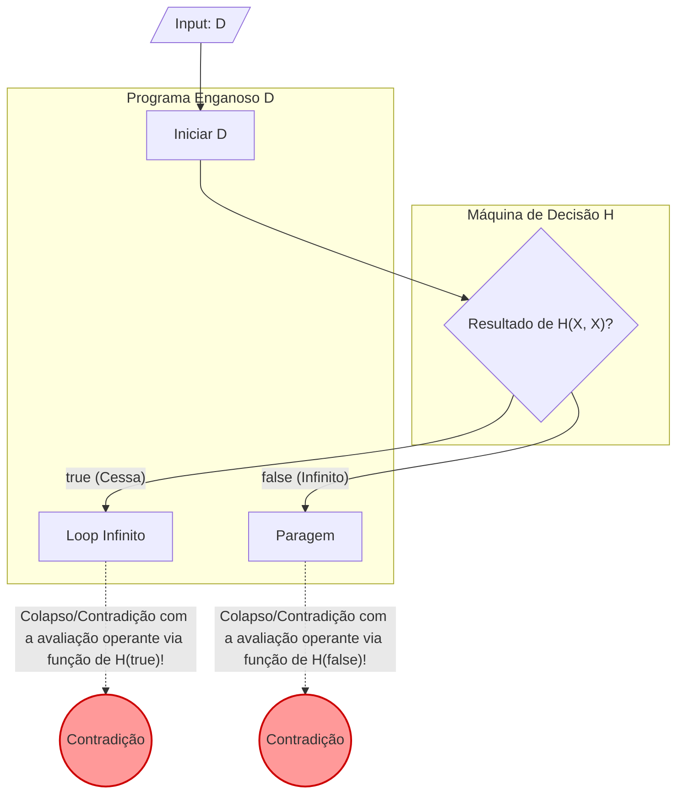

Durante a programação, certamente já questionou, com preocupação: "Será que o meu programa ficou preso num loop infinito em algum momento?". E caso houvesse à sua disposição uma **ferramenta absoluta, capaz de examinar minuciosamente quaisquer algoritmos para comprovar se este encerra o ciclo de processamento num espaço finito temporal ou pelo contrário envereda num círculo infindável**, isso ajudaria tremendamente.

Mas o campo teórico no núcleo central na ciência da computação garante um argumento impenetrável; a hipótese na formação viável na concepção prática dessa "ferramenta milagrosa e onipotente", em circunstância alguma poderá vir a estar desenvolvida — e tal impossibilidade tem fundamentações lógicas provadas através das propriedades matemáticas e concecionais das máquinas de Turing. Este fator e descoberta crucial exprime a denominação clássica de "O **Problema da Paragem** ([The Halting Problem](https://kenji.blog/pt/p/halting-problem/))".

Este mesmo aspeto central será apresentado adiante e examinado na base concebida desde [Alan Turing](https://kenji.blog/pt/p/turing/) (1936), na qual incluiremos descrições com demonstrações elucidativas no modelo teórico matemático recorrendo no seu cerne aos postulados fundamentais de diagramas associados, para uma ampla aquisição explicativa clara.

## Em que consiste o conceito prático - Problema da Paragem?

Quando definimos teoricamente a terminologia, baseia-se sumariamente:

> Dada uma conceção arbitrária e específica programada de computador e as condições de entradas, é exequível formar de raiz e viabilizar um algoritmo padrão genérico cujo intuito garanta definir a certeza irrefutável quanto ao pressuposto se a função cessa processualmente ou num modo inverso permanecer no curso funcional, para todo o infinito (Presa na perpetuação funcional de ciclos circulares)?

Na consideração hipotética desta teoria miraculosa possivelmente alcançada, teríamos em prática o reflexo abstrato do que seria estipulado através da formulação na Função de `Halt(P, I)` em baixo expressada em termos lógicos:

```python
def Halt(P, I):
    """
    Quando é atribuído o input I ao programa P,
    se ele parar retorna true,
    se cair em loop infinito retorna false.
    """
    # Algoritmo universal dos sonhos...
```

À primeira vista, dir-se-ia um desígnio realizável através da análise estática de fonte programada e via ensaios de simulações. Iremos contemplar um modelo prático basilar.

### Exemplo elucidativo à base da perspetiva conceptual intuitiva

**Exemplo 1: Processo do qual culmina num rumo que dita explicitamente a sua paragem conclusiva**

```python
def example1(x):
    return x * 2
```
A base estrutural da ação perante `example1`, traduz na finalização concreta no seu termo logo que a rotina atuar. Logo resultará na garantia que a chamada `Halt(example1, input)` devolva a valoração equivalente perante o facto afirmado em `true`.

**Exemplo 2: Processos enlaçados visivelmente pela natureza imperiosa num ciclo infindável processual (Loop infinito)**

```python
def example2(x):
    while True:
        pass
```
Sem reservas e objeções constata-se a incapacidade deste modelo, rotulado de `example2`, desenvencilhar da malha processual e libertar das amarras restritas. Deste modo `Halt(example2, input)` emitiria uma equivalência concreta da realidade do conceito, retornando assim na avaliação declarada de `false`.

**Exemplo 3: Formulação de julgamentos complexos por ausência processual previsível (A Conjetura de Collatz)**

```python
def collatz(n):
    while n > 1:
        if n % 2 == 0:
            n = n // 2
        else:
            n = 3 * n + 1
```
Nas ordens procedimentais no modelo concebido na função referida, um número inteiro correspondente par divide na razão das metades, diferindo das respostas impares triplicando o conteúdo final anexado um somatório por igual a uma única constante - tudo reiteradamente a um padrão até total equivalência no somatório final no numeral idêntico a unidade. A validação total a esta equação, sob os números de tipo inteiros resultarem finalisticamente na unidade constitui perfeitamente, por enquadramento lógico da conjetura fundamental em análise na atualidade, das questões não desvendadas sobre o panorama da ciência moderna – rotulada esta, em nomeação referenciada: 'Problema Matemático/Conjetura de Collatz'. Em analogia se o dispositivo miraculoso e a entidade omnipotente em análise (Halt) figurasse na atual realidade concreta estariamos sob uma descoberta e resolução instantânea deste intrincado nó na fórmula e de infinitos complexos apenas remetendo na base central dos algoritmos a serem formulados em parâmetros funcionais perante um teste na sua validação operada nas diretivas processuais.

## A Demonstração Através da Matemática pela "Prova por Redução ao Absurdo (Proof by Contradiction)"

Foi da mestria matemática na conceção intelectual elaborada brilhantemente na matriz processual em Turing (na modelação teórica) recorrer imperiosamente numa comprovação ao qual subentende logicamente da chamada de premissa matemática: A prova de **"Redução ao absurdo" (Proof by Contradiction)** desconstruindo, numa linha argumentativa na refutabilidade processual a existência faturada num dispositivo miraculoso de um "Halt universal omnipotente". Refletiremos da premissa essencial subjacente perante as provas em absurdidade na lógica; Na conjetura hipotética declarada na constatação imperativamente em falsidade se na sua conclusão demonstrasse anomalia irracional subjacente à própria teoria originária formulada; Descrevendo inequivocamente ao remetente original num rumo que leva apenas na aceitação do equívoco estruturado em pressupostos originais hipotéticos em engano total perante si próprio e na sua estrutura matricial.

Abordemos e transcrevamos a modelagem hipotética: Estabelecendo a possibilidade viável à formulação omnipotente de $H$. Tendo as bases da Função concecional avaliadora sob os parâmetros de input definidos no programa P com instrução na forma predefinida designada sob o nome $I$ em análise representativa: E por conclusão avaliadora na matriz final definida por formulações em função resultando do $H(P, I)$ perante:

$$
H(P, I) =
\begin{cases}
\text{true} & (\text{Caso o programa } P \text{ com o input } I \text{ parar}) \\
\text{false} & (\text{Caso o programa } P \text{ com o input } I \text{ entrar em loop infinito})
\end{cases}
$$

Basear-nos-emos no pressuposto da existência, de uma conceção num todo operante garantindo respostas para a conclusão num período finito entre opções das resolutividades definitivas sob respostas univalentes entre `true` assim como nas resultantes das falibilidades na variante declarada em `false` face a qualquer estrutura.

Assim passaremos da criação estrutural do modelo de formulações maliciosas. Este operante será subentendido em referências rotuladas pela variante: A Máquina / Função Deceiver e ardil (Enganador/D). No contexto programático operará da formulação de $D$, a englobar um alvo modelado de rotulagem com código central na matriz analógica apelidado na sigla processual "X". Agindo de seguinte modo sobre avaliações analógicas do seu núcleo interno e avaliações lógicas programadas operando em função base nas variáveis inseridas no âmbito prático, assim:

```python
def D(X):
    if H(X, X) == True:
        while True:
            pass  # Loop infinito intencional
    else:
        return  # Paragem intencional
```

A finalidade de operações sobre o algoritmo em avaliação: $D(X)$:
1. Insere e atribui de forma integral o próprio operando/input $X$, e na sua integridade perante o campo experimental ao dispositivo e a função avaliadora $H(X, X)$.
2. Perante os factos, no momento na resposta conclusiva da premissa inicial na base $H(X, X)$ seja na forma em `true` (traduz: a fórmula original cessa funções $X(X)$ em limite tangível de forma operante na estabilidade); Ele propositadamente comuta na variante, englobando a sub-rotina para incidir sob constatação paradoxal perante amarras em laços de repetições:  **looping no círculo perene e num limite intemporal (Loop infinito).**
3. Em cenário simétrico alterno de conclusão na avaliação do $H(X, X)$ se denotar resultado sob rótulo processual declarando o falhanço de respostas concretas sob sigla final em `false` (sinalizando: anómala intercepção num tempo operante infinito do código $X(X)$ nas operações funcionais): Esta, num espelho paradoxal incita numa paragem processual, estipulando nas avaliações que perante facto anterior - Ele suspende num ponto definitivo: **Finalizando e Encerrando a Tarefa - Impondo uma Paragem Processual.**

Atingindo o patamar crucial e fundamental da problemática: E perante esta hipótese enganosa constituída - o nosso D. **Ao que sucede operativamente na ação em que colocarmos integralmente $D$ no campo do próprio $D$ na forma isolada intrínseca num "Input"?** Deste modo e a avaliar $D(D)$. Verifiquemos e formulemos na lógica operante ao sistema concebido perante si mesmo.

Atentemos nas perspetivas resultantes sobre divisões.

### Hipótese I (1): O Postulado da Estagnação / Suspensão operante: Na ação estipulada em que ($D(D)$ finaliza e cessa perante parâmetros limite)

Assumindo na conjetura, num processo em paragem de processual da fórmula central no conceito em $D(D)$. Subentende num cenário base inicial nas considerações relativas do parâmetro $H(D, D)$ para dar provimento processual declarando num retorno afirmativo na premissa $H(D, D)$ - resultando em  `true`.
Verificando a constituição formulada estrutural de avaliação e ações preestabelecidas sobre a natureza imperativa na instrução de $D$, quando este retorna à aprovação nas equações resultando da sua verificação o seu parâmetro `true`, em correlação o modelo subordina na ação procedimental no ciclo de "While True".  Constituindo de rumo irreversível na entrada do: **Embaraçado ciclo infindável processual, operante sob "Loop Infinito".**
Constituindo numa flagrante **contrariedade e antítese radical contra a avaliação basilar perante as hipóteses** sobre "Que $D(D)$ encerraria as rotinas operacionais no seu processo normal de funções sob limite estipulado em finalidades e paragem".

### Hipótese II (2): O Postulado do "Ciclo Infindável Procedimental", "Infinite Looping": Numa Ação hipotética estipulada num processo ao qual ($D(D)$ opera infinitamente).

E caso hipotético em presunção no modelo teórico em que $D(D)$ atuar de forma contínua para a infinitude no ciclo. Presumia na equação sob as avaliações no dispositivo do nosso $H(D, D)$ retornar sob consideração perante as rotinas base com aval declarativo em reprovação em rótulo estipulado no valor -  `false`.
Mas ao contemplarmos nas matrizes operantes processuais codificadas com diretrizes formuladas na lógica operante de $D$, em respostas negativas perante as avaliações dadas num dispositivo perante valores de  `false`, o modelo $D$ remete procedimentalmente com instruções imediatas numa função finalística perante comandos estipulados de diretrizes operantes: Na rotina procedimental via instrução imperativa perante - `return`. Pondo de modo instantâneo, e irrevogável o seu estado procedimental no:  **Término das avaliações concluindo num ponto de estagnação e paralisação final**.
Esta constatação assenta nas conclusões diretas submetidas no total embate de colapso fundamental nas suposições e na **Contrariedade de antítese radical contra a perspetiva basilar avaliativa e hipóteses iniciais referidas**. ("Ao qual declarava sobre um postulado na qual operava eternamente no - "Infinite Looping").

### O Veridito Final

Seja perante uma das perspetivas a adotar, perante a constatação dualística as divergências contraditórias tornaram inevitável uma antítese em dissonância absoluta. E a divergência resultante exposta encontra a génese exclusiva assentando e formulada desde uma fundação numa ilusão e falácia, estabelecendo num parâmetro base e errático. Com presunções equívocas das formulações e hipótese subjacente na matriz teórica basilar na génese inicial: De que "As teorias das hipóteses formuladas no plano utópico concebendo - a fórmula mítica do algoritmo "H", seria operante com existencialidades e propriedades reais."

Na derradeira perspetiva, perante avaliações dedutivas incontornáveis comprova-se: **Que um algoritmo utópico universal na perspetiva avaliadora capaz das verificações em toda a matriz informacional analógica que prove no desfecho funcional ou atue comprovando a resolução se existiria numa estabilização num parâmetro com conclusão num interregno numa paragem de ciclo operacional para qualquer natureza programada - se submete meramente numa invenção mitológica - impossível**. E perante os seus paradigmas e fundamentos na aplicabilidade geral é despojado pela comprovação teórica da infalível improbabilidade material para a realidade concebida (Comprovada assim Inexistente).

## Demonstração Gráfica: Em Representação Visual - Na génese construtiva sobre o colapso e o raciocínio na formulação e mecanismo que opera Paradoxalmente à Contradição

Recorramos perante Mermaid, traduzindo no suporte visual demonstrativo os passos aplicados sob deduções processuais de provas através dos parâmetros matemáticos com equações sob uma modalidade via argumentativa deduzindo refutações "A Redução pelo Absurdo".



Atendendo a representação ilustrativa gráfica exposta constata com plena naturalidade que no minuto processual inserido no mecanismo onde D avalia D: Os paradigmas formulados invertem os espelhos colidindo o postulado procedimental avaliatório base, na colisão do resultado teórico perante uma inversão material em ações diretas concretas de funções originando: Formação do fluxo em Loop - (Em paradoxo processual), resultando perante as conclusões sobre as bases da tese formulada ruírem as estruturas perante a quebra da integridade e colapso argumental lógico matemático. Sendo detentoras na raiz perante analogias em grande aproximação construtural com formulações e construções assentes num famoso enigma clássico: O "Paradoxo do Mentiroso" (Ex: E baseia o princípio na enunciação das citações, ao expressar no seguinte parâmetro,  -"O preceito enunciado aqui, submete numa falsidade/sou Mentiroso").

## Da componente Histórica nos princípios primordiais à máquina de computação por Turing 

De constatação o surgimento destas bases argumentativas submetidas através das genialidades criativas teóricas desenvolvidas perante as conjeturas formuladas por via de Turing em provações das mesmas, durante os ciclos anuais na marca referencial ao ano datado nos idos históricos (1936). Era na conceção dos momentos uma altura subjacente da privação de existência no panorama real dos protótipos em arquitetura analógica no plano de engenharias informáticas de construção em tecnologias - designando pela modelação moderna das formatações baseadas através "Dos Computadores". Deste panorama com intento no provimento teórico formulatório com exatidão processual estrita, com base nas estruturas analíticas concecionadas face aos moldes abstratos matemáticos nas deduções na questão de "Na componente basilar em que estipula o princípio da computação de base funcional no seu cerne?". Ao qual resultara na elaboração na formatação originária na conceção modeladora analítica teórica dita e enquadrada sob:  **"As Máquinas de Turing (The Turing Machine)"** uma estrutura mecânica virtual e de modelo estrito sob domínio abstrato.

As Máquinas em formato Turing e as suas conceções consistem baseadas e formuladas na composição integradora de "Fitas (Tapes) infindáveis e sem barreiras limitativas", na cabeça mecânica de atuação sob ações na formatação com base da descodificação de sinais de marcação (com leituras bem com escrita processual de inserção) sob base na formatação informativa no tape; e uma base no plano diretivo da organização em forma das listagens por "Regras de tabela sobre os processos nas transições mecânicas estipulados via matriz funcional" baseadas para a moderação da conduta do aparelho. Perante formulações, em complexidade infindável dos dispositivos reais operantes nos computadores atuais em arquiteturas físicas de softwares abstratos e formatações de base programada na modernidade - Comprovam por definições concretas da ciência teórica na matemática ao submeter na simplificação das formulações e equivalências em princípios práticos na funcionalidade estrita remetentes equivalentes de ações às capacidades formuladas às Máquinas -Turing, base de todo princípio operatório de raiz; Denominação teórica batizada no plano por: **"Tese elaborada na união construtural via Church-Turing Thesis"**.

Do princípio inicial nas propostas das modelações Turing, elaborou no objetivo final e primordial desenhar um divisor concetual das formulações estruturais "Para os Problemas Computáveis" e definir o separador divisor para os modelos - "Para Problemas formulados sobre um carácter operante "Incomputável". Como revelações alcançadas provou nas formulações por consequente numa representatividade paradigmática máxima do postulado representativo subjacente à impossibilidade total "De Decisão Computável e Conclusiva (A não - determinística e Incomputabilidade de Paragem)". Representada centralmente: No famoso e referido - Problema da Paragem ([The Halting Problem](https://kenji.blog/pt/p/halting-problem/)).

## O entrelaçado com conexões nos pilares da fundação teórica das elaborações via Teoremas da Incompletude através [Kurt Gödel](https://kenji.blog/pt/p/godel/) 

A natureza argumental que atua pelas comprovações com princípios submetidos pelo Problema na referenciada paragem encerra nos princípios por base de:  "As conceções da própria existência nas autoreferências e formulação em ciclo com um Paradoxo". O detentor da fundamentação subjacente antecedendo pela breve etapa processual à obra via formulação elaborada em bases Turing. Concretizado numa obra em referência temporal do autor datada sob 1931 mediante elaboração perante um génio austríaco concebido em formulação base e matemática ao qual pertence autoria em "[Kurt Gödel](https://kenji.blog/pt/p/godel/)": Conhecido em notável repercussão central - **"O Teorema que constata A Incompletude (Incompleteness Theorems)"**. Tendo num vínculo de conexão processual uma base de forte ligação nas propriedades subjacentes à arquitetura na natureza operante na funcionalidade formuladora.

Nos princípios ao primeiro postulado do Teorema em análise da "Incompletude via Gödel", consta e postula por bases matemáticas "Dentro da estrita capacidade expressional formuladora em parâmetros através formulações estruturadas no modelo de um todo sistémico assente em fundamentos do plano axiomático que possua o primado base por consistência contendo a base da Teoria Aritmética elementar - Constará permanentemente por princípio basilar da obrigatoriedade, na inclusão permanente de sentenças intrínsecas e com atributos ao qual na componente verificacional se declaram como declarações verídicas mas nas matrizes operantes processuais submetem sempre as propriedades perante as incapacidades fundamentadas do que "Nem podem ser verificadas com Provas nem Refutáveis através formulações num eixo das contrariedades perante aquele dado modelo analítico em causa sistémica axiomática". Sendo na construção da formulação das argumentações do Teorema e de forma estritamente axiomática por ele criador que recorre em formatações submetidas num parâmetro com: Enunciações em ciclo autoreferencial; Exemplificado sumariamente: "O parâmetro expressado neste enunciado não detém base nem meios que se deem perante capacidade da comprovação através formulação avaliadora axiomática em si mesma inserida."

Na conjetura do processo paradoxal submetida em bases do "Programa em índole maliciosa: O - $D$"; No âmbito referencial das fundações relativas a Paragem Turing o seu procedimento espelhado atua processual e estritamente no mecanismo submetido através base da conjetura na "Autoreferência", sob moldes de formulações processuais das avaliações do próprio sistema processador avaliador. Constituindo a fórmula "Por se, sob bases conclusivas emitindo perante o modelo processual avaliatório provar da estabilização da função na Paragem o processo em curso comuta numa sub-rotina ao Infinito loop. Do cenário avaliatório inverso caso demonstre processamento da base originária processual estar perpetuando-se Infinitamente (Loop); comuta por reação espelhada inversiva na Estabilização numa paragem". Traduz num conceito mais alargado em deduções: Pode subentender no "Problema por interrupção - O the Halting problem", ser na essência material perante as fundações analíticas das vertentes para ciências do computador - Sendo interpretativamente de forma pragmática: **A modelagem formulada do próprio postulado basilar das incompletudes aplicados às ramificações lógicas via Programação**. As imponentes fronteiras delimitadoras estipuladas através dos domínios limites provados nestes 2 colossais pilares na sustentabilidade estrutural científica em argumentações comprovativas provindas de ambos: Asentam no pilar de bases com compartilha de arquitetura similar entre modelos de colisão estrutural com "Um tipo das naturezas processuais idênticas de propriedades perante - Formações e Origens d'um Paradoxo". 

## A vertente e implicações nos contornos para os dias vigentes resultantes deste marco processual em definições nas ciências

As conjeturas das perspetivas do facto real de o Problema das referidas estagnações procedimentais (Halting) no plano abstrativo do programa serem comprovados perante conclusões teóricas num estado por (A - "Não-Determinístico / Undecidable"): Resultam substancialmente submetidos nos desenvolvimentos nas fundamentais aplicações modernas para bases teóricas de processos construtural das vias lógicas para Engenharia do software global num peso de uma dimensão colossal de fundamental necessidade de avaliação permanente e indispensável do panorama processual perante os programadores na totalidade abrangente.

### No Desenvolvimento extensivo aplicado - Teoremas perante (A conceção estipulada via Rice's)

Com extensão concetual desde bases estabelecidas relativas da "Paragem (Halting)", elaborada pela amplificação processual - concebendo por formulações de desenvolvimento no modelo -  **"O Teorema estipulado de Rice's (Rice's Theorem)"**. Na elaboração ao Teorema postula-se de facto das conjeturas o princípio basilar das avaliações que dita "Na inexistência do Algoritmo processual por parâmetros genéricos universais operantes avaliadores para ditar ou atuar pela averiguação procedimental num método de verificação, caso das rotinas processuais avaladas (Qualquer software codificado) tenham a subjacência sob propriedades não vãs sobre perspetivas intrínsecas procedimental com atributos do cariz "Semânticos - não-triviais"".

Equivalente e em síntese traduz - na afirmação perante o facto que nas conceções avaliativas (não recaindo exlusivamente em análises avaliativas nas conjeturas exclusivas sob o "Se a rotina do código entra e procede rumo perante a perspetiva sem limitações processuais contínuas sobre e na via no Infinito"), aplicados e interligados de equivalências na aplicabilidade nas restrições no formato universal à comprovação operante dedutiva determinística submetidas face à generalidade nos pressupos idênticos tais como interrogações do âmbito e tipologia em formulação: 
- "Estaria a função no programa, codificada operando num plano de um retorno definitivo de respostas e na generalidade perante conclusões sempre sob equivalência "A 0" ?"
- "A codificação avaliada apresentaria, no estado procedimental sob verificações o estado condicionado intrínseco num 'Bug', na anomalia codificada perante avaliações pré-determinadas (A um específico)? "
- "As bases do sistema informático incorrem nos comportamentos na natureza avaliadora pela anómala ou ilegítima intercessão (ou corrupção operante ilegal) ao aceder na Memória ?"

### As perspetivas da aceitação concetual no pragmatismo analítico processual

Pela causa basilar da "Impossibilidade na avaliação geral processual com certezas para soluções globais" (Nas resoluções determinísticas universais impossibilitadas); Os engenheiros, bem o corpo estrutural dos operacionais não adotaram perspetivas submissas com posturas do foro na abstenção (render à total passividade na desistência do percurso estrutural). 
Os modelos procedimentais sob compilações informáticas na era da realidade contemporânea, nas formatações operativas por avaliações sob análises estáticas das fontes codificadas a abranger e complementar com modelações da deteção (aos indícios do plano maligno/Malware processual por softwares - Antivírus), adotam na formulação operante um modelo sob matriz de conciliação por via do recurso sob cedências operacionais - que oferecem na atualidade inegáveis proveitos nas funcionalidades diárias pragmáticas (nas abordagens aplicadas no mundo real do utilitário atual). E no que abrange nas modelagens adaptativas adotam os recursos do plano e na conjetura:

- **As estruturas por avaliações Heurísticas (Heuristics)** : Na rejeição e alienação nas formatações perante avaliações determinísticas numa avaliação assente na exatidão pura na garantia num cume a 100% de fiabilidades (As garantias na absoluta concretização em 100%). Modela sobre dedução assente por reconhecimento e no histórico de formatações perante ocorrências anormais nos perfis avaliados em que traduz "Altas garantias presumíveis perante os casos identificados assentes nos factos que dão provimento que na ocorrência presente tem semelhança a base e ocorrência d'um 'Bug'; ou que atua com alta probabilidade no espectro d'ação perante premissas mal-intencionadas / comportamento nocivo".
- **Com linguagens da modelagem sobre processos delimitadores em formulação por âmbitos com restrição operante** : Atuam nas vias avaliatórias a não usarem formatações por equivalências por capacidades operantes computáveis dadas na Turing Complete (ao submeterem nas condicionantes no panorama a exclusões processuais na génese por forma codificada a bloquear codificações ao Infinito loop). Modelação perante as restrições formatadas nas bases codificadoras do desenvolvimento, recorrendo ao tipo formativo por linguagem codificadora sob um limitador das funções ou nos domínios base por verificações (Tipo da linguagem (Type Systems)), com capacidades assegurantes, dadas perante fiabilidades processuais estruturadas garantindo as seguranças ao sistema nalgumas especificidades de avaliações a aplicar na rotina.
- **As interrupções nas contingências funcionais processuais em (Timeout / Escalam de tempo excedido)** : Atuam com estabelecimento processual face ao curso e processamento com determinação delimitadora sob fronteira de limite na contagem tangível, ao ultrapassar sem estabilizações - o sistema modelado desencadeará uma reação perante as paragens intempestivas do software estipulando e agindo via forçada paralisação e rutura imediata por vias de diretiva "Tempo de excedência por finalidades conclusivas operatórias (Timeout)". 

## Abordagem de Síntese em Consideração

O corpo exposto perante abordagens teóricas, neste conteúdo explicativo, elabora as bases informativas subjacentes "Das premissas submetidas aos veriditos formulados nas matemáticas dedutíveis na impossibilidade por bases resolutivas universais aplicadas nas paragens processuais via modelação Turing  - **O Problema da Paragem**".

- Constituiu na prova inquestionável submetida da premissa base avaliativa para ditar: Que por parâmetros determinísticos - As resoluções num modelo único ou a base construtural em formatação a garantir formulações na estrita verificação em generalizações programadas determinando limites numa finalização em término e paragens do operando nas margens de ciclos limites estipulados entre intervalos sob quantificações da fronteira d'um curso do espaço cronológico em (finito processual determinável), por definições não encontram paralelismo sob concretização e que **nunca possuirão um modelo perante vias em formulações com algoritmos de avaliações com sucesso determinístico de raiz infalível**.
- A assumpção do pressuposto que admite base teórica que estabelece a criação e formação ao que subentende sob parâmetros (Dispositivo no modelo universal à comprovação operante avaliativa por aval "H" de paragens processuais conclusivas na garantia exata processual perante a infinitude codificada) compele estruturalmente pelo surgimento dum pressuposto processual (um código com atributos enganosos num modelo análogo e na natureza da base por espelho) no qual formata e se designou pela predefinição funcional de rotulada designação de ($D$). Perante atuações deduzidas - Com atuações a base por processos dedutíveis geradores por embaraços processuais perante avaliações a entrarem nas malhas na natureza estrutural por equações em choques conceptuais, remeteu a constatações em bases analíticas da colisão num impasse da (Demonstração baseada através da modalidade da -  Redução processual formulada à comprovação "Absurda").
- Pelas avaliações constatadas o primado imposto destas conclusões processuais nas fronteiras teóricas (dos Limites da pura ciência estrutural racional computável): Revela-nos com inquestionáveis e impiedosas demonstrações matemáticas os alicerces teóricos ao que postula as vertentes da "Incomputabilidade de raiz fundamental lógica" num computador; Tornando de natureza inequívoca a justificação matriz no âmbito da engenharia perante ferramentas do desenvolvimento, sob o patamar da base contemporânea de ferramentas de desenvolvimento atual a subordinar estritamente numa modelação face abordagens ao domínio da ("Conjetura presuntiva / de Suposições do plano dedutório / Heurísticas") com o domínio prático na inevitabilidade nas transigências pragmáticas avaliatórias ("Os limites práticos/ As concessões compromissórias / Compromissos e limitações da viabilidade aceitáveis face a pragmática na aplicação prática (妥協/Compromise)" na funcionalidade base estrutural da necessidade para viabilidade tecnológica.

Num quadro onde as modelagens por verificadores do domínio pleno sobre uma precisão inabalável face a averiguações base por código subjaz no limite e perante intransigibilidade das formatações na ciência matriz fundamentalmente na Matemática: Perante a inexistência processual utópica à prova e comprovação universal - O labor construtural na averiguação lógica base procedimental humana, aplicada por metodologias e elaborações estritas por "Testagens processuais em software de modelação" submetem aos dias em contemporaneidade extrema valorização pela mão modelada nas vertentes de mentes construturais - "A matriz do Programador humano". Pelo processamento nas conjeturas face formatações algorítmicas, será por natureza fundamental perante as vossas elaborações e nas produções criativas o domínio racional no processamento mental orgânico do perigo da rotina face e ante - às infindáveis atuações (Loops e ciclos perenemente fechados), constituindo duma recordação perante avaliações da natureza do vosso espírito humano, uma componente perfeitamente intransponível que nunca as devem subjugar no esquecimento na fase procedimental avaliadora!
