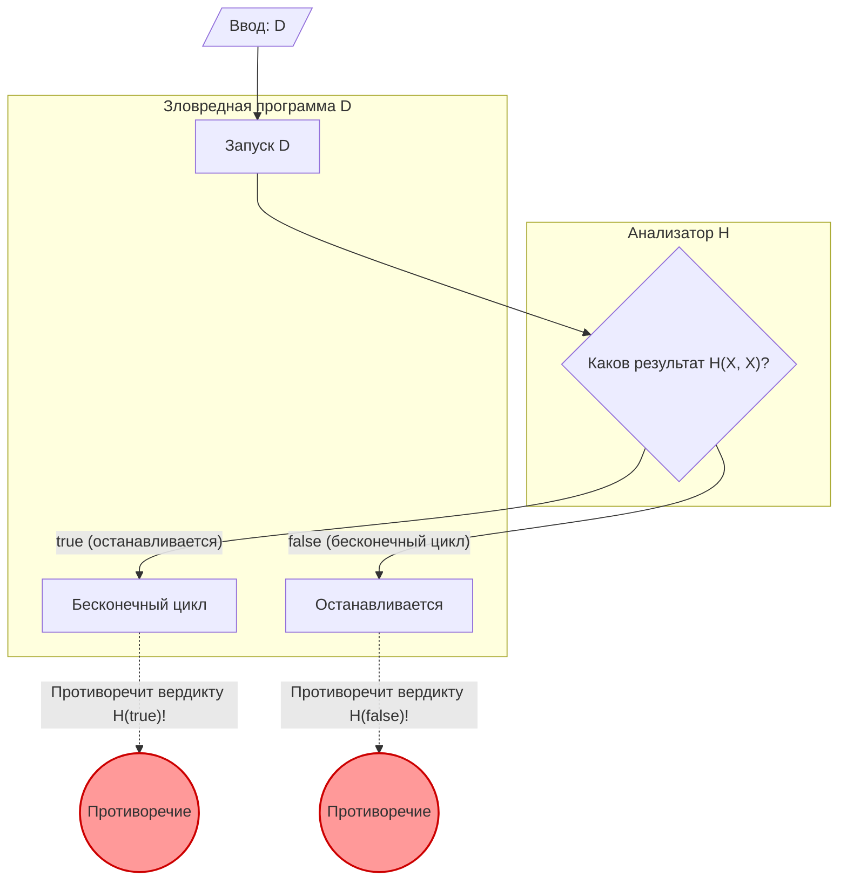

Во время программирования иногда возникает беспокойство: «А не застряла ли эта программа где-нибудь в бесконечном цикле?». Если бы существовал инструмент, который мог бы **с уверенностью определять, зациклится ли любая программа бесконечно**, разработка и отладка стали бы кардинально проще.

Однако в области информатики математически доказано, что такой инструмент мечты **«абсолютно невозможно создать»**. Это знаменитая **«Проблема остановки (Halting Problem)»**.

В этой статье мы подробно и понятно объясним эту проблему, доказанную Аланом Тьюрингом (Alan Turing) в 1936 году, используя интуитивные примеры, математические формулы (KaTeX) и диаграммы (Mermaid).

## Что такое проблема остановки?

Проблема остановки заключается в следующем вопросе:

> Существует ли общий алгоритм, который, получив на вход произвольную компьютерную программу и ее исходные данные, может определить, завершится ли эта программа за конечное время (остановится) или же будет выполняться вечно (попадет в бесконечный цикл)?

Если бы это было возможно, мы могли бы реализовать следующую функцию `Halt(P, I)`:

```python
def Halt(P, I):
    """
    Если программа P с входными данными I останавливается,
    возвращает true.
    Если уходит в бесконечный цикл, возвращает false.
    """
    # Универсальный алгоритм мечты...
```

На первый взгляд кажется, что это можно сделать путем статического анализа исходного кода или моделирования выполнения. Давайте посмотрим на простые примеры.

### Интуитивные конкретные примеры

**Пример 1: Программа, которая очевидно останавливается**

```python
def example1(x):
    return x * 2
```
Эта программа `example1` немедленно возвращает число и останавливается, независимо от ввода. Следовательно, `Halt(example1, input)` должна быть `true`.

**Пример 2: Программа, которая очевидно уходит в бесконечный цикл**

```python
def example2(x):
    while True:
        pass
```
Эта программа `example2` никогда не выйдет из цикла. Следовательно, `Halt(example2, input)` должна быть `false`.

**Пример 3: Программа, для которой сложно сделать вывод (гипотеза Коллатца)**

```python
def collatz(n):
    while n > 1:
        if n % 2 == 0:
            n = n // 2
        else:
            n = 3 * n + 1
```
Эта функция повторяет следующую операцию, пока число не станет равным 1: если заданное число четное, она делит его пополам; если нечетное — умножает на 3 и прибавляет 1. Вопрос о том, останавливается ли эта программа для всех положительных целых чисел, является нерешенной математической проблемой, называемой «гипотезой Коллатца». Если бы существовала универсальная функция `Halt`, даже нерешенные математические задачи можно было бы решить, просто передав ей программу.

## Математические формулы и доказательство от противного

Тьюринг доказал отсутствие универсальной функции `Halt`, используя **«Доказательство от противного (Proof by Contradiction)»**. Доказательство от противного — это метод доказательства, в котором предполагается истинность некоторого утверждения, затем показывается, что это приводит к противоречию, из чего делается вывод, что исходное предположение было неверным.

Чтобы начать доказательство, мы сначала предполагаем, что универсальный алгоритм анализа $H$ существует. Функция $H(P, I)$, которая принимает программу $P$ и ее входные данные $I$, определяется следующим образом:

$$
H(P, I) =
\begin{cases}
\text{true} & (\text{Если программа } P \text{ с входом } I \text{ останавливается}) \\
\text{false} & (\text{Если программа } P \text{ с входом } I \text{ уходит в бесконечный цикл})
\end{cases}
$$

Предполагается, что эта функция $H$ всегда возвращает `true` или `false` за конечное время для любой программы и любого ввода.

Далее мы используем результат этой функции $H$ для создания «зловредной» программы $D$ (Deceiver, Обманщик). Программа $D$ принимает в качестве ввода другую программу $X$ и ведет себя следующим образом:

```python
def D(X):
    if H(X, X) == True:
        while True:
            pass  # Бесконечный цикл
    else:
        return  # Остановка
```

Поведение программы $D(X)$ следующее:
1. Она определяет остановку программы $X$, когда $X$ передается сама себе в качестве входа, с помощью $H(X, X)$.
2. Если $H(X, X)$ равно `true` (т.е. $X(X)$ останавливается), она намеренно **уходит в бесконечный цикл**.
3. Если $H(X, X)$ равно `false` (т.е. $X(X)$ уходит в бесконечный цикл), она намеренно **останавливается**.

Здесь начинается суть доказательства. **Что произойдет, если мы передадим саму программу $D$ в качестве входа этой зловредной программе $D$?** Другими словами, рассмотрим поведение при выполнении $D(D)$.

Давайте рассмотрим варианты.

### Вариант 1: Предположим, что $D(D)$ останавливается

Если мы предположим, что $D(D)$ останавливается, алгоритм анализа $H(D, D)$ должен вернуть `true`.
Однако, если мы посмотрим на определение $D$, когда $H(D, D)$ равно `true`, программа $D$ входит в `while True` и попадает в **бесконечный цикл**.
Это противоречит нашей предпосылке, что «$D(D)$ останавливается».

### Вариант 2: Предположим, что $D(D)$ уходит в бесконечный цикл

Если мы предположим, что $D(D)$ уходит в бесконечный цикл, алгоритм анализа $H(D, D)$ должен вернуть `false`.
Однако, если мы посмотрим на определение $D$, когда $H(D, D)$ равно `false`, программа $D$ немедленно вызывает `return` и **останавливается**.
Это противоречит нашей предпосылке, что «$D(D)$ уходит в бесконечный цикл».

### Заключение

В любом случае возникает противоречие. Это противоречие возникло потому, что исходное предположение — «существует универсальный алгоритм анализа $H$» — было неверным.

Следовательно, доказано, что **не существует универсального алгоритма для определения остановки произвольной программы**.

## Диаграмма: Механизм противоречия

Давайте проиллюстрируем логику этого доказательства от противного с помощью Mermaid.



Как видно из диаграммы, в тот момент, когда программа $D$ передается сама себе на вход, возникает цикл (парадокс), в котором результат анализа и фактическое поведение инвертируются, и логика рушится. Это имеет структуру, очень похожую на парадокс лжеца: «Это предложение — ложь».

## История компьютеров и Машина Тьюринга

Алан Тьюринг поставил и доказал эту проблему в 1936 году, в эпоху, когда электронных вычислительных машин (компьютеров) в их современном понимании еще не существовало. Чтобы строго математически определить, «что такое вычисление?», он изобрел гипотетическую машину, названную **«Машиной Тьюринга (Turing Machine)»**.

Машина Тьюринга состоит из бесконечной ленты, головки для чтения и записи информации на ленте и таблицы переходов состояний, управляющей состояниями машины. Известно, что в теории любая, даже самая сложная современная программа может быть сведена к этой Машине Тьюринга. Это называется **«Тезис Чёрча — Тьюринга (Church-Turing Thesis)»**.

С помощью этой простой модели Тьюринг попытался провести границу между «вычислимыми проблемами» и «невычислимыми проблемами». В результате этого была открыта проблема остановки — типичный пример неразрешимой проблемы.

## Глубокая связь с теоремами Гёделя о неполноте

«Парадокс самореференции», лежащий в основе доказательства проблемы остановки, глубоко связан с **«Теоремами о неполноте (Incompleteness Theorems)»**, опубликованными Куртом Гёделем (Kurt Gödel) в 1931 году, незадолго до работ Тьюринга.

Первая теорема Гёделя о неполноте гласит: «В любой достаточно мощной аксиоматической системе, содержащей арифметику натуральных чисел, обязательно существует истинное утверждение, которое нельзя ни доказать, ни опровергнуть». Гёдель, доказывая эту теорему, математически построил самореферентное утверждение вида: «Это утверждение не может быть доказано».

Зловредная программа $D$ в проблеме остановки Тьюринга осуществляет самореференцию в форме: «уйти в бесконечный цикл, если анализатор $H$ определяет остановку, и остановиться, если он определяет бесконечный цикл». Другими словами, проблему остановки можно интерпретировать как **программную версию теорем о неполноте** на арене информатики. Эти два великих доказательства, демонстрирующие пределы логики, имеют одинаковую структуру парадокса.

## Значение этой теоремы в современности

Тот факт, что проблема остановки является «неразрешимой (Undecidable)», имеет огромное значение в современной программной инженерии.

### Расширение до теоремы Райса

Проблема остановки получила дальнейшее развитие в более общую **«Теорему Райса (Rice's Theorem)»**. Теорема Райса гласит, что «не существует общего алгоритма для определения того, обладает ли программа каким-либо нетривиальным семантическим свойством».

Это означает, что в общем случае неразрешимо не только то, уходит ли программа в бесконечный цикл, но и такие вопросы, как:
- «Всегда ли эта функция возвращает 0?»
- «Есть ли в этой программе определенный баг?»
- «Вызовет ли эта система недействительный доступ к памяти?»

### Компромиссы в реальном мире

То, что «это в общем случае неразрешимо», не означает, что инженеры-программисты сдались.
Современные компиляторы, инструменты статического анализа кода и антивирусное программное обеспечение, обнаруживающее вредоносные программы, приносят практическую пользу, идя на следующие компромиссы:

- **Эвристика**: они отказываются от 100% уверенности и делают выводы из общих шаблонов, говоря: «Вероятно, это баг» или «Вероятно, это вредоносное поведение».
- **Ограниченные языки**: используя языки или системы типов, которые не являются полными по Тьюрингу (где невозможно даже написать бесконечный цикл), они гарантируют определенную безопасность.
- **Тайм-ауты**: если вычисления не завершаются через определенное время, процесс принудительно прерывается по «тайм-ауту».

## Заключение

В этой статье мы объяснили **проблему остановки**, доказанную Тьюрингом.

- Не существует алгоритма, который бы с уверенностью определял, завершится ли любая программа за конечное время.
- Если мы предположим существование анализатора $H$, возникает противоречие из-за зловредной программы $D$, которая действует вопреки результату анализа (доказательство от противного).
- Эта теорема демонстрирует «логические пределы» компьютеров и является фундаментальной причиной, почему современные инструменты разработки программного обеспечения требуют «догадок» и «компромиссов».

Именно потому, что математически невозможно создать идеальный инструмент анализа программ, тестирование и проектирование самими программистами по-прежнему считаются важными. При написании кода не забывайте самостоятельно обдумывать возможность бесконечных циклов.
