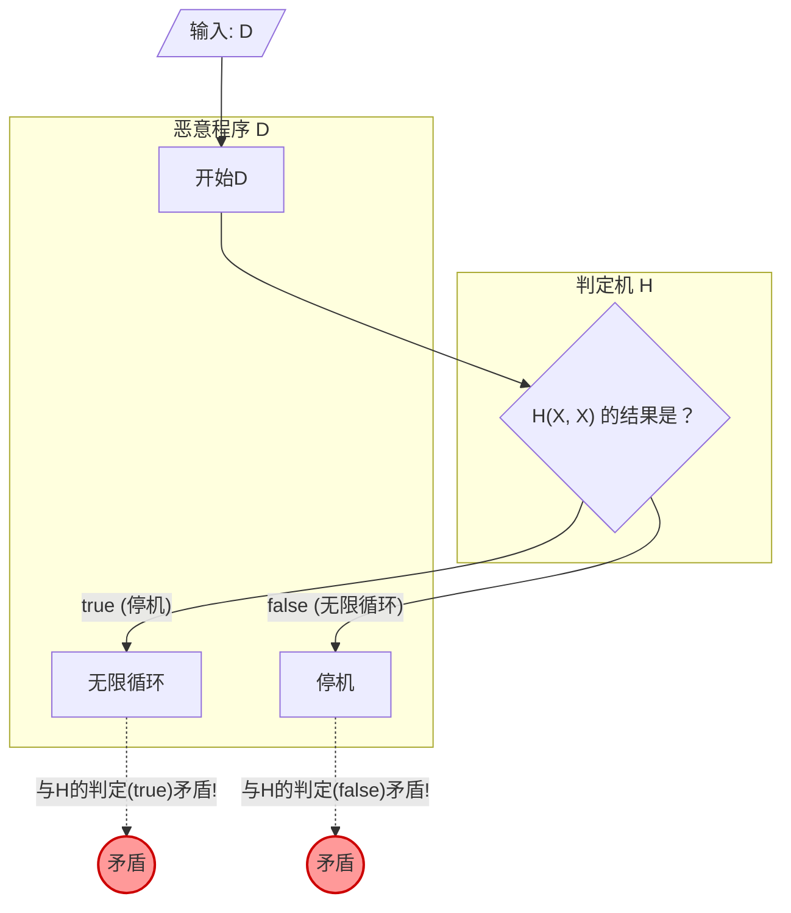

在编程时，有时会担心“这个程序，会不会在某个地方变成了无限循环？”。如果有一个 **能准确判断任意程序是否会无限循环的工具** ，开发和调试将会变得极其简单。

然而，在计算机科学领域，这种梦想般的工具已经在数学上被证明为 **“绝对无法做出”** 。这就是著名的 **“[停机问题（Halting Problem）](https://kenji.blog/zh-cn/p/halting-problem/)”** 。

本文将对阿兰·图灵（[Alan Turing](https://kenji.blog/zh-cn/p/turing/)）在1936年证明的这个问题，通过直观的具体例子、数学公式（KaTeX）以及图解（Mermaid），进行通俗易懂的解说。

## 什么是停机问题？

停机问题是指如下问题：

> 给定任意计算机程序及其输入，是否存在一个通用算法，能够判定该程序在有限时间内结束（停机），还是永远运行下去（无限循环）？

如果这是可能的，那么应该能够实现以下函数 `Halt(P, I)` 。

```python
def Halt(P, I):
    """
    当给程序 P 赋予输入 I 时，
    如果停机返回 true ，
    如果无限循环返回 false 。
    """
    # 梦幻的万能算法...
```

乍一看，似乎只要对源代码进行静态分析，或者模拟其运行就可以做出来。让我们来看一些简单的例子。

### 直观的具体例子

**例1：明显会停机的程序**

```python
def example1(x):
    return x * 2
```
这个程序 `example1` 无论输入什么都会立刻返回数值并停机。因此 `Halt(example1, input)` 应该是 `true` 。

**例2：明显会无限循环的程序**

```python
def example2(x):
    while True:
        pass
```
这个程序 `example2` 永远不会跳出循环处理。因此 `Halt(example2, input)` 应该是 `false` 。

**例3：判定困难的程序（考拉兹猜想）**

```python
def collatz(n):
    while n > 1:
        if n % 2 == 0:
            n = n // 2
        else:
            n = 3 * n + 1
```
这个函数对给定的数进行操作：如果是偶数则减半，如果是奇数则乘以3加1，一直重复直到变为1为止。对于所有正整数，这个程序是否会停机，是一个被称为“考拉兹猜想”的数学未解决问题。如果存在万能的 `Halt` 函数，那么就连未解决的数学问题，只要把程序传进去就能迎刃而解了。

## 数学公式与反证法的证明

图灵使用了 **“反证法（Proof by Contradiction）”** ，证明了万能的 `Halt` 函数是不存在的。反证法是一种证明手法，它先假设某个命题成立，然后展示这会导致矛盾，从而得出最初的假设是错误的结论。

为了开始证明，首先假设存在一个万能的判定算法 $H$ 。接收程序 $P$ 及其输入 $I$ 的函数 $H(P, I)$ 定义如下：

$$
H(P, I) =
\begin{cases}
\text{true} & (\text{程序 } P \text{ 在输入 } I \text{ 时停机}) \\
\text{false} & (\text{程序 } P \text{ 在输入 } I \text{ 时无限循环})
\end{cases}
$$

我们假设这个 $H$ 对任何程序和输入，必然能在有限时间内返回 `true` 或 `false` 。

接着，利用这个 $H$ 的结果，构建一个恶意的程序 $D$ （Deceiver，欺骗者）。程序 $D$ 接收另一个程序 $X$ 作为输入，行为如下：

```python
def D(X):
    if H(X, X) == True:
        while True:
            pass  # 无限循环
    else:
        return  # 停机
```

程序 $D(X)$ 的动作如下：
1. 用 $H(X, X)$ 判定程序 $X$ 以 $X$ 自身作为输入时的停机性。
2. 如果 $H(X, X)$ 为 `true` （即 $X(X)$ 会停机），则故意进入 **无限循环** 。
3. 如果 $H(X, X)$ 为 `false` （即 $X(X)$ 会无限循环），则故意 **停机** 。

证明的核心在这里。 **如果把这个恶意程序 $D$ 本身作为输入传给 $D$ ，会发生什么呢？** 也就是说，我们来考虑执行 $D(D)$ 时的行为。

分情况来思考一下。

### 情况1：假设 $D(D)$ 会停机

如果假设 $D(D)$ 会停机，那么判定算法 $H(D, D)$ 应该返回 `true` 。
但是，看看 $D$ 的定义，如果 $H(D, D)$ 为 `true` ， $D$ 会进入 `while True` ，从而陷入 **无限循环** 。
这与“ $D(D)$ 会停机”的前提相矛盾。

### 情况2：假设 $D(D)$ 会无限循环

如果假设 $D(D)$ 会无限循环，那么判定算法 $H(D, D)$ 应该返回 `false` 。
但是，看看 $D$ 的定义，如果 $H(D, D)$ 为 `false` ， $D$ 会立刻执行 `return` 而 **停机** 。
这与“ $D(D)$ 会无限循环”的前提相矛盾。

### 结论

无论哪种情况都会产生矛盾。这个矛盾是由于最初的假设“存在万能的判定算法 $H$ ”是错误的而产生的。

因此，证明了 **能够判定任意程序停机性的万能算法是不存在的** 。

## 图解：矛盾的机制

让我们用 Mermaid 来图解这个反证法的逻辑。



从图中可以看出，在将 $D$ 自身作为输入给出的瞬间，就产生了判定结果与实际行动相反的循环（悖论），逻辑在此崩溃。这与“这句话是谎言”这种说谎者悖论有着极其相似的结构。

## 计算机的历史与图灵机

阿兰·图灵提出并证明这个问题是在1936年，那还是一个不存在像现代这样的电子计算机的时代。他为了在数学上严格定义“什么是计算？”，构想了一种名为 **“图灵机（Turing Machine）”** 的虚拟机器。

图灵机由无限延伸的纸带、读写纸带信息的读写头以及管理机器状态的状态转移表构成。众所周知，现代任何复杂的程序，在理论上都可以还原为这个图灵机。这被称为 **“丘奇-图灵论题（Church-Turing Thesis）”** 。

图灵试图使用这个简单的模型，在“可计算问题”和“不可计算问题”之间划一条界线。作为结果被发现的，就是不可判定问题的代表作——停机问题。

## 与[哥德尔不完备定理](https://kenji.blog/zh-cn/p/godels-incompleteness-theorems/)的深刻联系

停机问题证明根底里的“自我指涉的悖论”，与图灵提出该问题稍早之前的1931年，[库尔特·哥德尔](https://kenji.blog/zh-cn/p/godel/)（[Kurt Gödel](https://kenji.blog/zh-cn/p/godel/)）发表的 **“不完备定理（Incompleteness Theorems）”** 有着深刻的联系。

哥德尔的第一不完备定理指出，“在包含自然数论的足够强大的公理系统中，必然存在既不能被证明也不能被证伪的真命题”。哥德尔在证明这个定理时，在数学上构建了一个“这个命题无法被证明”的自我指涉的命题。

图灵停机问题中的恶意程序 $D$ ，以“如果判定机 $H$ 判定会停机则无限循环，判定会无限循环则停机”的形式进行了自我指涉。也就是说，停机问题也可以解释为计算机科学舞台上的 **编程版不完备定理** 。这两个展示了逻辑局限性的伟大证明，共享着同样的悖论结构。

## 这个定理给现代带来的意义

停机问题是“不可判定的（Undecidable）”这一事实，在现代软件工程中也具有非常重要的意义。

### 向莱斯定理的扩展

停机问题进一步发展为更一般的 **“莱斯定理（Rice's Theorem）”** 。莱斯定理指出，“能够判定程序是否具有非平凡的语义性质的通用算法是不存在的”。

也就是说，我们知道不仅是能否判定是否无限循环，以下这类问题通常也是不可判定的。
- “这个函数总是返回0吗？”
- “这个程序中存在特定的 Bug 吗？”
- “这个系统会引发非法的内存访问吗？”

### 实用世界中的妥协

虽说“通常无法解开”，但软件工程师并没有因此放弃。
现代的编译器、静态代码分析工具、检测恶意软件的反病毒软件等，通过做出如下妥协，带来了实用的红利。

- **启发式算法（Heuristics）** ：放弃100%的确定性，从常见的模式中推断“这大概是 Bug ”或“这大概是恶意行为”。
- **受限的语言** ：通过使用非图灵完备的（根本写不出无限循环的）受限语言或类型系统，来保证特定的安全性。
- **超时（Timeout）** ：如果计算了一定时间还没结束，就将其作为“超时”强制终止处理。

## 总结

本文解说了由图灵证明的 **停机问题** 。

- 能够准确判定任意程序是否能在有限时间内停机的算法是不存在的。
- 假设存在判定机 $H$ ，就会因为一个背叛判定结果的恶意程序 $D$ 而产生矛盾（反证法）。
- 这个定理展示了计算机所固有的“逻辑局限性”，并且是现代软件开发工具需要“推测”和“妥协”的根本原因。

正因为在数学上无法造出完美的程序分析工具，所以现在依然认为程序员自己进行的测试和设计至关重要。在写代码的时候，别忘了用自己的大脑去思考产生无限循环的可能性。
