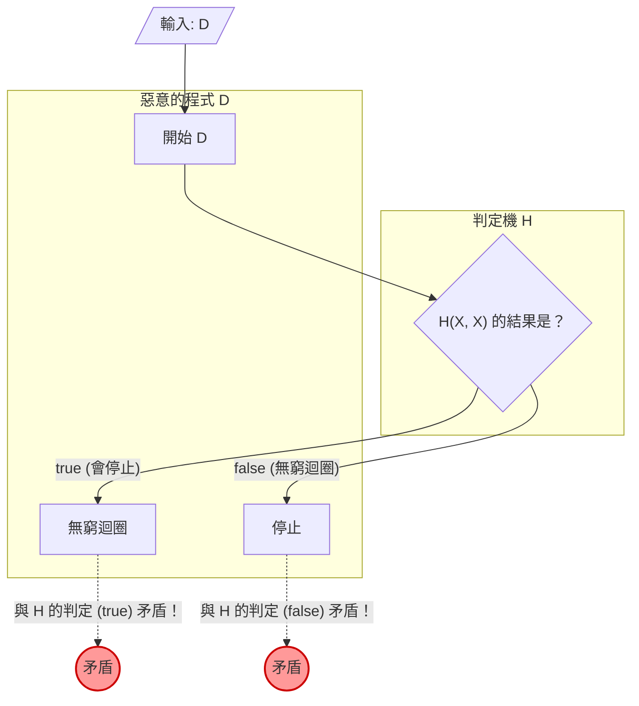

寫程式時，有時會感到不安：「這個程式，會不會在哪裡陷入無窮迴圈呢？」如果有一個 **能確實判定任意程式是否會陷入無窮迴圈的工具** ，那麼開發與除錯將會變得極其簡單。

然而，在計算機科學的領域中，這種夢幻般的工具已經在數學上被證明是 **「絕對無法打造」** 的。這就是著名的 **「[停止性問題（Halting Problem）](https://kenji.blog/zh-tw/p/halting-problem/)」** 。

本文將針對 1936 年由[艾倫·圖靈](https://kenji.blog/zh-tw/p/turing/)（[Alan Turing](https://kenji.blog/zh-tw/p/turing/)）所證明的這個問題，運用直觀的具體例子、數學公式（KaTeX）以及圖解（Mermaid），來進行淺顯易懂的解說。

## 什麼是停止性問題？

停止性問題指的是以下這樣的問題：

> 當給定任意的電腦程式及其輸入時，是否存在一個通用的演算法，能夠判定該程式會在有限時間內結束（停止），還是會永遠執行下去（陷入無窮迴圈）？

如果這是可能的，那麼我們應該可以實作出如下的函數 `Halt(P, I)`：

```python
def Halt(P, I):
    """
    當給予程式 P 輸入 I 時，
    如果會停止則回傳 true，
    如果會陷入無窮迴圈則回傳 false。
    """
    # 夢幻的萬能演算法...
```

乍看之下，只要透過靜態分析原始碼，或是模擬執行過程，似乎就能夠做得出來。讓我們來看幾個簡單的例子。

### 直觀的具體例子

**例 1：顯然會停止的程式**

```python
def example1(x):
    return x * 2
```
這個程式 `example1` 無論輸入為何，都會立刻回傳數值並停止。因此 `Halt(example1, input)` 應該要變成 `true`。

**例 2：顯然會陷入無窮迴圈的程式**

```python
def example2(x):
    while True:
        pass
```
這個程式 `example2` 永遠不會跳出迴圈。因此 `Halt(example2, input)` 應該要變成 `false`。

**例 3：難以判定的程式（考拉茲猜想）**

```python
def collatz(n):
    while n > 1:
        if n % 2 == 0:
            n = n // 2
        else:
            n = 3 * n + 1
```
這個函數會將給定的數字，如果是偶數就減半，如果是奇數就乘以 3 再加 1，重複這個操作直到變成 1 為止。對於所有正整數，這個程式是否都會停止，是一個被稱為「考拉茲猜想（Collatz conjecture）」的數學未解決問題。如果存在萬能的 `Halt` 函數，那麼就連未解決的數學問題，也只要把程式傳進去就能迎刃而解了。

## 數學公式與反證法的證明

圖靈運用了 **「反證法（Proof by Contradiction）」** ，證明了萬能的 `Halt` 函數並不存在。反證法是一種證明手法，藉由假設某個命題成立會產生矛盾，進而得出原本的假設是錯誤的結論。

為了開始證明，我們首先假設存在一個萬能的判定演算法 $H$。接收程式 $P$ 及其輸入 $I$ 的函數 $H(P, I)$ 的定義如下：

$$
H(P, I) =
\begin{cases}
\text{true} & (\text{當程式 } P \text{ 在輸入 } I \text{ 時會停止}) \\
\text{false} & (\text{當程式 } P \text{ 在輸入 } I \text{ 時會陷入無窮迴圈})
\end{cases}
$$

我們假設這個 $H$，對於任何程式與輸入，必定能在有限時間內回傳 `true` 或 `false`。

接著，利用這個 $H$ 的結果，我們來打造一個惡意的程式 $D$（Deceiver，欺騙者）。程式 $D$ 會將另一個程式 $X$ 當作輸入，並表現出如下的行為：

```python
def D(X):
    if H(X, X) == True:
        while True:
            pass  # 陷入無窮迴圈
    else:
        return  # 停止
```

程式 $D(X)$ 的動作如下：
1. 將 $X$ 本身當作輸入給予程式 $X$，並用 $H(X, X)$ 來判定其停止性。
2. 如果 $H(X, X)$ 為 `true`（亦即 $X(X)$ 會停止），則刻意 **陷入無窮迴圈** 。
3. 如果 $H(X, X)$ 為 `false`（亦即 $X(X)$ 會陷入無窮迴圈），則刻意 **停止** 。

接下來就是證明的核心。 **如果將 $D$ 本身當作輸入給予這個惡意的程式 $D$，會發生什麼事呢？** 也就是說，我們來思考執行 $D(D)$ 時的行為。

讓我們分情況來思考。

### 情況 1：假設 $D(D)$ 會停止

如果假設 $D(D)$ 會停止，判定演算法 $H(D, D)$ 應該會回傳 `true`。
但是，看看 $D$ 的定義，當 $H(D, D)$ 為 `true` 時，$D$ 會進入 `while True`，進而 **陷入無窮迴圈** 。
這與「 $D(D)$ 會停止」的前提產生了矛盾。

### 情況 2：假設 $D(D)$ 會陷入無窮迴圈

如果假設 $D(D)$ 會陷入無窮迴圈，判定演算法 $H(D, D)$ 應該會回傳 `false`。
但是，看看 $D$ 的定義，當 $H(D, D)$ 為 `false` 時，$D$ 會立刻 `return` 並 **停止** 。
這與「 $D(D)$ 會陷入無窮迴圈」的前提產生了矛盾。

### 結論

無論是哪種情況都產生了矛盾。這個矛盾，是因為我們最初的假設「存在一個萬能的判定演算法 $H$」是錯誤的所導致的。

因此，我們證明了 **能判定任意程式停止性的萬能演算法並不存在** 。

## 圖解：矛盾的機制

讓我們使用 Mermaid 來圖解這個反證法的邏輯。



如圖所示，在將 $D$ 本身作為輸入給予的瞬間，就會產生判定結果與實際行動相反的迴圈（悖論），導致邏輯崩潰。這與「這句話是謊言」的說謊者悖論有著非常相似的結構。

## 電腦的歷史與圖靈機

[艾倫·圖靈](https://kenji.blog/zh-tw/p/turing/)提出並證明這個問題是在 1936 年，那是一個還沒有像現代這種電子計算機（電腦）存在的時代。他為了在數學上嚴密定義「計算是什麼？」，構想出了一種稱為 **「圖靈機（Turing Machine）」** 的虛擬機器。

圖靈機由無限延伸的紙帶、能夠讀寫紙帶資訊的讀寫頭，以及管理機器狀態的狀態轉移表所構成。我們已經知道，即使是現代再怎麼複雜的程式，理論上都可以還原成這個圖靈機。這被稱為 **「邱奇－圖靈論題（Church-Turing Thesis）」** 。

圖靈試圖利用這個簡單的模型，在「可計算的問題」與「不可計算的問題」之間劃出一條界線。其結果所發現的，就是不可判定問題的代表——停止性問題。

## 與[哥德爾不完備定理](https://kenji.blog/zh-tw/p/godels-incompleteness-theorems/)的深層關聯

停止性問題證明根底的「自我指涉悖論」，與圖靈之前，在 1931 年由[庫爾特·哥德爾](https://kenji.blog/zh-tw/p/godel/)（[Kurt Gödel](https://kenji.blog/zh-tw/p/godel/)）發表的 **「不完備定理（Incompleteness Theorems）」** 有著深層的關聯。

哥德爾的第一不完備定理指出：「在包含自然數論且足夠強大的公理系統中，必定存在無法證明也無法反證的真命題。」哥德爾在這個定理的證明中，在數學上建構了「這個命題無法被證明」這樣的自我指涉命題。

圖靈停止性問題中惡意的程式 $D$，以「如果判定機 $H$ 判定為停止則陷入無窮迴圈，如果判定為無窮迴圈則停止」的形式進行了自我指涉。也就是說，停止性問題也可以被解釋為計算機科學舞台上 **不完備定理的程式設計版** 。這兩個展示邏輯極限的偉大證明，共享著相同的悖論結構。

## 這個定理對現代的意義

停止性問題是「不可判定（Undecidable）」的這個事實，在現代的軟體工程中也具有非常重要的意義。

### 擴展至萊斯定理

停止性問題更進一步發展為更普遍的 **「萊斯定理（Rice's Theorem）」** 。萊斯定理指出：「不存在通用的演算法，能夠判定程式是否具有非平凡的語義性質。」

也就是說，不只是會不會陷入無窮迴圈，我們已經知道，一般而言下列這類的問題也是不可判定的：
- 「這個函數是否總是回傳 0？」
- 「這個程式中是否存在特定的 bug？」
- 「這個系統是否會引發不合法的記憶體存取？」

### 實用世界中的妥協

即便「一般而言無法解開」，軟體工程師們也沒有因此放棄。
現代的編譯器、靜態程式碼分析工具，以及偵測惡意軟體的防毒軟體等，透過以下這樣的妥協，帶來了實用的幫助。

- **啟發式演算法（Heuristics）** ： 放棄 100% 的確定性，從常見的模式中推論出「這可能是個 bug」或是「這可能是惡意的行為」。
- **受限的語言** ： 藉由使用非圖靈完備（根本寫不出無窮迴圈）的受限語言或型別系統，來保證特定的安全性。
- **逾時（Timeout）** ： 如果計算了一段時間仍未結束，就將其視為「逾時」並強制終止處理。

## 總結

本文解說了圖靈所證明的 **停止性問題** 。

- 不存在能確實判定任意程式是否會在有限時間內停止的演算法。
- 如果假設存在判定機 $H$，將會被違背判定結果的惡意程式 $D$ 產生矛盾（反證法）。
- 這個定理展示了電腦所具有的「邏輯極限」，也是現代軟體開發工具需要「推測」與「妥協」的根本原因。

正因為在數學上無法打造出完美的程式分析工具，所以程式設計師親自進行的測試與設計，至今仍然非常重要。在寫程式時，請不要忘記用自己的頭腦去思考無窮迴圈的可能性。
