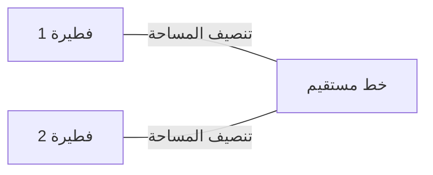
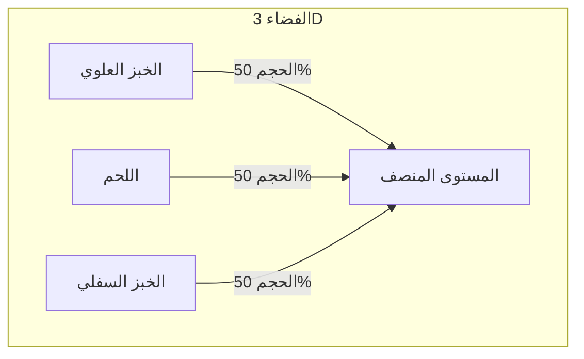
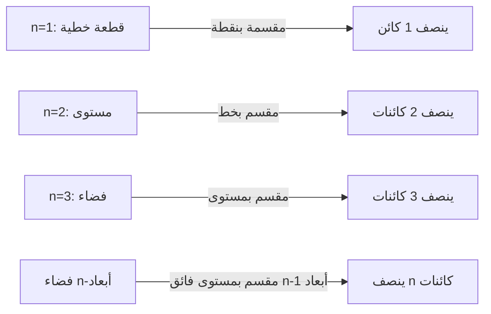

هناك العديد من النظريات الغريبة في الرياضيات التي تحمل أسماء من الحياة اليومية. من بينها، واحدة من أكثر النظريات شهرة وإثارة للاهتمام بشكل بديهي هي **[مبرهنة شطيرة اللحم](https://kenji.blog/ar/p/ham-sandwich-theorem/) (Ham Sandwich Theorem)**.

عندما تصنع شطيرة، فربما تتخيل شريحتين من الخبز مع شريحة من اللحم بينهما. تدعي هذه المبرهنة حقيقة مفاجئة: **"بغض النظر عن مدى تشوه الأشكال، أو كيف تتناثر في الهواء، فإن قطعًا واحدًا بسكين (مستوى واحد) يمكن أن ينصف تمامًا أحجام قطعتي خبز وقطعة واحدة من اللحم في نفس الوقت."**

في هذا المقال، سنشرح [مبرهنة شطيرة اللحم](https://kenji.blog/ar/p/ham-sandwich-theorem/) هذه بالتفصيل، من الفهم البديهي إلى نظرية الطوبولوجيا الجبرية القوية التي تقف وراءها، وهي **مبرهنة بورسوك-أولام**.

## 1. مقدمة: من الحياة اليومية إلى الرياضيات

تخيل قطع شطيرة إلى نصفين لتناول الإفطار أو الغداء. أنت تستخدم سكينًا لتقسيم الشطيرة إلى قطعتين. هل من الممكن قطعها بحيث يتم تقسيم المكونات الثلاثة - الخبز العلوي، والخبز السفلي، واللحم بالداخل - إلى نصف حجمها بالضبط؟

بشكل بديهي، إذا كان الخبز مكدسًا تمامًا، فسيكون القطع النظيف لأسفل المنتصف كافيًا. ولكن ماذا لو قام شخص ما بمزحة، بوضع الخبز العلوي على الحافة اليمنى للطاولة، والخبز السفلي على الحافة اليسرى، ولصق اللحم بالسقف؟

بشكل مثير للدهشة، وفقًا لنظرية رياضية، **حتى في هذه الحالة، إذا استخدمت سكينًا عملاقًا (مستوى)، يمكنك تنصيف الثلاثة في نفس الوقت**. هذا هو جوهر "[مبرهنة شطيرة اللحم](https://kenji.blog/ar/p/ham-sandwich-theorem/)". لا توجد متطلبات للمواقف أو الأشكال النسبية للأشياء، ولا تحتاج حتى إلى أن تكون قطعًا واحدة مستمرة.

## 2. البدء من ثنائي الأبعاد: مبرهنة الفطيرة

قبل النظر في [مبرهنة شطيرة اللحم](https://kenji.blog/ar/p/ham-sandwich-theorem/) ثلاثية الأبعاد، دعونا نلقي نظرة على الحالة ثنائية الأبعاد (المستوى). تُسمى النسخة ثنائية الأبعاد أحيانًا **مبرهنة الفطيرة (Pancake Theorem)**.

تنص مبرهنة الفطيرة على ما يلي:

> بالنظر إلى أي شكلين على مستوى (على سبيل المثال، فطيرتين)، يوجد دائمًا خط مستقيم واحد ينصف مساحات كلا الشكلين في نفس الوقت.

دعونا نوضح ذلك.

### فكرة لبرهان بديهي

لماذا يوجد مثل هذا الخط دائمًا؟ دعونا نفكر باستخدام مفهوم الاستمرارية.

1. أولاً، ارسم خطًا على المستوى يشير إلى اتجاه معين (على سبيل المثال، عموديًا).
2. أثناء ترجمتك لهذا الخط من اليسار إلى اليمين، ستجد بالتأكيد نقطة تنصف مساحة "الفطيرة 1" بالضبط (وهذا يرجع إلى **مبرهنة القيمة المتوسطة** في التفاضل والتكامل).
3. بعد ذلك، قم بتدوير زاوية هذا الخط باستمرار $\theta$ من $0^\circ$ إلى $180^\circ$.
4. في كل زاوية مدورة $\theta$ ، قم دائمًا بضبط الخط عن طريق ترجمته بحيث يستمر في تنصيف مساحة "الفطيرة 1".
5. في غضون ذلك، انتبه إلى كيفية تقسيم "الفطيرة 2" الأخرى. لتكن $f(\theta)$ نسبة مساحة الفطيرة 2 على الجانب الأيسر من الخط.
6. بين $\theta = 0^\circ$ و $\theta = 180^\circ$ ، يتم تبديل الجانبين "الأيسر" و "الأيمن" من الخط، لذلك $f(180^\circ) = 1 - f(0^\circ)$.
7. إذا كان الجانب الأيسر أكبر من النصف عند $\theta = 0^\circ$ ، فسيكون أصغر من النصف عند $\theta = 180^\circ$. نظرًا لأن نسبة المساحة $f(\theta)$ تتغير باستمرار، يجب أن تكون هناك زاوية على طول الطريق حيث $f(\theta) = 0.5$ ، مما يعني أن مساحة "الفطيرة 2" يتم تقليلها إلى النصف تمامًا.

هذا هو السبب في أنه يمكنك تنصيف كائنين في وقت واحد في الحالة ثنائية الأبعاد.

## 3. التمديد إلى ثلاثي الأبعاد: [مبرهنة شطيرة اللحم](https://kenji.blog/ar/p/ham-sandwich-theorem/)

الآن، دعونا ننتقل أخيرًا إلى القصة ثلاثية الأبعاد. عندما يرتفع البعد بمقدار واحد، يزداد عدد الكائنات التي يمكنك تقسيمها أيضًا بمقدار واحد.

البيان الرسمي للنظرية هو كما يلي:

> بالنسبة لأي ثلاث مناطق ذات حجم محدود $A, B, C$ في الفضاء ثلاثي الأبعاد $\mathbb{R}^3$ ، يوجد مستوى واحد على الأقل ينصف أحجام جميع الثلاثة في نفس الوقت.

تتوافق $A, B, C$ مع "الخبز العلوي" و "اللحم" و "الخبز السفلي" على التوالي. بغض النظر عن مدى تفتت الخبز، أو حتى لو طار اللحم إلى حافة الفضاء الخارجي، يمكن لمستوى واحد أن يقطعهم جميعًا بشكل مثالي إلى النصف.

الشيء الرائع في هذه النظرية هو أنه لا توجد أي قيود على الإطلاق على أشكال الكائنات المستهدفة. يمكن أن تكون مجالات، مكعبات، كعكات ذات ثقوب، أو حتى تنكسر إلى شظايا صغيرة لا حصر لها (رياضيا، تحتاج فقط إلى أن تكون مجموعات قابلة للقياس مع قياس ليبيغ محدود).

## 4. السلاح القوي الكامن: مبرهنة بورسوك-أولام

لإثبات [مبرهنة شطيرة اللحم](https://kenji.blog/ar/p/ham-sandwich-theorem/) رياضيًا وبدقة، يتم استخدام نظرية مهمة جدًا في الطوبولوجيا: **مبرهنة بورسوك-أولام**.

### ما هي مبرهنة بورسوك-أولام؟

الادعاء العام لمبرهنة بورسوك-أولام هو كما يلي:

> بالنسبة لأي تعيين مستمر $f: S^n \to \mathbb{R}^n$ ، توجد دائمًا نقطة $x \in S^n$ بحيث $f(x) = f(-x)$.

هنا، $S^n$ هي الكرة ذات الأبعاد $n$ في مساحة $(n+1)$ أبعاد (على سبيل المثال، $S^2$ عبارة عن كرة عادية مثل سطح الأرض التي نعيش عليها)، و $\mathbb{R}^n$ هي المساحة الإقليدية ذات الأبعاد $n$. أيضًا، يشير $x$ و $-x$ إلى **النقاط المتقابلة** على الكرة (نقاط على جانبي خط مستقيم يمر عبر المركز، مثل القطبين الشمالي والجنوبي على الأرض، أو طوكيو وقبالة سواحل البرازيل).

إذا فسرنا هذه النظرية في الحالة المألوفة لـ $n=2$ ( $S^2 \to \mathbb{R}^2$ )، فيمكننا تحديد الحقيقة المثيرة للاهتمام التالية:

**"هناك دائمًا زوج من النقاط المتقابلة في مكان ما على الأرض لها نفس درجة الحرارة والضغط تمامًا."**

بالنسبة لدالة $f(x) = \left( \text{درجة الحرارة}, \text{الضغط} \right)$ التي لها قيمتان مستمرتان، فهذا يعني أن القيم تتطابق تمامًا عند النقطة المقابلة $-x$ على الأرض. قد يبدو هذا غير بديهي، ولكنه حقيقة لا تتزعزع ومثبتة رياضيًا.

### رسم تخطيطي لإثبات [مبرهنة شطيرة اللحم](https://kenji.blog/ar/p/ham-sandwich-theorem/)

يمكن إثبات [مبرهنة شطيرة اللحم](https://kenji.blog/ar/p/ham-sandwich-theorem/) (النسخة ثلاثية الأبعاد) باستخدام الحالة $n=2$ من مبرهنة بورسوك-أولام. يوجد أدناه رسم تخطيطي لبرهانها الجميل.

1. ضع في اعتبارك النقطة $p$ على كرة الوحدة $S^2$ المتمركزة في الأصل (يمثل هذا المتجه الطبيعي للمستوى، أي "اتجاه" المستوى).
2. عندما يتم تثبيت الاتجاه $p$ ، يتم تحديد المستوى الذي ينصف حجم "الخبز العلوي" بشكل فريد (دعنا نطلق على هذا المستوى $H(p)$).
3. هذا المستوى $H(p)$ يقسم أيضًا "اللحم" و "الخبز السفلي".
4. لذلك، نحدد التعيين المستمر $f: S^2 \to \mathbb{R}^2$ على النحو التالي:
   $$ f(p) = \left( \text{حجم اللحم في الجانب الموجب من المستوى } H(p), \text{حجم الخبز السفلي في الجانب الموجب من المستوى } H(p) \right) $$
5. إذا عكسنا اتجاه المستوى تمامًا (قمنا بتغيير $p$ إلى $-p$)، فسيتم تبديل "الجانب الإيجابي" و "الجانب السلبي" من المستوى. لذلك، يتم تبديل أحجام الجانب الإيجابي والجانب السلبي.
6. وفقًا لمبرهنة بورسوك-أولام، هناك دائمًا اتجاه $p$ بحيث $f(p) = f(-p)$.
7. يعني $f(p) = f(-p)$ أن الحجم الموجود على الجانب الموجب من المستوى في الاتجاه $p$ يساوي الحجم على الجانب الموجب في الاتجاه $-p$ (وهو الجانب السالب من المستوى الأصلي). هذا يعني ببساطة أن كلا من "اللحم" و "الخبز السفلي" يتم تنصيفهما في وقت واحد.
8. نظرًا لأنه تم اختيار المستوى لتنصيف "الخبز العلوي" منذ البداية، ينتهي الأمر بتقسيم المكونات الثلاثة بواسطة مستوى واحد.

## 5. [مبرهنة شطيرة اللحم](https://kenji.blog/ar/p/ham-sandwich-theorem/) المعممة ذات الأبعاد n

قام علماء الرياضيات بتعميم هذه النظرية إلى أبعاد أعلى.

> لأي $n$ مجموعات ذات قياس ليبيغ محدود في فضاء الأبعاد $n$ $\mathbb{R}^n$ ، يوجد مستوى فائق الأبعاد $(n-1)$ ينصفها جميعًا في وقت واحد.

بمعنى آخر، كلما زاد البعد، زاد أيضًا عدد الكائنات التي يمكنك تنصيفها في نفس الوقت.
- $n=1$ (خط): تنصيف قطعة خطية 1 بنقطة 1.
- $n=2$ (مستوى): تنصيف مساحات شكلين بخط واحد (مبرهنة الفطيرة).
- $n=3$ (فضاء): تنصيف أحجام 3 مواد صلبة بمستوى واحد ([مبرهنة شطيرة اللحم](https://kenji.blog/ar/p/ham-sandwich-theorem/)).
- $n=4$: قم بتنصيف الأحجام المفرطة لأربعة كائنات 4D في وقت واحد بمسافة 3D واحدة.

وبهذه الطريقة، يستمر هذا القانون الجميل في أي بُعد.

## 6. هل هذا عملي؟ (التطبيقات في الهندسة الحسابية)

غالبًا ما يتم سرد "[مبرهنة شطيرة اللحم](https://kenji.blog/ar/p/ham-sandwich-theorem/)" كموضوع ممتع في الرياضيات البحتة، ولكنها في الواقع لها تطبيقات عملية في مجالات مثل **الهندسة الحسابية** و **علوم الكمبيوتر**.

على سبيل المثال، عندما توجد كمية هائلة من نقاط البيانات (غيوم النقاط) في الفضاء، تُستخدم أحيانًا نسخة حسابية من [مبرهنة شطيرة اللحم](https://kenji.blog/ar/p/ham-sandwich-theorem/) لتقسيم هذه البيانات ومعالجتها بكفاءة. من خلال تنصيف البيانات المصنفة إلى فئات متعددة في نفس الوقت، فإنه يساعد في بناء خوارزميات معالجة وبحث بيانات فعالة باستخدام نهج التقسيم والغزو.

## 7. خاتمة

قد تبدو [مبرهنة شطيرة اللحم](https://kenji.blog/ar/p/ham-sandwich-theorem/) وكأنها مزحة باسم مضحك للوهلة الأولى، ولكن في الواقع، إنها نتيجة جميلة مطبقة من نظرية قوية في الرياضيات الحديثة، وتحديداً الطوبولوجيا الجبرية. حقيقة أن النظرية الرياضية المجردة يتم التعبير عنها من خلال شيء ملموس ويومي مثل الشطيرة هي بلا شك واحدة من الجوانب الرائعة للرياضيات.

في المرة القادمة التي تقطع فيها شطيرة بشكل عرضي، قد تكون هناك لحظة يتم فيها قطع المكونات الثلاثة إلى النصف تمامًا عن طريق الصدفة. خلال استراحة الغداء القادمة، بينما تمسك بسكينك، لماذا لا تدع أفكارك تنجرف إلى مساحات ذات أبعاد أعلى ومبرهنة بورسوك-أولام؟
