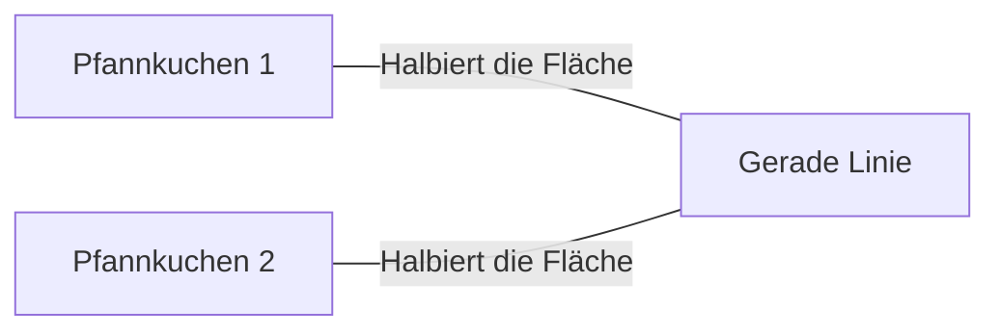
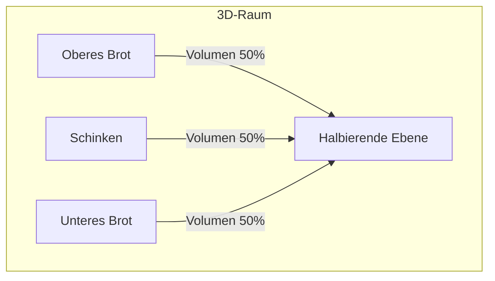
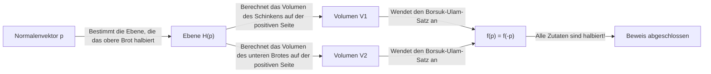
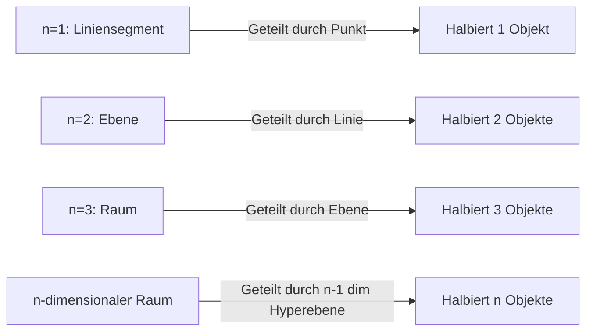

Es gibt viele merkwürdige Sätze in der Mathematik mit alltäglichen Namen. Einer der bekanntesten und intuitiv interessantesten davon ist der **Schinken-Sandwich-Satz (Ham Sandwich Theorem)**.

Wenn Sie ein Sandwich zubereiten, stellen Sie sich wahrscheinlich zwei Scheiben Brot mit einer Scheibe Schinken dazwischen vor. Dieser Satz behauptet eine überraschende Tatsache: **"Egal wie verzerrt die Formen sind oder wie weit sie in der Luft verstreut sind, ein einziger Schnitt mit einem Messer (eine einzige Ebene) kann die Volumina von zwei Stücken Brot und einem Stück Schinken gleichzeitig perfekt halbieren."**

In diesem Artikel werden wir diesen Schinken-Sandwich-Satz ausführlich erklären, vom intuitiven Verständnis bis hin zum mächtigen Satz der algebraischen Topologie, der dahinter steht, dem **Borsuk-Ulam-Satz**.

## 1. Einleitung: Vom Alltag zur Mathematik

Stellen Sie sich vor, Sie schneiden zum Frühstück oder Mittagessen ein Sandwich in der Mitte durch. Sie verwenden ein Messer, um das Sandwich in zwei Teile zu teilen. Ist es möglich, es so zu schneiden, dass alle drei Zutaten – das obere Brot, das untere Brot und der Schinken darin – in genau die Hälfte ihres Volumens geteilt werden?

Intuitiv gesehen würde ein sauberer Schnitt in der Mitte ausreichen, wenn das Brot perfekt gestapelt ist. Aber was, wenn sich jemand einen Scherz erlaubt und das obere Brot auf die rechte Kante des Tisches legt, das untere Brot auf die linke Kante und den Schinken an die Decke klebt?

Erstaunlicherweise können Sie laut einem mathematischen Satz **selbst dann, wenn Sie ein riesiges Messer (eine Ebene) verwenden, alle drei gleichzeitig halbieren**. Dies ist die Essenz des "Schinken-Sandwich-Satzes". Es gibt keine Anforderungen an die relativen Positionen oder Formen der Objekte, noch müssen sie einzelne kontinuierliche Stücke sein.

## 2. Ausgehend von 2D: Der Pfannkuchen-Satz

Bevor wir den Schinken-Sandwich-Satz in 3D betrachten, lassen Sie uns den zweidimensionalen (planaren) Fall betrachten. Die 2D-Version wird manchmal als **Pfannkuchen-Satz (Pancake Theorem)** bezeichnet.

Der Pfannkuchen-Satz besagt Folgendes:

> Bei zwei beliebigen Formen auf einer Ebene (z. B. zwei Pfannkuchen) gibt es immer eine einzige gerade Linie, die gleichzeitig die Flächen beider Formen halbiert.

Lassen Sie uns dies veranschaulichen.

### Idee eines intuitiven Beweises

Warum gibt es immer eine solche Linie? Denken wir unter Verwendung des Konzepts der Kontinuität.

1. Zeichnen Sie zunächst eine Linie auf der Ebene, die in eine bestimmte Richtung zeigt (z. B. vertikal).
2. Wenn Sie diese Linie von links nach rechts verschieben, werden Sie definitiv einen Punkt finden, an dem sie genau die Fläche von "Pfannkuchen 1" halbiert (dies ist auf den **Zwischenwertsatz** in der Infinitesimalrechnung zurückzuführen).
3. Drehen Sie als Nächstes kontinuierlich den Winkel dieser Linie $\theta$ von $0^\circ$ bis $180^\circ$.
4. Passen Sie die Linie bei jedem gedrehten Winkel $\theta$ immer so an, indem Sie sie verschieben, dass sie weiterhin die Fläche von "Pfannkuchen 1" halbiert.
5. Achten Sie währenddessen darauf, wie der andere "Pfannkuchen 2" geteilt wird. Sei $f(\theta)$ das Verhältnis der Fläche von Pfannkuchen 2 auf der linken Seite der Linie.
6. Zwischen $\theta = 0^\circ$ und $\theta = 180^\circ$ werden die "linke" und "rechte" Seite der Linie vertauscht, also ist $f(180^\circ) = 1 - f(0^\circ)$.
7. Wenn die linke Seite bei $\theta = 0^\circ$ größer als die Hälfte war, ist sie bei $\theta = 180^\circ$ kleiner als die Hälfte. Da sich das Flächenverhältnis $f(\theta)$ kontinuierlich ändert, muss es auf dem Weg einen Winkel geben, bei dem $f(\theta) = 0.5$ ist, was bedeutet, dass die Fläche von "Pfannkuchen 2" ebenfalls perfekt halbiert ist.

Aus diesem Grund können Sie im 2D-Fall zwei Objekte gleichzeitig halbieren.

## 3. Erweiterung auf 3D: [Der Schinken-Sandwich-Satz](https://kenji.blog/de/p/ham-sandwich-theorem/)

Lassen Sie uns nun endlich zur dreidimensionalen Geschichte übergehen. Wenn die Dimension um eins zunimmt, erhöht sich auch die Anzahl der Objekte, die Sie teilen können, um eins.

Die formale Aussage des Satzes lautet wie folgt:

> Für beliebige drei Regionen mit endlichem Volumen $A, B, C$ im dreidimensionalen Raum $\mathbb{R}^3$ existiert mindestens eine Ebene, die gleichzeitig die Volumina aller drei halbiert.

Diese $A, B, C$ entsprechen dem "oberen Brot", dem "Schinken" bzw. dem "unteren Brot". Egal wie zerbröselt das Brot ist oder selbst wenn der Schinken an den Rand des Weltraums fliegt, eine einzige Ebene kann sie alle perfekt in der Mitte durchschneiden.

Das Wunderbare an diesem Satz ist, dass es absolut keine Einschränkungen für die Formen der Zielobjekte gibt. Es können Kugeln, Würfel, Donuts mit Löchern sein oder sie können sogar in unzählige winzige Fragmente zerbrochen sein (mathematisch müssen es nur messbare Mengen mit endlichem Lebesgue-Maß sein).

## 4. Die mächtige Waffe dahinter: Der Borsuk-Ulam-Satz

Um den Schinken-Sandwich-Satz mathematisch und streng zu beweisen, wird ein sehr wichtiger Satz aus der Topologie verwendet: der **Borsuk-Ulam-Satz**.

### Was ist der Borsuk-Ulam-Satz?

Die allgemeine Behauptung des Borsuk-Ulam-Satzes lautet wie folgt:

> Für jede stetige Abbildung $f: S^n \to \mathbb{R}^n$ existiert immer ein Punkt $x \in S^n$ derart, dass $f(x) = f(-x)$.

Hier ist $S^n$ die $n$-dimensionale Sphäre im $(n+1)$-dimensionalen Raum (zum Beispiel ist $S^2$ eine gewöhnliche Sphäre wie die Erdoberfläche, auf der wir leben), und $\mathbb{R}^n$ ist der $n$-dimensionale euklidische Raum. Außerdem beziehen sich $x$ und $-x$ auf **Antipoden** auf der Sphäre (Punkte auf gegenüberliegenden Seiten einer geraden Linie, die durch das Zentrum verläuft, wie der Nord- und Südpol auf der Erde oder Tokio und vor der Küste Brasiliens).

Wenn wir diesen Satz im vertrauten Fall von $n=2$ ( $S^2 \to \mathbb{R}^2$ ) interpretieren, können wir folgende interessante Tatsache feststellen:

**"Es gibt immer ein Paar Antipoden irgendwo auf der Erde, die genau die gleiche Temperatur und den gleichen Druck haben."**

Für eine Funktion $f(x) = \left( \text{Temperatur}, \text{Druck} \right)$, die zwei kontinuierliche Werte hat, bedeutet dies, dass die Werte am entgegengesetzten Punkt $-x$ auf der Erde perfekt übereinstimmen. Das mag kontraintuitiv erscheinen, aber es ist eine unerschütterliche, mathematisch bewiesene Tatsache.

### Beweisskizze des Schinken-Sandwich-Satzes

[Der Schinken-Sandwich-Satz](https://kenji.blog/de/p/ham-sandwich-theorem/) (3D-Version) kann unter Verwendung des Falles $n=2$ des Borsuk-Ulam-Satzes bewiesen werden. Nachfolgend finden Sie eine Skizze seines schönen Beweises.

1. Betrachten Sie einen Punkt $p$ auf der Einheitssphäre $S^2$ mit dem Ursprung als Zentrum (dies stellt den Normalenvektor der Ebene dar, d. h. die "Richtung" der Ebene).
2. Wenn die Richtung $p$ festgelegt ist, ist eine Ebene, die das Volumen des "oberen Brotes" halbiert, eindeutig bestimmt (nennen wir sie Ebene $H(p)$).
3. Diese Ebene $H(p)$ teilt auch den "Schinken" und das "untere Brot".
4. Daher definieren wir eine stetige Abbildung $f: S^2 \to \mathbb{R}^2$ wie folgt:
   $$ f(p) = \left( \text{Volumen des Schinkens auf der positiven Seite der Ebene } H(p), \text{Volumen des unteren Brotes auf der positiven Seite der Ebene } H(p) \right) $$
5. Wenn wir die Richtung der Ebene vollständig umkehren ($p$ in $-p$ ändern), werden die "positive Seite" und die "negative Seite" der Ebene vertauscht. Daher werden die Volumina der positiven Seite und der negativen Seite vertauscht.
6. Nach dem Borsuk-Ulam-Satz gibt es immer eine Richtung $p$ derart, dass $f(p) = f(-p)$.
7. $f(p) = f(-p)$ bedeutet, dass das Volumen auf der positiven Seite der Ebene in Richtung $p$ gleich dem Volumen auf der positiven Seite in Richtung $-p$ ist (was die negative Seite der ursprünglichen Ebene ist). Dies bedeutet einfach, dass sowohl der "Schinken" als auch das "untere Brot" gleichzeitig halbiert werden.
8. Da die Ebene von Anfang an so gewählt wurde, dass sie das "obere Brot" halbiert, werden am Ende alle drei Zutaten durch eine einzige Ebene halbiert.

## 5. Verallgemeinerter n-dimensionaler Schinken-Sandwich-Satz

Mathematiker haben diesen Satz auf noch höhere Dimensionen verallgemeinert.

> Für beliebige $n$ Mengen mit endlichem Lebesgue-Maß im $n$-dimensionalen Raum $\mathbb{R}^n$ gibt es eine $(n-1)$-dimensionale Hyperebene, die alle gleichzeitig halbiert.

Mit anderen Worten, wenn die Dimension zunimmt, erhöht sich auch die Anzahl der Objekte, die Sie gleichzeitig halbieren können.
- $n=1$ (Linie): 1 Liniensegment mit 1 Punkt halbieren.
- $n=2$ (Ebene): Die Flächen von 2 Formen mit 1 Linie halbieren (Pfannkuchen-Satz).
- $n=3$ (Raum): Die Volumina von 3 Körpern mit 1 Ebene halbieren (Schinken-Sandwich-Satz).
- $n=4$: Gleichzeitiges Halbieren der Hypervolumina von vier 4D-Objekten mit einem 3D-Raum.

Auf diese Weise gilt dieses schöne Gesetz in jeder Dimension.

## 6. Ist es praktisch? (Anwendungen in der algorithmischen Geometrie)

Der "Schinken-Sandwich-Satz" wird oft als lustiges Thema in der reinen Mathematik erzählt, aber er hat tatsächlich praktische Anwendungen in Bereichen wie der **Algorithmischen Geometrie (Computational Geometry)** und der **Informatik**.

Wenn beispielsweise eine riesige Menge von Datenpunkten (Punktwolken) im Raum existiert, wird manchmal eine algorithmische Version des Schinken-Sandwich-Satzes verwendet, um diese Daten effizient zu partitionieren und zu verarbeiten. Durch das gleichzeitige Halbieren von Daten, die in mehrere Klassen eingeteilt sind, hilft dies beim Aufbau effizienter Datenverarbeitungs- und [Suchalgorithmen](/de/p/search-algorithms-linear-binary-hash-table-principles/) unter Verwendung des Divide-and-Conquer-Ansatzes.

## 7. Fazit

[Der Schinken-Sandwich-Satz](https://kenji.blog/de/p/ham-sandwich-theorem/) mag auf den ersten Blick wie ein Witz mit einem lustigen Namen erscheinen, aber in Wirklichkeit ist es ein schönes Ergebnis, das von einem mächtigen Satz in der modernen Mathematik, insbesondere der algebraischen Topologie, angewendet wird. Die Tatsache, dass eine abstrakte mathematische Theorie durch etwas so Konkretes und Alltägliches wie ein Sandwich ausgedrückt wird, ist wohl einer der faszinierenden Aspekte der Mathematik.

Wenn Sie das nächste Mal beiläufig ein Sandwich schneiden, gibt es vielleicht einfach einen Moment, in dem alle drei Zutaten durch Zufall perfekt halbiert werden. Warum lassen Sie Ihre Gedanken in Ihrer nächsten Mittagspause nicht in höherdimensionale Räume und zum Borsuk-Ulam-Satz schweifen, während Sie Ihr Messer greifen?
