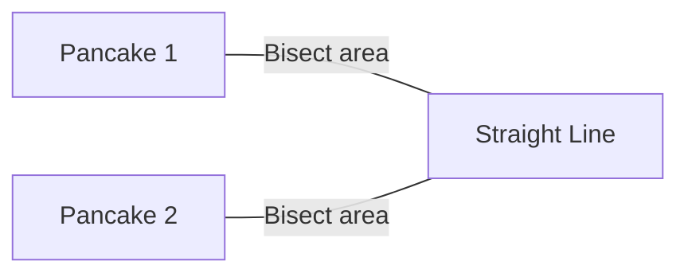
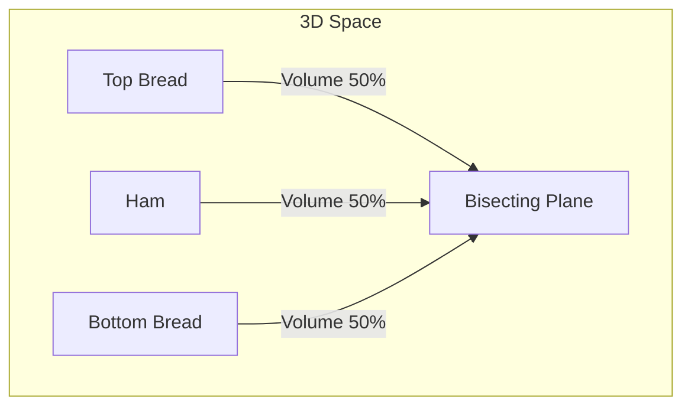
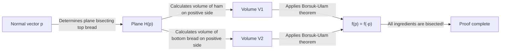
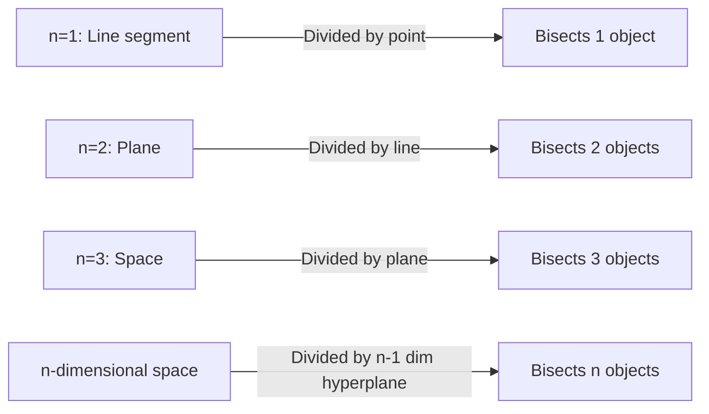

There are many curious theorems in mathematics with everyday names. Among them, one of the most famous and intuitively interesting is the **Ham Sandwich Theorem**.

When you make a sandwich, you probably imagine two pieces of bread with a slice of ham in between. This theorem claims a surprising fact: **"No matter how distorted the shapes are, or how scattered they are in mid-air, a single cut with a knife (a single plane) can perfectly bisect the volumes of two pieces of bread and one piece of ham simultaneously."**

In this article, we will thoroughly explain this Ham Sandwich Theorem, from an intuitive understanding to the powerful algebraic topology theorem behind it, the **Borsuk-Ulam Theorem**.

## 1. Introduction: From Everyday Life to Mathematics

Imagine cutting a sandwich in half for breakfast or lunch. You use a knife to divide the sandwich into two pieces. Is it possible to cut it so that all three ingredients—the top bread, the bottom bread, and the ham inside—are divided into exactly half their volume?

Intuitively, if the bread is perfectly stacked, a clean cut down the middle would suffice. But what if someone played a prank, placing the top bread on the right edge of the table, the bottom bread on the left edge, and sticking the ham to the ceiling?

Amazingly, according to a mathematical theorem, **even then, if you use a giant knife (a plane), you can bisect all three simultaneously**. This is the essence of the "Ham Sandwich Theorem". There are no requirements for the relative positions or shapes of the objects, nor do they even need to be single continuous chunks.

## 2. Starting from 2D: The Pancake Theorem

Before considering the 3D Ham Sandwich Theorem, let's look at the 2-dimensional (planar) case. The 2D version is sometimes called the **Pancake Theorem**.

The Pancake Theorem claims the following:

> Given any two shapes on a plane (for example, two pancakes), there always exists a single straight line that simultaneously bisects the areas of both shapes.

Let's illustrate this.

### Idea of an Intuitive Proof

Why does such a line always exist? Let's think using the concept of continuity.

1. First, draw a line on the plane pointing in a specific direction (e.g., vertically).
2. As you translate this line from left to right, you will definitely find a point where it exactly bisects the area of "Pancake 1" (this is due to the **Intermediate Value Theorem** in calculus).
3. Next, continuously rotate the angle of this line $\theta$ from $0^\circ$ to $180^\circ$.
4. At each rotated angle $\theta$, always adjust the line by translating it so that it continues to bisect the area of "Pancake 1".
5. Meanwhile, pay attention to how the other "Pancake 2" is divided. Let $f(\theta)$ be the ratio of the area of Pancake 2 on the left side of the line.
6. Between $\theta = 0^\circ$ and $\theta = 180^\circ$, the "left" and "right" sides of the line are swapped, so $f(180^\circ) = 1 - f(0^\circ)$.
7. If the left side was larger than half at $\theta = 0^\circ$, it will be smaller than half at $\theta = 180^\circ$. Since the area ratio $f(\theta)$ changes continuously, there must be an angle along the way where $f(\theta) = 0.5$, meaning the area of "Pancake 2" is also perfectly halved.

This is why you can bisect two objects simultaneously in the 2D case.

## 3. Extension to 3D: [The Ham Sandwich Theorem](https://kenji.blog/en/p/ham-sandwich-theorem/)

Now, let's finally move to the 3-dimensional story. When the dimension goes up by one, the number of objects you can divide also increases by one.

The formal statement of the theorem is as follows:

> For any three regions of finite volume $A, B, C$ in 3-dimensional space $\mathbb{R}^3$, there exists at least one plane that simultaneously bisects the volumes of all three.

These $A, B, C$ correspond to the "top bread", "ham", and "bottom bread", respectively. No matter how crumbled the bread is, or even if the ham flies off to the edge of outer space, a single plane can cut all of them perfectly in half.

The wonderful thing about this theorem is that there are absolutely no restrictions on the shapes of the target objects. They can be spheres, cubes, donuts with holes, or even broken into countless tiny fragments (mathematically, they just need to be measurable sets with finite Lebesgue measure).

## 4. The Powerful Weapon Behind: The Borsuk-Ulam Theorem

To mathematically and rigorously prove the Ham Sandwich Theorem, a very important theorem in topology is used: the **Borsuk-Ulam Theorem**.

### What is the Borsuk-Ulam Theorem?

The general claim of the Borsuk-Ulam theorem is as follows:

> For any continuous mapping $f: S^n \to \mathbb{R}^n$, there always exists a point $x \in S^n$ such that $f(x) = f(-x)$.

Here, $S^n$ is the $n$-dimensional sphere in $(n+1)$-dimensional space (for example, $S^2$ is an ordinary sphere like the surface of the Earth we live on), and $\mathbb{R}^n$ is the $n$-dimensional [Euclide](https://kenji.blog/en/p/euclid/)an space. Also, $x$ and $-x$ refer to **antipodal points** on the sphere (points on opposite sides of a straight line passing through the center, like the North and South Poles on Earth, or Tokyo and off the coast of Brazil).

If we interpret this theorem in the familiar case of $n=2$ ( $S^2 \to \mathbb{R}^2$ ), we can state the following interesting fact:

**"There always exists a pair of antipodal points somewhere on Earth that have exactly the same temperature and pressure."**

For a function $f(x) = \left( \text{Temperature}, \text{Pressure} \right)$ that has two continuous values, it means the values perfectly match at the opposite point $-x$ on Earth. This might seem counterintuitive, but it is an unshakable, mathematically proven fact.

### Proof Sketch of the Ham Sandwich Theorem

[The Ham Sandwich Theorem](https://kenji.blog/en/p/ham-sandwich-theorem/) (3D version) can be proved using the $n=2$ case of the Borsuk-Ulam Theorem. Below is a sketch of its beautiful proof.

1. Consider a point $p$ on the unit sphere $S^2$ centered at the origin (this represents the normal vector of the plane, i.e., the "direction" of the plane).
2. When the direction $p$ is fixed, a plane that bisects the volume of the "top bread" is uniquely determined (let's call this Plane $H(p)$).
3. This Plane $H(p)$ also divides the "ham" and the "bottom bread".
4. Therefore, we define a continuous mapping $f: S^2 \to \mathbb{R}^2$ as follows:
   $$ f(p) = \left( \text{Volume of ham on the positive side of plane } H(p), \text{Volume of bottom bread on the positive side of plane } H(p) \right) $$
5. If we completely reverse the direction of the plane (change $p$ to $-p$), the "positive side" and "negative side" of the plane are swapped. Therefore, the volumes of the positive side and negative side are swapped.
6. According to the Borsuk-Ulam theorem, there always exists a direction $p$ such that $f(p) = f(-p)$.
7. $f(p) = f(-p)$ means that the volume on the positive side of the plane in direction $p$ is equal to the volume on the positive side in direction $-p$ (which is the negative side of the original plane). This simply means that both the "ham" and the "bottom bread" are bisected simultaneously.
8. Since the plane was chosen to bisect the "top bread" from the very beginning, all three ingredients end up being bisected by a single plane.

## 5. Generalized n-dimensional Ham Sandwich Theorem

Mathematicians have generalized this theorem to even higher dimensions.

> For any $n$ sets with finite Lebesgue measure in $n$-dimensional space $\mathbb{R}^n$, there exists an $(n-1)$-dimensional hyperplane that simultaneously bisects all of them.

In other words, as the dimension increases, the number of objects you can simultaneously bisect also increases.
- $n=1$ (Line): Bisect 1 line segment with 1 point.
- $n=2$ (Plane): Bisect the areas of 2 shapes with 1 line (Pancake Theorem).
- $n=3$ (Space): Bisect the volumes of 3 solids with 1 plane (Ham Sandwich Theorem).
- $n=4$: Simultaneously bisect the hypervolumes of four 4D objects with one 3D space.

In this way, this beautiful law holds in any dimension.

## 6. Is it Practical? (Applications in Computational Geometry)

The "Ham Sandwich Theorem" is often told as a fun topic in pure mathematics, but it actually has practical applications in fields like **Computational Geometry** and **Computer Science**.

For example, when a massive amount of data points (point clouds) exist in space, an algorithmic version of the Ham Sandwich Theorem is sometimes used to partition and process that data efficiently. By simultaneously bisecting data classified into multiple classes, it helps in building efficient data processing and [search algorithms](/en/p/search-algorithms-linear-binary-hash-table-principles/) using the Divide and Conquer approach.

## 7. Conclusion

[The Ham Sandwich Theorem](https://kenji.blog/en/p/ham-sandwich-theorem/) might seem like a joke with a funny name at first glance, but in reality, it is a beautiful result applied from a powerful theorem in modern mathematics, specifically algebraic topology. The fact that an abstract mathematical theory is expressed through something as concrete and everyday as a sandwich is arguably one of the fascinating aspects of mathematics.

The next time you casually cut a sandwich, there might just be a moment when all three ingredients are perfectly halved by coincidence. During your next lunch break, as you grip your knife, why not let your thoughts drift to higher-dimensional spaces and the Borsuk-Ulam Theorem?
