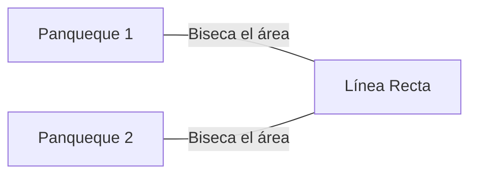
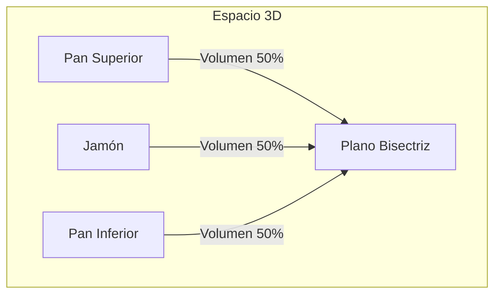
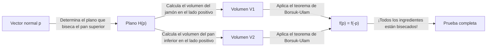
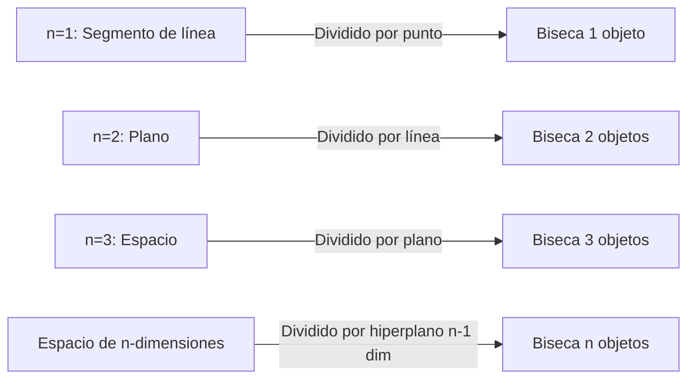

Hay muchos teoremas curiosos en matemáticas con nombres cotidianos. Entre ellos, uno de los más famosos e intuitivamente interesantes es el **Teorema del Sándwich de Jamón (Ham Sandwich Theorem)**.

Cuando preparas un sándwich, probablemente imaginas dos rebanadas de pan con una rebanada de jamón en el medio. Este teorema afirma un hecho sorprendente: **"No importa cuán distorsionadas estén las formas, o cuán dispersas estén en el aire, un solo corte con un cuchillo (un solo plano) puede bisecar perfectamente los volúmenes de dos piezas de pan y una de jamón simultáneamente."**

En este artículo, explicaremos a fondo este Teorema del Sándwich de Jamón, desde una comprensión intuitiva hasta el poderoso teorema de topología algebraica detrás de él, el **Teorema de Borsuk-Ulam**.

## 1. Introducción: De la Vida Cotidiana a las Matemáticas

Imagina cortar un sándwich por la mitad para el desayuno o el almuerzo. Usas un cuchillo para dividir el sándwich en dos partes. ¿Es posible cortarlo de manera que los tres ingredientes—el pan superior, el pan inferior y el jamón del interior—queden divididos exactamente en la mitad de su volumen?

Intuitivamente, si el pan está perfectamente apilado, un corte limpio por la mitad sería suficiente. Pero, ¿qué pasaría si alguien hace una broma, colocando el pan superior en el borde derecho de la mesa, el pan inferior en el borde izquierdo y pegando el jamón al techo?

Sorprendentemente, según un teorema matemático, **incluso entonces, si usas un cuchillo gigante (un plano), puedes bisecar los tres simultáneamente**. Esta es la esencia del "Teorema del Sándwich de Jamón". No hay requisitos para las posiciones relativas o las formas de los objetos, ni siquiera necesitan ser trozos únicos y continuos.

## 2. Empezando por 2D: El Teorema del Panqueque

Antes de considerar el Teorema del Sándwich de Jamón en 3D, veamos el caso bidimensional (plano). La versión 2D a veces se llama el **Teorema del Panqueque**.

El Teorema del Panqueque afirma lo siguiente:

> Dados dos objetos cualesquiera en un plano (por ejemplo, dos panqueques), siempre existe una única línea recta que biseca simultáneamente las áreas de ambas formas.

Vamos a ilustrar esto.

### Idea de una Prueba Intuitiva

¿Por qué siempre existe tal línea? Pensemos usando el concepto de continuidad.

1. Primero, dibuja una línea en el plano apuntando en una dirección específica (por ejemplo, verticalmente).
2. A medida que trasladas esta línea de izquierda a derecha, definitivamente encontrarás un punto donde biseca exactamente el área del "Panqueque 1" (esto se debe al **Teorema del Valor Intermedio** en cálculo).
3. A continuación, rota continuamente el ángulo de esta línea $\theta$ desde $0^\circ$ hasta $180^\circ$.
4. En cada ángulo rotado $\theta$, ajusta siempre la línea trasladándola para que siga bisecando el área del "Panqueque 1".
5. Mientras tanto, presta atención a cómo se divide el otro "Panqueque 2". Sea $f(\theta)$ la proporción del área del Panqueque 2 en el lado izquierdo de la línea.
6. Entre $\theta = 0^\circ$ y $\theta = 180^\circ$, los lados "izquierdo" y "derecho" de la línea se intercambian, por lo que $f(180^\circ) = 1 - f(0^\circ)$.
7. Si el lado izquierdo era mayor que la mitad en $\theta = 0^\circ$, será menor que la mitad en $\theta = 180^\circ$. Dado que la proporción de área $f(\theta)$ cambia continuamente, debe haber un ángulo en el camino donde $f(\theta) = 0.5$, lo que significa que el área del "Panqueque 2" también se reduce perfectamente a la mitad.

Es por esto que puedes bisecar dos objetos simultáneamente en el caso 2D.

## 3. Extensión a 3D: El Teorema del Sándwich de Jamón

Ahora, finalmente pasemos a la historia tridimensional. Cuando la dimensión aumenta en uno, el número de objetos que puedes dividir también aumenta en uno.

La declaración formal del teorema es la siguiente:

> Para cualesquiera tres regiones de volumen finito $A, B, C$ en el espacio tridimensional $\mathbb{R}^3$, existe al menos un plano que biseca simultáneamente los volúmenes de los tres.

Estos $A, B, C$ corresponden al "pan superior", el "jamón" y el "pan inferior", respectivamente. No importa cuán desmoronado esté el pan, o incluso si el jamón vuela hasta el borde del espacio exterior, un solo plano puede cortarlos a todos perfectamente por la mitad.

Lo maravilloso de este teorema es que no hay absolutamente ninguna restricción en las formas de los objetos objetivo. Pueden ser esferas, cubos, donas con agujeros o incluso romperse en innumerables fragmentos diminutos (matemáticamente, solo necesitan ser conjuntos medibles con medida de Lebesgue finita).

## 4. El Poderoso Arma Detrás: El Teorema de Borsuk-Ulam

Para demostrar matemática y rigurosamente el Teorema del Sándwich de Jamón, se utiliza un teorema muy importante en topología: el **Teorema de Borsuk-Ulam**.

### ¿Qué es el Teorema de Borsuk-Ulam?

La afirmación general del teorema de Borsuk-Ulam es la siguiente:

> Para cualquier mapeo continuo $f: S^n \to \mathbb{R}^n$, siempre existe un punto $x \in S^n$ tal que $f(x) = f(-x)$.

Aquí, $S^n$ es la esfera de $n$-dimensiones en un espacio de $(n+1)$-dimensiones (por ejemplo, $S^2$ es una esfera ordinaria como la superficie de la Tierra en la que vivimos), y $\mathbb{R}^n$ es el espacio euclidiano de $n$-dimensiones. Además, $x$ y $-x$ se refieren a **puntos antipodales** en la esfera (puntos en lados opuestos de una línea recta que pasa por el centro, como los Polos Norte y Sur en la Tierra, o Tokio y frente a la costa de Brasil).

Si interpretamos este teorema en el caso familiar de $n=2$ ( $S^2 \to \mathbb{R}^2$ ), podemos enunciar el siguiente dato interesante:

**"Siempre existe un par de puntos antipodales en algún lugar de la Tierra que tienen exactamente la misma temperatura y presión."**

Para una función $f(x) = \left( \text{Temperatura}, \text{Presión} \right)$ que tiene dos valores continuos, significa que los valores coinciden perfectamente en el punto opuesto $-x$ en la Tierra. Esto podría parecer contradictorio, pero es un hecho inquebrantable y matemáticamente comprobado.

### Esbozo de la Prueba del Teorema del Sándwich de Jamón

El Teorema del Sándwich de Jamón (versión 3D) se puede probar utilizando el caso $n=2$ del Teorema de Borsuk-Ulam. A continuación se presenta un esbozo de su hermosa prueba.

1. Considera un punto $p$ en la esfera unitaria $S^2$ centrada en el origen (esto representa el vector normal del plano, es decir, la "dirección" del plano).
2. Cuando la dirección $p$ se fija, un plano que biseca el volumen del "pan superior" se determina de forma única (llamemos a esto Plano $H(p)$).
3. Este Plano $H(p)$ también divide el "jamón" y el "pan inferior".
4. Por lo tanto, definimos un mapeo continuo $f: S^2 \to \mathbb{R}^2$ de la siguiente manera:
   $$ f(p) = \left( \text{Volumen del jamón en el lado positivo del plano } H(p), \text{Volumen del pan inferior en el lado positivo del plano } H(p) \right) $$
5. Si invertimos completamente la dirección del plano (cambiamos $p$ a $-p$), el "lado positivo" y el "lado negativo" del plano se intercambian. Por lo tanto, los volúmenes del lado positivo y el lado negativo se intercambian.
6. Según el teorema de Borsuk-Ulam, siempre existe una dirección $p$ tal que $f(p) = f(-p)$.
7. $f(p) = f(-p)$ significa que el volumen en el lado positivo del plano en la dirección $p$ es igual al volumen en el lado positivo en la dirección $-p$ (que es el lado negativo del plano original). Esto simplemente significa que tanto el "jamón" como el "pan inferior" son bisecados simultáneamente.
8. Dado que el plano fue elegido para bisecar el "pan superior" desde el principio, los tres ingredientes terminan siendo bisecados por un solo plano.

## 5. Teorema Generalizado del Sándwich de Jamón de n-dimensiones

Los matemáticos han generalizado este teorema a dimensiones aún mayores.

> Para cualquier grupo de $n$ conjuntos con medida de Lebesgue finita en el espacio de $n$-dimensiones $\mathbb{R}^n$, existe un hiperplano de $(n-1)$-dimensiones que los biseca a todos simultáneamente.

En otras palabras, a medida que aumenta la dimensión, el número de objetos que puedes bisecar simultáneamente también aumenta.
- $n=1$ (Línea): Biseca 1 segmento de línea con 1 punto.
- $n=2$ (Plano): Biseca las áreas de 2 formas con 1 línea (Teorema del Panqueque).
- $n=3$ (Espacio): Biseca los volúmenes de 3 sólidos con 1 plano (Teorema del Sándwich de Jamón).
- $n=4$: Biseca simultáneamente los hipervolúmenes de cuatro objetos 4D con un espacio 3D.

De esta manera, esta hermosa ley se cumple en cualquier dimensión.

## 6. ¿Es Práctico? (Aplicaciones en Geometría Computacional)

El "Teorema del Sándwich de Jamón" a menudo se cuenta como un tema divertido en matemáticas puras, pero en realidad tiene aplicaciones prácticas en campos como la **Geometría Computacional** y la **Informática**.

Por ejemplo, cuando existe una cantidad masiva de puntos de datos (nubes de puntos) en el espacio, a veces se usa una versión algorítmica del Teorema del Sándwich de Jamón para particionar y procesar esos datos de manera eficiente. Al bisecar simultáneamente datos clasificados en múltiples clases, ayuda a construir algoritmos eficientes de procesamiento de datos y búsqueda utilizando el enfoque de Divide y Vencerás.

## 7. Conclusión

El Teorema del Sándwich de Jamón podría parecer una broma con un nombre divertido a primera vista, pero en realidad, es un hermoso resultado aplicado de un poderoso teorema en las matemáticas modernas, específicamente en la topología algebraica. El hecho de que una teoría matemática abstracta se exprese a través de algo tan concreto y cotidiano como un sándwich es, sin duda, uno de los aspectos fascinantes de las matemáticas.

La próxima vez que cortes casualmente un sándwich, es posible que haya un momento en el que los tres ingredientes se reduzcan a la mitad por coincidencia. Durante tu próximo descanso para el almuerzo, mientras agarras tu cuchillo, ¿por qué no dejas que tus pensamientos divaguen hacia espacios de dimensiones superiores y el Teorema de Borsuk-Ulam?
