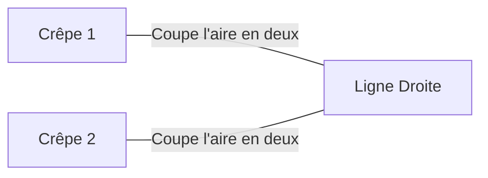
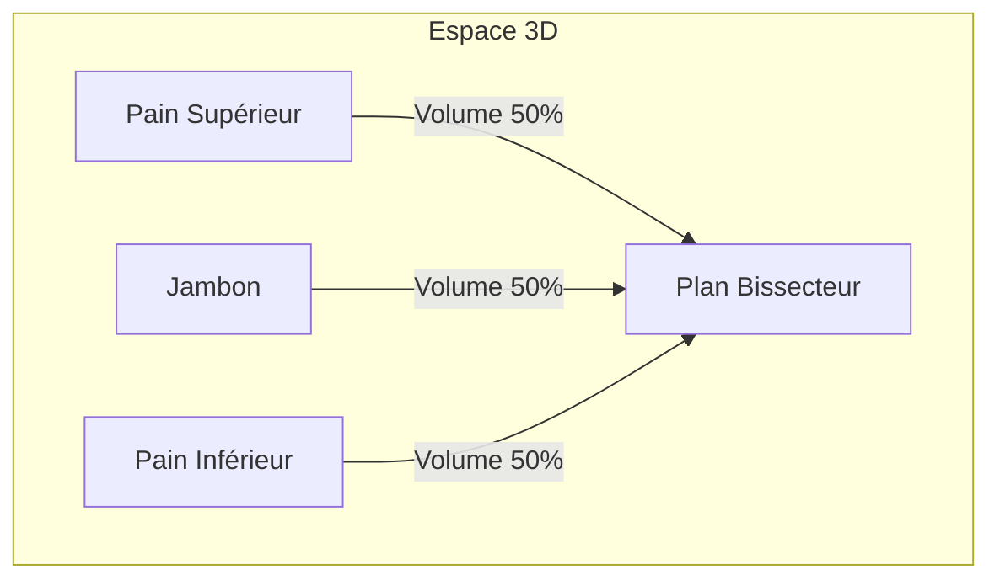
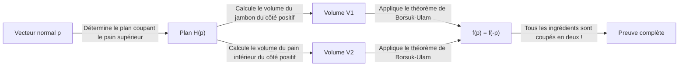
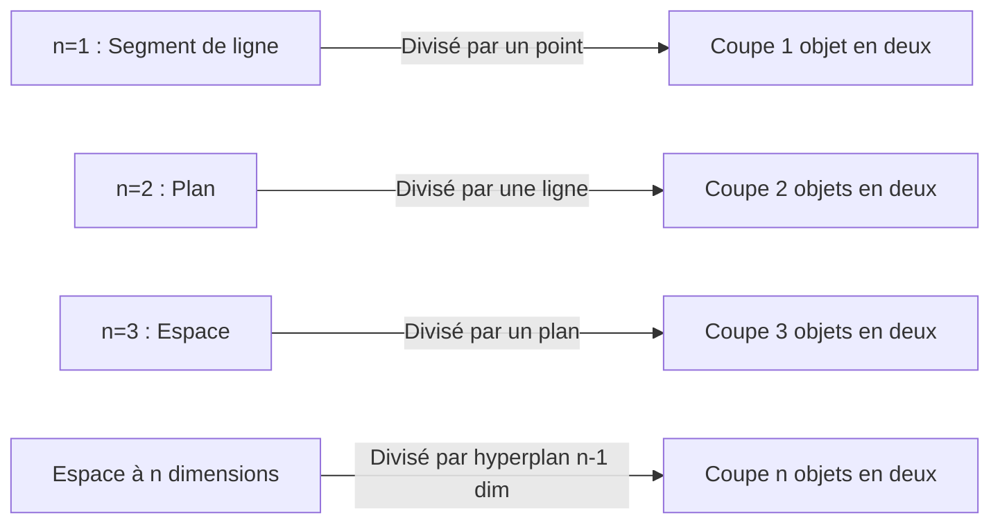

Il existe de nombreux théorèmes curieux en mathématiques avec des noms de la vie quotidienne. Parmi eux, l'un des plus célèbres et intuitivement intéressants est le **Théorème du Sandwich au Jambon (Ham Sandwich Theorem)**.

Lorsque vous préparez un sandwich, vous imaginez probablement deux tranches de pain avec une tranche de jambon au milieu. Ce théorème affirme un fait surprenant : **"Peu importe à quel point les formes sont déformées, ou comment elles sont dispersées en l'air, une seule coupe avec un couteau (un seul plan) peut parfaitement couper en deux les volumes de deux morceaux de pain et d'un morceau de jambon simultanément."**

Dans cet article, nous expliquerons en détail ce Théorème du Sandwich au Jambon, d'une compréhension intuitive au puissant théorème de topologie algébrique qui le sous-tend, le **Théorème de Borsuk-Ulam**.

## 1. Introduction : De la Vie Quotidienne aux Mathématiques

Imaginez couper un sandwich en deux pour le petit-déjeuner ou le déjeuner. Vous utilisez un couteau pour diviser le sandwich en deux morceaux. Est-il possible de le couper de sorte que les trois ingrédients — le pain supérieur, le pain inférieur et le jambon à l'intérieur — soient divisés exactement en la moitié de leur volume ?

Intuitivement, si le pain est parfaitement empilé, une coupe nette au milieu suffirait. Mais que se passerait-il si quelqu'un faisait une farce, plaçant le pain supérieur sur le bord droit de la table, le pain inférieur sur le bord gauche et collant le jambon au plafond ?

Étonnamment, selon un théorème mathématique, **même alors, si vous utilisez un couteau géant (un plan), vous pouvez couper les trois simultanément en deux**. C'est l'essence du "Théorème du Sandwich au Jambon". Il n'y a aucune exigence concernant les positions relatives ou les formes des objets, et ils n'ont même pas besoin d'être de simples morceaux continus.

## 2. En partant de la 2D : Le Théorème de la Crêpe

Avant de considérer le Théorème du Sandwich au Jambon en 3D, examinons le cas en 2 dimensions (plan). La version 2D est parfois appelée le **Théorème de la Crêpe (Pancake Theorem)**.

Le Théorème de la Crêpe affirme ce qui suit :

> Étant donné deux formes quelconques sur un plan (par exemple, deux crêpes), il existe toujours une seule ligne droite qui coupe simultanément en deux les aires des deux formes.

Illustrons cela.

### Idée d'une Preuve Intuitive

Pourquoi une telle ligne existe-t-elle toujours ? Réfléchissons en utilisant le concept de continuité.

1. Tout d'abord, tracez une ligne sur le plan pointant dans une direction spécifique (par exemple, verticalement).
2. Au fur et à mesure que vous translatez cette ligne de gauche à droite, vous trouverez certainement un point où elle coupe exactement l'aire de la "Crêpe 1" (cela est dû au **Théorème des Valeurs Intermédiaires** en calcul).
3. Ensuite, faites pivoter continuellement l'angle de cette ligne $\theta$ de $0^\circ$ à $180^\circ$.
4. À chaque angle de rotation $\theta$, ajustez toujours la ligne en la translatant pour qu'elle continue de couper l'aire de la "Crêpe 1".
5. Pendant ce temps, faites attention à la façon dont l'autre "Crêpe 2" est divisée. Soit $f(\theta)$ le rapport de l'aire de la Crêpe 2 du côté gauche de la ligne.
6. Entre $\theta = 0^\circ$ et $\theta = 180^\circ$, les côtés "gauche" et "droit" de la ligne sont échangés, donc $f(180^\circ) = 1 - f(0^\circ)$.
7. Si le côté gauche était plus grand que la moitié à $\theta = 0^\circ$, il sera plus petit que la moitié à $\theta = 180^\circ$. Étant donné que le rapport de surface $f(\theta)$ change continuellement, il doit y avoir un angle en cours de route où $f(\theta) = 0.5$, ce qui signifie que la surface de la "Crêpe 2" est également parfaitement divisée par deux.

C'est pourquoi vous pouvez couper deux objets simultanément dans le cas 2D.

## 3. Extension à la 3D : [Le Théorème du Sandwich au Jambon](https://kenji.blog/fr/p/ham-sandwich-theorem/)

Maintenant, passons enfin à l'histoire tridimensionnelle. Lorsque la dimension augmente de un, le nombre d'objets que vous pouvez diviser augmente également de un.

L'énoncé formel du théorème est le suivant :

> Pour trois régions quelconques de volume fini $A, B, C$ dans l'espace tridimensionnel $\mathbb{R}^3$, il existe au moins un plan qui coupe simultanément en deux les volumes des trois.

Ces $A, B, C$ correspondent respectivement au "pain supérieur", au "jambon" et au "pain inférieur". Peu importe à quel point le pain est émietté, ou même si le jambon s'envole à la limite de l'espace extra-atmosphérique, un seul plan peut tous les couper parfaitement en deux.

La chose merveilleuse à propos de ce théorème est qu'il n'y a absolument aucune restriction sur les formes des objets cibles. Ils peuvent être des sphères, des cubes, des beignets avec des trous, ou même brisés en d'innombrables fragments minuscules (mathématiquement, ils doivent simplement être des ensembles mesurables avec une mesure de Lebesgue finie).

## 4. L'Arme Puissante Derrière : Le Théorème de Borsuk-Ulam

Pour prouver mathématiquement et rigoureusement le Théorème du Sandwich au Jambon, un théorème très important en topologie est utilisé : le **Théorème de Borsuk-Ulam**.

### Qu'est-ce que le Théorème de Borsuk-Ulam ?

L'énoncé général du théorème de Borsuk-Ulam est le suivant :

> Pour toute application continue $f: S^n \to \mathbb{R}^n$, il existe toujours un point $x \in S^n$ tel que $f(x) = f(-x)$.

Ici, $S^n$ est la sphère à $n$ dimensions dans un espace à $(n+1)$ dimensions (par exemple, $S^2$ est une sphère ordinaire comme la surface de la Terre sur laquelle nous vivons), et $\mathbb{R}^n$ est l'espace euclidien à $n$ dimensions. De plus, $x$ et $-x$ désignent des **points antipodaux** sur la sphère (points sur les côtés opposés d'une ligne droite passant par le centre, comme les pôles Nord et Sud sur Terre, ou Tokyo et au large des côtes brésiliennes).

Si nous interprétons ce théorème dans le cas familier de $n=2$ ( $S^2 \to \mathbb{R}^2$ ), nous pouvons énoncer le fait intéressant suivant :

**"Il existe toujours une paire de points antipodaux quelque part sur Terre qui ont exactement la même température et la même pression."**

Pour une fonction $f(x) = \left( \text{Température}, \text{Pression} \right)$ qui a deux valeurs continues, cela signifie que les valeurs correspondent parfaitement au point opposé $-x$ sur Terre. Cela peut sembler contre-intuitif, mais c'est un fait inébranlable, mathématiquement prouvé.

### Esquisse de Preuve du Théorème du Sandwich au Jambon

[Le Théorème du Sandwich au Jambon](https://kenji.blog/fr/p/ham-sandwich-theorem/) (version 3D) peut être prouvé en utilisant le cas $n=2$ du Théorème de Borsuk-Ulam. Voici une esquisse de sa belle preuve.

1. Considérez un point $p$ sur la sphère unité $S^2$ centrée à l'origine (cela représente le vecteur normal du plan, c'est-à-dire la "direction" du plan).
2. Lorsque la direction $p$ est fixée, un plan qui coupe le volume du "pain supérieur" en deux est déterminé de manière unique (appelons cela le Plan $H(p)$).
3. Ce Plan $H(p)$ divise également le "jambon" et le "pain inférieur".
4. Par conséquent, nous définissons une application continue $f: S^2 \to \mathbb{R}^2$ comme suit :
   $$ f(p) = \left( \text{Volume du jambon du côté positif du plan } H(p), \text{Volume du pain inférieur du côté positif du plan } H(p) \right) $$
5. Si nous inversons complètement la direction du plan (changeons $p$ en $-p$), le "côté positif" et le "côté négatif" du plan sont échangés. Par conséquent, les volumes du côté positif et du côté négatif sont échangés.
6. Selon le théorème de Borsuk-Ulam, il existe toujours une direction $p$ telle que $f(p) = f(-p)$.
7. $f(p) = f(-p)$ signifie que le volume du côté positif du plan dans la direction $p$ est égal au volume du côté positif dans la direction $-p$ (qui est le côté négatif du plan d'origine). Cela signifie simplement que le "jambon" et le "pain inférieur" sont simultanément coupés en deux.
8. Puisque le plan a été choisi pour couper en deux le "pain supérieur" dès le début, les trois ingrédients finissent par être coupés en deux par un seul plan.

## 5. Théorème Généralisé du Sandwich au Jambon en dimension n

Les mathématiciens ont généralisé ce théorème à des dimensions encore plus élevées.

> Pour tous les $n$ ensembles de mesure de Lebesgue finie dans un espace à $n$ dimensions $\mathbb{R}^n$, il existe un hyperplan à $(n-1)$ dimensions qui les coupe tous simultanément en deux.

En d'autres termes, à mesure que la dimension augmente, le nombre d'objets que vous pouvez simultanément couper en deux augmente également.
- $n=1$ (Ligne) : Couper en deux 1 segment de ligne avec 1 point.
- $n=2$ (Plan) : Couper en deux les aires de 2 formes avec 1 ligne (Théorème de la Crêpe).
- $n=3$ (Espace) : Couper en deux les volumes de 3 solides avec 1 plan (Théorème du Sandwich au Jambon).
- $n=4$ : Couper simultanément en deux les hypervolumes de quatre objets 4D avec un espace 3D.

De cette façon, cette belle loi s'applique dans n'importe quelle dimension.

## 6. Est-ce Pratique ? (Applications en Géométrie Algorithmique)

Le "Théorème du Sandwich au Jambon" est souvent raconté comme un sujet amusant en mathématiques pures, mais il a en fait des applications pratiques dans des domaines tels que la **Géométrie Algorithmique (Computational Geometry)** et l' **Informatique**.

Par exemple, lorsqu'une quantité massive de points de données (nuages de points) existe dans l'espace, une version algorithmique du Théorème du Sandwich au Jambon est parfois utilisée pour partitionner et traiter ces données efficacement. En divisant simultanément des données classées en plusieurs classes, il aide à construire des algorithmes efficaces de traitement des données et de recherche en utilisant l'approche Diviser pour Régner.

## 7. Conclusion

[Le Théorème du Sandwich au Jambon](https://kenji.blog/fr/p/ham-sandwich-theorem/) peut sembler être une blague avec un drôle de nom à première vue, mais en réalité, c'est un résultat magnifique appliqué à partir d'un puissant théorème des mathématiques modernes, en particulier la topologie algébrique. Le fait qu'une théorie mathématique abstraite s'exprime à travers quelque chose d'aussi concret et quotidien qu'un sandwich est sans doute l'un des aspects fascinants des mathématiques.

La prochaine fois que vous couperez un sandwich au hasard, il pourrait y avoir un moment où les trois ingrédients seront parfaitement divisés par coïncidence. Lors de votre prochaine pause déjeuner, alors que vous saisissez votre couteau, pourquoi ne pas laisser vos pensées dériver vers les espaces de dimensions supérieures et le Théorème de Borsuk-Ulam ?
