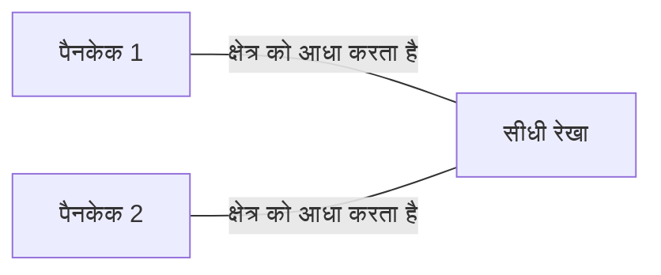
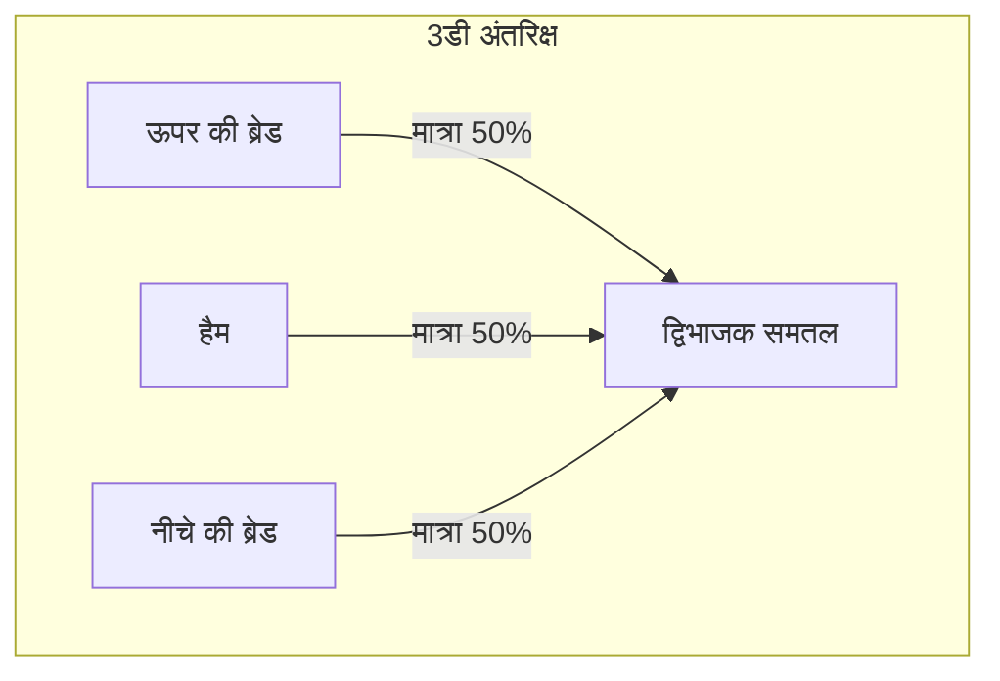
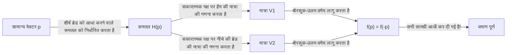
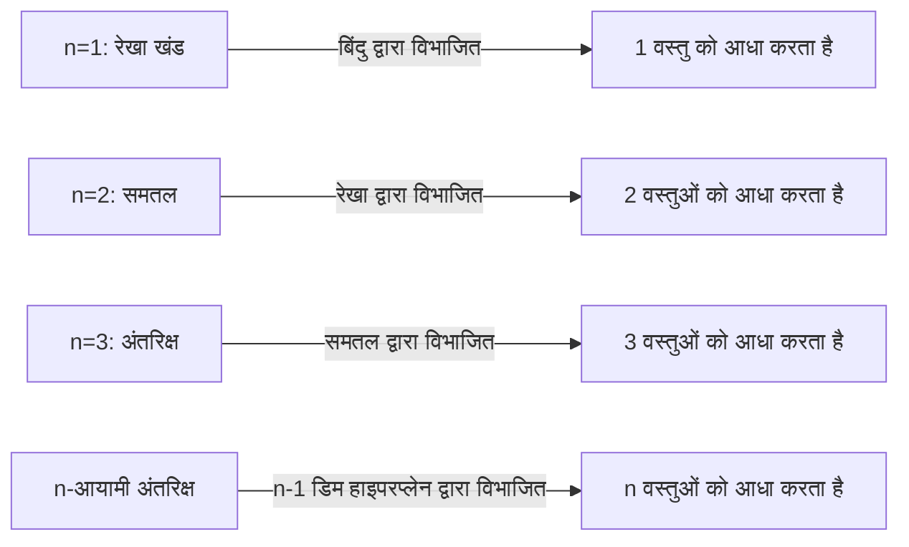

गणित में रोज़मर्रा के नामों वाले कई उत्सुक प्रमेय हैं। उनमें से, सबसे प्रसिद्ध और सहज रूप से दिलचस्प में से एक **[हैम सैंडविच प्रमेय](https://kenji.blog/hi/p/ham-sandwich-theorem/) (Ham Sandwich Theorem)** है।

जब आप सैंडविच बनाते हैं, तो आप शायद ब्रेड के दो टुकड़ों की कल्पना करते हैं जिसके बीच में हैम का एक टुकड़ा होता है। यह प्रमेय एक आश्चर्यजनक तथ्य का दावा करता है: **"कोई फर्क नहीं पड़ता कि आकार कितने विकृत हैं, या वे हवा में कितने बिखरे हुए हैं, चाकू से एक ही कट (एक समतल) रोटी के दो टुकड़ों और हैम के एक टुकड़े की मात्रा को एक साथ पूरी तरह से आधा कर सकता है।"**

इस लेख में, हम एक सहज समझ से लेकर इसके पीछे की शक्तिशाली बीजीय टोपोलॉजी प्रमेय, **बोरसुक-उलम प्रमेय (Borsuk-Ulam Theorem)** तक, इस [हैम सैंडविच प्रमेय](https://kenji.blog/hi/p/ham-sandwich-theorem/) को विस्तार से समझाएंगे।

## 1. परिचय: रोजमर्रा की जिंदगी से गणित तक

नाश्ते या दोपहर के भोजन के लिए सैंडविच को आधा काटने की कल्पना करें। आप सैंडविच को दो टुकड़ों में बांटने के लिए चाकू का इस्तेमाल करते हैं। क्या इसे इस तरह से काटना संभव है कि सभी तीन सामग्री - ऊपर की ब्रेड, नीचे की ब्रेड, और अंदर का हैम - उनके आयतन के ठीक आधे हिस्से में विभाजित हो जाएं?

सहज रूप से, यदि ब्रेड पूरी तरह से स्टैक्ड है, तो बीच में एक साफ कट पर्याप्त होगा। लेकिन क्या होगा अगर किसी ने मजाक किया, ऊपरी रोटी को टेबल के दाहिने किनारे पर रखा, नीचे की रोटी को बाएं किनारे पर, और हैम को छत से चिपका दिया?

हैरानी की बात है, एक गणितीय प्रमेय के अनुसार, **तभी, यदि आप एक विशाल चाकू (एक समतल) का उपयोग करते हैं, तो आप एक साथ तीनों को आधा कर सकते हैं**। यह "[हैम सैंडविच प्रमेय](https://kenji.blog/hi/p/ham-sandwich-theorem/)" का सार है। वस्तुओं की सापेक्ष स्थिति या आकार के लिए कोई आवश्यकताएं नहीं हैं, और न ही उन्हें एकल निरंतर टुकड़े होने की आवश्यकता है।

## 2. 2डी से शुरू: पैनकेक प्रमेय

3डी [हैम सैंडविच प्रमेय](https://kenji.blog/hi/p/ham-sandwich-theorem/) पर विचार करने से पहले, आइए 2-आयामी (समतल) मामले को देखें। 2डी संस्करण को कभी-कभी **पैनकेक प्रमेय (Pancake Theorem)** कहा जाता है।

पैनकेक प्रमेय निम्नलिखित का दावा करता है:

> एक समतल पर किन्हीं दो आकृतियों (उदाहरण के लिए, दो पैनकेक) को देखते हुए, हमेशा एक सीधी रेखा होती है जो एक साथ दोनों आकृतियों के क्षेत्र को आधा कर देती है।

आइए इसे स्पष्ट करें।

### एक सहज प्रमाण का विचार

ऐसी रेखा हमेशा क्यों मौजूद होती है? आइए निरंतरता की अवधारणा का उपयोग करके सोचें।

1. सबसे पहले, एक विशिष्ट दिशा (जैसे, लंबवत) की ओर इशारा करते हुए समतल पर एक रेखा खींचें।
2. जैसे ही आप इस रेखा को बाएँ से दाएँ ले जाते हैं, आपको निश्चित रूप से एक ऐसा बिंदु मिलेगा जहाँ यह "पैनकेक 1" के क्षेत्र को ठीक आधा कर देता है (यह कैलकुलस में **मध्यवर्ती मूल्य प्रमेय** के कारण है)।
3. इसके बाद, इस रेखा के कोण $\theta$ को लगातार $0^\circ$ से $180^\circ$ तक घुमाएं।
4. प्रत्येक घुमाए गए कोण $\theta$ पर, हमेशा रेखा को अनुवाद करके समायोजित करें ताकि यह "पैनकेक 1" के क्षेत्र को आधा करना जारी रखे।
5. इस बीच, इस बात पर ध्यान दें कि दूसरा "पैनकेक 2" कैसे विभाजित है। मान लें कि $f(\theta)$ रेखा के बाईं ओर पैनकेक 2 के क्षेत्र का अनुपात है।
6. $\theta = 0^\circ$ और $\theta = 180^\circ$ के बीच, रेखा के "बाएं" और "दाएं" पक्षों की अदला-बदली की जाती है, इसलिए $f(180^\circ) = 1 - f(0^\circ)$।
7. यदि बायां भाग $\theta = 0^\circ$ पर आधे से बड़ा था, तो यह $\theta = 180^\circ$ पर आधे से छोटा होगा। चूंकि क्षेत्र अनुपात $f(\theta)$ लगातार बदलता रहता है, इसलिए रास्ते में एक कोण होना चाहिए जहां $f(\theta) = 0.5$ हो, जिसका अर्थ है कि "पैनकेक 2" का क्षेत्र भी पूरी तरह से आधा हो गया है।

यही कारण है कि आप 2D मामले में एक साथ दो वस्तुओं को आधा कर सकते हैं।

## 3. 3डी का विस्तार: [हैम सैंडविच प्रमेय](https://kenji.blog/hi/p/ham-sandwich-theorem/)

अब, अंत में 3-आयामी कहानी पर चलते हैं। जब आयाम एक से बढ़ जाता है, तो उन वस्तुओं की संख्या भी एक से बढ़ जाती है जिन्हें आप विभाजित कर सकते हैं।

प्रमेय का औपचारिक कथन इस प्रकार है:

> 3-आयामी अंतरिक्ष $\mathbb{R}^3$ में परिमित मात्रा $A, B, C$ के किसी भी तीन क्षेत्रों के लिए, कम से कम एक समतल मौजूद है जो एक साथ तीनों की मात्रा को आधा करता है।

ये $A, B, C$ क्रमशः "ऊपरी ब्रेड", "हैम" और "नीचे की ब्रेड" के अनुरूप हैं। ब्रेड कितनी भी उखड़ गई हो, या भले ही हैम बाहरी अंतरिक्ष के किनारे पर उड़ जाए, एक भी समतल उन सभी को पूरी तरह से आधा में काट सकता है।

इस प्रमेय के बारे में अद्भुत बात यह है कि लक्ष्य वस्तुओं के आकार पर बिल्कुल कोई प्रतिबंध नहीं है। वे गोले, घन, छेद वाले डोनट्स हो सकते हैं, या अनगिनत छोटे टुकड़ों में भी टूट सकते हैं (गणितीय रूप से, उन्हें बस परिमित लेबेस्ग माप के साथ मापने योग्य सेट होने की आवश्यकता है)।

## 4. पीछे शक्तिशाली हथियार: बोरसुक-उलम प्रमेय

[हैम सैंडविच प्रमेय](https://kenji.blog/hi/p/ham-sandwich-theorem/) को गणितीय और कठोर रूप से सिद्ध करने के लिए, टोपोलॉजी में एक बहुत ही महत्वपूर्ण प्रमेय का उपयोग किया जाता है: **बोरसुक-उलम प्रमेय (Borsuk-Ulam Theorem)**।

### बोरसुक-उलम प्रमेय क्या है?

बोरसुक-उलम प्रमेय का सामान्य दावा इस प्रकार है:

> किसी भी निरंतर मानचित्रण $f: S^n \to \mathbb{R}^n$ के लिए, हमेशा एक बिंदु $x \in S^n$ मौजूद होता है जैसे कि $f(x) = f(-x)$।

यहां, $S^n$, $(n+1)$-आयामी अंतरिक्ष में $n$-आयामी क्षेत्र है (उदाहरण के लिए, $S^2$ पृथ्वी की सतह की तरह एक साधारण क्षेत्र है जिस पर हम रहते हैं), और $\mathbb{R}^n$, $n$-आयामी [यूक्लिड](https://kenji.blog/hi/p/euclid/)ियन अंतरिक्ष है। इसके अलावा, $x$ और $-x$ क्षेत्र पर **एंटीपोडल बिंदुओं** को संदर्भित करते हैं (केंद्र से गुजरने वाली सीधी रेखा के विपरीत किनारों पर स्थित बिंदु, जैसे पृथ्वी पर उत्तरी और दक्षिणी ध्रुव, या टोक्यो और ब्राजील के तट पर)।

यदि हम इस प्रमेय की व्याख्या $n=2$ ( $S^2 \to \mathbb{R}^2$ ) के परिचित मामले में करते हैं, तो हम निम्नलिखित दिलचस्प तथ्य बता सकते हैं:

**"पृथ्वी पर हमेशा कहीं न कहीं एंटीपोडल बिंदुओं की एक जोड़ी मौजूद होती है जिनका तापमान और दबाव बिल्कुल समान होता है।"**

दो निरंतर मानों वाले फ़ंक्शन $f(x) = \left( \text{तापमान}, \text{दबाव} \right)$ के लिए, इसका मतलब है कि पृथ्वी पर विपरीत बिंदु $-x$ पर मान पूरी तरह से मेल खाते हैं। यह उल्टा लग सकता है, लेकिन यह एक अडिग, गणितीय रूप से सिद्ध तथ्य है।

### [हैम सैंडविच प्रमेय](https://kenji.blog/hi/p/ham-sandwich-theorem/) का प्रमाण स्केच

[हैम सैंडविच प्रमेय](https://kenji.blog/hi/p/ham-sandwich-theorem/) (3D संस्करण) को बोरसुक-उलम प्रमेय के $n=2$ मामले का उपयोग करके सिद्ध किया जा सकता है। नीचे इसके सुंदर प्रमाण का एक रेखाचित्र दिया गया है।

1. मूल पर केंद्रित इकाई क्षेत्र $S^2$ पर एक बिंदु $p$ पर विचार करें (यह समतल के सामान्य वेक्टर का प्रतिनिधित्व करता है, यानी, समतल की "दिशा")।
2. जब दिशा $p$ तय हो जाती है, तो एक समतल जो "ऊपरी ब्रेड" के आयतन को आधा कर देता है, विशिष्ट रूप से निर्धारित होता है (आइए इसे समतल $H(p)$ कहें)।
3. यह समतल $H(p)$ "हैम" और "नीचे की ब्रेड" को भी विभाजित करता है।
4. इसलिए, हम एक सतत मानचित्रण $f: S^2 \to \mathbb{R}^2$ को निम्नानुसार परिभाषित करते हैं:
   $$ f(p) = \left( \text{समतल } H(p) \text{ के सकारात्मक पक्ष पर हैम की मात्रा}, \text{समतल } H(p) \text{ के सकारात्मक पक्ष पर नीचे की ब्रेड की मात्रा} \right) $$
5. यदि हम समतल की दिशा को पूरी तरह से उलट देते हैं ($p$ को $-p$ में बदल दें), तो समतल के "सकारात्मक पक्ष" और "नकारात्मक पक्ष" की अदला-बदली की जाती है। इसलिए, सकारात्मक पक्ष और नकारात्मक पक्ष की मात्रा की अदला-बदली की जाती है।
6. बोरसुक-उलम प्रमेय के अनुसार, हमेशा एक दिशा $p$ मौजूद होती है जैसे कि $f(p) = f(-p)$।
7. $f(p) = f(-p)$ का अर्थ है कि दिशा $p$ में समतल के सकारात्मक पक्ष पर आयतन दिशा $-p$ में सकारात्मक पक्ष (जो मूल समतल का नकारात्मक पक्ष है) पर आयतन के बराबर है। इसका सीधा सा मतलब है कि "हैम" और "नीचे की रोटी" दोनों एक साथ आधे में कट जाते हैं।
8. चूँकि समतल को शुरू से ही "ऊपरी ब्रेड" को आधा करने के लिए चुना गया था, इसलिए तीनों सामग्रियाँ एक ही समतल से आधी कट जाती हैं।

## 5. सामान्यीकृत n-आयामी [हैम सैंडविच प्रमेय](https://kenji.blog/hi/p/ham-sandwich-theorem/)

गणितज्ञों ने इस प्रमेय को और भी उच्च आयामों के लिए सामान्यीकृत किया है।

> $n$-आयामी अंतरिक्ष $\mathbb{R}^n$ में परिमित लेबेस्ग माप वाले किसी भी $n$ सेट के लिए, एक $(n-1)$-आयामी हाइपरप्लेन मौजूद है जो एक साथ उन सभी को आधा करता है।

दूसरे शब्दों में, जैसे-जैसे आयाम बढ़ता है, आप जिन वस्तुओं को एक साथ आधा कर सकते हैं उनकी संख्या भी बढ़ जाती है।
- $n=1$ (रेखा): 1 बिंदु से 1 रेखाखंड को आधा करें।
- $n=2$ (समतल): 1 रेखा के साथ 2 आकृतियों के क्षेत्रों को आधा करें (पैनकेक प्रमेय)।
- $n=3$ (अंतरिक्ष): 1 समतल के साथ 3 ठोसों की मात्रा को आधा करें ([हैम सैंडविच प्रमेय](https://kenji.blog/hi/p/ham-sandwich-theorem/))।
- $n=4$: एक 3डी स्पेस के साथ चार 4डी ऑब्जेक्ट्स के हाइपरवॉल्यूम को एक साथ आधा करें।

इस तरह, यह सुंदर नियम किसी भी आयाम में कायम है।

## 6. क्या यह व्यावहारिक है? (कम्प्यूटेशनल ज्यामिति में अनुप्रयोग)

"[हैम सैंडविच प्रमेय](https://kenji.blog/hi/p/ham-sandwich-theorem/)" को अक्सर शुद्ध गणित में एक मजेदार विषय के रूप में बताया जाता है, लेकिन वास्तव में इसके व्यावहारिक अनुप्रयोग **कम्प्यूटेशनल ज्योमेट्री** और **कंप्यूटर साइंस** जैसे क्षेत्रों में हैं।

उदाहरण के लिए, जब अंतरिक्ष में बड़े पैमाने पर डेटा बिंदु (बिंदु बादल) मौजूद होते हैं, तो उस डेटा को कुशलतापूर्वक विभाजित करने और संसाधित करने के लिए कभी-कभी [हैम सैंडविच प्रमेय](https://kenji.blog/hi/p/ham-sandwich-theorem/) के एल्गोरिथम संस्करण का उपयोग किया जाता है। एक साथ कई वर्गों में वर्गीकृत डेटा को आधा करके, यह डिवाइड एंड कॉन्कर दृष्टिकोण का उपयोग करके कुशल डेटा प्रोसेसिंग और [खोज एल्गोरिदम](/hi/p/search-algorithms-linear-binary-hash-table-principles/) बनाने में मदद करता है।

## 7. निष्कर्ष

[हैम सैंडविच प्रमेय](https://kenji.blog/hi/p/ham-sandwich-theorem/) पहली नज़र में एक मज़ेदार नाम वाले मज़ाक जैसा लग सकता है, लेकिन वास्तव में, यह आधुनिक गणित में एक शक्तिशाली प्रमेय, विशेष रूप से बीजीय टोपोलॉजी से लागू एक सुंदर परिणाम है। यह तथ्य कि एक अमूर्त गणितीय सिद्धांत को सैंडविच जैसी ठोस और रोजमर्रा की किसी चीज़ के माध्यम से व्यक्त किया जाता है, यकीनन गणित के आकर्षक पहलुओं में से एक है।

अगली बार जब आप आकस्मिक रूप से सैंडविच काटते हैं, तो ऐसा क्षण हो सकता है जब संयोग से तीनों सामग्री पूरी तरह से आधी हो जाती हैं। आपके अगले लंच ब्रेक के दौरान, जब आप अपने चाकू को पकड़ते हैं, तो क्यों न अपने विचारों को उच्च-आयामी रिक्त स्थान और बोरसुक-उलम प्रमेय की ओर जाने दें?
