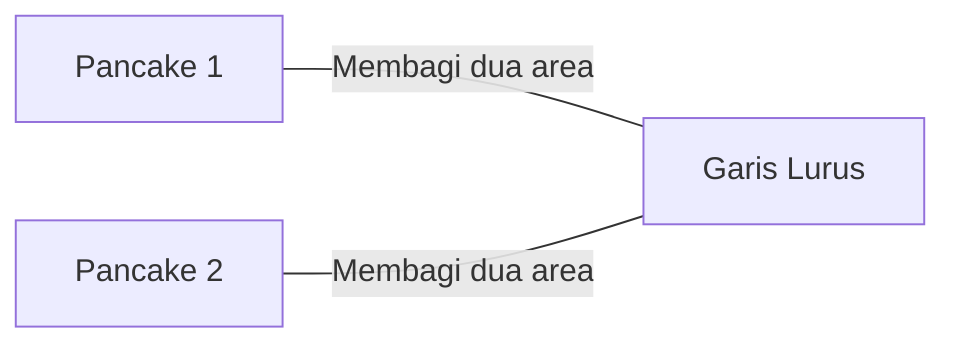
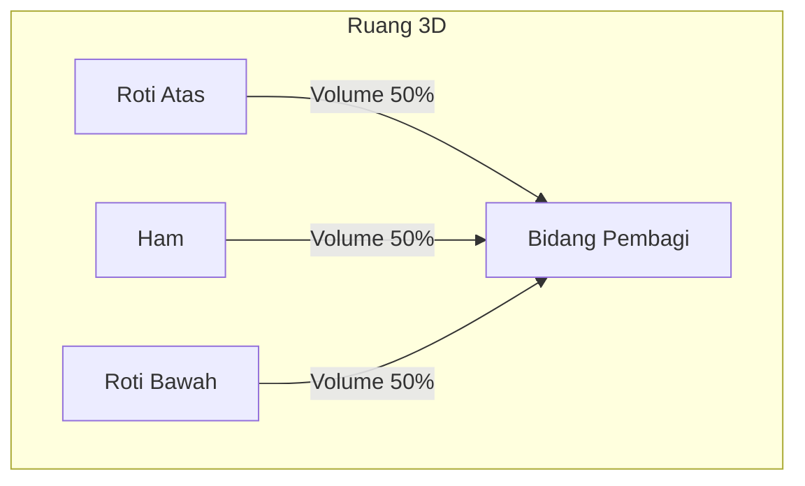
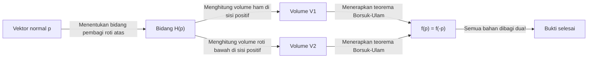
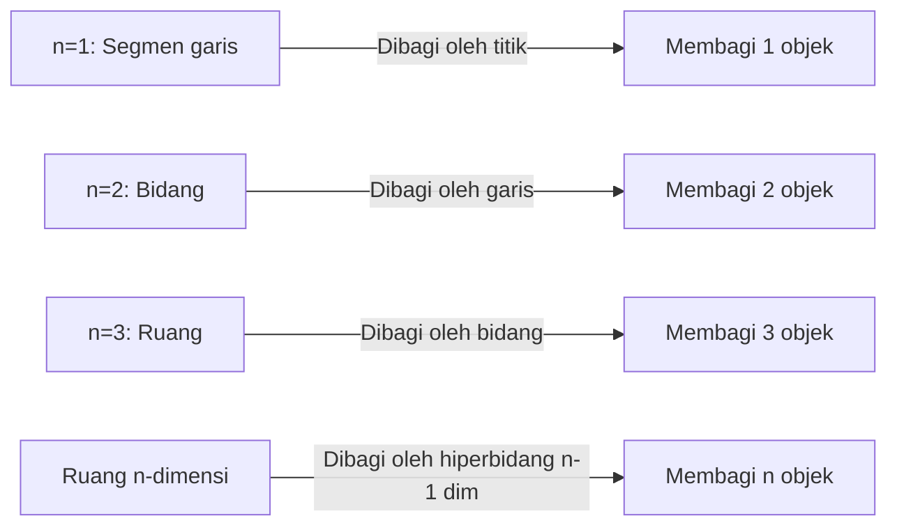

Ada banyak teorema unik dalam matematika dengan nama sehari-hari. Di antaranya, salah satu yang paling terkenal dan menarik secara intuitif adalah **Teorema Sandwich Ham (Ham Sandwich Theorem)**.

Saat Anda membuat sandwich, Anda mungkin membayangkan dua potong roti dengan sepotong ham di antaranya. Teorema ini mengklaim fakta yang mengejutkan: **"Tidak peduli seberapa terdistorsi bentuknya, atau seberapa tersebar mereka di udara, satu potongan dengan pisau (satu bidang tunggal) dapat membagi dua dengan sempurna volume dua potong roti dan satu potong ham secara bersamaan."**

Dalam artikel ini, kami akan menjelaskan Teorema Sandwich Ham ini secara menyeluruh, dari pemahaman intuitif hingga teorema topologi aljabar kuat di baliknya, **Teorema Borsuk-Ulam**.

## 1. Pendahuluan: Dari Kehidupan Sehari-hari ke Matematika

Bayangkan memotong sandwich menjadi dua untuk sarapan atau makan siang. Anda menggunakan pisau untuk membagi sandwich menjadi dua potong. Mungkinkah memotongnya sehingga ketiga bahan—roti atas, roti bawah, dan ham di dalamnya—dibagi tepat setengah dari volumenya?

Secara intuitif, jika roti ditumpuk dengan sempurna, potongan bersih di tengah akan cukup. Tapi bagaimana jika seseorang bermain lelucon, meletakkan roti atas di tepi kanan meja, roti bawah di tepi kiri, dan menempelkan ham ke langit-langit?

Hebatnya, menurut sebuah teorema matematika, **bahkan dengan kondisi seperti itu, jika Anda menggunakan pisau raksasa (sebuah bidang), Anda dapat membagi ketiganya secara bersamaan**. Inilah esensi dari "Teorema Sandwich Ham". Tidak ada persyaratan untuk posisi relatif atau bentuk objek, mereka juga tidak perlu berupa potongan tunggal yang terus-menerus.

## 2. Mulai dari 2D: Teorema Pancake

Sebelum mempertimbangkan Teorema Sandwich Ham 3D, mari kita lihat kasus 2 dimensi (bidang). Versi 2D kadang-kadang disebut **Teorema Pancake (Pancake Theorem)**.

Teorema Pancake mengklaim hal berikut:

> Mengingat dua bentuk apa pun pada suatu bidang (misalnya, dua pancake), selalu ada satu garis lurus yang membagi dua luas kedua bentuk tersebut secara bersamaan.

Mari kita ilustrasikan hal ini.

### Ide dari Bukti Intuitif

Mengapa garis seperti itu selalu ada? Mari kita berpikir menggunakan konsep kontinuitas.

1. Pertama, gambar garis pada bidang yang menunjuk ke arah tertentu (misalnya, vertikal).
2. Saat Anda memindahkan (translasi) garis ini dari kiri ke kanan, Anda pasti akan menemukan titik di mana garis itu membagi dua dengan tepat area "Pancake 1" (ini karena **Teorema Nilai Antara** dalam kalkulus).
3. Selanjutnya, putar terus sudut garis ini $\theta$ dari $0^\circ$ hingga $180^\circ$.
4. Pada setiap sudut yang diputar $\theta$, selalu sesuaikan garis dengan menerjemahkannya sehingga terus membagi dua area "Pancake 1".
5. Sementara itu, perhatikan bagaimana "Pancake 2" lainnya dibagi. Biarkan $f(\theta)$ menjadi rasio area Pancake 2 di sisi kiri garis.
6. Antara $\theta = 0^\circ$ dan $\theta = 180^\circ$, sisi "kiri" dan "kanan" garis ditukar, jadi $f(180^\circ) = 1 - f(0^\circ)$.
7. Jika sisi kiri lebih besar dari setengah pada $\theta = 0^\circ$, sisi tersebut akan lebih kecil dari setengah pada $\theta = 180^\circ$. Karena rasio luas $f(\theta)$ berubah secara kontinu, pasti ada sudut di sepanjang jalan di mana $f(\theta) = 0.5$, yang berarti luas "Pancake 2" juga terbelah dua dengan sempurna.

Inilah sebabnya mengapa Anda dapat membagi dua objek secara bersamaan dalam kasus 2D.

## 3. Ekstensi ke 3D: Teorema Sandwich Ham

Sekarang, mari kita beralih ke cerita tiga dimensi. Ketika dimensi naik satu, jumlah objek yang dapat Anda bagi juga bertambah satu.

Pernyataan formal teorema tersebut adalah sebagai berikut:

> Untuk setiap tiga wilayah dengan volume berhingga $A, B, C$ dalam ruang tiga dimensi $\mathbb{R}^3$, setidaknya ada satu bidang yang membagi dua volume ketiganya secara bersamaan.

Ketiga area $A, B, C$ ini masing-masing sesuai dengan "roti atas", "ham", dan "roti bawah". Tidak peduli seberapa hancur rotinya, atau bahkan jika ham terbang ke ujung luar angkasa, satu bidang tunggal dapat memotong semuanya dengan sempurna menjadi dua.

Hal yang luar biasa tentang teorema ini adalah sama sekali tidak ada batasan pada bentuk objek target. Mereka bisa berupa bola, kubus, donat berlubang, atau bahkan dipecah menjadi fragmen-fragmen kecil yang tak terhitung jumlahnya (secara matematis, mereka hanya perlu menjadi himpunan terukur dengan ukuran Lebesgue berhingga).

## 4. Senjata Kuat di Baliknya: Teorema Borsuk-Ulam

Untuk membuktikan Teorema Sandwich Ham secara matematis dan ketat, digunakan teorema yang sangat penting dalam topologi: **Teorema Borsuk-Ulam**.

### Apa itu Teorema Borsuk-Ulam?

Klaim umum dari teorema Borsuk-Ulam adalah sebagai berikut:

> Untuk setiap pemetaan kontinu $f: S^n \to \mathbb{R}^n$, selalu ada titik $x \in S^n$ sedemikian rupa sehingga $f(x) = f(-x)$.

Di sini, $S^n$ adalah bola berdimensi $n$ dalam ruang berdimensi $(n+1)$ (misalnya, $S^2$ adalah bola biasa seperti permukaan Bumi tempat kita tinggal), dan $\mathbb{R}^n$ adalah ruang Euclidean berdimensi $n$. Juga, $x$ dan $-x$ mengacu pada **titik antipodal** pada bola (titik di sisi berlawanan dari garis lurus yang melewati pusat, seperti Kutub Utara dan Selatan di Bumi, atau Tokyo dan di lepas pantai Brasil).

Jika kita menafsirkan teorema ini dalam kasus yang sudah dikenal dari $n=2$ ( $S^2 \to \mathbb{R}^2$ ), kita dapat menyatakan fakta menarik berikut:

**"Selalu ada sepasang titik antipodal di suatu tempat di Bumi yang memiliki suhu dan tekanan yang sama persis."**

Untuk fungsi $f(x) = \left( \text{Suhu}, \text{Tekanan} \right)$ yang memiliki dua nilai kontinu, itu berarti nilai-nilai tersebut cocok dengan sempurna pada titik berlawanan $-x$ di Bumi. Ini mungkin tampak berlawanan dengan intuisi, tetapi ini adalah fakta yang tak tergoyahkan dan terbukti secara matematis.

### Sketsa Bukti Teorema Sandwich Ham

Teorema Sandwich Ham (versi 3D) dapat dibuktikan menggunakan kasus $n=2$ dari Teorema Borsuk-Ulam. Di bawah ini adalah sketsa bukti indahnya.

1. Pertimbangkan sebuah titik $p$ pada bola satuan $S^2$ yang berpusat pada titik asal (ini mewakili vektor normal bidang, yaitu, "arah" bidang).
2. Ketika arah $p$ ditetapkan, sebuah bidang yang membagi dua volume "roti atas" ditentukan secara unik (mari kita sebut Bidang ini $H(p)$).
3. Bidang $H(p)$ ini juga membagi "ham" dan "roti bawah".
4. Oleh karena itu, kita mendefinisikan pemetaan kontinu $f: S^2 \to \mathbb{R}^2$ sebagai berikut:
   $$ f(p) = \left( \text{Volume ham di sisi positif bidang } H(p), \text{Volume roti bawah di sisi positif bidang } H(p) \right) $$
5. Jika kita membalikkan arah bidang sepenuhnya (ubah $p$ menjadi $-p$), "sisi positif" dan "sisi negatif" bidang ditukar. Oleh karena itu, volume sisi positif dan sisi negatif ditukar.
6. Menurut teorema Borsuk-Ulam, selalu ada arah $p$ sedemikian rupa sehingga $f(p) = f(-p)$.
7. $f(p) = f(-p)$ berarti volume di sisi positif bidang dalam arah $p$ sama dengan volume di sisi positif dalam arah $-p$ (yang merupakan sisi negatif bidang asli). Ini secara sederhana berarti bahwa "ham" dan "roti bawah" dibagi dua secara bersamaan.
8. Karena bidang tersebut dipilih untuk membagi dua "roti atas" sejak awal, ketiga bahan tersebut akhirnya dibagi dua oleh satu bidang tunggal.

## 5. Teorema Sandwich Ham n-dimensi yang Diperumum

Para matematikawan telah memperumum teorema ini ke dimensi yang lebih tinggi.

> Untuk setiap $n$ himpunan dengan ukuran Lebesgue berhingga dalam ruang berdimensi $n$ $\mathbb{R}^n$, terdapat hiperbidang berdimensi $(n-1)$ yang secara bersamaan membagi dua semuanya.

Dengan kata lain, seiring dengan meningkatnya dimensi, jumlah objek yang dapat Anda bagi dua secara bersamaan juga meningkat.
- $n=1$ (Garis): Membagi 1 segmen garis dengan 1 titik.
- $n=2$ (Bidang): Membagi dua area dari 2 bentuk dengan 1 garis (Teorema Pancake).
- $n=3$ (Ruang): Membagi dua volume dari 3 padatan dengan 1 bidang (Teorema Sandwich Ham).
- $n=4$: Membagi dua hipervolume dari empat objek 4D secara bersamaan dengan satu ruang 3D.

Dengan cara ini, hukum indah ini berlaku dalam dimensi apa pun.

## 6. Apakah Ini Praktis? (Aplikasi dalam Geometri Komputasi)

"Teorema Sandwich Ham" sering diceritakan sebagai topik yang menyenangkan dalam matematika murni, tetapi sebenarnya ia memiliki aplikasi praktis dalam bidang seperti **Geometri Komputasi (Computational Geometry)** dan **Ilmu Komputer**.

Misalnya, ketika sejumlah besar titik data (point cloud) ada dalam ruang, versi algoritmik dari Teorema Sandwich Ham kadang-kadang digunakan untuk mempartisi dan memproses data tersebut secara efisien. Dengan secara bersamaan membagi dua data yang diklasifikasikan ke dalam beberapa kelas, ini membantu dalam membangun algoritma pemrosesan data dan pencarian yang efisien menggunakan pendekatan Divide and Conquer.

## 7. Kesimpulan

Teorema Sandwich Ham mungkin tampak seperti lelucon dengan nama yang lucu pada pandangan pertama, tetapi pada kenyataannya, ini adalah hasil indah yang diterapkan dari teorema yang kuat dalam matematika modern, khususnya topologi aljabar. Fakta bahwa teori matematika abstrak diekspresikan melalui sesuatu yang sangat konkret dan sehari-hari seperti sandwich bisa dibilang merupakan salah satu aspek matematika yang menakjubkan.

Lain kali Anda dengan santai memotong sandwich, mungkin ada momen di mana ketiga bahan dibelah dua dengan sempurna secara kebetulan. Selama istirahat makan siang Anda berikutnya, saat Anda memegang pisau Anda, mengapa tidak membiarkan pikiran Anda melayang ke ruang berdimensi lebih tinggi dan Teorema Borsuk-Ulam?
