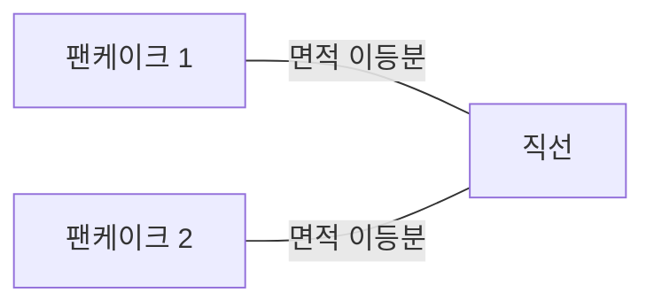
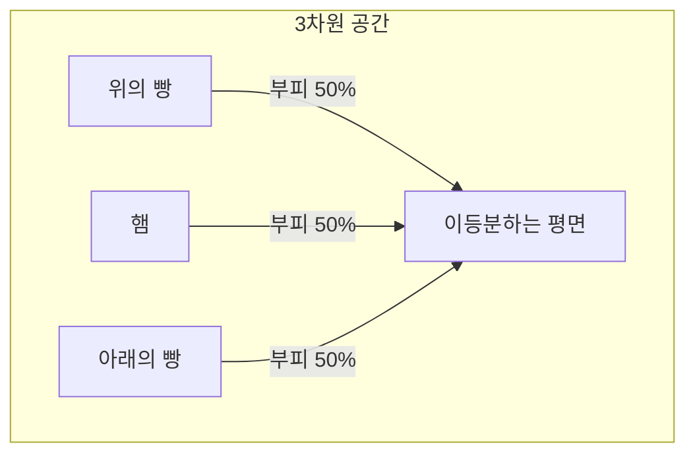
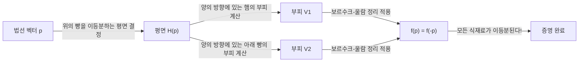
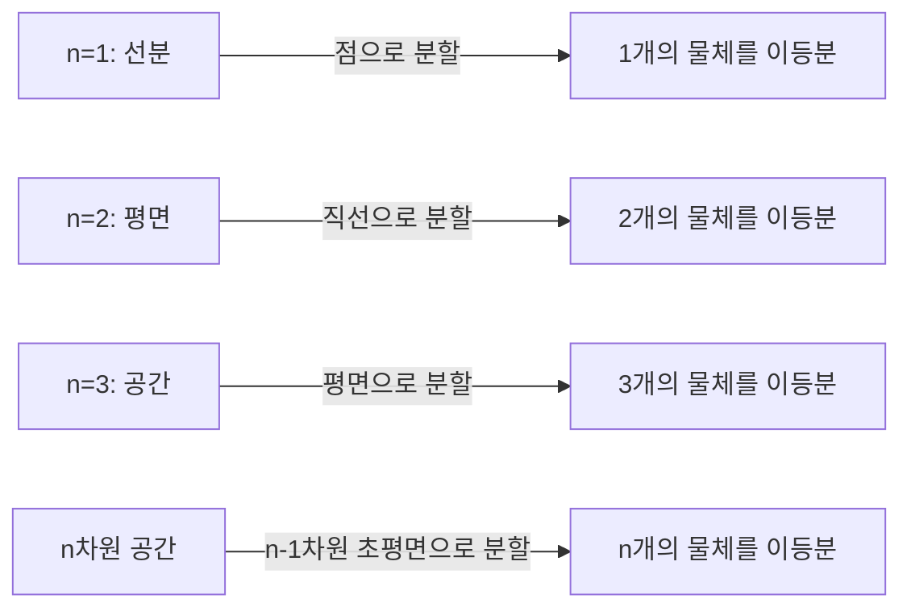

수학의 세계에는 일상적인 이름이 붙은 신기한 정리들이 많이 있습니다. 그중에서도 특히 유명하고 직관적으로 흥미로운 것이 바로 **‘햄 샌드위치 정리 (Ham Sandwich Theorem)’** 입니다.

샌드위치를 만들 때, 보통 빵 두 조각과 그 사이에 햄 한 조각이 끼워져 있는 모습을 상상할 것입니다. 이 정리가 주장하는 놀라운 사실은 다음과 같습니다. **“모양이 아무리 찌그러져 있거나 허공에 뿔뿔이 흩어져 있더라도, 단 한 번의 칼질(하나의 평면)로 두 조각의 빵과 한 조각의 햄의 모든 부피를 동시에 정확히 반으로 나눌 수 있다.”**

이 글에서는 이 햄 샌드위치 정리에 대해 직관적인 이해부터 그 배경에 있는 대수적 위상수학의 강력한 정리인 **‘보르수크-울람 정리 (Borsuk-Ulam Theorem)’** 까지 자세히 설명해 드리겠습니다.

## 1. 서론: 일상에서 수학으로

아침이나 점심으로 샌드위치를 반으로 자르는 상황을 상상해 보세요. 칼을 사용하여 샌드위치를 두 조각으로 나눕니다. 이때 위의 빵, 아래의 빵, 그리고 내용물인 햄 3가지 식재료 모두가 정확히 절반의 부피가 되도록 자를 수 있을까요?

직관적으로 빵이 예쁘게 포개져 있다면 가운데를 깔끔하게 자르기만 하면 될 것 같습니다. 하지만 만약 누군가가 장난을 쳐서 위의 빵을 테이블 오른쪽 끝에 두고, 아래의 빵을 왼쪽 끝에 두고, 햄을 천장에 붙여놓았다면 어떨까요?

놀랍게도 수학적 정리에 따르면, **그럼에도 불구하고 거대한 칼(평면) 하나를 사용하면 3개 모두를 동시에 이등분할 수 있습니다**. 이것이 ‘햄 샌드위치 정리’의 핵심입니다. 물체의 위치 관계나 모양에 대한 제약이 없으며, 심지어 연속된 하나의 덩어리일 필요조차 없습니다.

## 2. 2차원에서의 출발: 팬케이크 정리

3차원의 햄 샌드위치 정리를 생각하기 전에, 먼저 2차원(평면)의 경우를 생각해 봅시다. 2차원 버전은 **‘팬케이크 정리 (Pancake Theorem)’** 라고 불리기도 합니다.

팬케이크 정리는 다음과 같은 주장입니다.

> 평면 위에 임의의 두 도형(예: 2장의 팬케이크)이 있을 때, 그 두 도형의 넓이를 동시에 이등분하는 단 하나의 직선이 항상 존재한다.

이를 그림으로 나타내 봅시다.

### 직관적인 증명 아이디어

왜 이러한 직선이 항상 존재하는 것일까요? 연속성이라는 개념을 사용하여 생각해 봅시다.

1. 먼저, 평면 위에 특정 방향(예: 세로 방향)을 향하는 직선을 긋습니다.
2. 이 직선을 왼쪽에서 오른쪽으로 평행 이동시키다 보면, 어느 순간 ‘팬케이크 1’의 면적을 정확히 이등분하는 위치를 반드시 찾을 수 있습니다 (이는 미적분학의 **중간값 정리**에 의한 것입니다).
3. 다음으로, 이 직선의 각도 $\theta$ 를 $0^\circ$ 에서 $180^\circ$ 까지 연속적으로 회전시킵니다.
4. 회전시키는 각 각도 $\theta$ 에서, 항상 ‘팬케이크 1’의 면적을 이등분하도록 직선을 평행 이동시켜 조정합니다.
5. 이때, 또 다른 ‘팬케이크 2’가 어떻게 분할되고 있는지 주목합니다. 직선의 왼쪽에 있는 팬케이크 2의 면적 비율을 $f(\theta)$ 라고 합시다.
6. $\theta = 0^\circ$ 일 때와 $\theta = 180^\circ$ 일 때 직선의 ‘왼쪽’과 ‘오른쪽’이 뒤바뀌므로, $f(180^\circ) = 1 - f(0^\circ)$ 가 됩니다.
7. 만약 $\theta = 0^\circ$ 에서 왼쪽이 절반보다 크다면, $\theta = 180^\circ$ 에서는 절반보다 작아집니다. 면적 비율 $f(\theta)$ 는 연속적으로 변화하므로, 그 중간에 반드시 $f(\theta) = 0.5$ , 즉 ‘팬케이크 2’의 면적도 정확히 절반이 되는 각도가 존재합니다.

이것이 2차원의 경우에 두 물체를 동시에 이등분할 수 있는 이유입니다.

## 3. 3차원으로의 확장: 햄 샌드위치 정리

그럼, 드디어 3차원의 이야기로 넘어가겠습니다. 차원이 1개 올라가면, 분할할 수 있는 물체의 수도 1개 늘어납니다.

정리의 공식적인 주장은 다음과 같습니다.

> 3차원 공간 $\mathbb{R}^3$ 내에 있는 임의의 3개의 유한 부피를 가진 영역 $A, B, C$ 에 대하여, 그 3개의 부피를 동시에 이등분하는 평면이 적어도 1개 존재한다.

이 $A, B, C$ 가 각각 ‘위의 빵’, ‘햄’, ‘아래의 빵’에 대응하는 것입니다. 빵이 아무리 산산조각이 나 있든, 햄이 우주 공간 끝으로 날아가 있든, 그 모든 것을 단 하나의 평면으로 두 동강 낼 수 있는 것입니다.

이 정리의 멋진 점은 대상이 되는 물체의 모양에 어떠한 제약도 없다는 것입니다. 구형이든, 정육면체든, 구멍 뚫린 도넛 모양이든, 혹은 무수히 많은 작은 파편으로 나뉘어 있어도 상관없습니다 (수학적으로는 유한한 르베그 측도를 가지는 가측 집합이면 됩니다).

## 4. 배경에 있는 강력한 무기: 보르수크-울람 정리

햄 샌드위치 정리를 수학적으로 엄밀하게 증명하기 위해서는 토폴로지(위상수학)에서 매우 중요한 정리인 **‘보르수크-울람 정리 (Borsuk-Ulam Theorem)’** 가 사용됩니다.

### 보르수크-울람 정리란?

보르수크-울람 정리의 일반적인 주장은 다음과 같습니다.

> 임의의 연속 사상 $f: S^n \to \mathbb{R}^n$ 에 대하여, $f(x) = f(-x)$ 가 되는 점 $x \in S^n$ 이 반드시 존재한다.

여기서 $S^n$ 은 $(n+1)$ 차원 공간에서의 $n$ 차원 구면(예를 들어 $S^2$ 는 우리가 살고 있는 지구 표면과 같은 일반적인 구면)이고, $\mathbb{R}^n$ 은 $n$ 차원 유클리드 공간입니다. 또한 $x$ 와 $-x$ 는 구면 상의 **대척점 (antipodal points)** (지구로 치면 북극과 남극, 또는 서울과 우루과이 앞바다처럼 중심을 지나는 직선의 반대편 점)을 의미합니다.

우리에게 친숙한 $n=2$ 의 경우( $S^2 \to \mathbb{R}^2$ )로 이 정리를 해석하면, 다음과 같은 재미있는 사실을 말할 수 있습니다.

**“지구 상 어딘가에는 기온과 기압이 완전히 똑같은 대척점 쌍이 반드시 존재한다.”**

기온과 기압이라는 2개의 연속적인 값을 가지는 함수 $f(x) = \left( \text{기온}, \text{기압} \right)$ 에 대하여, 지구 반대편의 점 $-x$ 에서 값이 완전히 일치한다는 의미입니다. 이는 직관에 어긋나는 것처럼 보일 수 있지만, 수학적으로 증명된 확고부동한 사실입니다.

### 햄 샌드위치 정리의 증명 스케치

햄 샌드위치 정리(3차원 버전)는 보르수크-울람 정리의 $n=2$ 인 경우를 사용하여 증명할 수 있습니다. 아래에 그 아름다운 증명의 스케치를 보여드립니다.

1. 원점을 중심으로 하는 단위 구면 $S^2$ 상의 점 $p$ (이는 평면의 법선 벡터, 즉 평면의 ‘방향’을 나타냅니다)를 생각합니다.
2. 방향 $p$ 를 고정했을 때, ‘위의 빵’의 부피를 이등분하는 평면이 유일하게 결정됩니다 (이것을 평면 $H(p)$ 라고 합시다).
3. 이 평면 $H(p)$ 에 의해 ‘햄’과 ‘아래의 빵’도 분할됩니다.
4. 따라서, 연속 사상 $f: S^2 \to \mathbb{R}^2$ 를 다음과 같이 정의합니다.
   $$ f(p) = \left( \text{평면 } H(p) \text{의 양의 방향에 있는 햄의 부피}, \text{평면 } H(p) \text{의 양의 방향에 있는 아래의 빵의 부피} \right) $$
5. 평면의 방향을 정반대로 하면( $p$ 를 $-p$ 로 하면), 평면의 ‘양의 방향’과 ‘음의 방향’이 뒤바뀝니다. 따라서 양의 방향 부피와 음의 방향 부피가 뒤바뀌게 됩니다.
6. 보르수크-울람 정리에 의해, $f(p) = f(-p)$ 가 되는 방향 $p$ 가 반드시 존재합니다.
7. $f(p) = f(-p)$ 라는 것은, 방향 $p$ 에서 평면의 양의 방향 부피와 방향 $-p$ 에서 평면의 양의 방향(원래 평면의 음의 방향) 부피가 같다는 뜻입니다. 이는 곧 ‘햄’과 ‘아래의 빵’이 동시에 이등분되었음을 의미합니다.
8. 처음부터 ‘위의 빵’은 이등분하도록 평면을 결정해 놓았기 때문에, 결과적으로 3가지 식재료 모두가 단 하나의 평면으로 이등분된 것입니다.

## 5. 일반화된 n차원의 햄 샌드위치 정리

수학자들은 이 정리를 더 높은 차원으로 일반화했습니다.

> $n$ 차원 공간 $\mathbb{R}^n$ 에 있는 임의의 $n$ 개의 유한한 르베그 측도를 가지는 집합에 대하여, 그들 모두를 동시에 이등분하는 $(n-1)$ 차원의 초평면이 존재한다.

즉, 차원이 올라갈수록 동시에 이등분할 수 있는 물체의 수도 늘어납니다.
- $n=1$ (직선): 1개의 선분을 1개의 점으로 이등분한다.
- $n=2$ (평면): 2개 도형의 면적을 1개의 직선으로 이등분한다 (팬케이크 정리).
- $n=3$ (공간): 3개 입체의 부피를 1개의 평면으로 이등분한다 (햄 샌드위치 정리).
- $n=4$: 4개의 4차원 물체의 초부피를 1개의 3차원 공간으로 동시에 이등분한다.

이처럼 어떤 차원에서도 이 아름다운 법칙은 성립하는 것입니다.

## 6. 실용성이 있을까? (계산 기하학에의 응용)

‘햄 샌드위치 정리’는 순수 수학의 재미있는 화제로 이야기되는 경우가 많지만, 사실 **계산 기하학 (Computational Geometry)** 이나 **컴퓨터 과학** 분야에서 실용적인 응용이 있습니다.

예를 들어, 대량의 데이터 포인트(점군)가 공간 상에 존재할 때, 그 데이터들을 효율적으로 분할하여 처리하기 위해 햄 샌드위치 정리의 알고리즘적 버전이 사용되기도 합니다. 여러 클래스로 분류된 데이터를 동시에 반으로 분할함으로써, 분할 정복법(Divide and Conquer)을 이용한 효율적인 데이터 처리 및 검색 알고리즘을 구축하는 데 도움이 됩니다.

## 7. 결론

햄 샌드위치 정리는 얼핏 보면 우스꽝스러운 이름의 농담 같지만, 그 실체는 현대 수학, 특히 대수적 위상수학의 강력한 정리를 응용한 아름다운 결과입니다. 추상적인 수학적 이론이 우리의 일상적인 샌드위치라는 매우 구체적인 것을 통해 표현된다는 것은 수학이 가진 매력 중 하나라고 할 수 있습니다.

우리가 일상적으로 샌드위치를 자를 때, 우연히도 3가지 재료가 모두 정확히 반으로 나뉘는 순간이 있을지도 모릅니다. 다음번 점심시간에는 꼭 칼을 쥐고, 고차원 공간과 보르수크-울람 정리에 대해 상상의 나래를 펼쳐보는 것은 어떨까요?
