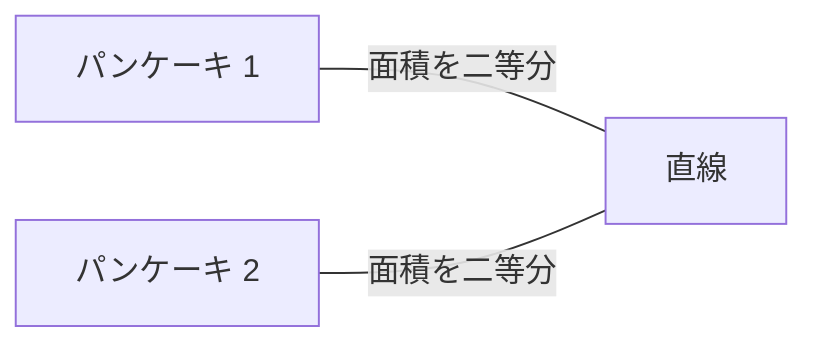
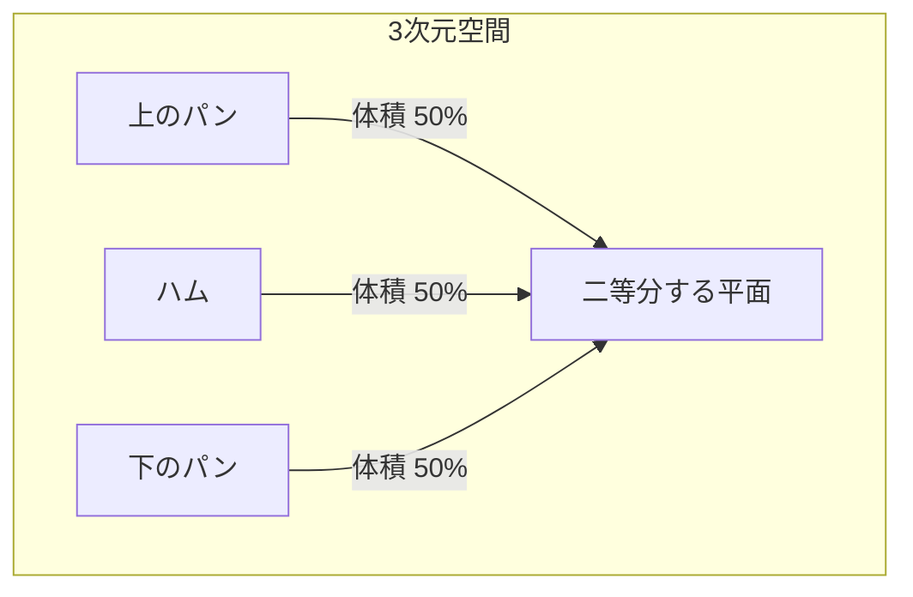
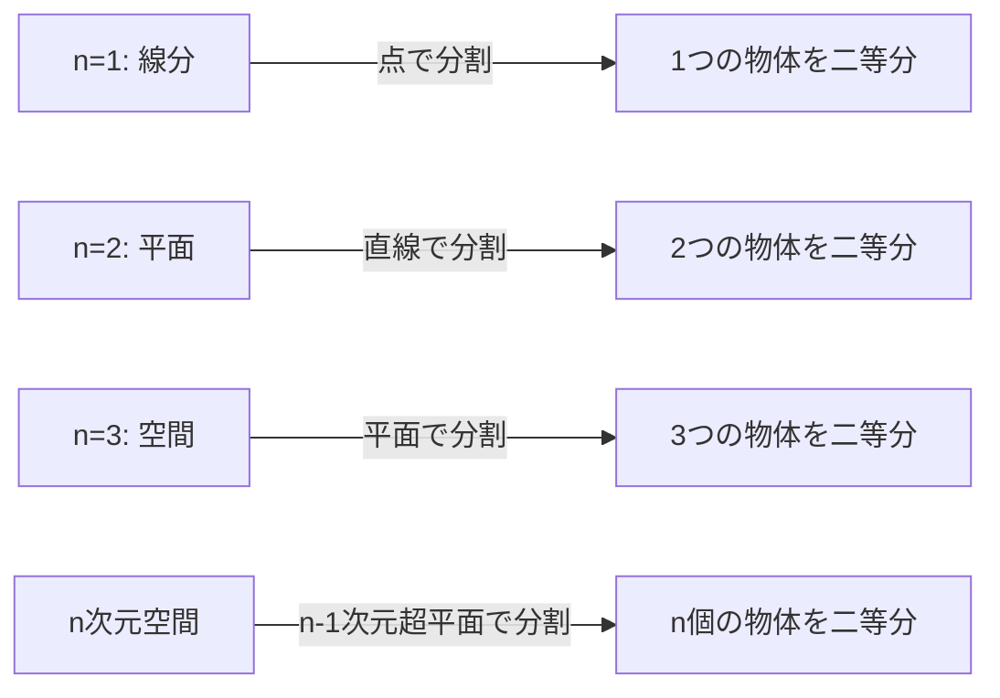

数学の世界には、日常的な名前が付けられた不思議な定理がたくさんあります。その中でも特に有名で、かつ直感的に面白いのが **「[ハムサンドイッチの定理](https://kenji.blog/p/ham-sandwich-theorem/)（Ham Sandwich Theorem）」** です。

皆さんはサンドイッチを作るとき、パンが2枚と、その間にハムが1枚挟まっているものを想像するでしょう。この定理が主張しているのは、 **「どんなに形が歪んでいても、またどんなに空中にバラバラに配置されていても、1回の包丁のカット（1つの平面）で、2枚のパンと1枚のハムのすべての体積を同時にぴったり半分に分けることができる」** という驚くべき事実です。

本記事では、この[ハムサンドイッチの定理](https://kenji.blog/p/ham-sandwich-theorem/)について、直感的な理解から、その背景にある代数的位相幾何学の強力な定理 **「ボルサック・ウラムの定理（Borsuk-Ulam Theorem）」** まで、詳しく解説していきます。

## 1. はじめに：日常から数学へ

朝食や昼食でサンドイッチを半分に切る場面を想像してください。あなたは包丁を使って、サンドイッチを2つのピースに分けます。このとき、上のパン、下のパン、そして中身のハムの3つの食材すべてが、ちょうど半分の体積になるように切ることは可能でしょうか？

直感的には、パンが綺麗に重なっていれば真ん中からスパッと切るだけで済みそうです。しかし、もし誰かが悪ふざけをして、上のパンをテーブルの右端に置き、下のパンを左端に置き、ハムを天井に貼り付けたとしたらどうでしょう？

驚くべきことに、数学的な定理によれば、 **それでも1つの巨大な包丁（平面）を使えば、3つすべてを同時に二等分できる** のです。これが「[ハムサンドイッチの定理](https://kenji.blog/p/ham-sandwich-theorem/)」の真髄です。物体の位置関係や形状、さらには連続したひとつの塊である必要すらありません。

## 2. 2次元からの出発：パンケーキの定理

3次元の[ハムサンドイッチの定理](https://kenji.blog/p/ham-sandwich-theorem/)を考える前に、まずは2次元（平面）の場合を考えてみましょう。2次元のバージョンは **「パンケーキの定理（Pancake Theorem）」** と呼ばれることがあります。

パンケーキの定理は、次のような主張です。

> 平面上に任意の2つの図形（例えば、2枚のパンケーキ）があるとき、それら2つの図形の面積を同時に二等分する1本の直線が必ず存在する。

これを図解してみましょう。

### 直感的な証明のアイデア

なぜこのような直線が必ず存在するのでしょうか？ 連続性という概念を使って考えてみましょう。

1. まず、平面上に特定の方向（例えば縦方向）を向いた直線を引きます。
2. この直線を左から右へと平行移動させていくと、どこかのタイミングで「パンケーキ1」の面積をちょうど二等分する場所が必ず見つかります（これは微分積分学における **中間値の定理** によるものです）。
3. 次に、この直線の角度 $\theta$ を $0^\circ$ から $180^\circ$ まで連続的に回転させていきます。
4. 回転させる各角度 $\theta$ において、常に「パンケーキ1」の面積を二等分するように直線を平行移動させて調整します。
5. このとき、もう一つの「パンケーキ2」がどのように分割されているかに注目します。直線の左側にあるパンケーキ2の面積の割合を $f(\theta)$ としましょう。
6. $\theta = 0^\circ$ のときと $\theta = 180^\circ$ のときでは、直線の「左側」と「右側」が入れ替わるため、 $f(180^\circ) = 1 - f(0^\circ)$ となります。
7. もし $\theta = 0^\circ$ で左側が半分より大きければ、 $\theta = 180^\circ$ では半分より小さくなります。面積の割合 $f(\theta)$ は連続的に変化するため、その途中で必ず $f(\theta) = 0.5$ 、つまり「パンケーキ2」の面積もぴったり半分になる角度が存在します。

これが、2次元の場合に2つの物体を同時に二等分できる理由です。

## 3. 3次元への拡張：[ハムサンドイッチの定理](https://kenji.blog/p/ham-sandwich-theorem/)

それでは、いよいよ3次元のお話に入りましょう。次元が1つ上がると、分割できる物体の数も1つ増えます。

定理の正式な主張は以下の通りです。

> 3次元空間 $\mathbb{R}^3$ 内にある任意の3つの有限体積の領域 $A, B, C$ に対して、それら3つの体積を同時に二等分する平面が少なくとも1つ存在する。

この $A, B, C$ が、それぞれ「上のパン」「ハム」「下のパン」に対応するというわけです。どんなにパンがボロボロに崩れていようが、ハムが宇宙空間の果てに飛んでいこうが、それらすべてを1つの平面で真っ二つにできるのです。

この定理の素晴らしい点は、対象となる物体の形状に一切の制約がないことです。球体でも、立方体でも、穴の空いたドーナツ型でも、あるいは無数の小さな破片に分かれていても構いません（数学的には、有限のルベーグ測度を持つ可測集合であればよいとされています）。

## 4. 背景にある強大な武器：ボルサック・ウラムの定理

[ハムサンドイッチの定理](https://kenji.blog/p/ham-sandwich-theorem/)を数学的に厳密に証明するためには、トポロジー（位相幾何学）における非常に重要な定理である **「ボルサック・ウラムの定理（Borsuk-Ulam Theorem）」** が用いられます。

### ボルサック・ウラムの定理とは？

ボルサック・ウラムの定理の一般的な主張は次のようなものです。

> 任意の連続写像 $f: S^n \to \mathbb{R}^n$ について、 $f(x) = f(-x)$ となるような点 $x \in S^n$ が必ず存在する。

ここで、 $S^n$ は $(n+1)$ 次元空間における $n$ 次元球面（例えば $S^2$ は私たちが住んでいる地球の表面のような通常の球面）、 $\mathbb{R}^n$ は $n$ 次元[ユークリッド](https://kenji.blog/p/euclid/)空間です。また、 $x$ と $-x$ は球面上における **対蹠点（たいせきてん）** （地球でいう北極と南極、あるいは東京とブラジル沖のような、中心を通る直線の反対側の点）を指します。

身近な $n=2$ の場合（ $S^2 \to \mathbb{R}^2$ ）でこの定理を解釈すると、次のような面白い事実が言えます。

**「地球上のどこかに、気温と気圧が全く同じであるような対蹠点のペアが必ず存在する。」**

気温と気圧という2つの連続的な値を持つ関数 $f(x) = \left( \text{気温}, \text{気圧} \right)$ に対して、地球上の反対側の点 $-x$ で値が完全に一致する、という意味です。これは直感に反するかもしれませんが、数学的に証明された揺るぎない事実です。

### [ハムサンドイッチの定理](https://kenji.blog/p/ham-sandwich-theorem/)の証明スケッチ

[ハムサンドイッチの定理](https://kenji.blog/p/ham-sandwich-theorem/)（3次元版）は、ボルサック・ウラムの定理の $n=2$ の場合を用いて証明できます。以下にその美しい証明のスケッチを示します。

1. 原点を中心とする単位球面 $S^2$ 上の点 $p$ （これは平面の法線ベクトル、つまり平面の「向き」を表します）を考えます。
2. 向き $p$ を固定したとき、「上のパン」の体積を二等分するような平面が一意に定まります（これを 平面 $H(p)$ とします）。
3. この 平面 $H(p)$ によって、「ハム」と「下のパン」も分割されます。
4. そこで、連続写像 $f: S^2 \to \mathbb{R}^2$ を次のように定義します。
   $$ f(p) = \left( \text{平面 } H(p) \text{ の正側にあるハムの体積}, \text{平面 } H(p) \text{ の正側にある下のパンの体積} \right) $$
5. 平面の向きを真逆にすると（ $p$ を $-p$ にすると）、平面の「正側」と「負側」が入れ替わります。したがって、正側の体積と負側の体積が入れ替わることになります。
6. ボルサック・ウラムの定理より、 $f(p) = f(-p)$ となるような向き $p$ が必ず存在します。
7. $f(p) = f(-p)$ ということは、向き $p$ における平面の正側の体積と、向き $-p$ における平面の正側（元の平面の負側）の体積が等しいということです。これはつまり、「ハム」と「下のパン」が同時に二等分されていることを意味します。
8. 最初から「上のパン」は二等分するように平面を決めていたので、結果として3つすべての食材が1つの平面で二等分されたことになります。

## 5. 一般化された n次元の[ハムサンドイッチの定理](https://kenji.blog/p/ham-sandwich-theorem/)

数学者たちは、この定理をさらに高次元へと一般化しました。

> $n$ 次元空間 $\mathbb{R}^n$ における任意の $n$ 個の有限なルベーグ測度を持つ集合に対して、それらすべてを同時に二等分する $(n-1)$ 次元の超平面が存在する。

つまり、次元が上がるごとに、同時に二等分できる物体の数も増えていきます。
- $n=1$ （直線）: 1つの線分を1つの点で二等分する。
- $n=2$ （平面）: 2つの図形の面積を1本の直線で二等分する（パンケーキの定理）。
- $n=3$ （空間）: 3つの立体の体積を1つの平面で二等分する（[ハムサンドイッチの定理](https://kenji.blog/p/ham-sandwich-theorem/)）。
- $n=4$ : 4つの4次元物体の超体積を1つの3次元空間で同時に二等分する。

このように、どんな次元でもこの美しい法則は成り立つのです。

## 6. 実用性はあるのか？（計算幾何学への応用）

「[ハムサンドイッチの定理](https://kenji.blog/p/ham-sandwich-theorem/)」は純粋数学の面白い話題として語られることが多いですが、実は **計算幾何学（Computational Geometry）** や **コンピュータサイエンス** の分野で実用的な応用があります。

例えば、大量のデータポイント（点群）が空間上に存在するとき、それらのデータを効率的に分割して処理するために、[ハムサンドイッチの定理](https://kenji.blog/p/ham-sandwich-theorem/)のアルゴリズム的なバージョンが使われることがあります。複数のクラスに分類されたデータを同時に半分に分割することで、分割統治法（Divide and Conquer）を用いた効率的なデータ処理や検索アルゴリズムを構築するのに役立ちます。

## 7. 結び

[ハムサンドイッチの定理](https://kenji.blog/p/ham-sandwich-theorem/)は、一見するとおかしな名前のジョークのようですが、その実態は現代数学、特に代数的位相幾何学の強力な定理を応用した美しい結果です。抽象的な数学的理論が、私たちの日常のサンドイッチという非常に具体的なものを通じて表現されるのは、数学の持つ魅力の1つと言えるでしょう。

私たちが日常的にサンドイッチを切るとき、偶然にも3つの具材がすべてぴったり半分に分かれる瞬間があるかもしれません。次回のランチタイムには、ぜひ包丁を握りながら、高次元空間とボルサック・ウラムの定理に思いを馳せてみてはいかがでしょうか。
