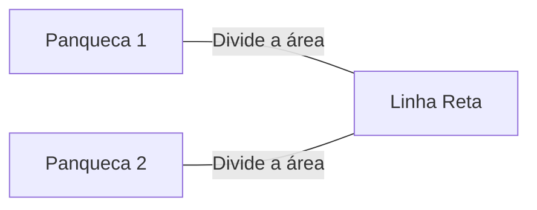
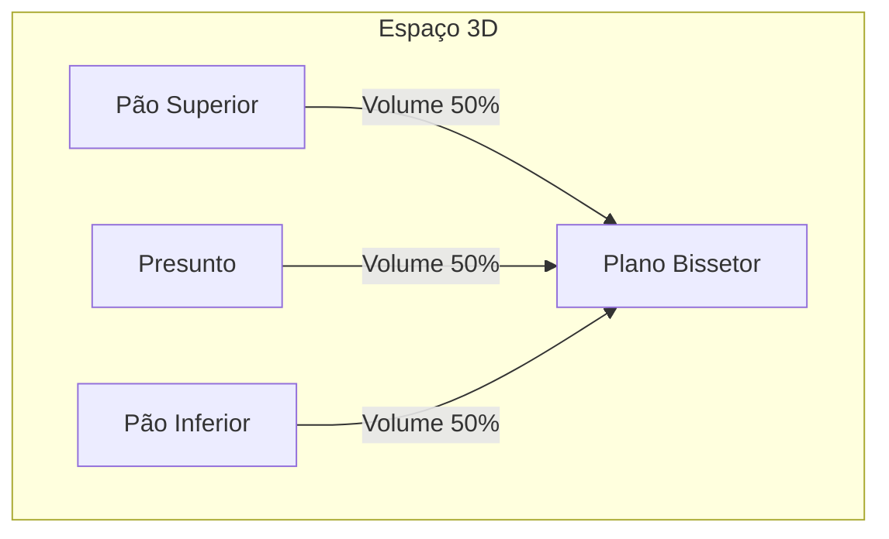
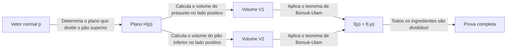
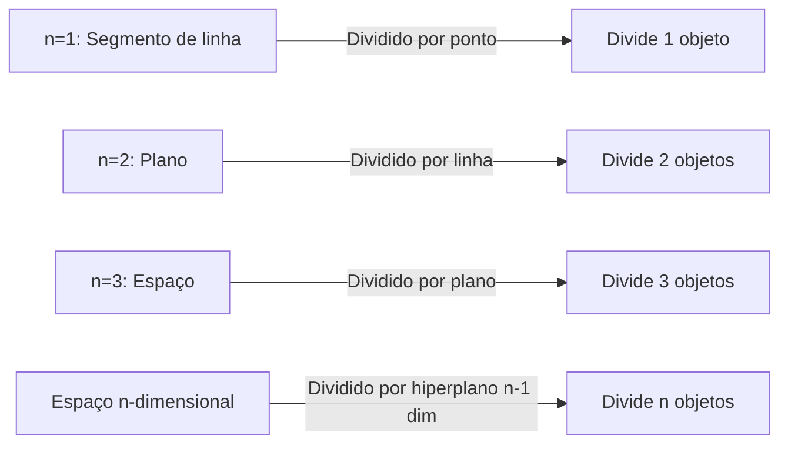

Existem muitos teoremas curiosos na matemática com nomes cotidianos. Entre eles, um dos mais famosos e intuitivamente interessantes é o **Teorema do Sanduíche de Presunto (Ham Sandwich Theorem)**.

Quando você faz um sanduíche, provavelmente imagina duas fatias de pão com uma fatia de presunto no meio. Este teorema afirma um fato surpreendente: **"Não importa o quão distorcidas sejam as formas, ou quão espalhadas elas estejam no ar, um único corte com uma faca (um único plano) pode dividir perfeitamente os volumes de dois pedaços de pão e um pedaço de presunto simultaneamente."**

Neste artigo, explicaremos detalhadamente este Teorema do Sanduíche de Presunto, de uma compreensão intuitiva até o poderoso teorema da topologia algébrica por trás dele, o **Teorema de Borsuk-Ulam**.

## 1. Introdução: Da Vida Cotidiana à Matemática

Imagine cortar um sanduíche ao meio para o café da manhã ou almoço. Você usa uma faca para dividir o sanduíche em dois pedaços. É possível cortá-lo de forma que todos os três ingredientes — o pão superior, o pão inferior e o presunto dentro — sejam divididos exatamente na metade de seu volume?

Intuitivamente, se o pão estiver perfeitamente empilhado, um corte limpo no meio seria suficiente. Mas e se alguém fizesse uma brincadeira, colocando o pão superior na borda direita da mesa, o pão inferior na borda esquerda e colando o presunto no teto?

Surpreendentemente, de acordo com um teorema matemático, **mesmo assim, se você usar uma faca gigante (um plano), poderá dividir todos os três simultaneamente**. Esta é a essência do "Teorema do Sanduíche de Presunto". Não há requisitos para as posições relativas ou formas dos objetos, nem eles precisam ser pedaços únicos e contínuos.

## 2. Começando em 2D: O Teorema da Panqueca

Antes de considerar o Teorema do Sanduíche de Presunto em 3D, vejamos o caso bidimensional (plano). A versão 2D às vezes é chamada de **Teorema da Panqueca (Pancake Theorem)**.

O Teorema da Panqueca afirma o seguinte:

> Dadas quaisquer duas formas em um plano (por exemplo, duas panquecas), sempre existe uma única linha reta que divide simultaneamente as áreas de ambas as formas.

Vamos ilustrar isso.

### Ideia de uma Prova Intuitiva

Por que tal linha sempre existe? Vamos pensar usando o conceito de continuidade.

1. Primeiro, desenhe uma linha no plano apontando em uma direção específica (por exemplo, verticalmente).
2. À medida que você translada essa linha da esquerda para a direita, definitivamente encontrará um ponto onde ela divide exatamente a área da "Panqueca 1" (isso se deve ao **Teorema do Valor Intermediário** no cálculo).
3. A seguir, gire continuamente o ângulo desta linha $\theta$ de $0^\circ$ a $180^\circ$.
4. Em cada ângulo girado $\theta$, sempre ajuste a linha transladando-a para que continue a dividir a área da "Panqueca 1".
5. Enquanto isso, preste atenção em como a outra "Panqueca 2" é dividida. Seja $f(\theta)$ a proporção da área da Panqueca 2 no lado esquerdo da linha.
6. Entre $\theta = 0^\circ$ e $\theta = 180^\circ$, os lados "esquerdo" e "direito" da linha são trocados, então $f(180^\circ) = 1 - f(0^\circ)$.
7. Se o lado esquerdo fosse maior que a metade em $\theta = 0^\circ$, será menor que a metade em $\theta = 180^\circ$. Como a proporção de área $f(\theta)$ muda continuamente, deve haver um ângulo ao longo do caminho onde $f(\theta) = 0.5$, o que significa que a área da "Panqueca 2" também é perfeitamente dividida pela metade.

É por isso que você pode dividir dois objetos simultaneamente no caso 2D.

## 3. Extensão para 3D: O Teorema do Sanduíche de Presunto

Agora, vamos finalmente para a história tridimensional. Quando a dimensão sobe um, o número de objetos que você pode dividir também aumenta em um.

A declaração formal do teorema é a seguinte:

> Para quaisquer três regiões de volume finito $A, B, C$ no espaço tridimensional $\mathbb{R}^3$, existe pelo menos um plano que divide simultaneamente os volumes de todos os três.

Esses $A, B, C$ correspondem ao "pão superior", "presunto" e "pão inferior", respectivamente. Não importa o quão esfarelado o pão esteja, ou mesmo se o presunto voar para a borda do espaço sideral, um único plano pode cortar todos eles perfeitamente ao meio.

A coisa maravilhosa sobre este teorema é que não há absolutamente nenhuma restrição sobre as formas dos objetos alvo. Eles podem ser esferas, cubos, rosquinhas com buracos, ou até mesmo quebrados em incontáveis pequenos fragmentos (matematicamente, eles só precisam ser conjuntos mensuráveis com medida de Lebesgue finita).

## 4. A Poderosa Arma por Trás: O Teorema de Borsuk-Ulam

Para provar matematicamente e rigorosamente o Teorema do Sanduíche de Presunto, um teorema muito importante na topologia é usado: o **Teorema de Borsuk-Ulam**.

### O que é o Teorema de Borsuk-Ulam?

A afirmação geral do teorema de Borsuk-Ulam é a seguinte:

> Para qualquer mapeamento contínuo $f: S^n \to \mathbb{R}^n$, sempre existe um ponto $x \in S^n$ tal que $f(x) = f(-x)$.

Aqui, $S^n$ é a esfera de dimensão $n$ no espaço de dimensão $(n+1)$ (por exemplo, $S^2$ é uma esfera comum como a superfície da Terra em que vivemos), e $\mathbb{R}^n$ é o espaço euclidiano de dimensão $n$. Além disso, $x$ e $-x$ referem-se a **pontos antipodais** na esfera (pontos em lados opostos de uma linha reta passando pelo centro, como os Polos Norte e Sul na Terra, ou Tóquio e na costa do Brasil).

Se interpretarmos este teorema no caso familiar de $n=2$ ( $S^2 \to \mathbb{R}^2$ ), podemos afirmar o seguinte fato interessante:

**"Sempre existe um par de pontos antipodais em algum lugar da Terra que têm exatamente a mesma temperatura e pressão."**

Para uma função $f(x) = \left( \text{Temperatura}, \text{Pressão} \right)$ que tem dois valores contínuos, significa que os valores combinam perfeitamente no ponto oposto $-x$ na Terra. Isso pode parecer contraintuitivo, mas é um fato inabalável e matematicamente comprovado.

### Esboço da Prova do Teorema do Sanduíche de Presunto

O Teorema do Sanduíche de Presunto (versão 3D) pode ser provado usando o caso $n=2$ do Teorema de Borsuk-Ulam. Abaixo está um esboço de sua bela prova.

1. Considere um ponto $p$ na esfera unitária $S^2$ centrada na origem (isso representa o vetor normal do plano, ou seja, a "direção" do plano).
2. Quando a direção $p$ é fixada, um plano que divide o volume do "pão superior" é determinado de forma única (vamos chamar isso de Plano $H(p)$).
3. Este Plano $H(p)$ também divide o "presunto" e o "pão inferior".
4. Portanto, definimos um mapeamento contínuo $f: S^2 \to \mathbb{R}^2$ da seguinte forma:
   $$ f(p) = \left( \text{Volume do presunto no lado positivo do plano } H(p), \text{Volume do pão inferior no lado positivo do plano } H(p) \right) $$
5. Se invertermos completamente a direção do plano (mudarmos $p$ para $-p$), o "lado positivo" e o "lado negativo" do plano são trocados. Portanto, os volumes do lado positivo e do lado negativo são trocados.
6. De acordo com o teorema de Borsuk-Ulam, sempre existe uma direção $p$ tal que $f(p) = f(-p)$.
7. $f(p) = f(-p)$ significa que o volume no lado positivo do plano na direção $p$ é igual ao volume no lado positivo na direção $-p$ (que é o lado negativo do plano original). Isso significa simplesmente que tanto o "presunto" quanto o "pão inferior" são divididos simultaneamente.
8. Como o plano foi escolhido para dividir o "pão superior" desde o início, todos os três ingredientes acabam sendo divididos por um único plano.

## 5. Teorema do Sanduíche de Presunto n-dimensional Generalizado

Os matemáticos generalizaram este teorema para dimensões ainda mais altas.

> Para quaisquer $n$ conjuntos com medida de Lebesgue finita no espaço $n$-dimensional $\mathbb{R}^n$, existe um hiperplano $(n-1)$-dimensional que divide simultaneamente todos eles.

Em outras palavras, à medida que a dimensão aumenta, o número de objetos que você pode dividir simultaneamente também aumenta.
- $n=1$ (Linha): Divide 1 segmento de linha com 1 ponto.
- $n=2$ (Plano): Divide as áreas de 2 formas com 1 linha (Teorema da Panqueca).
- $n=3$ (Espaço): Divide os volumes de 3 sólidos com 1 plano (Teorema do Sanduíche de Presunto).
- $n=4$: Divide simultaneamente os hipervolumes de quatro objetos 4D com um espaço 3D.

Desta forma, esta bela lei se sustenta em qualquer dimensão.

## 6. É Prático? (Aplicações em Geometria Computacional)

O "Teorema do Sanduíche de Presunto" é frequentemente contado como um tópico divertido em matemática pura, mas na verdade tem aplicações práticas em áreas como **Geometria Computacional** e **Ciência da Computação**.

Por exemplo, quando uma quantidade massiva de pontos de dados (nuvens de pontos) existe no espaço, uma versão algorítmica do Teorema do Sanduíche de Presunto às vezes é usada para particionar e processar esses dados de forma eficiente. Ao dividir simultaneamente dados classificados em várias classes, isso ajuda na construção de algoritmos eficientes de processamento e busca de dados usando a abordagem Dividir e Conquistar.

## 7. Conclusão

O Teorema do Sanduíche de Presunto pode parecer uma piada com um nome engraçado à primeira vista, mas na realidade, é um belo resultado aplicado de um teorema poderoso na matemática moderna, especificamente na topologia algébrica. O fato de que uma teoria matemática abstrata seja expressa através de algo tão concreto e cotidiano como um sanduíche é indiscutivelmente um dos aspectos fascinantes da matemática.

Da próxima vez que você cortar um sanduíche casualmente, pode haver apenas um momento em que todos os três ingredientes sejam divididos perfeitamente por coincidência. Durante sua próxima pausa para o almoço, ao agarrar sua faca, por que não deixar seus pensamentos vagarem para espaços de dimensões superiores e o Teorema de Borsuk-Ulam?
