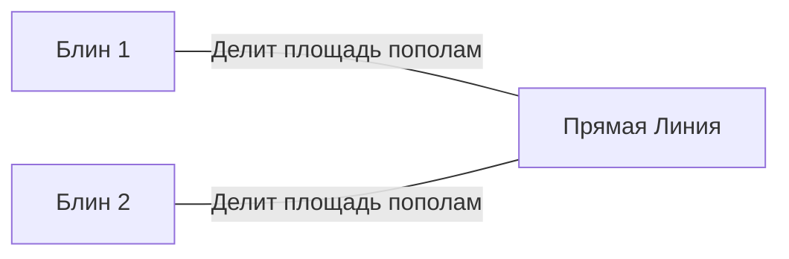
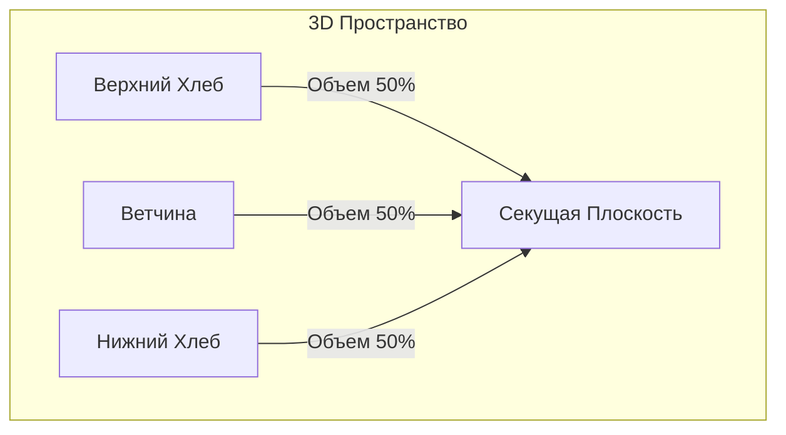
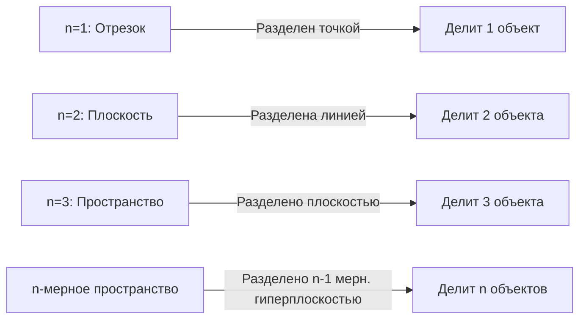

В математике есть много любопытных теорем с повседневными названиями. Среди них одна из самых известных и интуитивно интересных — **[Теорема о сэндвиче с ветчиной](https://kenji.blog/ru/p/ham-sandwich-theorem/) (Ham Sandwich Theorem)**.

Когда вы делаете сэндвич, вы, вероятно, представляете себе два куска хлеба с ломтиком ветчины между ними. Эта теорема утверждает удивительный факт: **«Независимо от того, насколько искажены формы или как они разбросаны в воздухе, один-единственный разрез ножом (одна плоскость) может идеально и одновременно разделить пополам объемы двух кусков хлеба и одного куска ветчины»**.

В этой статье мы подробно объясним эту Теорему о сэндвиче с ветчиной: от интуитивного понимания до стоящей за ней мощной теоремы алгебраической топологии — **Теоремы Борсука-Улама**.

## 1. Введение: От повседневной жизни к математике

Представьте, что вы разрезаете сэндвич пополам на завтрак или обед. Вы используете нож, чтобы разделить сэндвич на две части. Можно ли разрезать его так, чтобы все три ингредиента — верхний хлеб, нижний хлеб и ветчина внутри — были разделены ровно на половину своего объема?

Интуитивно кажется, что если хлеб идеально сложен, достаточно чистого разреза посередине. Но что, если кто-то решил пошутить, положив верхний хлеб на правый край стола, нижний хлеб — на левый, а ветчину приклеил к потолку?

Удивительно, но согласно математической теореме, **даже тогда, если вы используете гигантский нож (плоскость), вы можете разделить все три объекта пополам одновременно**. В этом суть «Теоремы о сэндвиче с ветчиной». Нет никаких требований к взаимному расположению или формам объектов, и им даже не обязательно быть цельными непрерывными кусками.

## 2. Начиная с 2D: Теорема о блине

Прежде чем рассматривать Теорему о сэндвиче с ветчиной в 3D, давайте посмотрим на двумерный (плоский) случай. Двумерная версия иногда называется **Теоремой о блине (Pancake Theorem)**.

Теорема о блине утверждает следующее:

> Для любых двух фигур на плоскости (например, двух блинов) всегда существует одна прямая линия, которая одновременно делит пополам площади обеих фигур.

Давайте проиллюстрируем это.

### Идея интуитивного доказательства

Почему такая линия всегда существует? Давайте подумаем, используя концепцию непрерывности.

1. Сначала нарисуйте линию на плоскости, указывающую в определенном направлении (например, вертикально).
2. По мере того, как вы перемещаете эту линию слева направо, вы обязательно найдете точку, где она точно делит пополам площадь «Блина 1» (это связано с **Теоремой о промежуточном значении** в математическом анализе).
3. Затем непрерывно вращайте угол этой линии $\theta$ от $0^\circ$ до $180^\circ$.
4. На каждом повернутом угле $\theta$ всегда корректируйте линию, перемещая ее так, чтобы она продолжала делить пополам площадь «Блина 1».
5. Тем временем обратите внимание на то, как делится другой «Блин 2». Пусть $f(\theta)$ будет отношением площади Блина 2 с левой стороны линии.
6. Между $\theta = 0^\circ$ и $\theta = 180^\circ$ «левая» и «правая» стороны линии меняются местами, поэтому $f(180^\circ) = 1 - f(0^\circ)$.
7. Если левая сторона была больше половины при $\theta = 0^\circ$, она будет меньше половины при $\theta = 180^\circ$. Поскольку отношение площадей $f(\theta)$ изменяется непрерывно, по пути должен быть угол, где $f(\theta) = 0.5$, что означает, что площадь «Блина 2» также идеально уменьшена вдвое.

Вот почему вы можете разделить два объекта одновременно в 2D-случае.

## 3. Расширение до 3D: [Теорема о сэндвиче с ветчиной](https://kenji.blog/ru/p/ham-sandwich-theorem/)

Теперь, наконец, перейдем к трехмерной истории. Когда размерность увеличивается на единицу, количество объектов, которые вы можете разделить, также увеличивается на один.

Формальная формулировка теоремы выглядит следующим образом:

> Для любых трех областей конечного объема $A, B, C$ в трехмерном пространстве $\mathbb{R}^3$ существует по крайней мере одна плоскость, которая одновременно делит пополам объемы всех трех.

Эти $A, B, C$ соответствуют «верхнему хлебу», «ветчине» и «нижнему хлебу» соответственно. Неважно, насколько раскрошился хлеб, или даже если ветчина улетит на край космоса, одна-единственная плоскость может идеально разрезать их все пополам.

Замечательно в этой теореме то, что нет абсолютно никаких ограничений на формы целевых объектов. Они могут быть сферами, кубами, пончиками с дырками или даже разбиты на бесчисленное множество крошечных фрагментов (математически им просто нужно быть измеримыми множествами с конечной мерой Лебега).

## 4. Мощное оружие: Теорема Борсука-Улама

Чтобы математически и строго доказать Теорему о сэндвиче с ветчиной, используется очень важная теорема в топологии: **Теорема Борсука-Улама**.

### Что такое Теорема Борсука-Улама?

Общее утверждение теоремы Борсука-Улама выглядит следующим образом:

> Для любого непрерывного отображения $f: S^n \to \mathbb{R}^n$ всегда существует точка $x \in S^n$ такая, что $f(x) = f(-x)$.

Здесь $S^n$ — это $n$-мерная сфера в $(n+1)$-мерном пространстве (например, $S^2$ — это обычная сфера, такая как поверхность Земли, на которой мы живем), а $\mathbb{R}^n$ — $n$-мерное евклидово пространство. Также $x$ и $-x$ относятся к **антиподальным точкам** на сфере (точки на противоположных сторонах прямой линии, проходящей через центр, как Северный и Южный полюса на Земле, или Токио и побережье Бразилии).

Если мы интерпретируем эту теорему в знакомом случае $n=2$ ( $S^2 \to \mathbb{R}^2$ ), мы можем констатировать следующий интересный факт:

**«Где-то на Земле всегда существует пара антиподальных точек, которые имеют абсолютно одинаковую температуру и давление».**

Для функции $f(x) = \left( \text{Температура}, \text{Давление} \right)$, которая имеет два непрерывных значения, это означает, что значения идеально совпадают в противоположной точке $-x$ на Земле. Это может показаться нелогичным, но это непоколебимый, математически доказанный факт.

### Набросок доказательства Теоремы о сэндвиче с ветчиной

Теорему о сэндвиче с ветчиной (версия 3D) можно доказать, используя случай $n=2$ Теоремы Борсука-Улама. Ниже приведен набросок ее красивого доказательства.

1. Рассмотрим точку $p$ на единичной сфере $S^2$ с центром в начале координат (это представляет собой вектор нормали плоскости, то есть «направление» плоскости).
2. Когда направление $p$ зафиксировано, плоскость, делящая пополам объем «верхнего хлеба», определяется однозначно (назовем это Плоскость $H(p)$).
3. Эта Плоскость $H(p)$ также делит «ветчину» и «нижний хлеб».
4. Следовательно, мы определяем непрерывное отображение $f: S^2 \to \mathbb{R}^2$ следующим образом:
   $$ f(p) = \left( \text{Объем ветчины с положительной стороны плоскости } H(p), \text{Объем нижнего хлеба с положительной стороны плоскости } H(p) \right) $$
5. Если мы полностью изменим направление плоскости (изменим $p$ на $-p$), «положительная сторона» и «отрицательная сторона» плоскости поменяются местами. Следовательно, объемы положительной и отрицательной сторон меняются местами.
6. Согласно теореме Борсука-Улама, всегда существует направление $p$ такое, что $f(p) = f(-p)$.
7. $f(p) = f(-p)$ означает, что объем на положительной стороне плоскости в направлении $p$ равен объему на положительной стороне в направлении $-p$ (что является отрицательной стороной исходной плоскости). Это просто означает, что и «ветчина», и «нижний хлеб» одновременно делятся пополам.
8. Поскольку плоскость с самого начала была выбрана так, чтобы делить пополам «верхний хлеб», все три ингредиента в конечном итоге делятся пополам одной плоскостью.

## 5. Обобщенная n-мерная [Теорема о сэндвиче с ветчиной](https://kenji.blog/ru/p/ham-sandwich-theorem/)

Математики обобщили эту теорему для еще более высоких измерений.

> Для любых $n$ множеств с конечной мерой Лебега в $n$-мерном пространстве $\mathbb{R}^n$ существует $(n-1)$-мерная гиперплоскость, которая одновременно делит пополам все из них.

Другими словами, по мере увеличения размерности увеличивается и количество объектов, которые вы можете одновременно разделить пополам.
- $n=1$ (Линия): Разделить 1 отрезок 1 точкой.
- $n=2$ (Плоскость): Разделить площади 2 фигур 1 линией (Теорема о блине).
- $n=3$ (Пространство): Разделить объемы 3 тел 1 плоскостью ([Теорема о сэндвиче с ветчиной](https://kenji.blog/ru/p/ham-sandwich-theorem/)).
- $n=4$: Одновременное деление гиперобъемов четырех 4D-объектов одним 3D-пространством.

Таким образом, этот прекрасный закон действует в любом измерении.

## 6. Практично ли это? (Применение в вычислительной геометрии)

«Теорему о сэндвиче с ветчиной» часто называют забавной темой в чистой математике, но на самом деле она имеет практическое применение в таких областях, как **Вычислительная геометрия** и **Информатика**.

Например, когда в пространстве существует огромное количество точек данных (облака точек), алгоритмическая версия Теоремы о сэндвиче с ветчиной иногда используется для эффективного разделения и обработки этих данных. Одновременно деля пополам данные, классифицированные по нескольким классам, это помогает в построении эффективных алгоритмов обработки данных и поиска с использованием подхода «Разделяй и властвуй».

## 7. Заключение

[Теорема о сэндвиче с ветчиной](https://kenji.blog/ru/p/ham-sandwich-theorem/) на первый взгляд может показаться шуткой с забавным названием, но на самом деле это красивый результат применения мощной теоремы современной математики, в частности алгебраической топологии. Тот факт, что абстрактная математическая теория выражается через нечто столь же конкретное и повседневное, как сэндвич, возможно, является одним из самых увлекательных аспектов математики.

В следующий раз, когда вы будете небрежно резать сэндвич, может наступить момент, когда все три ингредиента по случайности идеально разделятся пополам. Во время следующего обеденного перерыва, сжимая в руке нож, почему бы не позволить своим мыслям перенестись в пространства высших измерений и к Теореме Борсука-Улама?
