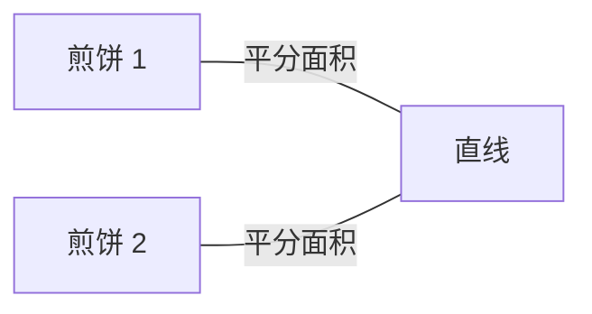
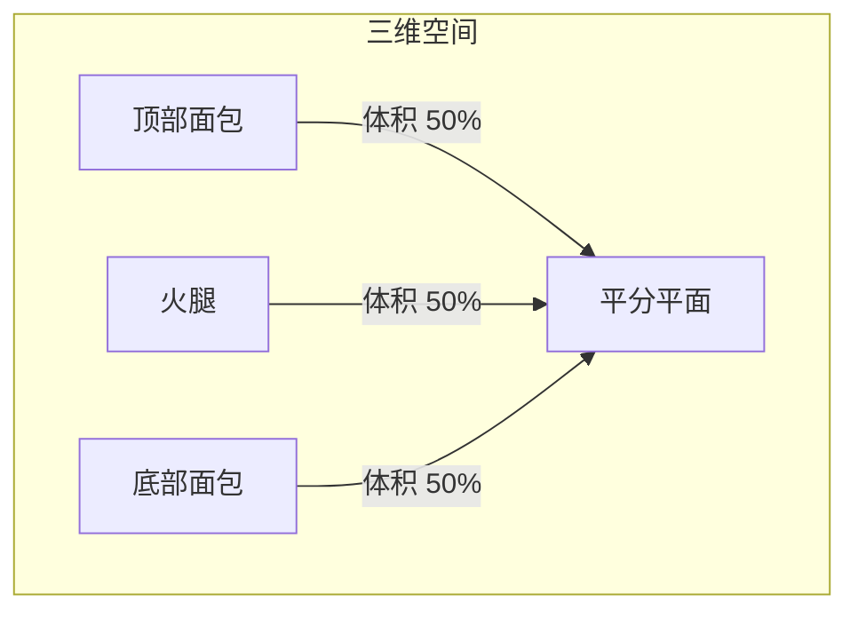
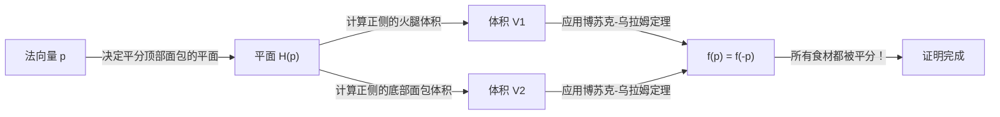
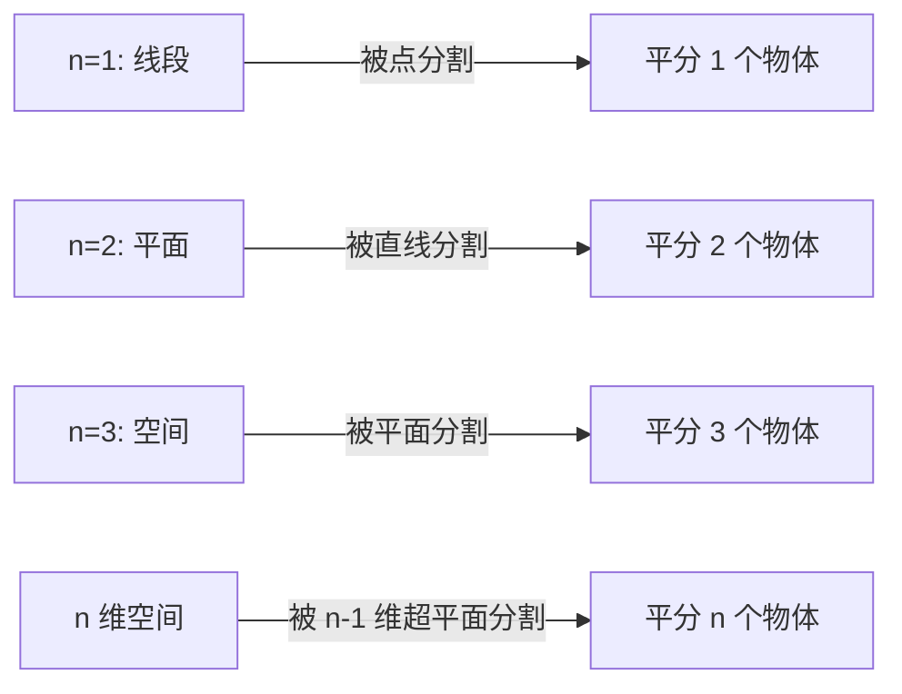

在数学的世界里，有很多以日常事物命名的奇妙定理。其中最著名、也最直观有趣的定理之一就是 **“[火腿三明治定理](https://kenji.blog/zh-cn/p/ham-sandwich-theorem/)（Ham Sandwich Theorem）”**。

当您制作三明治时，您通常会想象两片面包中间夹着一片火腿。这个定理提出了一个令人惊讶的事实：**“无论形状多么扭曲，或者它们在空中如何散落，只需用刀切一次（一个平面），就能完美地同时将两片面包和一片火腿的体积平分。”**

在本文中，我们将详细解释这个[火腿三明治定理](https://kenji.blog/zh-cn/p/ham-sandwich-theorem/)，从直观的理解到其背后的强大代数拓扑学定理——**“博苏克-乌拉姆定理（Borsuk-Ulam Theorem）”**。

## 1. 简介：从日常到数学

想象一下在早餐或午餐时将一个三明治切成两半。你用刀将三明治分成两部分。是否有可能这样切，使得顶部的面包、底部的面包以及里面的火腿这三种食材，都恰好被分成一半的体积？

直观地说，如果面包堆叠得非常整齐，从中间利落地切一刀就足够了。但是，如果有人搞恶作剧，把顶部的面包放在桌子的右边缘，底部的面包放在左边缘，然后把火腿粘在天花板上呢？

令人惊讶的是，根据一个数学定理，**即使在这种情况下，如果你使用一把巨大的刀（一个平面），你仍然可以同时将这三者平分**。这就是“[火腿三明治定理](https://kenji.blog/zh-cn/p/ham-sandwich-theorem/)”的精髓。它对物体的相对位置或形状没有任何要求，它们甚至不需要是单一的连续块。

## 2. 从二维开始：煎饼定理

在考虑三维的[火腿三明治定理](https://kenji.blog/zh-cn/p/ham-sandwich-theorem/)之前，让我们先看看二维（平面）的情况。二维版本有时被称为 **“煎饼定理（Pancake Theorem）”**。

煎饼定理的表述如下：

> 给定平面上的任意两个图形（例如，两个煎饼），总是存在一条直线，可以同时平分这两个图形的面积。

让我们通过图表来说明。

### 直观证明的思路

为什么总是存在这样一条直线？让我们使用连续性的概念来思考。

1. 首先，在平面上画一条指向特定方向（例如，垂直方向）的线。
2. 当你把这条线从左向右平移时，你一定会找到一个恰好平分“煎饼 1”面积的位置（这是微积分中的 **介值定理** 决定的）。
3. 接下来，连续地将这条线的角度 $\theta$ 从 $0^\circ$ 旋转到 $180^\circ$。
4. 在每一个旋转的角度 $\theta$ 下，总是通过平移来调整直线，使其继续平分“煎饼 1”的面积。
5. 与此同时，注意观察另一个“煎饼 2”是如何被划分的。设 $f(\theta)$ 为直线左侧煎饼 2 的面积比例。
6. 在 $\theta = 0^\circ$ 和 $\theta = 180^\circ$ 之间，直线的“左侧”和“右侧”互换了，所以 $f(180^\circ) = 1 - f(0^\circ)$。
7. 如果在 $\theta = 0^\circ$ 时左侧大于一半，那么在 $\theta = 180^\circ$ 时它将小于一半。因为面积比例 $f(\theta)$ 是连续变化的，所以在这个过程中必然存在一个角度使得 $f(\theta) = 0.5$，这意味着“煎饼 2”的面积也被完美地平分了。

这就是为什么在二维情况下你可以同时平分两个物体。

## 3. 扩展到三维：[火腿三明治定理](https://kenji.blog/zh-cn/p/ham-sandwich-theorem/)

现在，我们终于进入三维的故事。当维度增加一时，你可以分割的物体数量也增加一个。

该定理的正式表述如下：

> 对于三维空间 $\mathbb{R}^3$ 中的任意三个有限体积区域 $A, B, C$，至少存在一个平面，可以同时平分这三个区域的体积。

这里的 $A, B, C$ 分别对应“顶部的面包”、“火腿”和“底部的面包”。无论面包多么破碎，甚至火腿飞到了外太空的边缘，一个平面也能将它们全部完美地切成两半。

这个定理的美妙之处在于，对目标物体的形状绝对没有任何限制。它们可以是球体、立方体、带孔的甜甜圈，甚至碎成无数微小的碎片（在数学上，它们只需要是具有有限勒贝格测度的可测集）。

## 4. 背后的强大武器：博苏克-乌拉姆定理

为了在数学上严格证明[火腿三明治定理](https://kenji.blog/zh-cn/p/ham-sandwich-theorem/)，需要用到拓扑学中一个非常重要的定理：**博苏克-乌拉姆定理（Borsuk-Ulam Theorem）**。

### 什么是博苏克-乌拉姆定理？

博苏克-乌拉姆定理的一般表述如下：

> 对于任何连续映射 $f: S^n \to \mathbb{R}^n$，总是存在一个点 $x \in S^n$ 使得 $f(x) = f(-x)$。

这里，$S^n$ 是 $(n+1)$ 维空间中的 $n$ 维球面（例如，$S^2$ 是像我们居住的地球表面一样的普通球面），$\mathbb{R}^n$ 是 $n$ 维[欧几里得](https://kenji.blog/zh-cn/p/euclid/)空间。此外，$x$ 和 $-x$ 指的是球面上的 **对跖点**（穿过中心的直线的两端的点，就像地球上的北极和南极，或者东京和巴西沿海）。

如果我们用熟悉的 $n=2$ 的情况（ $S^2 \to \mathbb{R}^2$ ）来解释这个定理，我们可以陈述以下有趣的事实：

**“在地球上的某个地方，总是存在一对对跖点，它们的温度和气压完全相同。”**

对于一个具有两个连续值的函数 $f(x) = \left( \text{温度}, \text{气压} \right)$ 来说，这意味着地球上相反的两个点 $-x$ 上的值完美匹配。这似乎违背直觉，但这是一个不可动摇的、经过数学证明的事实。

### [火腿三明治定理](https://kenji.blog/zh-cn/p/ham-sandwich-theorem/)的证明概要

[火腿三明治定理](https://kenji.blog/zh-cn/p/ham-sandwich-theorem/)（三维版本）可以使用博苏克-乌拉姆定理 $n=2$ 的情况来证明。下面是其优美证明的概要。

1. 考虑以原点为中心的单位球面 $S^2$ 上的一个点 $p$（这代表平面的法向量，即平面的“方向”）。
2. 当方向 $p$ 固定时，平分“顶部面包”体积的平面就被唯一确定了（我们称之为平面 $H(p)$）。
3. 这个平面 $H(p)$ 同时也划分了“火腿”和“底部面包”。
4. 因此，我们定义一个连续映射 $f: S^2 \to \mathbb{R}^2$ 如下：
   $$ f(p) = \left( \text{平面 } H(p) \text{ 正侧的火腿体积}, \text{平面 } H(p) \text{ 正侧的底部面包体积} \right) $$
5. 如果我们完全反转平面的方向（将 $p$ 变为 $-p$），平面的“正侧”和“负侧”就互换了。因此，正侧的体积和负侧的体积也会互换。
6. 根据博苏克-乌拉姆定理，总是存在一个方向 $p$ 使得 $f(p) = f(-p)$。
7. $f(p) = f(-p)$ 意味着在方向 $p$ 上平面正侧的体积等于在方向 $-p$ 上平面正侧（即原平面的负侧）的体积。这仅仅意味着“火腿”和“底部面包”同时被平分了。
8. 由于平面从一开始就被选择为平分“顶部面包”，所以这三种食材最终都被一个平切成了两半。

## 5. 广义 n 维[火腿三明治定理](https://kenji.blog/zh-cn/p/ham-sandwich-theorem/)

数学家们将这个定理推广到了更高的维度。

> 对于 $n$ 维空间 $\mathbb{R}^n$ 中任意 $n$ 个具有有限勒贝格测度的集合，存在一个 $(n-1)$ 维超平面同时平分它们全部。

换句话说，随着维度的增加，您可以同时平分的物体数量也随之增加。
- $n=1$（线）：用 1 个点平分 1 条线段。
- $n=2$（平面）：用 1 条直线平分 2 个图形的面积（煎饼定理）。
- $n=3$（空间）：用 1 个平面平分 3 个立体的体积（[火腿三明治定理](https://kenji.blog/zh-cn/p/ham-sandwich-theorem/)）。
- $n=4$：用 1 个三维空间同时平分 4 个四维物体的超体积。

这样，这条美丽的法则在任何维度都成立。

## 6. 它有实际用途吗？（计算几何中的应用）

“[火腿三明治定理](https://kenji.blog/zh-cn/p/ham-sandwich-theorem/)”经常被当作纯数学中的一个有趣话题来讲述，但它实际上在 **计算几何** 和 **计算机科学** 等领域有实际应用。

例如，当空间中存在海量数据点（点云）时，有时会使用[火腿三明治定理](https://kenji.blog/zh-cn/p/ham-sandwich-theorem/)的算法版本来有效地划分和处理这些数据。通过同时平分被分类为多个类别的数据，它有助于使用分治法构建高效的数据处理和搜索算法。

## 7. 结语

乍一看，[火腿三明治定理](https://kenji.blog/zh-cn/p/ham-sandwich-theorem/)可能像是一个带有滑稽名字的玩笑，但在现实中，它是现代数学（特别是代数拓扑学）中一个强大定理的优美应用结果。抽象的数学理论通过三明治这样具体和日常的事物表达出来，这无疑是数学迷人的方面之一。

下次你随意切三明治时，可能恰好有那么一瞬间，三种成分巧合地被完美切半。在你的下一个午休时间，当你握住刀时，为什么不让你的思绪飘向高维空间和博苏克-乌拉姆定理呢？
