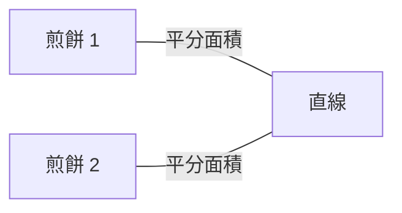
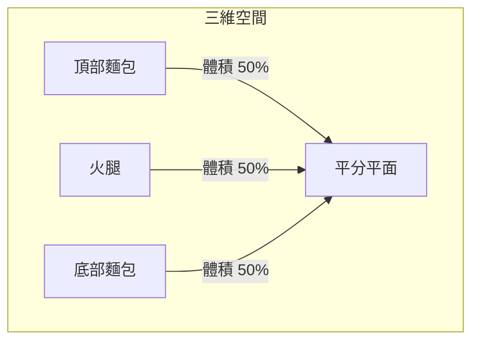
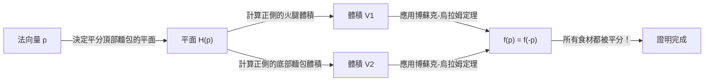
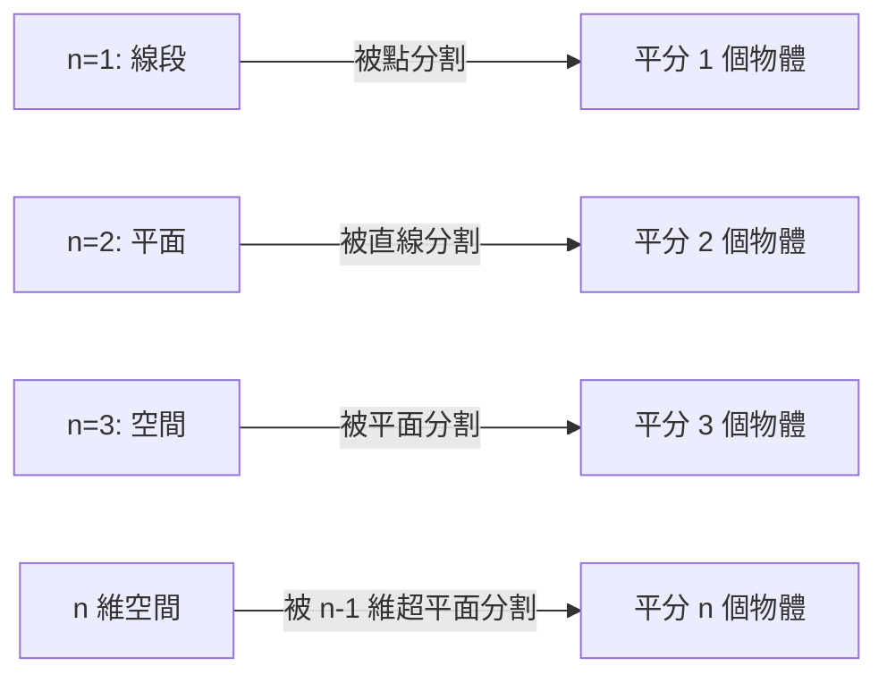

在數學的世界裡，有很多以日常事物命名的奇妙定理。其中最著名、也最直觀有趣的定理之一就是 **「火腿三明治定理（Ham Sandwich Theorem）」**。

當您製作三明治時，您通常會想像兩片麵包中間夾著一片火腿。這個定理提出了一個令人驚訝的事實：**「無論形狀多麼扭曲，或者它們在空中如何散落，只需用刀切一次（一個平面），就能完美地同時將兩片麵包和一片火腿的體積平分。」**

在本文中，我們將詳細解釋這個火腿三明治定理，從直觀的理解到其背後的強大代數拓撲學定理——**「博蘇克-烏拉姆定理（Borsuk-Ulam Theorem）」**。

## 1. 簡介：從日常到數學

想像一下在早餐或午餐時將一個三明治切成兩半。你用刀將三明治分成兩部分。是否有可能這樣切，使得頂部的麵包、底部的麵包以及裡面的火腿這三種食材，都恰好被分成一半的體積？

直觀地說，如果麵包堆疊得非常整齊，從中間俐落地切一刀就足夠了。但是，如果有人搞惡作劇，把頂部的麵包放在桌子的右邊緣，底部的麵包放在左邊緣，然後把火腿黏在天花板上呢？

令人驚訝的是，根據一個數學定理，**即使在這種情況下，如果你使用一把巨大的刀（一個平面），你仍然可以同時將這三者平分**。這就是「火腿三明治定理」的精髓。它對物體的相對位置或形狀沒有任何要求，它們甚至不需要是單一的連續塊。

## 2. 從二維開始：煎餅定理

在考慮三維的火腿三明治定理之前，讓我們先看看二維（平面）的情況。二維版本有時被稱為 **「煎餅定理（Pancake Theorem）」**。

煎餅定理的表述如下：

> 給定平面上的任意兩個圖形（例如，兩個煎餅），總是存在一條直線，可以同時平分這兩個圖形的面積。

讓我們透過圖表來說明。

### 直觀證明的思路

為什麼總是存在這樣一條直線？讓我們使用連續性的概念來思考。

1. 首先，在平面上畫一條指向特定方向（例如，垂直方向）的線。
2. 當你把這條線從左向右平移時，你一定會找到一個恰好平分「煎餅 1」面積的位置（這是微積分中的 **介值定理** 決定的）。
3. 接下來，連續地將這條線的角度 $\theta$ 從 $0^\circ$ 旋轉到 $180^\circ$。
4. 在每一個旋轉的角度 $\theta$ 下，總是透過平移來調整直線，使其繼續平分「煎餅 1」的面積。
5. 與此同時，注意觀察另一個「煎餅 2」是如何被劃分的。設 $f(\theta)$ 為直線左側煎餅 2 的面積比例。
6. 在 $\theta = 0^\circ$ 和 $\theta = 180^\circ$ 之間，直線的「左側」和「右側」互換了，所以 $f(180^\circ) = 1 - f(0^\circ)$。
7. 如果在 $\theta = 0^\circ$ 時左側大於一半，那麼在 $\theta = 180^\circ$ 時它將小於一半。因為面積比例 $f(\theta)$ 是連續變化的，所以在這個過程中必然存在一個角度使得 $f(\theta) = 0.5$，這意味著「煎餅 2」的面積也被完美地平分了。

這就是為什麼在二維情況下你可以同時平分兩個物體。

## 3. 擴展到三維：火腿三明治定理

現在，我們終於進入三維的故事。當維度增加一時，你可以分割的物體數量也增加一個。

該定理的正式表述如下：

> 對於三維空間 $\mathbb{R}^3$ 中的任意三個有限體積區域 $A, B, C$，至少存在一個平面，可以同時平分這三個區域的體積。

這裡的 $A, B, C$ 分別對應「頂部的麵包」、「火腿」和「底部的麵包」。無論麵包多麼破碎，甚至火腿飛到了外太空的邊緣，一個平面也能將它們全部完美地切成兩半。

這個定理的美妙之處在於，對目標物體的形狀絕對沒有任何限制。它們可以是球體、立方體、帶孔的甜甜圈，甚至碎成無數微小的碎片（在數學上，它們只需要是具有有限勒貝格測度的可測集）。

## 4. 背後的強大武器：博蘇克-烏拉姆定理

為了在數學上嚴格證明火腿三明治定理，需要用到拓撲學中一個非常重要的定理：**博蘇克-烏拉姆定理（Borsuk-Ulam Theorem）**。

### 什麼是博蘇克-烏拉姆定理？

博蘇克-烏拉姆定理的一般表述如下：

> 對於任何連續映射 $f: S^n \to \mathbb{R}^n$，總是存在一個點 $x \in S^n$ 使得 $f(x) = f(-x)$。

這裡，$S^n$ 是 $(n+1)$ 維空間中的 $n$ 維球面（例如，$S^2$ 是像我們居住的地球表面一樣的普通球面），$\mathbb{R}^n$ 是 $n$ 維歐幾里得空間。此外，$x$ 和 $-x$ 指的是球面上的 **對蹠點**（穿過中心的直線的兩端的點，就像地球上的北極和南極，或者東京和巴西沿海）。

如果我們用熟悉的 $n=2$ 的情況（ $S^2 \to \mathbb{R}^2$ ）來解釋這個定理，我們可以陳述以下有趣的事實：

**「在地球上的某個地方，總是存在一對對蹠點，它們的溫度和氣壓完全相同。」**

對於一個具有兩個連續值的函數 $f(x) = \left( \text{溫度}, \text{氣壓} \right)$ 來說，這意味著地球上相反的兩個點 $-x$ 上的值完美匹配。這似乎違背直覺，但這是一個不可動搖的、經過數學證明的事實。

### 火腿三明治定理的證明概要

火腿三明治定理（三維版本）可以使用博蘇克-烏拉姆定理 $n=2$ 的情況來證明。下面是其優美證明的概要。

1. 考慮以原點為中心的單位球面 $S^2$ 上的一個點 $p$（這代表平面的法向量，即平面的「方向」）。
2. 當方向 $p$ 固定時，平分「頂部麵包」體積的平面就被唯一確定了（我們稱之為平面 $H(p)$）。
3. 這個平面 $H(p)$ 同時也劃分了「火腿」和「底部麵包」。
4. 因此，我們定義一個連續映射 $f: S^2 \to \mathbb{R}^2$ 如下：
   $$ f(p) = \left( \text{平面 } H(p) \text{ 正側的火腿體積}, \text{平面 } H(p) \text{ 正側的底部麵包體積} \right) $$
5. 如果我們完全反轉平面的方向（將 $p$ 變為 $-p$），平面的「正側」和「負側」就互換了。因此，正側的體積和負側的體積也會互換。
6. 根據博蘇克-烏拉姆定理，總是存在一個方向 $p$ 使得 $f(p) = f(-p)$。
7. $f(p) = f(-p)$ 意味著在方向 $p$ 上平面正側的體積等於在方向 $-p$ 上平面正側（即原平面的負側）的體積。這僅僅意味著「火腿」和「底部麵包」同時被平分了。
8. 由於平面從一開始就被選擇為平分「頂部麵包」，所以這三種食材最終都被一個平切成了兩半。

## 5. 廣義 n 維火腿三明治定理

數學家們將這個定理推廣到了更高的維度。

> 對於 $n$ 維空間 $\mathbb{R}^n$ 中任意 $n$ 個具有有限勒貝格測度的集合，存在一個 $(n-1)$ 維超平面同時平分它們全部。

換句話說，隨著維度的增加，您可以同時平分的物體數量也隨之增加。
- $n=1$（線）：用 1 個點平分 1 條線段。
- $n=2$（平面）：用 1 條直線平分 2 個圖形的面積（煎餅定理）。
- $n=3$（空間）：用 1 個平面平分 3 個立體的體積（火腿三明治定理）。
- $n=4$：用 1 個三維空間同時平分 4 個四維物體的超體積。

這樣，這條美麗的法則在任何維度都成立。

## 6. 它有實際用途嗎？（計算幾何中的應用）

「火腿三明治定理」經常被當作純數學中的一個有趣話題來講述，但它實際上在 **計算幾何** 和 **計算機科學** 等領域有實際應用。

例如，當空間中存在海量資料點（點雲）時，有時會使用火腿三明治定理的演算法版本來有效地劃分和處理這些資料。透過同時平分被分類為多個類別的資料，它有助於使用分治法構建高效的資料處理和搜尋演算法。

## 7. 結語

乍看之下，火腿三明治定理可能像是一個帶有滑稽名字的玩笑，但在現實中，它是現代數學（特別是代數拓撲學）中一個強大定理的優美應用結果。抽象的數學理論透過三明治這樣具體和日常的事物表達出來，這無疑是數學迷人的方面之一。

下次你隨意切三明治時，可能恰好有那麼一瞬間，三種成分巧合地被完美切半。在你的下一個午休時間，當你握住刀時，為什麼不讓你的思緒飄向高維空間和博蘇克-烏拉姆定理呢？
