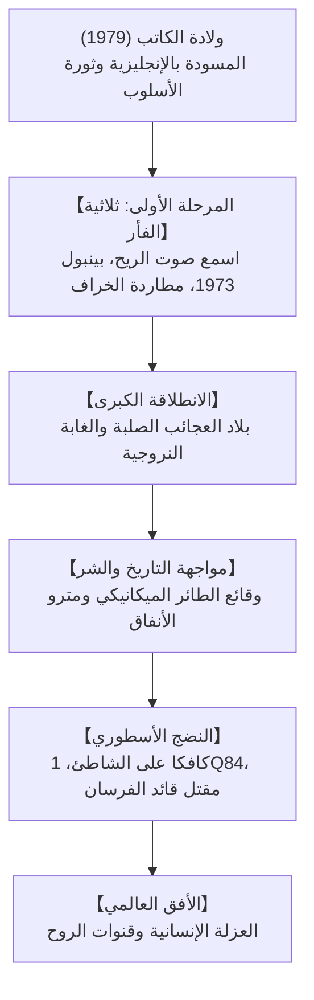

## مقدمة: هاروكي موراكامي في الأدب العالمي

يعد هاروكي موراكامي (ولد عام 1949) أحد أكثر الروائيين المعاصرين مقروئية وتأثيراً في العالم. تُرجمت أعماله إلى أكثر من خمسين لغة، واستطاعت أن تلامس وجدان ملايين القراء حول العالم لأنها تعبر عن عزلة الإنسان الحديث، وتصدع الهوية، والألم الدفين في اللاوعي.

## 1. إلهام الملعب والتحول الأسلوبي
بينما كان يدير مقهى لموسيقى الجاز في طوكيو، جاءه إلهام الكتابة فجأة أثناء مشاهدة مباراة بيسبول عام 1978. ولكي يتحرر من قيود اللغة اليابانية الكلاسيكية الثقيلة، كتب بدايات نصوصه بآلة كاتبة إنجليزية ثم ترجمها إلى اليابانية، مبتكراً أسلوباً انسيابياً مفعماً بإيقاع الجاز.

## 2. ثلاثية الفأر: الفقد والانسحاب
في روايات «اسمع صوت الريح» (1979)، «بينبول 1973» (1980)، و«مطاردة الخراف الجامحة» (1982)، يصور موراكامي مرارة انقضاء الشباب وخيبة أمل جيل ما بعد الحركات الطلابية، وصولاً إلى تضحية الصديق الملقب بـ «الفأر» لمقاومة قوى الهيمنة.

## 3. الروائع الخالدة: *الغابة النروجية*
- **بلاد العجائب الصلبة ونهاية العالم (1985)**: بنية روائية بارعة تتنقل بين طوكيو المستقبلية ومدينة خيالية هادئة محاطة بأسوار عالية حيث تعيش حيوانات أحادي القرن وتُفصل الظلال عن الأجساد.
- **الغابة النروجية (1987)**: الرواية الواقعية المؤثرة التي حطمت أرقام المبيعات القياسية برصدها مشاعر الحب والفقد والانتحار لدى الشباب الجامعي.

## 4. الذاكرة التاريخية: *وقائع الطائر الميكانيكي*
في التسعينيات، التزم موراكامي بمواجهة جراح التاريخ. ينزل البطل تورو أوكادا إلى قاع بئر جافة ومظلمة بحثاً عن زوجته المفقودة، ليتشابك ألمه الشخصي مع فظائع الجيش الياباني في منشوريا.

## 5. *كافكا على الشاطئ* و *1Q84*
تعيد «كافكا على الشاطئ» (2002) صياغة لعنة أوديب مع الفتى الهارب كافكا والعجوز ناكاتا. بينما تقدم «1Q84» (2009-2010) ملحمة كبرى في عالم يضيئه قمران، حيث ينتصر الحب الصادق على بطش الجماعات الشمولية.
الآبار الجافة، الأسوار العالية، وموسيقى الجاز والطبخ تشكل ركائز روحية تحمي الذات من الانهيار.

## خاتمة: الوقوف دائماً إلى جانب البيضة
في خطابه الشهير في القدس عام 2009، قال موراكامي: «بين جدار عالٍ صلب وبيضة تنكسر عليه، سأقف دائماً إلى جانب البيضة». تظل رواياته شعلة دافئة تضيء سراديب الروح الإنسانية في كل مكان.
