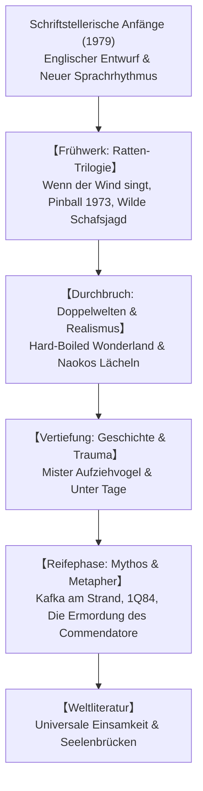

## Einleitung: Haruki Murakami als Phänomen der Weltliteratur

Haruki Murakami (geb. 1949) gehört zu den weltweit meistgelesenen und einflussreichsten Autoren der Gegenwart. Seine Romane, übersetzt in über 50 Sprachen, berühren eine universelle existenzielle Saite: die fundamentale Einsamkeit des Individuums in der modernen Leistungsgesellschaft, die Suche nach Identität und die Konfrontation mit verborgenen historischen Traumata.

## 1. Die Jingu-Stadion-Erleuchtung und der Stilumbruch
Nach Jahren als Betreiber einer Tokioter Jazzbar erlebte Murakami 1978 bei einem Baseballspiel die plötzliche Eingebung, Schriftsteller zu werden. Um sich von der schwerfälligen japanischen Literaturtradition zu lösen, schrieb er den Beginn seines Debüts auf einer englischen Schreibmaschine und übersetzte ihn ins Japanische. So entstand sein unverkennbar klarer, rhythmischer und moderner Stil.

## 2. Die Ratten-Trilogie: Distanz und Abschied
In *Wenn der Wind singt* (1979), *Pinball 1973* (1980) und *Wilde Schafsjagd* (1982) erforscht Murakami die melancholische Melancholie der Post-68er-Generation. Der Protagonist „Boku“ begegnet der geheimnisvollen Gestalt der „Ratte“, die sich am Ende opfert, um ein totalitäres Wesen (das Schaf) aufzuhalten.

## 3. Meisterwerke: *Hard-Boiled Wonderland* und *Naokos Lächeln*
- **Hard-Boiled Wonderland und das Ende der Welt (1985)**: Geniale Verflechtung zweier Welten – einem futuristischen Cyber-Tokio und einer zeitlosen, von Einhörnern bewohnten Stadt ohne Schatten.
- **Naokos Lächeln / Norwegian Wood (1987)**: Murakamis realistischer Sensationserfolg über Liebe, Verlust und Suizid unter japanischen Studenten der späten 1960er Jahre.

## 4. Konfrontation mit der Geschichte: *Mister Aufziehvogel*
Mit *Mister Aufziehvogel* (1994–1995) wandte sich Murakami dem gesellschaftlichen Engagement zu. Der Abstieg in einen ausgetrockneten Brunnen führt den Helden zu den Gräueltaten des japanischen Militarismus in der Mandschurei und zum Duell mit dem bösartigen Politiker Wataya.

## 5. Spätwerk und Leitmotive: *Kafka am Strand* und *1Q84*
*Kafka am Strand* (2002) verknüpft die Flucht eines 15-jährigen Jungen mit dem katzenverstehenden Nakata. *1Q84* (2009–2010) entfaltet ein Monumentalwerk um zwei Monde, Sekten und die rettende Kraft der Liebe.
Wiederkehrende Motive wie Brunnen, hohe Mauern, Jazz und Nudelkochen fungieren als seelische Anker gegen den Abgrund des Wahnsinns.

## Fazit: Auf der Seite des Eis
In seiner berühmten Rede in Jerusalem 2009 bekannte Murakami: „Zwischen einer hohen, festen Mauer und einem Ei, das daran zerschellt, stehe ich immer auf der Seite des Eis.“ Seine Romane sind unvergängliche Lichter in den dunklen Winkeln der menschlichen Seele.
