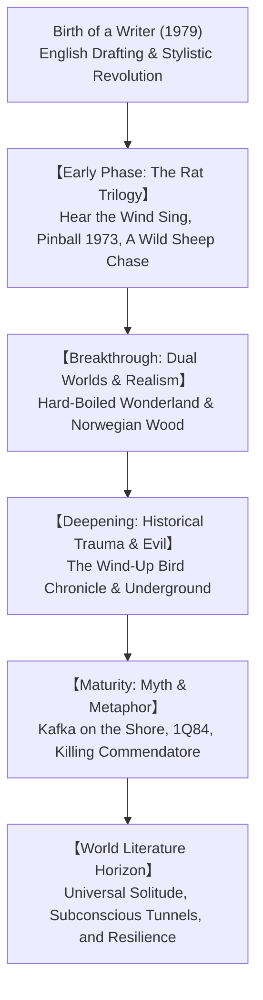

## Introduction: Haruki Murakami as World Literature

Haruki Murakami (born 1949) stands as one of the most widely read and intensely debated authors in contemporary world literature. Translated into more than fifty languages, his fiction resonates across cultural, linguistic, and generational boundaries—from Tokyo and New York to Paris, Berlin, Seoul, and São Paulo.

Murakami's enduring global appeal lies in his ability to articulate universal existential conditions: the profound loneliness of the individual in advanced capitalist societies, the fragility of identity, the insidious nature of systemic violence, and the yearning for spiritual connection. Blending melancholic realism with surreal magical realism, dry humor, jazz rhythms, and culinary domesticity, Murakami has created a distinctive literary cosmos.

## Chapter 1: The Epiphany at Jingu Stadium and Stylistic Revolution
Born in Kyoto and raised in Kobe, Murakami ran a jazz bar named "Peter Cat" in Tokyo after college. His literary vocation arrived like a secular revelation on April 1, 1978, at Jingu Stadium: watching an American batter hit a double, he was seized by the conviction that he could write a novel.

Struggling with the emotional density of conventional Japanese prose, Murakami conducted a daring experiment: he drafted the opening of *Hear the Wind Sing* on an English typewriter, then translated it back into Japanese. This constraint stripped away baroque ornamentation, forging a lucid, rhythmic, and modern voice. Winning the Gunzo Prize in 1979, Murakami immediately disrupted Japan's traditional literary establishment.

## Chapter 2: The Early Trilogy of the Rat: Detachment and Loss
1. **Hear the Wind Sing (1979)**: Spanning eighteen days in August 1970, the narrator ("Boku") and his friend the Rat drink beer at J's Bar amidst the wreckage of failed 1960s student protests. Characterized by emotional detachment and ephemeral encounters.
2. **Pinball, 1973 (1980)**: Meditates on nostalgic mourning as the narrator searches for a lost three-flipper pinball machine, while the Rat prepares to leave their seaside town.
3. **A Wild Sheep Chase (1982)**: The pivotal leap into narrative ambition. Threatened by a shadowy right-wing syndicate, the narrator embarks on an odyssey to snowy Hokkaido to find a demonic sheep with a star-shaped mark. The Rat chooses suicide to prevent the totalitarian spirit of the sheep from possessing him, concluding the trilogy with tragic sacrifice.

## Chapter 3: Dual Worlds and Realism: *Hard-Boiled Wonderland* and *Norwegian Wood*
- **Hard-Boiled Wonderland and the End of the World (1985)**: A masterpiece of dual narrative architecture. Odd chapters follow a human data-processor ("Calcutec") trapped in futuristic subterranean Tokyo; even chapters depict a peaceful, walled town where unicorns graze and shadows are severed. The town is revealed to be the protagonist's own subconscious; choosing responsibility over escapism, his core self remains within the wall.
- **Norwegian Wood (1987)**: Murakami's straight realistic romance that became an international publishing phenomenon selling millions of copies. Toru Watanabe navigates the suicide of his best friend Kizuki, torn between the emotionally fragile Naoko and the vibrant, life-affirming Midori.

## Chapter 4: Historical Horror and Evil: *The Wind-Up Bird Chronicle*
Published in the mid-1990s, this magnum opus marked Murakami's transition from "detachment" to "commitment." Toru Okada's search for his missing wife Kumiko leads him to sit in the absolute darkness of a dry well. This descent into the subconscious connects private grief with the atrocities of imperial Japanese history—the Nomonhan Incident, Unit 731, and the Battle of Lake Khasan. Okada confronts Noboru Wataya, a charismatic politician embodying systemic evil.

Murakami's non-fiction investigation *Underground* (1997)—interviewing sixty survivors of the Aum Shinrikyo sarin gas attack—deepened his exploration of religious cults and societal malaise.

## Chapter 5: Metaphors of Salvation: *Kafka on the Shore* and *1Q84*
- **Kafka on the Shore (2002)**: Weaves together the odyssey of fifteen-year-old runaway Kafka Tamura, cursed with an Oedipal fate by his sinister sculptor father, and Nakata, an illiterate elderly man who talks to cats. Opening the "entrance stone," both characters transcend psychic trauma in a realm beyond time.
- **1Q84 (2009–2010)**: A monumental three-volume epic set in a parallel 1984 under two moons. Assassin Aomame and mathematics teacher Tengo uncover the sinister religious cult Sakigake and the subterranean "Little People." Their childhood love becomes an unyielding thread of salvation through totalitarian darkness.

## Chapter 6: Late Masterpieces: *Killing Commendatore* and *The City and Its Uncertain Walls*
In *Killing Commendatore* (2017), an unnamed portrait painter discovers a hidden canvas in an attic, confronting an embodied Idea (the Commendatore) and traversing the horrors of the 1938 Anschluss and the Nanjing Massacre. In *The City and Its Uncertain Walls* (2023), Murakami revisits his 1980 novella, meditating on aging, phantom libraries, and the boundaries separating reality from the soul's sanctuaries.

## Chapter 7: The Master Key to Murakami's Motifs
- **Wells and Underground Passages**: Vertical descents into the collective unconscious and repressed historical memory.
- **High Walls**: Boundaries separating ego from shadow, protection from imprisonment.
- **Music (Jazz, Classical, Pop)**: Magical tuning forks that summon lost memories and awaken hidden dimensions.
- **Culinary Rituals**: Slicing vegetables, boiling pasta, and ironing shirts serve as protective domestic anchors grounding the self against encroaching chaos.

## Conclusion: Lighting a Candle in the Soul's Darkness
In his celebrated 2009 Jerusalem Prize address, Murakami stated:
> "Between a high, solid wall and an egg that breaks against it, I will always stand on the side of the egg."

The wall symbolizes the crushing apparatus of state power, war, and ideological systems; the egg represents the fragile, irreplaceable human soul. Through decades of storytelling, Haruki Murakami has lit a quiet candle in the deep basement of the human spirit, offering solace to lonely souls across the globe.
