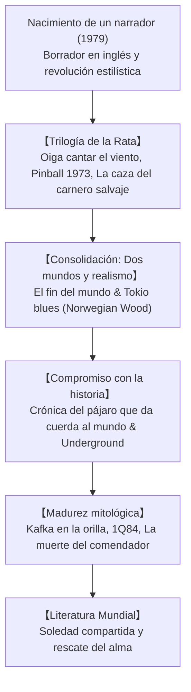

## Introducción: Haruki Murakami como fenómeno de la literatura universal

Haruki Murakami (1949) es uno de los autores contemporáneos más leídos en todo el mundo. Sus historias conectan profundamente con lectores de todas las culturas al plasmar la soledad en las urbes modernas, la pérdida de sentido, los ecos traumáticos de la historia y el misterioso umbral que comunica la vigilia con el inconsciente.

## 1. La epifanía del estadio y el estilo narrativo
Mientras gestionaba un club de jazz en Tokio, Murakami sintió en 1978 la súbita certeza de que podía escribir una novela. Para romper con la tradición literaria japonesa, redactó el inicio en inglés antes de verterlo a su idioma nativo, creando una prosa limpia, melódica y desprovista de artificios.

## 2. La Trilogía de la Rata: Melancolía y pérdida
*Oiga cantar el viento* (1979), *Pinball 1973* (1980) y *La caza del carnero salvaje* (1982) retratan el desencanto juvenil tras los movimientos estudiantiles de los años sesenta, culminando con el sacrificio del amigo «el Rata» frente a una fuerza totalitaria.

## 3. Obras maestras: *El fin del mundo* y *Tokio blues*
- **El fin del mundo y un fin del mundo despiadado (1985)**: Asombrosa estructura dual entre un Tokio de ciencia ficción subterránea y una apacible ciudad amurallada donde pastan unicornios y se separan las sombras.
- **Tokio blues / Norwegian Wood (1987)**: Novela realista que conmocionó a millones de lectores mediante la historia de amor, pérdida y duelo entre Toru, la atormentada Naoko y la vivaz Midori.

## 4. Memoria histórica y horror: *Crónica del pájaro que da cuerda al mundo*
En los años noventa, Murakami asumió un compromiso moral con el pasado bélico japonés. Toru Okada desciende al fondo de un pozo seco para rescatar a su esposa, conectando su drama personal con las atrocidades militares en Manchuria (Nomonhan).

## 5. Obras mayores: *Kafka en la orilla* y *1Q84*
*Kafka en la orilla* (2002) combina la maldición edípica del joven Kafka con la bondad ingenua del anciano Nakata. En *1Q84* (2009-2010), Aomame y Tengo buscan reencontrarse bajo el cielo de dos lunas frente a sectas fanáticas.
Pozos secos, gatos misteriosos, música clásica y platos de pasta cotidiana operan como anclas ante el abismo.

## Conclusión: Siempre del lado del huevo
En su célebre discurso de Jerusalén en 2009, Murakami afirmó: «Entre una pared alta y dura y un huevo que se estrella contra ella, siempre estaré del lado del huevo». Su literatura sigue siendo una luz cálida en la penumbra de la condición humana.
