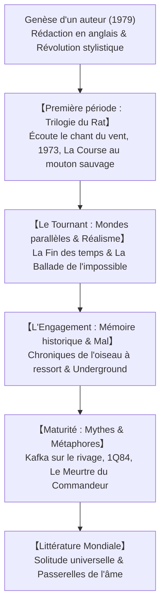

## Introduction : Haruki Murakami et la littérature mondiale

Haruki Murakami (né en 1949) s'impose comme une figure majeure de la littérature mondiale. Traduits dans plus de cinquante langues, ses livres résonnent auprès de millions de lecteurs parce qu'ils explorent la solitude moderne, la fragilité de la mémoire, les traumatismes de l'histoire et les passages secrets entre le quotidien et l'inconscient.

## 1. L'illumination du stade et la révolution du style
Propriétaire d'un club de jazz à Tokyo, Murakami décide brusquement d'écrire en 1978. Pour échapper aux lourdeurs du japonais académique, il rédige ses premières pages sur une machine à écrire anglaise avant de les traduire en japonais. Ce détour produit une prose fluide, dénuée d'artifices et rythmée par le tempo du jazz.

## 2. La Trilogie du Rat : Mélancolie et détachement
Dans *Écoute le chant du vent* (1979), *Flipper, 1973* (1980) et *La Course au mouton sauvage* (1982), Murakami met en scène son narrateur fétiche (« Boku ») et son double, le Rat, confrontés au deuil de la jeunesse et à l'ombre menaçante d'un pouvoir autoritaire.

## 3. Les chefs-d'œuvre fondateurs
- **La Fin des temps (1985)** : Roman magistral à double hélice alternant entre un Tokyo cyberpunk et une cité close protégée par une haute muraille où paissent des licornes.
- **La Ballade de l'impossible / Norwegian Wood (1987)** : Grand roman réaliste sur le suicide, l'amour et l'entrée dans l'âge adulte, qui propulse Murakami au rang de star internationale.

## 4. L'exploration du Mal : *Chroniques de l'oiseau à ressort*
Dans les années 1990, Murakami s'engage dans la mémoire collective. Toru Okada s'isole au fond d'un puits asséché pour retrouver sa femme disparue. Cette plongée intime rejoint les atrocités de la guerre en Mandchourie (incident de Nomonhan) et affronte le mal absolu incarné par Noboru Wataya.

## 5. Mythes modernes : *Kafka sur le rivage* et *1Q84*
*Kafka sur le rivage* (2002) réinvente le mythe d'Œdipe à travers le périple d'un adolescent de quinze ans et du vieux Nakata. *1Q84* (2009-2010) déploie une fresque grandiose sous deux lunes, défiant les sectes fanatiques grâce à la puissance invincible de l'amour.

## Conclusion : Se tenir du côté de l'œuf
Dans son discours de Jérusalem en 2009, Murakami déclarait : « Entre un mur haut et solide et un œuf qui se brise dessus, je choisirai toujours d'être du côté de l'œuf. » Ses romans demeurent des refuges bienveillants où chaque lecteur solitaire peut trouver une étincelle de réconfort.
