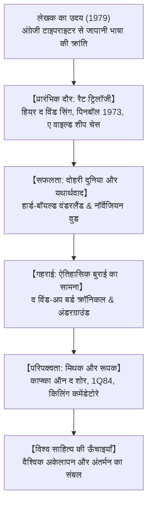

## प्रस्तावना: विश्व साहित्य में हारुकी मुराकामी

हारुकी मुराकामी (जन्म 1949) समकालीन विश्व साहित्य के सबसे लोकप्रिय और प्रभावशाली लेखकों में से एक हैं। 50 से अधिक भाषाओं में अनूदित उनकी रचनाएँ आधुनिक जीवन के अकेलेपन, पहचान के संकट, ऐतिहासिक घावों और अवचेतन मन की गहराइयों को छूती हैं।

## 1. स्टेडियम की प्रेरणा और अनूठी शैली
टोक्यो में जैज़ कैफे चलाने वाले मुराकामी को 1978 में एक बेसबॉल मैच देखते हुए अचानक उपन्यास लिखने की प्रेरणा मिली। पारंपरिक जापानी भाषा के बोझिलपन से बचने के लिए उन्होंने पहले अंग्रेजी में लिखा और फिर उसका जापानी में अनुवाद किया, जिससे उनकी सरल और लयबद्ध शैली बनी।

## 2. रैट ट्रिलॉजी और अलगाव का दौर
*हियर द विंड सिंग* (1979), *पिनबॉल, 1973* (1980) और *ए वाइल्ड शीप चेस* (1982) में 1960 के दशक के छात्र आंदोलनों के बाद की निराशा और खोई हुई युवावस्था के दर्द को उकेरा गया है।

## 3. *नॉर्वेजियन वुड* और वैश्विक सफलता
- **हार्ड-बॉयल्ड वंडरलैंड (1985)**: दो समानांतर दुनियाओं की कहानी जिसमें एक तरफ साइबर टोक्यो है और दूसरी तरफ यूनिकॉर्न वाला शहर।
- **नॉर्वेजियन वुड (1987)**: प्रेम, अवसाद और आत्महत्या के इर्द-गिर्द बुना गया यथार्थवादी उपन्यास जिसने मुराकामी को अंतरराष्ट्रीय ख्याति दिलाई।

## 4. ऐतिहासिक दर्द: *द विंड-अप बर्ड क्रॉनिकल*
1990 के दशक में मुराकामी ने सामाजिक सरोकारों की ओर रुख किया। तोरू ओकाडा अपनी खोई हुई पत्नी को ढूँढने के लिए सूखे कुएँ में उतरता है, जहाँ उसका निजी दुख मंचूरिया में जापानी सेना के युद्ध अपराधों से जुड़ जाता है।

## 5. *काफ्का ऑन द शोर* और *1Q84*
*काफ्का ऑन द शोर* (2002) में 15 वर्षीय काफ्का तामुरा और बिल्लियों से बात करने वाले नाकाता की यात्रा है। *1Q84* (2009-2010) दो चंद्रमाओं वाली रहस्यमयी दुनिया में प्रेम और अधिनायकवादी पंथ के बीच संघर्ष की महागाथा है।
सूखे कुएँ, ऊँची दीवारें, जैज़ संगीत और पास्ता बनाना जीवन को थामे रखने वाले महत्वपूर्ण प्रतीक हैं।

## निष्कर्ष: दीवार और अंडे का रूपक
2009 में यरुशलम पुरस्कार भाषण में मुराकामी ने कहा था: "एक ऊँची, कठोर दीवार और उससे टकराकर टूटने वाले अंडे के बीच, मैं हमेशा अंडे के साथ खड़ा रहूँगा।" उनकी कहानियाँ दुनिया भर के अकेले दिलों के लिए अंधेरे में जलती मोमबत्ती की तरह हैं।
