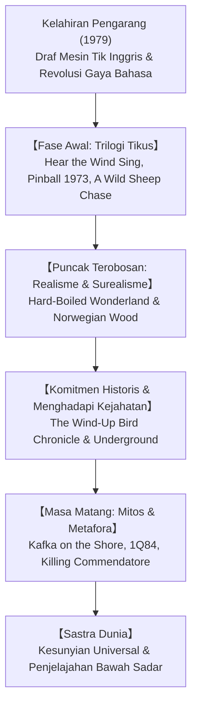

## Pengantar: Haruki Murakami dalam Kancah Sastra Dunia

Haruki Murakami (lahir 1949) merupakan salah satu novelis kontemporer yang paling luas dibaca dan memikat pembaca di seluruh dunia. Diterjemahkan ke dalam lebih dari lima puluh bahasa, fiksi Murakami berbicara tentang kesendirian mendalam manusia modern, kerapuhan identitas, dan batas antara kenyamanan sehari-hari dengan alam bawah sadar yang penuh misteri.

## 1. Wahyu di Stadion Jingu dan Revolusi Bahasa
Ketika mengelola kafe jazz di Tokyo, Murakami mendapatkan ilham tiba-tiba saat menonton pertandingan bisbol pada 1978. Untuk melepaskan diri dari gaya bahasa sastra Jepang klasik yang kaku, ia mengetik draf awalnya dalam bahasa Inggris sebelum menerjemahkannya kembali ke bahasa Jepang. Proses ini melahirkan gaya bercerita yang ringkas, berirama jazz, dan modern.

## 2. Trilogi Tikus: Kehilangan dan Keterasingan
Dalam *Hear the Wind Sing* (1979), *Pinball, 1973* (1980), dan *A Wild Sheep Chase* (1982), tokoh "Aku" menghadapi masa muda yang memudar dan kehilangan sahabatnya yang dijuluki si Tikus, yang akhirnya mengorbankan diri demi menghentikan kekuatan jahat.

## 3. *Hard-Boiled Wonderland* dan *Norwegian Wood*
- **Hard-Boiled Wonderland and the End of the World (1985)**: Mahakarya dua alur cerita yang mempertemukan Tokyo futuristik bawah tanah dengan kota bertembok tinggi tempat berkeliarannya unicorn.
- **Norwegian Wood (1987)**: Novel romansa realistis yang meledak di pasar dunia, menceritakan cinta, kehilangan, dan duka cita Toru Watanabe di tengah bunuh diri sahabat dan kekasihnya.

## 4. Sejarah dan Kegelapan: *The Wind-Up Bird Chronicle*
Pada era 1990-an, Murakami beralih ke komitmen sosial. Toru Okada turun ke dasar sumur kering yang gelap demi mencari istrinya yang hilang. Penjelajahan batin ini bersilangan dengan sejarah kekejaman militer Jepang di Manchuria (Insiden Nomonhan).

## 5. *Kafka on the Shore* dan *1Q84*
*Kafka on the Shore* (2002) mempertemukan kutukan Oedipus pemuda Kafka Tamura dengan Nakata, kakek yang bisa berbicara dengan kucing. *1Q84* (2009–2010) menyajikan epik tandingan dengan dua bulan di langit malam, di mana cinta sejati melawan kendali sekte totaliter.
Motif sumur kering, dinding tinggi, musik klasik, dan memasak pasta berfungsi sebagai jangkar penyelamat jiwa manusia.

## Kesimpulan: Selalu Berpihak pada Telur
Dalam pidato Penghargaan Yerusalem 2009, Murakami menegaskan: "Di antara dinding yang tinggi dan keras serta telur yang pecah membenturnya, aku akan selalu berdiri di pihak telur." Cerita-cerita Murakami menjadi lilin penerang bagi jiwa-jiwa yang sunyi di seluruh dunia.
