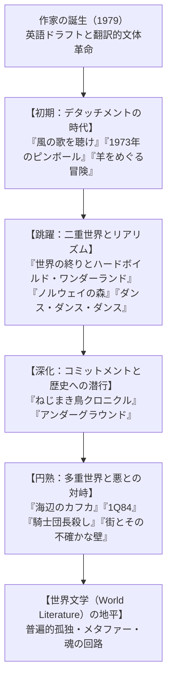
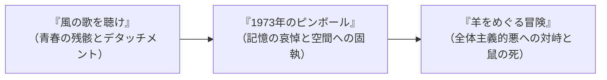
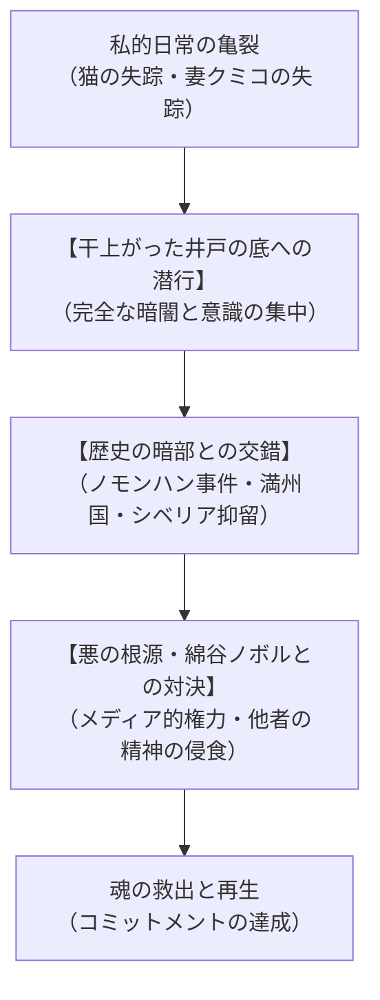
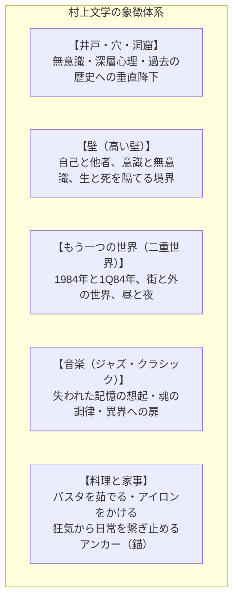

## 序論：世界文学としての村上春樹――グローバルな孤独と共振する物語

20世紀末から21世紀初頭にかけて、世界の文壇において最も広範に読まれ、最も熱狂的な支持と批評的議論を巻き起こし続けている作家の一人が村上春樹（1949〜）である。彼の作品は世界50以上の言語に翻訳され、東京、ニューヨーク、パリ、ベルリン、北京、ソウル、モスクワ、サンパウロに至るまで、国境、言語、文化的差異を軽々と越えて無数の読者の魂を捉えて離さない。

村上春樹の文学は、なぜこれほどまでにグローバルな普遍性を持つのか。それは、彼が描き出す主題が、近代化と資本主義の高度化の果てに人類が直面せざるを得なくなった**「個の根源的な孤独」「自己同一性の不確かさ」「歴史の暗部から立ち現れる暴力と悪」、そして「失われたものへの静謐な哀悼と再生への祈り」**という、人類共通の実存的深層に直結しているからに他ならない。

乾いた都会的なユーモアとスタイリッシュな比喩、ジャズやクラシック音楽の心地よいリズム、料理や衣服の細やかな手触り、そして日常の裂け目から突如として口を開ける「もう一つの世界（異界）」への滑降。村上春樹は、リアリズムとマジックリアリズムを独自の洗練された文体で融合させ、世界文学の歴史に決定的な金字塔を打ち立てた。

本稿では、村上春樹の作家としての誕生から、初期・中期・後期の全主要長編小説の徹底解題、短編・ノンフィクション・翻訳の達成、反復される象徴的モチーフの精神分析的・物語論的読解、そして世界文学としての受容と評価に至るまで、村上春樹の広大無辺な文学宇宙を包括的かつ学術的深度をもって解読する。

## 第1章：作家・村上春樹の誕生――ジャズ喫茶から神宮球場の啓示へ

### 1.1 神宮球場、外野席の啓示
1949年1月12日、京都市伏見区に生まれ、西宮・芦屋で育った村上春樹は、国語教師であった両親のもとで、幼少期より河出書房の『世界文学全集』などを乱読し、十代の頃から海外ペーパーバックを原書で読み耽る早熟な読書体験を持っていた。早稲田大学第一文学部演劇科に進学したものの、折からの全共闘運動・大学紛争の嵐の中で授業は長期にわたりストライキとなり、村上は政治セクトの教条的な言葉のインフレーションに強い違和感を抱き、距離を置いた。

在学中に結婚した村上は、卒業前年の1974年、東京・国分寺（後に千駄ヶ谷へ移転）にジャズ喫茶「ピーター・キャット」を開業した。朝から晩まで重労働に追われ、レコードを回し、サンドイッチを作り、借金を返済する日々が続いた。

作家への転機は、あまりにも唐突に、しかし神託のように訪れた。1978年4月1日午後1時半、明治神宮球場の外野席の芝生に寝転び、ビールを飲みながらヤクルトスワローズ対広島カープの開幕戦を観戦していたときのことである。1回裏、ヤクルトの先頭打者デイヴ・ヒルトンが広島の安仁屋宗八からレフト線へ鮮やかな二塁打を放った瞬間、村上は「何の脈絡もなく、何の根拠もなく、突然『そうだ、僕にも小説が書けるかもしれない』と思った」と回想している。

### 1.2 英語によるドラフトと翻訳的日本語の文体革命
店が終わった後の深夜の台所のテーブルで、安価な万年筆を使って書き始められた処女作『風の歌を聴け』は、当初、うまく進まなかった。従来の日本語の情緒的で重々しい文体に囚われ、自分が本当に言いたいことが表現できなかったからである。

そこで村上は、極めて独創的な実験を試みた。**「オリヴィエッティの英語タイプライターを取り出し、小説の冒頭部分をまず英語で書いてみる」**という手法である。
限られた英単語と簡潔な構文で書かれた英文を、今度は自分自身の日本語へと「翻訳」し直した。このプロセスによって、日本語特有のじめじめした情緒性や過剰な修飾が削ぎ落とされ、主語と述語が明快で、リズム感に富み、風通しの良い、まったく新しい現代的な日本語散文が生み出された。

1979年、この『風の歌を聴け』は第22回群像新人文学賞を受賞。選考委員の丸谷才一や吉行淳之介は、そのアメリカ文学の影響を色濃く宿した斬新な文体と都会的感性を絶賛し、彗星のごとく文壇に登場した。

## 第2章：初期三部作（鼠三部作）の喪失と疾走――デタッチメントの美学

村上春樹の初期文学は、「僕」と名乗る語り手と、その親友である「鼠（ねずみ）」という二重写しの自己をめぐる三部作（通称「鼠三部作」）によって形成された。

### 2.1 『風の歌を聴け』（1979年）――完璧な文章などといったものは存在しない
> 「完璧な文章などといったものは存在しない。完璧な絶望が存在しないようにね。」

この有名な冒頭の一節で幕を開ける本作は、1970年8月8日から8月26日までの18日間の青春の断片を、架空のアメリカ人作家デレク・ハートフィールドのエピソードを交えながら描く。
70年代初頭の政治的季節の終焉、全共闘運動の挫折の後に訪れた乾いた虚無感の中で、「僕」はバー「ジェイズ・バー」で鼠とビールを飲み、ピーナッツの殻を床に散らかし、指が4本しかない女の子と出会い、そして別れていく。出来事に深くのめり込まず、一定の距離（デタッチメント / 超然とした態度）を保ちながら、失われていく青春の光景を淡々とスケッチする姿勢は、同時代の若者たちの心情と深くシンクロした。

### 2.2 『1973年のピンボール』（1980年）――双子の姉妹と失われたピンボール台
前作から3年後、翻訳事務所を共同経営しながら都会で暮らす「僕」のもとに、突如として正体不明の双子の姉妹「208」と「209」が現れ、奇妙な同居生活が始まる。
「僕」は、かつてジェイズ・バーに置かれていた3フリッパーのピンボール台「スペースシップ」への抗いがたい郷愁に駆られ、閉鎖された養鶏場の冷凍倉庫に保管されているその機械を探し当てる。一方、故郷に残った鼠は、名もなき女性との別れを経て、街を去る決意をする。
過ぎ去った過去の記憶と、二度と戻らない青春の象徴である機械との無言の対話は、村上文学特有のメランコリーと哀悼の美学を静かに湛えている。

### 2.3 『羊をめぐる冒険』（1982年）――物語の跳躍と「巨大な悪」との対峙
ジャズ喫茶を売却し、専業作家として退路を断って執筆された本作は、村上文学の第一の巨大な跳躍点である。
背中に星型の斑紋を持つ「羊」の写真のネガを同封したPR誌を作ったことから、「僕」は右翼の黒幕の秘書である黒服の男に脅迫され、北海道の原野へと羊を探す過酷な旅に出る。耳の形が美しい謎のガールフレンド、羊男との出会い、そして山奥の別荘で「僕」を待っていたのは、自らの身体に羊を宿したまま自死を選んだ親友・鼠の魂であった。

国家の近代化を陰から操り、人間の精神を乗っ取ろうとする「羊（意志を持った巨大な悪・全体主義の暗喩）」に対し、鼠は自らの命を絶つことで羊を道連れにし、その企てを阻止した。デタッチメントに安住していた主人公が、不可避的に「歴史と悪」に巻き込まれ、喪失と引き換えに現実の世界へと帰還するプロットは、初期三部作の壮大なる完結編となった。

## 第3章：二重世界構造と総合小説への飛躍――『世界の終り』から『ノルウェイの森』へ

### 3.1 『世界の終りとハードボイルド・ワンダーランド』（1985年）――二重螺旋の物語
谷崎潤一郎賞を受賞した本作は、奇数章と偶数章で全く異なる二つの世界が交互に進行し、終盤で劇的に交錯する壮大な二重螺旋構造を持つ。
- **「ハードボイルド・ワンダーランド」**：高度情報化が進んだ近未来の東京。人間の潜在意識を暗号鍵としてデータを処理する「計算士（キャルキュレーター）」である「私」は、老博士から極秘のデータ処理を依頼されるが、組織「記号士（セミオテック）」や地下に棲む異形の怪獣「やみくろ」の暗闘に巻き込まれ、自らの脳内で作られた世界へと永久に意識が閉じ込められる運命を知る。
- **「世界の終り」**：高い壁に囲まれ、冬には一角獣が草を食む静謐で隔絶された街。街に入る際に「影」を切り離された「僕」は、図書館で一角獣の頭骨から「古い夢」を読み解く仕事を割り当てられる。

この「世界の終りの街」とは、実は「私」自身の潜在意識が作り出した精神の小宇宙であった。心がなく、争いも苦痛もない代わりに愛や記憶も存在しない永遠の街において、影は街からの脱出を懇願する。しかし「僕」は、自分が生み出したこの世界とその住人たちへの責任を引き受け、影だけを現実世界へ逃がし、自らは壁の中に残ることを選択する。
「心とは何か」「個人の内面世界と現実の倫理的関係」を極限まで探求した、村上文学の最高傑作の一つである。

### 3.2 『ノルウェイの森』（1987年）――死に囲まれた生のリアリズム
前作の超現実的世界から一転、村上春樹が「個人的なリアリズム小説」として書き下ろしたのが、上下巻合わせて1000万部を超える空前の大ベストセラーとなった『ノルウェイの森』である。ビートルズの同名曲が流れるハンブルク空港の機内から、37歳の「僕（ワタナベ・トオル）」の回想が始まる。

> 「死は生の対極としてではなく、その一部として存在している。」

高校時代、唯一の無二の親友キズキが突如として自殺した。その喪失感を抱えたまま東京の大学に進学したワタナベは、キズキの恋人であった直子と再会し、互いの傷を埋めるように結ばれる。しかし精神の均衡を崩した直子は、京都の山奥にある療養施設「阿美寮」へと入所する。
死の影を色濃く漂わせる直子に惹かれ続ける一方で、ワタナベは大学で圧倒的な生命力と自由奔放な魅力を放つ後輩・緑（小林緑）と出会い、生と死、現実と記憶の狭間で激しく引き裂かれる。やがて直子の自殺という絶対的絶望を通過したワタナベは、阿美寮の同室者・レイコさんとの音楽的一夜を経て、緑へ電話をかけ、「僕は今どこにいるのだろう？」と自問しながら、生の側へと足を踏み出す。

『ノルウェイの森』は、村上春樹を一躍国民的・世界的スーパースターへと押し上げたが、その爆発的熱狂とプライバシーの侵害に耐えかねた村上は、日本を離れ、ギリシャ、イタリア、アメリカを巡る長い海外放浪生活へと旅立つこととなった。

### 3.4 『国境の南、太陽の西』（1992年）――喪失した初恋とヒステリア・シベリア
バブル経済の絶頂期、南青山の高級ジャズバーを2軒経営し、経済的成功と美しい妻、二人の娘に恵まれ満ち足りた生活を送る主人公・ハジメ。しかし彼の心には、決して埋めることのできない空洞が存在していた。
そこに突如として現れたのが、小学生時代の同級生であり、互いに身体の障害や孤独を分かち合っていた初恋の少女・島本さんであった。雨の夜にだけバーに現れる謎めいた島本さんとの再会により、ハジメは自らの安定した家庭や社会的地位のすべてを捨て去っても彼女と共に生きたいという破滅的な情熱に囚われる。
箱根の別荘での濃密な一夜、そして彼女が語るシベリアの荒野で孤独に死んでいく農夫の精神疾患「ヒステリア・シベリア」の寓話。翌朝、島本さんは煙のように忽然と姿を消し、ハジメは自らの実存の空虚さと残酷な現実の日常に直面する。
成熟した男女の愛の限界と、過去の幻影に囚われることの甘美さと暴力性を描いた、村上文学屈指の痛切なリアリズム恋愛小説である。

### 3.3 『ダンス・ダンス・ダンス』（1988年）――高度資本主義社会の哀歌
『羊をめぐる冒険』の直接の続編であり、高度資本主義が爛熟したバブル期の日本を舞台とする。
札幌の「ドルフィン・ホテル」は近代的な超高級ホテルへと変貌していた。「僕」は再び現れた羊男から「踊るんだ。音楽が鳴っているあいだは、とにかく踊り続けるんだ」という啓示を受け、予知能力を持つ美少女ユキ、かつての同級生で美貌の映画スター・五反田君、高級娼婦キキたちの複雑な運命の糸を解きほぐしていく。
すべてが記号化され、消費され、金で買い叩かれる「高度資本主義の荒野」の中で、失われた魂との繋がりをいかに保ち続けるかが描かれる。

## 第4章：歴史・暴力・悪の深層への潜行――『ねじまき鳥クロニクル』とコミットメントへの転換

### 4.1 デタッチメントからコミットメントへ
1990年代初頭、米国プリンストン大学の客員研究員として滞在していた村上春樹は、自らの文学的姿勢において決定的な方向転換（パラダイムシフト）を宣言した。従来の「個人的な喪失に留まるデタッチメント（関与の回避）」から、**「社会、歴史、他者と積極的に結びつくコミットメント（関与と責任）」**への移行である。

その記念碑的成果が、1994年から1995年にかけて発表された長編三部作**『ねじまき鳥クロニクル（The Wind-Up Bird Chronicle）』**である。

### 4.2 『ねじまき鳥クロニクル』の重層的構造と悪の解剖
法律事務所を辞めて失業中の主人公・岡田トオル（僕）は、飼い猫「ワタヤノボロ」の失踪をきっかけに、妻のクミコが突然失踪するという不条理な事態に直面する。
妻を取り戻すため、トオルは近所の空き家の「干上がった井戸の底」へと降りていく。完全な暗闇の中で精神を研ぎ澄まし、壁を通り抜けて「もう一つの世界（ホテルの一室）」へと侵入するトオルは、妻を精神的に支配し陵辱している義兄・綿谷ノボル（新進気鋭のメディア知識人・政治家）という「絶対的な悪」と対峙する。

本作の白眉は、岡田トオルの私的な妻奪還の物語が、近代日本の歴史の暗部――**「満州国」「ノモンハン事件」「シベリア抑留」**という血塗られた国家の暴力と幾重にも交錯していく点にある。
元将校の本田伍長や、ノモンハンの生き残りである間宮中尉によって語られる凄惨な生皮剥ぎの拷問や、井戸の底に取り残された記憶。村上春樹は、個人の心の深層にある暴力性と、国家が引き起こす狂気的な戦争犯罪が、地下の同じ水脈（井戸）で直結していることを鮮烈に暴き出した。

トオルは井戸の底で得た超感覚的な力とバットを手に、ホテルの異界で綿谷ノボルを打倒し、現実世界でもノボルは病に倒れ、クミコの手によって生命維持装置を切られる。私的な愛の回復のために歴史の闇へと潜行し、悪と命懸けで戦うこの物語は、村上文学の最高峰として国際的に絶賛された。

### 4.3 『アンダーグラウンド』（1997年）――オウム真理教事件と被害者の肉声
1995年、日本社会を震撼させた阪神・淡路大震災と地下鉄サリン事件は、村上春樹に決定的な衝撃を与えた。
村上は小説の執筆を一時中断し、地下鉄サリン事件の被害者・遺族60人以上に自ら対面して数時間ずつのロングインタビューを敢行した。その膨大な証言をまとめたノンフィクション『アンダーグラウンド』において、村上はメディアが貼り付ける「無辜の被害者」という記号を排し、一人ひとりの固有名を持つ人間が、その朝どのような朝食を食べ、どのような家族を持ち、いかに懸命に生きていたかを克明に記録した。

さらに続編『約束された場所で』では、オウム真理教の元信者たちにもインタビューを行い、彼らがなぜ近代社会に絶望し、麻原彰晃の狂信的な疑似物語（ナラティブ）に魂を明け渡してしまったのかを探求した。村上は問う。「オウムを生み出したこの日本社会の閉塞感は、我々自身と無縁の狂気なのか？ 我々は彼らを悪魔化して排除するだけで済むのか？」この徹底的な他者への視線が、後の巨大長編『1Q84』の直接の母胎となっていく。村上は『アンダーグラウンド』を通じて、オウム信者たちが抱えていた「この社会に対する息苦しさや純粋な精神的探求」それ自体は、決して特殊な異常者のものではなく、現代社会を生きる多くの若者が共有していた実存的渇きであったことを直視した。悪の物語に対抗し得るのは、より深く、より強靭で、他者を排除しない「真の善き物語」だけである――この痛切な作家としての自覚が、村上春樹のその後の創作の羅針盤となったのである。

## 第5章：世紀転換期と救済の寓話――『海辺のカフカ』から『1Q84』へ

### 5.1 『海辺のカフカ』（2002年）――オイディプス神話と魂の彷徨
21世紀の幕開けに放たれた本作は、世界文学としての評価を不動のものとした記念碑的傑作である。世界で最もタフな15歳の少年を目指して家出する「僕（田村カフカ）」と、幼少期の奇妙な事故によって文字の読み書きと記憶を失った代わりに「猫と話す能力」を得た老人の「ナカタさん」という、二つの独立した物語が平行して語られる。

- **カフカ少年の物語**：彫刻家である冷酷な父から「お前はいつか父を殺し、母と交わり、姉と交わるだろう」という呪わしい予言（エディプス神話）を告げられたカフカは、四国の高知へと逃れ、私立甲村記念図書館で身を潜める。そこで図書館を管理する佐伯さん（少年の生き別れの母かもしれない女性）や大島さんと出会い、夢と現実が越境する精神の深層へと迷い込む。
- **ナカタさんの物語**：東京の中野で猫探しの仕事をしていたナカタさんは、猫を惨殺して魂を集める猟奇的な怪人物「ジョニー・ウォーカー」（カフカの父の生霊）を殺害せざるを得なくなり、長距離トラック運転手・星野青年の助けを借りて四国へと向かう。

ナカタさんが「入口の石」を開けたことで、現実世界と死者の住む「森の奥の異界」が接続される。父の呪いを引き受けながらも、愛と記憶の力によってそれを超克したカフカ少年は、佐伯さんとの魂の和解を経て、「君は世界でいちばんタフな15歳の少年になる」という祝福とともに現実の世界へと帰還する。

### 5.2 『1Q84』（2009-2010年）――二つの月が浮かぶ世界と全体主義
全3巻で数百万部を記録した大長編『1Q84』は、ジョージ・オーウェルの『1984年』へのオマージュでありながら、カルト宗教、DV、児童虐待、全体主義という現代社会の病理を真っ向から撃ち抜いた超大作である。

舞台は1984年の東京。首都高速道路の非常階段を降りた暗殺者・青豆（あおまめ）と、予備校の数学講師でありながら新人文学賞応募作『空気さなぎ』のゴーストライターを引き受けた天吾（てんご）。二人が気づいたとき、夜空には「緑色をした大小二つの月」が浮かぶ変容した世界**「1Q84年」**が広がっていた。

宗教団体「さきがけ」の教祖（深田保）と、森の奥の闇から現れる謎の異形存在**「リトル・ピープル」**。教祖は幼い少女たちを依り代としてリトル・ピープルの声を降ろし、超常的な力を行使していた。青豆は虐待された少女たちを救うために教祖暗殺を実行し、天吾は『空気さなぎ』の真の作者である少女・ふかえりを保護しながら、青豆の気配を追い続ける。
10歳のときに手を握り合ったきり別れた青豆と天吾が、二つの月が照らす狂気の世界の中で互いを求め合い、命懸けの試練を突破して一つの月が浮かぶ現実世界へと手を携えて脱出する結末は、村上文学における究極の「愛による救済」の達成であった。

### 5.3 『スプートニクの恋人』（1999年）――孤独な衛星の軌道と失われた半分
小学校教師の「僕（K）」、小説家志望の奔放な女性「すみれ」、そしてすみれが激しい恋に落ちた17歳年上の美しい韓国系実業家「ミュウ」。この3人の奇妙な三角関係をめぐる物語。
すみれはミュウの秘書となり、ヨーロッパへ同行するが、ギリシャの小島で突如として煙のように失踪する。ギリシャへ急行した「僕」に対し、ミュウはかつてスイスの遊園地の観覧車に閉じ込められた夜、遠く離れたホテルの部屋で「もう一人の自分」が快楽に耽る姿を目撃し、その恐怖で髪が一夜にして真っ白になり、性的欲望と情熱を完全に失ってしまった過去を告白する。
すみれは、自らの魂の片割れ（異界へ行ってしまったもう一つの自分）を求めて、この世ならぬ世界の裂け目へと消え去った。宇宙の暗闇の中を誰とも交わることなく孤独に回り続ける人工衛星スプートニクのように、人間が本質的に抱える「他者との断絶と絶対的孤独」を描いた哀切極まる中編である。

### 5.4 『アフターダーク』（2004年）――深夜の東京を俯瞰する監視カメラの視線
深夜23時56分から翌朝6時52分までのわずか7時間弱の出来事を、あたかも上空を漂う監視カメラのような三人称客観視点（「私たち」というカメラ・アイ）で捉えた実験的中編。
深夜のデニーズで一人本を読む19歳の女子大生・浅井マリ。彼女の姉で圧倒的な美貌を持つエリは、自室のベッドで昏々と眠り続け、深夜のテレビモニターの画面の中に吸い込まれるように幽閉されている。一方、街ではトロンボーン奏者の高橋、ラブホテル「アルファヴィル」を切り盛りする元女子プロレスラーのカオル、暴力被害に遭った中国人娼婦、そして平穏なサラリーマンでありながら残酷な暴力を振るう白川という男の時間が複雑に交差する。
都市の夜の闇の底に潜む暴力と悪意、そして眠りから覚めない魂。その冷え冷えとした世界の中で、マリと高橋が交わす他愛のない会話が、微かな人間の温もりとして夜明けの光へと繋がっていく。

## 第6章：晩年の境地と自己言及的探求――『騎士団長殺し』から『街とその不確かな壁』へ

### 6.1 『騎士団長殺し』（2017年）――歴史のトラウマとイデアの顕現
小田原の山奥、高名な日本画家・雨田具彦のアトリエに滞在する肖像画家である「私」。屋根裏部屋から発見された未発表の傑作日本画『騎士団長殺し』と、夜中に鳴り響く謎の鈴の音をきっかけに、祠の奥の石積みの穴が開かれる。
そこから現れたのは、絵画の中から実体化して現れた身長60センチほどの**「イデア（騎士団長）」**であった。隣の豪邸に住む謎めいた白髪の実業家・免色渉（めんしきわたる）と、自分の娘かもしれない中学生・秋川まりえ。ナチス併合下のウィーンで暗殺未遂事件に関わった雨田具彦の過去、南京虐殺事件の悲劇という歴史の暗雲が重なり合う中、「私」はまりえを救うために自らの手でイデアを刺殺し、恐るべき悪意が蠢く「メタファーの地下通路」を潜り抜けて再生を果たす。

### 6.2 『色彩を持たない多崎つくると、彼の巡礼の年』（2013年）――過去への巡礼と魂の赦し
名古屋の高校時代、主人公の多崎つくるは、赤松（赤）、青海（青）、白根（白）、黒野（黒）という、名前に「色」を持つ4人の親友たちと、奇跡のように調和した完璧な共同体を形成していた。しかし、東京の大学に進学した大学2年の夏、つくるは何の理由も告げられないまま、4人から突然の絶交通告を受ける。
激しい絶望から半年間死の淵を彷徨ったつくるは、やがて鉄道の駅を設計する技術者となるが、36歳になったとき、恋人・沙羅の後押しを受け、かつての親友たちを一人ひとり訪ねて「あのとき何が起きたのか」を解き明かす巡礼の旅に出る。
黒人ピアニストのシロ（白根）が強姦されたと告発したこと、そのシロが数年後に謎の絞殺死を遂げたこと。フィンランドの静謐な森で陶芸家として生きるクロ（黒野）との再会を通じ、つくるは自らが愛されていたこと、そして自らの「色のなさ（個性への不安）」を受け入れ、魂の再生を果たす。フランツ・リストのピアノ曲『巡礼の年 第1年：スイス』の第8曲「ル・マル・デュ・ペイ（郷愁）」が、全編を通じて哀悼と希望の調べを響かせている。

### 6.2 『街とその不確かな壁』（2023年）――43年の時を超えた魂の円環
村上春樹が1980年に文芸誌に発表するも単行本化を封印し、40年以上にわたり自らの胸の奥で温め続けていた幻の初期中編を、70代を迎えた村上が全精力を傾注して書き直した集大成的大作である。
高い壁に囲まれた、心のない静謐な街。十七歳の「ぼく」が好きになった少女が語った「本当の私が暮らす街」。青年期を過ぎ、中年となった主人公は、福島県の山奥にある奇妙な図書館の館長となり、亡霊のような前館長・子易さんや、サヴァン症候群の少年「イエロー・サブマリンの少年」と交流しながら、自らの影と魂の行方を再び問い直す。
壁とは他者との境界であり、自己防衛の檻であり、同時に超克されるべき不確かな幻影である。老境に入った村上が、自らの原点と対話し、物語を紡ぐことの意味そのものを祝福した至高の到達点である。

## 第7章：短編小説の鉱脈とノンフィクションの世界

村上春樹の真価は、巨大な長編小説のみならず、宝石のように磨き抜かれた短編小説群と、誠実なノンフィクション・エッセイにも宿っている。

### 7.1 主要短編集の系譜
- **『中国行きのスロウ・ボート』（1983年）**：人生の中で出会い、すれ違っていった3人の中国人との記憶。個人的な記憶が歴史の裂け目と優しく触れ合う初期の名作。
- **『パン屋再襲撃』（1986年）**：耐え難い空腹に襲われた新婚夫婦が、夜中に包丁を持ってマクドナルドを襲撃し、ビッグマックを強奪して食べるという傑作不条理コメディ。「特殊な呪い」を解くための儀式。
- **『レキシントンの幽霊』（1996年）**：孤独な夜の屋敷で開かれる死者たちの無音のパーティーを描く表題作や、氷のように冷酷な「氷男」と結婚した女性の寓話など、深層心理の恐怖を巧緻に描く。
- **『神の子どもたちはみな踊る』（2000年）**：阪神・淡路大震災を直接描くのではなく、地震の揺れが遠く離れた人々の心に開けた「ブラックホール」を描いた連作短編集。『かえるくん、東京を救う』では、地下で目覚めようとする巨大な「みみずくん」と戦う巨大なカエルが登場し、不条理な災厄に立ち向かう勇気を描いた。
- **『めくらやなぎと眠る女』（2009年）**：フランク・オコナー国際短編賞を受賞した世界標準の傑作選。
- **『女のいない男たち』（2014年）**：濱口竜介監督によって映画化され、米アカデミー賞国際長編映画賞を受賞した『ドライブ・マイ・カー』を収録。妻を亡くした舞台俳優・家福と、寡黙な女性ドライバー・みさきの車中での対話を通じ、他者を真に理解することの不可能性と希望を描く。

### 7.2 身体性と規律：走ること、書くこと
『走ることについて語るときに僕の語ること』（2006年）において、村上は自らの創作の秘密を惜しみなく明かしている。
小説を書くことは、極めて不健康で毒素に満ちた作業である。心の奥底にある暗い地下室へと降り、危険な毒素（狂気や暴力）と対峙しながら、再び安全に地上へと戻ってこなければならない。その精神の毒に耐え、強靭な物語を構築し続けるためには、**「フィジカルな身体の強度と厳格な規律」**が不可欠である。
毎朝4時に起き、5〜6時間集中して原稿用紙10枚を書き、毎日10キロを走り、年に一度フルマラソンを完走する。このアスリートのような徹底した自己管理と身体性こそが、村上春樹が半世紀近くにわたり第一線で長編小説を産み出し続けられる最大のエンジンなのである。

## 第8章：翻訳者としての村上春樹――アメリカ文学の遺伝子と共鳴

村上春樹は、当代屈指のアメリカ文学の翻訳家でもある。彼は「小説を書くことと翻訳をすることは、自分にとって右足と左足のように交互に前に進むためのもの」と語り、敬愛する作家たちの作品を自らの手で日本語へと移し替えてきた。

| 翻訳対象作家 | 主な翻訳作品 | 村上文学への影響と共鳴 |
| :--- | :--- | :--- |
| **F・スコット・フィッツジェラルド** | 『グレート・ギャツビー』 『マイ・ロスト・シティー』 | 華麗で詩的な文体、失われた青春と理想への哀悼、幻影の美学。『ノルウェイの森』の精神的支柱。 |
| **レイモンド・カーヴァー** | 『頼むから静かにしてくれ』 『大聖堂』全集全8巻 | 削ぎ落とされたミニマリズム、日常の裏に潜む不穏さと沈黙、労働者階級のささやかな生の肯定。村上が最も深く師事した作家。 |
| **J・D・サリンジャー** | 『キャッチャー・イン・ザ・ライ』 | 既成社会の欺瞞に対する少年の繊細な違和感、純粋性と俗世の衝突。『海辺のカフカ』のカフカ少年の精神的造形。 |
| **トルーマン・カポーティ** | 『ティファニーで朝食を』 『冷血』 | 完璧な文体の美しさ、残酷な現実と都会的孤独、ノンフィクションにおける観察の徹底。 |
| **レイモンド・チャンドラー** | 『ロング・グッドバイ』 『大いなる眠り』 | 私立探偵フィリップ・マーロウの高潔なモラル、タフでありながら優しい語り口。『羊をめぐる冒険』のプロット骨格。 |

## 第9章：村上文学の象徴的モチーフ解読――井戸、壁、音楽、そしてもう一つの世界

村上春樹のテクストには、全作品を通じて反復される極めて象徴的なモチーフ群が存在する。これらは単なる小道具ではなく、物語の深層意識を駆動する構造的装置である。

1. **井戸・穴・地下道（垂直方向の潜行）**
   - 『ねじまき鳥クロニクル』の干上がった井戸、『騎士団長殺し』の石積みの祠、『海辺のカフカ』の森の奥。日常の平穏な水平面から、垂直に深く降りていく穴は、ユング心理学における「集合的無意識」および「国家や個人の歴史の暗部」への通路である。そこに一人で潜り、完全な暗闇の中で耐えることによってのみ、魂の変容と治癒が可能となる。

2. **壁（境界の防壁と檻）**
   - 『世界の終り』の高い壁、『街とその不確かな壁』の門番がいる壁。壁は外敵から心を保護してくれるシェルターであると同時に、愛や感情を締め出す冷酷な牢獄でもある。壁をどのように超えるか、あるいは壁とどのように対峙するかが、主人公たちの実存の試練となる。

3. **音楽（魂のチューニングと記憶の扉）**
   - ロシーニの泥棒かささぎ、モーツァルトのピアノ協奏曲、ベートーヴェンの大公トリオ、ビートルズ、ボブ・ディラン、セロニアス・モンク。村上の小説において、音楽は単なるBGMではなく、登場人物の魂を覚醒させ、失われた記憶を召喚し、異界へのトランス状態を引き起こす魔術的触媒である。

4. **料理と家事（日常を繋ぎ止めるアンカー）**
   - パスタをアルデンテに茹でる、キュウリとトマトのサラダを作る、シャツに丁寧にしわのないアイロンをかける。世界がどれほど不条理に崩壊し、狂気や悪が迫ってこようとも、主人公たちは淡々と丁寧な手仕事で自らの生活を整える。この「手触りのある日常の規律」こそが、深淵に呑み込まれないための最強の命綱（アンカー）として機能している。

## 第11章：村上春樹の文体論と比喩の構造――直喩（シミリ）の美学

村上春樹の小説を唯一無二のものにしている最大の要素は、その精緻を極めた「文体（スタイル）」と「比喩表現（メタファー／シミリ）」である。

### 11.1 独自の直喩（シミリ）の力学
村上の比喩は、従来の日本語文学に見られる情緒的な連想ではなく、遠く離れた二つの事象を電撃的に結びつける、極めて理知的で斬新なイメージの跳躍を特徴とする。
- 「世界中の虎が溶けてバターになってしまうくらい好き」（『ノルウェイの森』）
- 「まるで古い映写機がカタカタと音を立てて回るように」（『世界の終り』）
- 「夜中の台所で、冷蔵庫の低い唸り声を聞いているときのように孤独だ」（『スプートニクの恋人』）
- 「針を失くして狂ったように回転し続ける磁気コンパス」（『海辺のカフカ』）

これらの比喩は、読者の日常的な感覚を意図的に異化（ロシアン・フォルマリズムにおける「異化効果」）し、言葉にし難い感情のニュアンスや実存の渇きを、網膜に焼き付くような鮮明な映像として立ち現れさせる。

### 11.2 一人称「僕」の変容と三人称への挑戦
村上文学は長らく、語り手「僕」の私的で内省的なモノローグを基本としてきた。この「僕」は、読者が自らの意識を投影しやすい透明なアバターとして機能した。
しかし、1990年代以降、歴史や社会悪と対峙する中で、村上は語りの形式を意識的に拡張させた。
- **多声的リアリズム**：『アンダーグラウンド』における無数の他者のインタビューを通じて、他者の声に耳を澄ます姿勢を獲得。
- **二重視点・三人称の導入**：『海辺のカフカ』における「僕（カフカ）」の一人称と「ナカタさん」の客観三人称の交互配置。そして『1Q84』における「青豆」「天吾」、さらに第3巻で加わる追跡者「牛河」という完全な三人称多元視点の達成。
自らを他者の位置に置き、悪人や異形の存在の論理すらも内側から描き出す三人称の獲得によって、村上春樹は近代小説の最高峰であるドストエフスキー的な「ポリフォニー（多声性）小説」へと到達したのである。

## 第12章：日本文学史における位置と批評的論争

村上春樹の登場と世界的成功は、戦後日本文学のパラダイムを決定的に変容させた。そこには同時代の作家や批評家たちとの熾烈な論争の歴史が存在する。

### 12.1 「純文学」と「サブカルチャー」の境界解体
1980年代初頭、村上春樹の登場は、志賀直哉や私小説の系譜を至高とする伝統的な文壇エスタブリッシュメントから「バタ臭いアメリカ小説の亜流」「軽薄な風俗小説」として激しい反発を受けた。しかし、丸谷才一、川西政司らは、その伝統にとらわれない卓越した言語感覚をいち早く擁護した。
村上は、ハードボイルド探偵小説、SF、ファンタジー、少女マンガ、ハリウッド映画、ポップミュージックといったサブカルチャーの技法や感性を大胆に純文学へと移植し、日本文学のガラパゴス的閉鎖性を打ち破った。

### 12.2 批評家たちとの論争史
1. **蓮實重彦の村上批判**：フランス文学者・映画批評家の蓮實重彦は、村上春樹の作品が「あらかじめ読者に受容されやすい記号の洗練された戯れ」に過ぎないと批判。これに対し、文学の歓びと物語の力を信じる読者層との間で長年にわたる論争が続いた。
2. **加藤典洋のコミットメント論**：文芸批評家の加藤典洋は、『村上春樹論』や『イエローページ』を通じて、村上がいかに「戦後日本人の去勢された実存」と向き合い、デタッチメントからコミットメントへと至ったかを思想史的文脈で綿密に位置づけ、最大の理解者となった。
3. **大江健三郎との対照性**：ノーベル文学賞作家・大江健三郎は、政治・歴史・地域共同体の重々しい言葉を紡ぎ出す正統的純文学の巨頭であり、村上春樹とはしばしば好対照をなす存在とされた。しかし晩年、大江自身も村上の国際的達成と物語の強度を認め、互いに敬意を払い合う関係となった。

## 第13章：世界文学（World Literature）としての受容とノーベル賞論争

### 10.1 なぜ世界中でこれほど読まれるのか
村上春樹の作品が世界中で熱狂的に読まれる現象を、文学理論家のダヴィッド・ダムロッシュらは「世界文学（World Literature）」の理想的体現として分析している。
1. **翻訳可能性（Translatability）の高さ**：過剰な日本語的土着性や文脈依存性を削ぎ落とした透明度の高い文体は、他言語に翻訳された際にもその魅力とリズムが損なわれにくい。
2. **脱領域的な都市の孤独**：描かれる舞台は東京や京都でありながら、そこで生きる人々の孤独、疎外感、カフェでコーヒーを飲みながら音楽を聴くライフスタイルは、ニューヨーク、ロンドン、ソウル、サンパウロの若者たちにとっても「自分たちの街の物語」として完全に受容される。
3. **神話的原型の現代的再生**：オルフェウスの冥府下り、オイディプスの悲劇、聖杯伝説といった人類共通の神話的・昔話的プロット（失われた花嫁を探しに異界へ降りる、呪いを解くために怪物と対決する）を、現代の都会小説の形式で見事に再構築している。

### 10.2 ノーベル文学賞候補としての20年と批判的議論
毎年10月のノーベル文学賞発表の季節になると、ブックメーカーのオッズで村上春樹は常に最有力候補として名前が挙げられ、世界中のメディアが騒然となる。これは一種の国際的年中行事とさえなっている。

一方で、文学批評の側からは賛否両論の議論が絶えない。
- **肯定的評価**：歴史のトラウマ（ノモンハン、南京虐殺）やカルト宗教の暴力に文学として果敢に対峙した点、個人の魂の救済の物語を世界規模で共有させた功績を高く評価。
- **批判的見解**：女性キャラクターの造形が主人公の自己実現や性のための「都合のよい触媒（ミステリアスな導き手）」として消費されがちであるというフェミニズム批評からの指摘や、政治的・社会的な対決が最終的に内面世界やファンタジーへと回収されてしまう傾向への疑問も提示されている。

しかし、これらの激しい議論そのものが、村上春樹が同時代において極めて巨大な批評的引力を持つ作家であることの揺るぎない証明である。

## 第14章：村上春樹と音楽の全宇宙――ジャズ、クラシック、ロックの対話

村上春樹の文学世界は、音楽と不可分に結びついている。作家自身、長年にわたる熱狂的なアナログレコード・コレクターであり、数万枚に及ぶLPを所有している。彼の文章のリズム、テンポ、休符（ポーズ）は、まさに音楽の身体的体感から直接生み出されたものである。

### 14.1 ジャズの身体性と即興性（インプロヴィゼーション）
和田誠との共著『ポートレイト・イン・ジャズ』『さらに、ポートレイト・イン・ジャズ』において、村上は自らが愛するジャズ・ミュージシャンたちへの濃密なオマージュを捧げている。
- **セロニアス・モンク**：「奇妙な角度で硬い氷を割るようなピアノの音」。モンクの予測不能で角張ったコード進行とリズムの跳躍に、村上は自らの小説作法の理想を見出した。
- **マイルス・デイヴィス**：時代ごとに自己のスタイルを冷徹に破壊し、常に最先端へと変貌し続けた帝王マイルス。村上が『ノルウェイの森』から『ねじまき鳥』へと自己変革を遂げた軌跡は、マイルスの姿勢と深く共鳴している。
- **ビル・エヴァンス**：『ポートレイト・イン・ジャズ』で語られる「人間の魂が自己の傷口を美しく磨き上げるようなピアノ」。そのリリシズムと哀愁は、『風の歌を聴け』をはじめとする初期作品の空気感を決定づけた。

### 14.2 クラシック音楽の劇的機能と魂の救済
指揮者・小澤征爾との濃密な対話を記録した『小澤征爾さんと、音楽について話をする』（2011年）は、音楽と文学という二つの表現形式がいかに魂の深層で通底しているかを示す第一級の芸術論である。
村上文学においてクラシック音楽は、単なる教養や装飾ではなく、登場人物の精神が極限状態に達したときに鳴り響く「魂の触媒」である。
- **ベートーヴェン『ピアノ協奏曲第3番』**：『海辺のカフカ』で大島さんが語る、ベートーヴェンの「不完全さゆえの圧倒的な力」。
- **ヤナーチェク『シンフォニエッタ』**：『1Q84』の冒頭、タクシーのラジオから流れるファンファーレが、青豆を日常の1984年から狂気と愛の1Q84年へと引きずり込む決定的なスイッチとなる。
- **フランツ・リスト『巡礼の年』**：『色彩を持たない多崎つくる』において、哀悼、記憶の痛み、そして再生への祈りを一身に担う通奏低音として機能する。

### 14.3 ロックとポップスの時代の刻印
ビートルズの『ノルウェイの森』『マジカル・ミステリー・ツアー』、ローリング・ストーンズ、ビーチ・ボーイズ、ドアーズ、ボブ・ディラン、レディオヘッド。ポップミュージックは、各時代の若者たちが共有した集合的無意識の空気、時代特有の匂いと光熱を、一瞬にして鮮やかに甦らせる魔法のタイムカプセルとして物語に埋め込まれている。

## 第15章：村上文学の登場人物類型学（アーキタイプ）解読

村上春樹の広大な物語群には、繰り返し現れるいくつかの決定的な人物類型（アーキタイプ）が存在する。それらはユングの深層心理学における元型のように、読者の無意識を強く揺さぶる。

| 人物類型 | 主な該当キャラクター | 物語論的・心理学的機能 |
| :--- | :--- | :--- |
| **語り手 / 僕（自我）** | 「僕」、岡田トオル、田村カフカ、天吾、私（画家） | 読者の意識の憑代（アバター）。平穏な日常を生きていたが、不条理な喪失を契機に異界への過酷なオデッセイ（冒険）を強いられる。 |
| **失われた分身（シャドウ）** | 鼠、キズキ、五反田君、カフカの影 | 主人公が生き延びるために切り離さざるを得なかった「もう一つの自己」。純粋すぎるがゆえに現実世界に適応できず、死や失踪によって主人公の生を贖う。 |
| **絶対的悪 / 権力（シャドウの暴走）** | 羊（黒幕）、綿谷ノボル、ジョニー・ウォーカー、白川 | 他者の精神を侵食し、暴力を振るい、魂を搾取する冷酷なシステム。論理的で弁舌爽やか、メディアや政治の権力を握ることが多い。 |
| **トリックスター / 導き手** | 羊男、ナカタさん、免色渉、大島さん、騎士団長 | 現実と異界の境界線上に立ち、主人公に謎めいた知恵や道具、通路を与える超自然的中立者。常識的な善悪の彼岸に生きる。 |
| **巫女 / 霊媒的女性（アニマ）** | 直子、佐伯さん、白根柚木（シロ）、ふかえり | 異界の声を聞き、超感覚的な力を宿すが、現実世界では精神的・肉体的な傷を負いやすい壊れやすい魂。主人公の愛と探求の対象。 |
| **現実へのアンカー（地上の生命力）** | 小林緑、笠原メイ、カオル、沙羅 | 迷宮や狂気の深淵に引きずり込まれそうになる主人公を、明るい生命力、飾らない言葉、性愛の肯定によって現実の生へと繋ぎ止める存在。 |

## 第16章：結語――魂の地下室で蝋燭を灯し続ける物語

魂の地下室で蝋燭を灯し続ける物語
村上春樹が国際社会に向けて発した最も力強いメッセージの一つが、2009年2月、イスラエル軍によるガザ侵攻の直後に行われた「エルサレム賞」の受賞記念スピーチ「壁と卵（Always on the Side of the Egg）」である。

当時、国際的な軍事衝突の中でイスラエルに赴いて賞を受け取ることに対しては、激しい抗議やボイコットの呼びかけがあった。しかし村上は、沈黙を守って欠席する代わりに、自らエルサレムの地に赴き、イスラエルの大統領シモン・ペレスらの首脳陣が居並ぶ演壇において、世界を深い感動と衝撃で包む歴史的スピーチを英語で行った。

> 「私は小説を書くとき、常にひとつのことを心に留めています。それは、たとえどれほど高く堅固な壁があり、それに叩きつけられて砕ける卵があるとしても、私は常に卵の側に立つ、ということです。
> そう、その壁がどれほど正しく、卵がどれほど間違っていようとも、私は卵の側に立ちます。正しさの判断は他者に任せればいい。あるいは時間や歴史に任せればいい。しかし、もし小説家がどんな理由であれ、壁の側に立って作品を書いたとしたら、その作家にいったいどのような価値があるでしょうか？
> このメタファーが意味するものは何でしょうか？ ある場合にはあまりに明白です。爆撃機、戦車、ロケット弾、白燐弾は高く堅固な壁です。そしてそれらに押し潰され、焼き尽くされ、射殺される無力な非戦闘員たちは卵です。
> しかし、意味はそれだけにとどまりません。私たちは皆、一人ひとりが卵なのです。壊れやすい殻に包まれた、唯一無二の、かけがえのない魂を持った卵です。そして私たちは誰もが、高く堅固な壁に直面しています。その壁の名は『システム（機構）』です。システムは本来、私たちを保護するために作られたはずでした。しかし時にそれは暴走し、自立した生命を持ち、私たちを殺害し、私たちに他者を冷酷に殺害させようとします。」

この「壁と卵」の思想は、初期のデタッチメントから、中期の歴史へのコミットメント、そして後期の多重世界の物語に至るまで、村上春樹の全文学的営為を貫く倫理的背骨そのものである。

> 「高く堅固な壁と、そこに叩きつけられて砕ける卵があるなら、私は常に卵の側に立つ。」

この「壁」とは、システム、体制、戦争、全体主義、そして人間を抑圧する冷酷な機構の暗喩であり、「卵」とは、壊れやすく、かけがえのない、一人ひとりの個人の魂の暗喩である。

小説家の仕事とは、その壊れやすい卵の尊厳を守るために、システムの壁に風穴を開け、個人の魂が自由に呼吸できる空間を確保することである。暗い魂の地下室へ降り、誰の目にも見えない場所で静かに蝋燭を灯し、物語という名の祈りを紡ぎ続けること。

村上春樹が紡ぎ出した膨大な物語は、孤独の闇に震える世界中の無数の魂にとって、今夜も心強い温もりを放つ不滅の灯火であり続けている。
