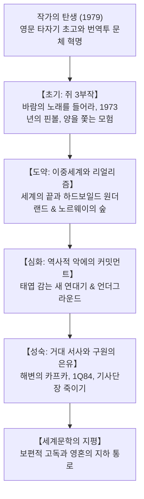

## 서론: 세계문학으로서의 무라카미 하루키

무라카미 하루키(1949~)는 현대 세계 문단에서 가장 폭넓게 읽히고 뜨겁게 논쟁되는 작가 중 한 명입니다. 전 세계 50개 이상의 언어로 번역된 그의 소설은 현대 고도자본주의 사회에서 개인이 마주하는 근원적 고독, 정체성의 불안, 역사적 폭력의 심연을 건드리며 국경을 초월한 공명을 일으키고 있습니다.

## 1. 메이지진구 구장의 계시와 문체의 탄생
도쿄에서 재즈 찻집 '피터 캣'을 운영하던 하루키는 1978년 야구 경기 관람 중 갑작스러운 계시처럼 소설을 쓰기로 결심했습니다. 일본어 특유의 무거운 감상을 걷어내기 위해 영문 타자기로 초고를 작성한 후 이를 다시 일본어로 번역하는 독창적 기법을 통해 경쾌하고 감각적인 독자적 문체를 확립했습니다.

## 2. 쥐 3부작: 상실감과 데터치먼트
- 《바람의 노래를 들어라》(1979): 60년대 학생운동 종언 후의 허무감 속에서 '나'와 친구 '쥐'의 일상을 담담히 스케치.
- 《1973년의 핀볼》(1980): 과거의 기억을 상징하는 핀볼 기계를 찾아 헤매는 상실의 애도.
- 《양을 쫓는 모험》(1982): 국가 권력을 조종하는 전체주의적 악의 화신인 '양'에 맞서 스스로 목숨을 끊어 악을 봉인한 쥐의 비극적 결말.

## 3. 종합소설로의 도약: 《세계의 끝》과 《노르웨이의 숲》
- 《세계의 끝과 하드보일드 원더랜드》(1985): 사이버펑크 도쿄와 그림자를 떼어내고 유니콘이 풀을 뜯는 벽 안의 고요한 도시가 교차하는 이중 나선 구조의 걸작.
- 《노르웨이의 숲(상실의 시대)》(1987): 친구의 자살 이후 방황하는 청춘의 사랑과 상실을 정밀한 리얼리즘으로 포착한 메가히트작.

## 4. 역사와 악의 심연: 《태엽 감는 새 연대기》
1990년대 하루키는 방관(데터치먼트)에서 참여(커밋먼트)로 전환했습니다. 주인공 오카다 토오루가 메마른 우물 바닥에 내려가 내면을 응시하며 마주한 아내의 실종은 노몬한 사건 등 제국주의 일본의 전쟁 범죄와 맞닿아 있습니다. 옴진리교 사린 테러 피해자들을 인터뷰한 《언더그라운드》는 사회적 타자에 대한 시선을 더욱 심화시켰습니다.

## 5. 21세기 거대 서사: 《해변의 카프카》와 《1Q84》
오이디푸스 신화를 재해석한 《해변의 카프카》(2002)와 두 개의 달이 뜬 평행세계를 배경으로 사이비 종교와 폭력에 맞서는 《1Q84》(2009-2010)는 영혼의 구원과 사랑의 연대를 그렸습니다.
우물, 벽, 클래식 및 재즈 음악, 파스타 요리는 혼돈의 심연에서 일상을 지탱하는 하루키 특유의 은유적 장치입니다.

## 결론: 벽과 알의 비유
2009년 예루살렘상 수상 연설에서 하루키는 말했습니다.
> "높고 단단한 벽과 거기에 부딪혀 깨지는 알이 있다면, 나는 언제나 알의 편에 서겠다."

체제의 억압에 맞서 상처받기 쉬운 영혼의 존엄을 지키는 문학의 소명. 하루키가 길어 올린 이야기들은 전 세계 고독한 영혼들의 어둠을 밝히는 따스한 등불로 빛나고 있습니다.
