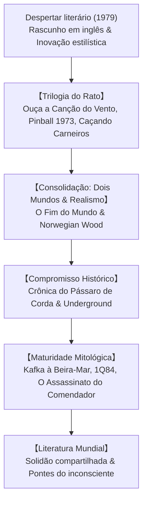

## Introdução: Haruki Murakami e a Literatura Mundial

Haruki Murakami (1949) consolidou-se como um dos autores mais celebrados da literatura contemporânea. Traduzida para mais de cinquenta idiomas, sua ficção capta a solidão nas metrópoles, a perda de vínculos afetivos e o misterioso diálogo entre o cotidiano banal e o inconsciente profundo.

## 1. Do Bar de Jazz à Literatura
Murakami administrava um bar de jazz em Tóquio quando teve a epifania de escrever ficção durante um jogo de beisebol em 1978. Redigiu seus primeiros parágrafos numa máquina de escrever em inglês para criar um estilo leve, sem rebuscamentos e com cadência musical.

## 2. A Trilogia do Rato
Em *Ouça a Canção do Vento* (1979), *Pinball, 1973* (1980) e *Caçando Carneiros* (1982), o narrador convive com as lembranças do movimento estudantil e o desaparecimento do amigo «Rato», culminando num confronto com poderes opressores.

## 3. O Fim do Mundo e Norwegian Wood
- **O Fim do Mundo e o País das Maravilhas Desalmado (1985)**: Estrutura inovadora que contrasta uma Tóquio cyberpunk com uma cidade cercada por muralhas onde se separam as sombras.
- **Norwegian Wood (1987)**: Sucesso estrondoso sobre o amor juvenil, o luto e a dor da perda entre Toru Watanabe, Naoko e Midori.

## 4. O Poço e a História: *Crônica do Pássaro de Corda*
Nos anos 1990, Murakami aprofundou seu compromisso com a história. Toru Okada isola-se no fundo de um poço seco para buscar a esposa, entrelaçando seu drama com os crimes do imperialismo japonês na Manchúria.

## 5. *Kafka à Beira-Mar* e *1Q84*
*Kafka à Beira-Mar* (2002) recria o mito edipiano com o jovem Kafka e o idoso Nakata. *1Q84* (2009-2010) constrói uma narrativa épica sob duas luas, demonstrando o poder do amor frente a seitas totalitárias.
Poços, gatos, música clássica e preparo de refeições funcionam como defesas do eu contra o absurdo.

## Conclusão: Sempre do Lado do Ovo
Em Jerusalém (2009), Murakami declarou: «Entre uma parede alta e dura e um ovo que se espatifa contra ela, sempre ficarei do lado do ovo». Sua obra segue como um abrigo de ternura e reflexão no mundo moderno.
