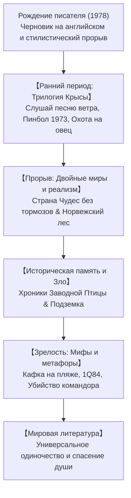

## Введение: Харуки Мураками как феномен мировой литературы

Харуки Мураками (род. 1949) — один из самых читаемых и обсуждаемых писателей рубежа XX и XXI веков. Его романы переведены более чем на пятьдесят языков. Секрет его всемирного успеха кроется в исследовании глубинной человеческой изоляции в постиндустриальном мире, хрупкости памяти и скрытых связей между бытовой реальностью и потусторонним миром.

## 1. Озарение на стадионе и рождение стиля
Владелец токийского джаз-бара «Питер Кэт», Мураками внезапно решил написать роман во время бейсбольного матча в 1978 году. Чтобы преодолеть тяжеловесность традиционного японского литературного слога, он напечатал первые страницы на английской пишущей машинке, а затем перевел их на японский язык, создав прозрачный и ритмичный стиль.

## 2. «Трилогия Крысы»: Меланхолия и утрата
В романах «Слушай песню ветра» (1979), «Пинбол 1973» (1980) и «Охота на овец» (1982) рассказчик («Я») переживает крах юношеских идеалов, завершающийся гибелью друга по кличке Крыса в борьбе с темной тоталитарной сущностью Овцы.

## 3. Вершины творчества: «Страна Чудес» и «Норвежский лес»
- **«Страна Чудес без тормозов и Конец Света» (1985)**: Шедевр параллельного повествования, соединяющий киберпанковский Токио с тихим Городом за высокой Стеной, где отрезают тени и пасутся единороги.
- **«Норвежский лес» (1987)**: Психологический реалистический роман о студенческой любви, смерти и взрослении, ставший культовым мировым бестселлером.

## 4. Столкновение с историей: «Хроники Заводной Птицы»
В романе «Хроники Заводной Птицы» (1994–1995) герой Тору Окада спускается на дно сухого колодца, чтобы отыскать пропавшую жену. Это погружение в подсознание смыкается с военными преступлениями Японии в Маньчжурии (Номонхан) и борьбой против абсолютного зла в лице политика Нобору Ватаи.

## 5. «Кафка на пляже» и «1Q84»
«Кафка на пляже» (2002) переосмысляет эдипов миф через странствия подростка Кафки и старика Накаты. В грандиозной трилогии «1Q84» (2009–2010) герои Аомамэ и Тэнго ищут друг друга в мире двух лун, побеждая тоталитарный морок любовью.
Колодцы, стены, джазовые пластинки и приготовление спагетти служат якорями, удерживающими человека от распада.

## Заключение: Всегда на стороне яйца
В Иерусалимской речи 2009 года Мураками произнес: «Между высокой твердой стеной и яйцом, которое разбивается о нее, я всегда на стороне яйца». Его книги остаются тихим светом надежды в лабиринтах человеческой души.
