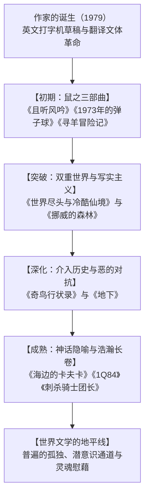

## 序论：作为世界文学的村上春树

村上春树（1949-）是当代世界文坛读者最多、反响最强烈的作家之一。其作品被翻译为五十多种语言，无论是在东京、纽约，还是巴黎、柏林、首尔与圣保罗，无不引发跨越文化与国界的强烈共鸣。

村上文学之所以具备全球普遍性，在于他精准捕捉了后工业社会中个体的深刻孤独、历史暗处的暴力、以及在虚无废墟中追寻救赎与温情的渴望。

## 第一章 神宫球场的启示与文体革命
1978年4月1日，在东京经营爵士酒吧“彼得猫”的村上春树在神宫球场观看棒球赛时，突获神启般萌生了写小说的念头。
为打破传统日语沉重情绪化的枷锁，村上尝试先用英文打字机敲出草稿，再将其翻译回日语。这一独特的自译过程剔除了浮夸修饰，创造出通透轻盈、富有爵士节奏感的全新现代日语散文。

## 第二章 “鼠之三部曲”：青春的终结与疏离
- **《且听风吟》（1979）**：以全共斗运动落潮后的虚无为背景，主角“我”与好友“鼠”在杰氏酒吧饮啤酒，在疏离中缅怀消逝的青春。
- **《1973年的弹子球》（1980）**：追寻早已停产的三飞板弹子机，抒发对不可逆时光的静默哀悼。
- **《寻羊冒险记》（1982）**：村上文学的巨大飞跃。“我”受神秘右翼集团胁迫前往北海道荒原寻找背负星纹的恶魔之羊。“鼠”选择自缢与恶灵同归于尽，完成了崇高的精神献祭。

## 第三章 双重世界与写实绝唱：《世界尽头》与《挪威的森林》
- **《世界尽头与冷酷仙境》（1985）**：双螺旋交错叙事的巅峰。奇数章是充满赛博暗斗的东京地下，偶数章则是隔绝尘世、独角兽漫步的高墙之城。“我”最终选择对内心的世界承担责任，留守墙内。
- **《挪威的森林》（1987）**：销量破千万册的写实恋爱经典。渡边在自杀好友木月的阴影中，徘徊于游走在崩溃边缘的直子与生命力盎然的绿子之间。

## 第四章 历史之恶与自我救赎：《奇鸟行状录》
90年代中期的《奇鸟行状录》标志着村上从“疏离”转向“介入”。冈田亨坐在干涸幽暗的枯井底凝神沉思，个体的妻子失踪之痛与近代日本在诺门罕战役、伪满洲国的残暴历史在潜意识深处激荡交汇。村上随后采访沙林毒气事件受害者完成非虚构杰作《地下》，进一步深挖狂热体制对人性的吞噬。

## 第五章 新世纪的隐喻长卷：《海边的卡夫卡》与《1Q84》
- **《海边的卡夫卡》（2002）**：将俄狄浦斯神话融入十五岁出走少年卡夫卡与能与猫对话的中田老人的平行历险中。
- **《1Q84》（2009-2010）**：在悬挂两个月亮的诡异时空下，刺客青豆与教师天吾跨越邪教“先驱”与“小小人”的阻隔，用坚贞之爱完成脱险。

## 结语：永远站在鸡蛋这一边
2009年村上春树在耶路撒冷奖演讲中指出：“在高大坚硬的墙和击向它并破碎的鸡蛋之间，我永远站在鸡蛋这一边。”在冰冷体制与技术浪潮面前，村上在灵魂的幽暗地下室中点亮微光，为世间所有孤独的心灵提供了温暖的避风港。
