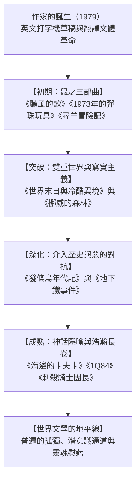

## 序論：作為世界文學的村上春樹

村上春樹（1949-）是當代世界文壇讀者最多、反響最深刻的作家之一。其作品被翻譯為五十多種語言，無論是在東京、紐約，還是巴黎、柏林、首爾與聖保羅，無不引發跨越文化與國界的強烈共鳴。

村上文學之所以具備全球普遍性，在於他精準捕捉了後工業社會中個體的深刻孤獨、歷史暗處的暴力、以及在虛無廢墟中追尋救贖與溫情的渴望。

## 第一章 神宮球場的啟示與文體革命
1978年4月1日，在東京經營爵士酒吧「彼得貓」的村上春樹在神宮球場觀看棒球賽時，突獲神啟般萌生了寫小說的念頭。
為打破傳統日語沉重情緒化的枷鎖，村上嘗試先用英文打字機敲出草稿，再將其翻譯回日語。這一獨特的自譯過程剔除了浮誇修飾，創造出通透輕盈、富有爵士節奏感的全新現代日語散文。

## 第二章 「鼠之三部曲」：青春的終結與疏離
- **《聽風的歌》（1979）**：以全共鬥運動落潮後的虛無為背景，主角「我」與好友「鼠」在傑氏酒吧飲啤酒，在疏離中緬懷消逝的青春。
- **《1973年的彈珠玩具》（1980）**：追尋早已停產的三飛板彈珠機，抒發對不可逆時光的靜默哀悼。
- **《尋羊冒險記》（1982）**：村上文學的巨大飛躍。「我」受神秘右翼集團脅迫前往北海道荒原尋找背負星紋的惡魔之羊。「鼠」選擇自縊與惡靈同歸於盡，完成了崇高的精神獻祭。

## 第三章 雙重世界與寫實絕唱：《世界末日》與《挪威的森林》
- **《世界末日與冷酷異境》（1985）**：雙螺旋交錯敘事的巔峰。奇數章是充滿賽博暗鬥的東京地下，偶數章則是隔絕塵世、獨角獸漫步的高牆之城。「我」最終選擇對內心的世界承擔責任，留守牆內。
- **《挪威的森林》（1987）**：銷量破千萬冊的寫實戀愛經典。渡邊在自殺好友木月的陰影中，徘徊於遊走在崩潰邊緣的直子與生命力盎然的綠子之間。

## 第四章 歷史之惡與自我救贖：《發條鳥年代記》
90年代中期的《發條鳥年代記》標誌著村上從「疏離」轉向「介入」。岡田亨坐在乾涸幽暗的枯井底凝神沉思，個體的妻子失蹤之痛與近代日本在諾門罕戰役、偽滿洲國的殘暴歷史在潛意識深處激盪交匯。村上隨後採訪沙林毒氣事件受害者完成非虛構傑作《地下鐵事件》，進一步深挖狂熱體制對人性的吞噬。

## 第五章 新世紀的隱喻長卷：《海邊的卡夫卡》與《1Q84》
- **《海邊的卡夫卡》（2002）**：將俄狄浦斯神話融入十五歲出走少年卡夫卡與能與貓對話的中田老人的平行歷險中。
- **《1Q84》（2009-2010）**：在懸掛兩個月亮的詭異時空下，刺客青豆與教師天吾跨越邪教「先驅」與「小小人」的阻隔，用堅貞之愛完成脫險。

## 結語：永遠站在雞蛋這一邊
2009年村上春樹在耶路撒冷獎演講中指出：「在高大堅硬的牆和擊向它並破碎的雞蛋之間，我永遠站在雞蛋這一邊。」在冰冷體制與技術浪潮面前，村上在靈魂的幽暗地下室中點亮微光，為世間所有孤獨的心靈提供了溫暖的避風港。
