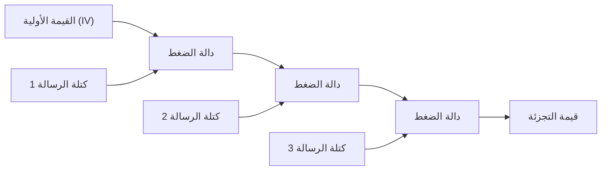
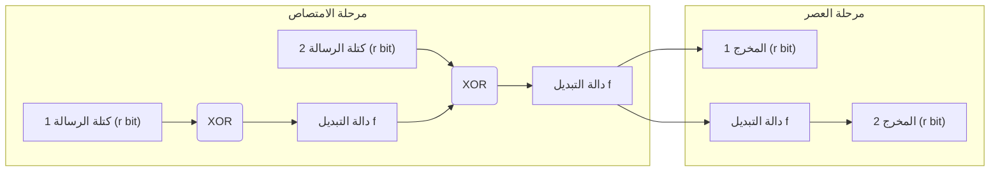

في المجتمع الرقمي الحديث، تُستخدم "دوال التجزئة التشفيرية" (Cryptographic hash functions) على نطاق واسع كتقنية أساسية للتأكد من عدم العبث بالبيانات وأن الطرف المتصل هو بالفعل الطرف المقصود. تتراوح تطبيقاتها من تخزين كلمات المرور، التوقيعات الرقمية، البلوكشين، وحتى الاتصالات المشفرة عبر SSL/TLS. في هذه المقالة، سنتعمق في المتطلبات الأساسية لدوال التجزئة التشفيرية، وكيف تم اختراق MD5 و SHA-1 التي كانت معتمدة سابقًا كمعايير قياسية، والمشكلات الهيكلية لـ SHA-2 السائد حاليًا، و"البنية الإسفنجية" (Sponge Construction) الثورية لـ SHA-3 (Keccak) التي أصبحت المعيار الجديد بعد مسابقة من قبل المعهد الوطني للمعايير والتقنية (NIST).

## ما هي دالة التجزئة التشفيرية؟

دالة التجزئة هي دالة تأخذ بيانات ذات طول متغير (الرسالة) كمدخلات، وتخرج بيانات ذات طول ثابت (قيمة التجزئة أو ملخص الرسالة). دوال التجزئة المستخدمة في الأغراض التشفيرية تتطلب ثلاث خصائص قوية رئيسية:

1. **مقاومة إيجاد الصورة الأصلية (Pre-image Resistance)**
   عند إعطاء قيمة تجزئة $h$، يجب أن يكون من الصعب جداً العثور على الرسالة الأصلية $m$ بحيث $H(m) = h$. إذا لم يتحقق ذلك، يمكن، على سبيل المثال، استنتاج كلمة المرور الأصلية من كلمة المرور المجزأة.
2. **مقاومة إيجاد الصورة الأصلية الثانية (Second Pre-image Resistance)**
   عند إعطاء رسالة $m_1$، يجب أن يكون من الصعب العثور على رسالة أخرى $m_2$ بحيث $H(m_1) = H(m_2)$ و $m_1 \neq m_2$.
3. **مقاومة التصادم (Collision Resistance)**
   يجب أن يكون من الصعب العثور على أي رسالتين مختلفتين $m_1, m_2$ بحيث $H(m_1) = H(m_2)$. هذا أمر حيوي لمنع المهاجم الخبيث من إنشاء "ملف غير ضار" و"ملف ضار" بنفس قيمة التجزئة في نفس الوقت واستبدالهما (على سبيل المثال، تزوير التوقيعات الرقمية).

بسبب الخاصية الرياضية المعروفة باسم هجوم يوم الميلاد (Birthday Attack)، يتناسب مقدار الحسابات اللازمة للعثور على تصادم في دالة تجزئة بمخرجات طولها $N$ بت مع $2^{N/2}$. لذلك، من الضروري الحصول على مخرجات تجزئة طويلة بما يكفي للحفاظ على مقاومة عملية للتصادم.

## انهيار MD5 و SHA-1: لماذا تم اختراق دوال التجزئة السابقة؟

من بين دوال التجزئة التي كانت تستخدم على نطاق واسع عبر الإنترنت سابقاً MD5 (بمخرجات 128 بت) الذي صممه رونالد ريفست (Ronald Rivest)، و SHA-1 (بمخرجات 160 بت) الذي صممته وكالة الأمن القومي الأمريكية (NSA) وتم اعتماده كمعيار من قبل NIST. ومع ذلك، تُعتبر هذه الدوال الآن "غير آمنة" ولا يُنصح باستخدامها.

في عام 2004، أعلن باحثون صينيون عن هجوم لاكتشاف التصادم في وقت عملي على MD5، مما أدى فعليًا إلى انهياره. بالنسبة لـ SHA-1، تمت الإشارة إلى نقاط ضعف نظرية في عام 2005، وفي عام 2017، نشر فريق بحثي من جوجل و CWI Amsterdam مثالًا عمليًا للتصادم سُمي "SHAttered". لقد نجحوا في توليد ملفي PDF مختلفين يمتلكان نفس قيمة تجزئة SHA-1 تمامًا.

السبب الجذري لاختراق هذه الخوارزميات يكمن في نقاط الضعف في تصميم دالة الضغط (Compression function) المستخدمة داخليًا (على سبيل المثال، بنية تجعل من السهل إلغاء تأثير الفروقات في الرسائل على الحالة الداخلية). وبفضل هذا، أصبح من الممكن العثور على تصادمات بجهد حسابي أقل بكثير من هجوم القوة العمياء (Brute-force attack).

## حدود SHA-2 وبنية Merkle-Damgård

استجابةً لتدهور MD5 و SHA-1، أصبح SHA-2 (بمخرجات أطول مثل 256 بت و 512 بت وبنية معززة) هو الخيار السائد حاليًا. ومع ذلك، كان لـ SHA-2 مخاوف تصميمية محتملة. وهي أنه يعتمد نفس **بنية ميركل-دامغارد (Merkle-Damgård)** المستخدمة في MD5 و SHA-1.

في بنية Merkle-Damgård، يتم تقسيم رسالة الإدخال إلى كتل بحجم ثابت، وتُمرر القيمة الأولية (IV) والكتلة الأولى عبر دالة الضغط لتوليد حالة وسيطة. بعد ذلك، يتم تكرار العملية بتمرير الحالة الوسيطة والكتلة التالية عبر دالة الضغط بشكل متسلسل.

رغم أن هذه البنية كانت موثوقة لسنوات عديدة، إلا أن هناك ثغرة أمنية معروفة باسم "هجوم تمديد الطول (Length Extension Attack)". يعني ذلك أنه إذا كانت قيمة التجزئة $H(M)$ وطول الرسالة $M$ معروفين، يمكن للمهاجم بسهولة حساب قيمة التجزئة $H(M || X)$ لرسالة مضاف إليها بيانات $X$ دون معرفة محتوى $M$. تتسبب هذه المشكلة في مخاطر أمنية خطيرة في البناء البسيط لرمز مصادقة الرسالة (MAC) (لذلك تم ابتكار آليات مثل HMAC لمنع ذلك).

## مسابقة SHA-3 وانتصار Keccak

استجابةً للمخاوف المتزايدة بشأن أمان SHA-2 (التي تنبع بشكل رئيسي من التشابه الهيكلي)، بدأت NIST مسابقة عامة في عام 2007 لتطوير معيار دالة التجزئة للجيل الجديد "SHA-3". من بين 64 مقترحًا من جميع أنحاء العالم، وبعد سنوات من اختبارات فك التشفير الصارمة وتقييم الأداء، تم اختيار **Keccak** الذي صممه Guido Bertoni و Joan Daemen و Michaël Peeters و Gilles Van Assche كفائز في عام 2012.

السبب الأكبر لاختيار Keccak كـ SHA-3 هو اعتماده على نموذج جديد تمامًا يُسمى **"البنية الإسفنجية" (Sponge Construction)**، والذي يختلف جذريًا عن بنية Merkle-Damgård التي اعتمدت عليها MD5 و SHA-1 و SHA-2.

## الابتكار الرياضي والتصميمي للبنية الإسفنجية

تتكون البنية الإسفنجية، كما يوحي اسمها، من مرحلتين: "الامتصاص" (Absorbing) و"العصر" (Squeezing).

### تكوين الحالة الداخلية: معدل البت (r) والسعة (c)
يتم تمثيل الحالة الداخلية لـ Keccak كمصفوفة بتات ضخمة (1600 بت في SHA-3). تنقسم هذه الحالة الداخلية إلى جزء **معدل البت (Rate, $r$)** المستخدم لإدخال وإخراج البيانات، وجزء **السعة (Capacity, $c$)** الذي لا ينكشف أبدًا بشكل مباشر للخارج (طول الحالة الإجمالي $b = r + c$).

تعمل السعة $c$ كـ "صندوق أسود سري" يمثل جوهر الأمان. تعتمد قوة الأمان لمنع تصادم المخرجات بشكل تقريبي على $c / 2$. على سبيل المثال، في SHA-3-256 يتم تعيين $c = 512$ بت، مما يوفر مستوى أمان 256 بت.

### مرحلة الامتصاص (Absorbing Phase)
1. يتم تقسيم رسالة الإدخال إلى كتل بحجم $r$ بت (بما في ذلك الحشو أو Padding).
2. يتم إجراء عملية XOR (المتغير المنطقي المستبعد) بين كتلة الرسالة الأولى وجزء الـ $r$ بت من الحالة الداخلية.
3. يتم تطبيق **دالة تبديل غير خطية (Permutation Function $f$)** على كامل الحالة ($r + c$ بت)، مما يؤدي إلى خلط الحالة الداخلية بشدة.
4. يتم إجراء XOR بين كتلة الرسالة التالية وجزء الـ $r$ بت مرة أخرى، وتطبق الدالة $f$. يتكرر هذا حتى تنتهي جميع كتل الرسائل.

### مرحلة العصر (Squeezing Phase)
1. بعد اكتمال الامتصاص، يتم استخراج جزء الـ $r$ بت من الحالة الداخلية ليكون جزءًا من المخرجات.
2. إذا كانت هناك حاجة إلى مخرجات إضافية، يتم تطبيق الدالة $f$ مرة أخرى لتحديث الحالة الداخلية، ويتم استخراج $r$ بت جديدة. يتكرر هذا حتى يتم الوصول إلى طول المخرجات المطلوب (مثل 256 بت أو 512 بت).

### لماذا تعتبر البنية الإسفنجية متفوقة؟

1. **مقاومة هجوم تمديد الطول**: نظرًا لأن جزءًا من الحالة الداخلية (السعة $c$) يبقى مخفيًا دائمًا، لا يمكن للمهاجم استعادة الحالة الداخلية بأكملها، مما يبطل نقطة الضعف الأساسية في بنية Merkle-Damgård (هجوم تمديد الطول).
2. **مرونة عالية**: من خلال تغيير التوازن بين $r$ و $c$، يمكن ضبط الأداء (زيادة $r$) والأمان (زيادة $c$) ديناميكيًا. علاوة على ذلك، طالما استمرت مرحلة العصر، يمكن إنشاء سلسلة أرقام عشوائية لا نهائية، مما يجعل SHA-3 ليس مجرد دالة تجزئة، بل أداة تشفير متعددة الاستخدامات يمكن تطبيقها كمولد أرقام شبه عشوائية (PRNG)، أو تشفير متدفق، أو رمز مصادقة الرسالة (MAC).
3. **كفاءة تطبيق الأجهزة (Hardware Implementation)**: تتكون دالة التبديل $f$ في Keccak فقط من عمليات منطقية على مستوى البت (XOR, AND, NOT) ودوران (Rotation)، ولا تتطلب عمليات حسابية معقدة (مثل الجمع). هذا يوفر ميزة كبيرة من حيث العمل بسرعة فائقة واستهلاك منخفض للطاقة، خاصة عند تطبيقه على الأجهزة (مثل ASIC أو FPGA).

## الخلاصة

كان تاريخ دوال التجزئة عبارة عن صراع مستمر مع فك التشفير. يمكن القول إن هزيمة MD5 و SHA-1 كانت نتيجة حتمية لنقاط الضعف في دوال الضغط الداخلية وتطور أجهزة الكمبيوتر. رغم أن SHA-2 لا يزال قيد الاستخدام الآمن، إلا أنه يعاني من قيود تصميمية ناتجة عن بنية Merkle-Damgård.

كان ظهور SHA-3 (Keccak) والبنية الإسفنجية كحل جذري لهذه التحديات، ليس مجرد تحديث بسيط للخوارزمية، بل اختراقًا أعاد تعريف بنية التجزئة التشفيرية نفسها. إن تصميمها المرن والمتين سيستمر في العمل كحجر أساس حيوي لضمان الثقة الرقمية، بدءًا من أجهزة إنترنت الأشياء (IoT) المستقبلية وحتى أنظمة التشفير المتقدمة المتوقعة في عصر الحوسبة الكمية.
