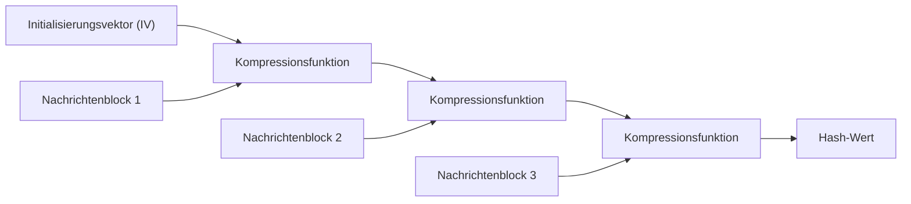
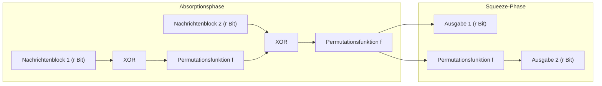

In der modernen digitalen Gesellschaft werden kryptografische Hash-Funktionen weithin als grundlegende Technologie genutzt, um sicherzustellen, dass Daten nicht manipuliert wurden und dass der Kommunikationspartner wirklich die beabsichtigte Partei ist. Ihre Anwendungsbereiche sind vielfältig und reichen von der Speicherung von Passwörtern über digitale Signaturen und Blockchains bis hin zu verschlüsselter Kommunikation mittels SSL/TLS. In diesem Artikel werden die Anforderungen an kryptografische Hash-Funktionen detailliert erläutert. Wir betrachten, wie die früher standardmäßig verwendeten MD5 und SHA-1 geknackt wurden, die strukturellen Probleme des aktuell dominierenden SHA-2 und schließlich die revolutionäre 'Schwammkonstruktion' (Sponge Construction) von SHA-3 (Keccak), der nach einem Wettbewerb des NIST zum neuen Standard der nächsten Generation wurde.

## Was ist eine kryptografische Hash-Funktion?

Eine Hash-Funktion ist eine Funktion, die Daten beliebiger Länge (eine Nachricht) als Eingabe erhält und Daten mit fester Länge (einen Hash-Wert oder Message Digest) ausgibt. Hash-Funktionen, die für kryptografische Zwecke verwendet werden, müssen hauptsächlich die folgenden drei starken Eigenschaften aufweisen:

1. **Urbildresistenz (Pre-image Resistance)**
   Wenn ein Hash-Wert $h$ gegeben ist, muss es extrem schwierig sein, die ursprüngliche Nachricht $m$ zu finden, für die $H(m) = h$ gilt. Wenn dies nicht erfüllt ist, kann beispielsweise das ursprüngliche Passwort aus einem gehashten Passwort zurückgerechnet werden.
2. **Zweite Urbildresistenz (Second Pre-image Resistance)**
   Wenn eine Nachricht $m_1$ gegeben ist, muss es schwierig sein, eine andere Nachricht $m_2$ zu finden, für die $H(m_1) = H(m_2)$ und $m_1 \neq m_2$ gilt.
3. **Kollisionsresistenz (Collision Resistance)**
   Es muss schwierig sein, zwei beliebige, unterschiedliche Nachrichten $m_1, m_2$ zu finden, für die $H(m_1) = H(m_2)$ gilt. Dies ist unerlässlich, um Angriffe zu verhindern, bei denen ein böswilliger Angreifer gleichzeitig eine 'harmlose Datei' und eine 'bösartige Datei' mit demselben Hash-Wert erstellt und diese austauscht (z. B. Fälschung einer digitalen Signatur).

Aufgrund einer mathematischen Eigenschaft, die als Geburtstagsangriff (Birthday Attack) bekannt ist, ist der Rechenaufwand zum Finden einer Kollision bei einer Hash-Funktion mit einer Ausgabe von $N$ Bit proportional zu $2^{N/2}$. Daher ist eine ausreichend lange Hash-Ausgabe erforderlich, um in der Praxis eine Kollisionsresistenz aufrechtzuerhalten.

## Der Zusammenbruch von MD5 und SHA-1: Warum wurden frühere Hash-Funktionen geknackt?

Zu den Hash-Funktionen, die früher im Internet am weitesten verbreitet waren, gehörten MD5 (128-Bit-Ausgabe), entworfen von Ronald Rivest, und SHA-1 (160-Bit-Ausgabe), entworfen von der NSA (National Security Agency) und standardisiert vom NIST. Heutzutage gelten diese jedoch als 'unsicher' und werden nicht mehr empfohlen.

MD5 brach 2004 faktisch zusammen, als chinesische Forscher einen Kollisionsangriff veröffentlichten, der in praktikabler Zeit durchführbar war. Auch bei SHA-1 wurden 2005 theoretische Schwachstellen aufgezeigt, und 2017 veröffentlichte ein Forschungsteam von Google und dem CWI Amsterdam ein tatsächliches Kollisionsbeispiel namens 'SHAttered'. Ihnen gelang es, zwei unterschiedliche PDF-Dateien zu generieren, die exakt denselben SHA-1-Hashwert aufwiesen.

Die grundlegende Ursache für das Brechen dieser Algorithmen lag in den Schwächen des Designs der intern verwendeten Kompressionsfunktionen (z. B. in einer Struktur, bei der sich die Auswirkungen von Nachrichtenunterschieden auf den internen Zustand leicht aufheben lassen). Dadurch wurde es möglich, Kollisionen mit einem viel geringeren Rechenaufwand als durch einen Brute-Force-Angriff zu finden.

## Die Grenzen von SHA-2 und der Merkle-Damgård-Konstruktion

Aufgrund der Kompromittierung von MD5 und SHA-1 ist SHA-2, das über längere Ausgabelängen (wie 256 Bit, 512 Bit) und eine verstärkte Struktur verfügt, zum aktuellen Standard geworden. Allerdings gab es bei SHA-2 potenzielle Designbedenken. Es verwendet dieselbe **Merkle-Damgård-Konstruktion** wie MD5 und SHA-1.

Bei der Merkle-Damgård-Konstruktion wird die Eingabenachricht in Blöcke fester Größe unterteilt. Ein Initialisierungsvektor (IV) und der erste Block werden durch eine Kompressionsfunktion verarbeitet, um einen Zwischenzustand zu generieren. Anschließend wird dieser Zwischenzustand zusammen mit dem nächsten Block erneut der Kompressionsfunktion zugeführt. Dieser Prozess wird kettenartig wiederholt.

Obwohl dieser Struktur lange vertraut wurde, ist eine Schwachstelle bekannt, die als 'Length Extension Attack' (Längenerweiterungsangriff) bezeichnet wird. Wenn der Hash-Wert $H(M)$ einer Nachricht $M$ und die Länge von $M$ bekannt sind, kann ein Angreifer ohne Kenntnis des Inhalts von $M$ leicht den Hash-Wert $H(M || X)$ berechnen, wenn er zusätzliche Daten $X$ anhängt. Dieses Problem stellt ein ernsthaftes Sicherheitsrisiko in einfachen Konstruktionen von Message Authentication Codes (MAC) dar (um dies zu verhindern, wurden Mechanismen wie HMAC entwickelt).

## Der SHA-3-Wettbewerb und der Sieg von Keccak

Als Reaktion auf die wachsenden Bedenken hinsichtlich der Sicherheit von SHA-2 (hauptsächlich aufgrund der strukturellen Ähnlichkeit) startete das NIST 2007 einen öffentlichen Wettbewerb, um 'SHA-3' als Standard für eine Hash-Funktion der nächsten Generation festzulegen. Es gab 64 Einreichungen aus der ganzen Welt. Nach jahrelanger rigoroser kryptoanalytischer Prüfung und Leistungsbewertung wurde 2012 **Keccak**, entworfen von Guido Bertoni, Joan Daemen, Michaël Peeters und Gilles Van Assche, als Gewinner ausgewählt.

Der Hauptgrund für die Wahl von Keccak als SHA-3 war die Übernahme eines völlig neuen Paradigmas, das als **'Schwammkonstruktion' (Sponge Construction)** bezeichnet wird und sich stark von der Merkle-Damgård-Konstruktion unterscheidet, auf die MD5, SHA-1 und SHA-2 angewiesen waren.

## Die mathematische und gestalterische Innovation der Schwammkonstruktion

Wie der Name schon sagt, besteht die Schwammkonstruktion aus zwei Phasen: 'Absorbieren' (Absorbing) und 'Auspressen' (Squeezing).

### Struktur des internen Zustands: Bitrate (r) und Kapazität (c)
Der interne Zustand von Keccak wird als riesiges Bit-Array (1600 Bit bei SHA-3) dargestellt. Dieser interne Zustand ist in zwei Teile unterteilt: die **Bitrate (Rate, $r$)**, die für die Ein- und Ausgabe von Daten verwendet wird, und die **Kapazität (Capacity, $c$)**, die niemals direkt nach außen sichtbar wird (Gesamtzustandslänge $b = r + c$).

Die Kapazität $c$ fungiert als 'geheime Blackbox', die den Kern der Sicherheit bildet. Die Sicherheitsstärke zur Verhinderung von Ausgabekollisionen hängt grob von $c / 2$ ab. Beispielsweise ist bei SHA-3-256 $c = 512$ Bit eingestellt, was ein Sicherheitsniveau von 256 Bit bietet.

### Absorptionsphase (Absorbing Phase)
1. Die Eingabenachricht wird in Blöcke von je $r$ Bit unterteilt (einschließlich Padding).
2. Der erste Nachrichtenblock wird mit dem $r$-Bit-Teil des internen Zustands durch XOR (Exklusives ODER) verknüpft.
3. Auf das Ganze ($r + c$ Bit) wird eine nichtlineare **Permutationsfunktion $f$** angewendet, um den internen Zustand stark zu vermischen.
4. Der nächste Nachrichtenblock wird wieder mit dem $r$-Bit-Teil XOR-verknüpft und die Funktion $f$ wird angewendet. Dies wird wiederholt, bis alle Nachrichtenblöcke verarbeitet sind.

### Squeeze-Phase (Squeezing Phase)
1. Nach Abschluss der Absorption wird der $r$-Bit-Teil des internen Zustands extrahiert und als Teil der Ausgabe verwendet.
2. Wenn weitere Ausgaben erforderlich sind, wird die Funktion $f$ erneut angewendet, um den internen Zustand zu aktualisieren, und ein neuer $r$-Bit-Teil wird extrahiert. Dies wird wiederholt, bis die erforderliche Ausgabelänge (z. B. 256 Bit oder 512 Bit) erreicht ist.

### Warum ist die Schwammkonstruktion überlegen?

1. **Resistenz gegen Length Extension Attacks**: Da ein Teil des internen Zustands (die Kapazität $c$) immer verborgen bleibt, kann ein Angreifer nicht den gesamten internen Zustand wiederherstellen. Dadurch wird der Längenerweiterungsangriff, der eine Schwachstelle der Merkle-Damgård-Konstruktion war, grundlegend vereitelt.
2. **Hohe Flexibilität**: Durch Ändern des Gleichgewichts zwischen $r$ und $c$ können Leistung (größeres $r$) und Sicherheit (größeres $c$) dynamisch angepasst werden. Da zudem unendlich viele Zufallszahlen generiert werden können, solange die Squeeze-Phase andauert, ist SHA-3 nicht nur eine einfache Hash-Funktion. Sie besitzt die Vielseitigkeit, als verschiedene kryptografische Primitive wie Pseudozufallszahlengeneratoren (PRNG), Stromchiffren und Message Authentication Codes (MAC) eingesetzt zu werden.
3. **Effizienz der Hardware-Implementierung**: Die Permutationsfunktion $f$ von Keccak besteht nur aus bitweisen logischen Operationen (XOR, AND, NOT) und Rotationen; sie erfordert keine komplexen arithmetischen Operationen (wie Addition). Dies bietet einen großen Vorteil, da sie besonders bei der Hardware-Implementierung (ASIC und FPGA) extrem schnell und energiesparend arbeitet.

## Zusammenfassung

Die Geschichte der Hash-Funktionen war ein ständiger Kampf gegen die Kryptoanalyse. Die Niederlage von MD5 und SHA-1 kann als unvermeidliches Ergebnis der Schwächen ihrer internen Kompressionsfunktionen und der Weiterentwicklung der Computer betrachtet werden. SHA-2 wird derzeit weiterhin sicher verwendet, weist jedoch Designbeschränkungen auf, die sich aus der Merkle-Damgård-Konstruktion ergeben.

SHA-3 (Keccak) und die Schwammkonstruktion, die als grundlegende Lösung für diese Probleme eingeführt wurden, stellten nicht nur ein einfaches Algorithmus-Update dar, sondern einen Durchbruch, der die Architektur kryptografischer Hashes selbst neu definierte. Dieses flexible und robuste Design wird weiterhin als wichtiger Grundstein zur Gewährleistung des digitalen Vertrauens dienen, von zukünftigen IoT-Geräten bis hin zu fortschrittlichen kryptografischen Systemen im Zeitalter der Quantencomputer.
