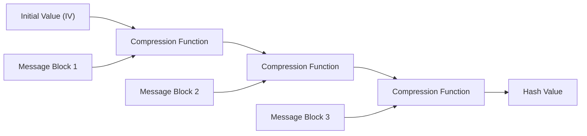
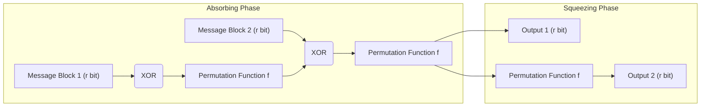

In today's digital society, 'cryptographic hash functions' are widely used as a foundational technology to ensure that data has not been tampered with and that the communication party is indeed the intended recipient. Their applications are diverse, including password storage, digital signatures, blockchain, and encrypted communications via SSL/TLS. In this article, starting from the requirements of a cryptographic hash function, we will delve into how the once standard MD5 and SHA-1 were broken, the structural challenges of the currently mainstream SHA-2, and the revolutionary 'sponge construction' of SHA-3 (Keccak), which became the new generation standard after a competition by NIST.

## What is a Cryptographic Hash Function?

A hash function is a function that takes data (a message) of arbitrary length as input and outputs fixed-length data (a hash value, or message digest). Hash functions used for cryptographic purposes primarily require the following three strong properties:

1. **Pre-image Resistance**
   Given a hash value $h$, it should be extremely difficult to find the original message $m$ such that $H(m) = h$. If this is not met, a hashed password, for example, could be reverse-engineered back to the original password.
2. **Second Pre-image Resistance**
   Given a message $m_1$, it should be difficult to find another message $m_2$ such that $H(m_1) = H(m_2)$ and $m_1 \neq m_2$.
3. **Collision Resistance**
   It should be difficult to find any two different messages $m_1, m_2$ such that $H(m_1) = H(m_2)$. This is essential to prevent attacks where a malicious attacker simultaneously creates a 'harmless file' and a 'malicious file' with the same hash value and swaps them (e.g., forging a digital signature).

Due to a mathematical property called the Birthday Attack, the computational complexity to find a collision in a hash function with an $N$-bit output is proportional to $2^{N/2}$. Therefore, to maintain practical collision resistance, a sufficiently long hash output is necessary.

## The Collapse of MD5 and SHA-1: Why Past Hash Functions Were Broken

Hash functions that were once the most widely used on the internet include MD5 (128-bit output) designed by Ronald Rivest, and SHA-1 (160-bit output) designed by the NSA (National Security Agency) and standardized by NIST. However, these are currently deprecated as 'unsafe'.

MD5 virtually collapsed in 2004 when Chinese researchers announced a collision-finding attack within a practical amount of time. Furthermore, theoretical vulnerabilities in SHA-1 were pointed out in 2005, and in 2017, a joint research team from Google and CWI Amsterdam published a real collision example called 'SHAttered'. They succeeded in generating two different PDF files that had the exact same SHA-1 hash value.

The fundamental cause for the compromise of these algorithms was a weakness in the design of the internal compression function (for example, a structure that easily offsets the effect of message differences on the internal state). This made it possible to find collisions with far less computational effort than a brute-force attack.

## SHA-2 and the Limitations of the Merkle-Damgård Construction

Following the compromise of MD5 and SHA-1, SHA-2, which features a longer output length (256 bits, 512 bits, etc.) and a strengthened structure, has become the current mainstream. However, there were underlying design concerns with SHA-2. That is, it adopts the same **Merkle-Damgård construction** as MD5 and SHA-1.

In the Merkle-Damgård construction, the input message is divided into blocks of a fixed size, and an intermediate state is generated by passing an initial value (IV) and the first block through a compression function. After that, the intermediate state and the next block are again passed through the compression function, a process repeated in a chained manner.

While this structure has been trusted for many years, a vulnerability known as the 'Length Extension Attack' is known. This means that if an attacker knows the hash value $H(M)$ and the length of a certain message $M$, they can easily calculate the hash value $H(M || X)$ of $M || X$ with additional data $X$ appended, even without knowing the contents of $M$. This problem poses a serious security risk in simple constructions of Message Authentication Codes (MACs) (mechanisms like HMAC were devised to prevent this).

## The SHA-3 Competition and Keccak's Victory

In response to growing concerns (mainly from structural similarities) about the security of SHA-2, NIST initiated a public competition in 2007 to develop a new generation hash function standard, 'SHA-3'. Out of 64 submissions from around the world, after years of rigorous cryptographic trials and performance evaluations, **Keccak**, designed by Guido Bertoni, Joan Daemen, Michaël Peeters, and Gilles Van Assche, was selected as the winner in 2012.

The biggest reason Keccak was chosen as SHA-3 is that it adopted a new paradigm called the **'Sponge Construction'**, which is completely different from the Merkle-Damgård construction relied upon by MD5, SHA-1, and SHA-2.

## Mathematical and Design Innovation of the Sponge Construction

The sponge construction, as its name suggests, consists of two phases: 'Absorbing' and 'Squeezing'.

### Internal State Configuration: Bitrate (r) and Capacity (c)
The internal state of Keccak is represented as a massive bit array (1600 bits for SHA-3). This internal state is divided into the **Bitrate (Rate, $r$)** portion used for data input/output, and the **Capacity ($c$)** portion that is never directly exposed to the outside (total state length $b = r + c$).

The capacity $c$ functions as a 'secret black box' that forms the foundation of security. The security strength against output collisions roughly depends on $c / 2$. For instance, in SHA-3-256, $c$ is set to 512 bits, providing a 256-bit security level.

### Absorbing Phase
1. The input message is divided into blocks of $r$ bits (including padding).
2. The first message block is XORed (exclusive OR) with the $r$-bit portion of the internal state.
3. A non-linear **Permutation Function $f$** is applied to the whole ($r + c$ bits), vigorously mixing the internal state.
4. The next message block is again XORed with the $r$-bit portion, and function $f$ is applied. This is repeated until all message blocks are processed.

### Squeezing Phase
1. After absorption is complete, the $r$-bit portion of the internal state is extracted and forms part of the output.
2. If more output is needed, function $f$ is applied again to update the internal state, and a new $r$-bit portion is extracted. This is repeated until the required output length (e.g., 256 bits or 512 bits) is reached.

### Why is the Sponge Construction Superior?

1. **Resistance to Length Extension Attacks**: Since a part of the internal state (capacity $c$) is always hidden, an attacker cannot recover the entire internal state, fundamentally nullifying the length extension attack, which was a weakness of the Merkle-Damgård construction.
2. **High Flexibility**: By changing the balance of $r$ and $c$, performance (increasing $r$) and security (increasing $c$) can be dynamically adjusted. Moreover, since it can generate an infinite sequence of random numbers as long as the squeezing phase continues, SHA-3 has the versatility to be applied not just as a hash function, but as various cryptographic primitives such as Pseudo-Random Number Generators (PRNGs), stream ciphers, and Message Authentication Codes (MACs).
3. **Hardware Implementation Efficiency**: Keccak's permutation function $f$ consists solely of bitwise logical operations (XOR, AND, NOT) and rotations, requiring no complex arithmetic operations (like addition). This brings a huge advantage of operating extremely fast and with low power consumption, especially when implemented in hardware (ASIC or FPGA).

## Conclusion

The history of hash functions has been a constant battle against cryptanalysis. The defeat of MD5 and SHA-1 can be said to be an inevitable result brought about by weaknesses in internal compression functions and the evolution of computers. While SHA-2 is still used securely today, it harbors design limitations stemming from the Merkle-Damgård construction.

SHA-3 (Keccak) and the sponge construction, which emerged as a fundamental answer to these, were not simply an algorithm update, but a breakthrough that redefined the architecture of cryptographic hashes itself. Its flexible and robust design will continue to serve as a crucial keystone ensuring digital trust, from future IoT devices to advanced cryptographic systems anticipating the quantum computer era.
