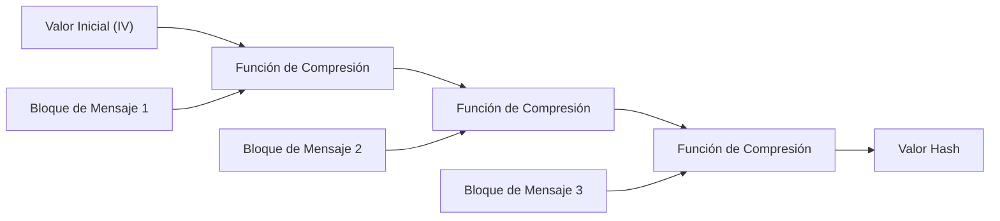
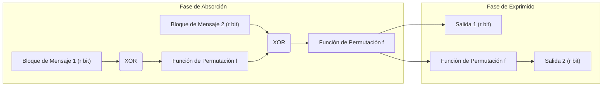

En la sociedad digital moderna, las "funciones hash criptográficas" se utilizan ampliamente como una tecnología fundamental para verificar que los datos no han sido manipulados y que la parte comunicante es realmente quien dice ser. Sus aplicaciones son diversas, e incluyen el almacenamiento de contraseñas, firmas digitales, blockchain y comunicaciones cifradas mediante SSL/TLS. En este artículo, profundizaremos en los requisitos de las funciones hash criptográficas, cómo se vulneraron MD5 y SHA-1 (que alguna vez fueron estándares), los problemas estructurales de SHA-2 (actualmente predominante), y la innovadora "estructura de esponja" de SHA-3 (Keccak), que se convirtió en el estándar de nueva generación tras la competencia del NIST.

## ¿Qué es una función hash criptográfica?

Una función hash es una función que toma datos (un mensaje) de cualquier longitud como entrada y genera datos de longitud fija (un valor hash o resumen del mensaje) como salida. Las funciones hash utilizadas para propósitos criptográficos requieren principalmente las tres siguientes propiedades robustas:

1. **Resistencia a la preimagen (Pre-image Resistance)**
   Dado un valor hash $h$, debe ser extremadamente difícil encontrar el mensaje original $m$ tal que $H(m) = h$. Si esto no se cumple, por ejemplo, una contraseña original podría ser calculada a la inversa a partir de su contraseña en formato hash.
2. **Resistencia a la segunda preimagen (Second Pre-image Resistance)**
   Dado un mensaje $m_1$, debe ser difícil encontrar un mensaje diferente $m_2$ tal que $H(m_1) = H(m_2)$ y $m_1 \neq m_2$.
3. **Resistencia a colisiones (Collision Resistance)**
   Debe ser difícil encontrar dos mensajes diferentes cualesquiera $m_1$ y $m_2$ tales que $H(m_1) = H(m_2)$. Esto es esencial para evitar ataques en los que un atacante malicioso cree un "archivo inofensivo" y un "archivo malicioso" con el mismo valor hash simultáneamente y los intercambie (por ejemplo, falsificación de firmas digitales).

Debido a una propiedad matemática conocida como el Ataque del Cumpleaños (Birthday Attack), la cantidad de cálculo requerida para encontrar una colisión en una función hash con una salida de $N$ bits es proporcional a $2^{N/2}$. Por lo tanto, para mantener una resistencia a colisiones práctica, es necesario un tamaño de salida de hash suficientemente largo.

## El colapso de MD5 y SHA-1: ¿Por qué se vulneraron las funciones hash del pasado?

Entre las funciones hash más utilizadas en Internet en el pasado se encontraban MD5 (salida de 128 bits), diseñada por Ronald Rivest, y SHA-1 (salida de 160 bits), diseñada por la NSA (Agencia de Seguridad Nacional de EE. UU.) y estandarizada por el NIST. Sin embargo, hoy en día se consideran "inseguras" y están obsoletas.

MD5 colapsó de facto en 2004 cuando investigadores chinos publicaron un ataque de descubrimiento de colisiones en un tiempo práctico. Además, con respecto a SHA-1, en 2005 se señalaron vulnerabilidades teóricas, y en 2017 un equipo de investigación de Google y CWI Amsterdam publicó un caso de colisión real llamado "SHAttered". Lograron generar dos archivos PDF diferentes con exactamente el mismo valor hash SHA-1.

La causa fundamental de la vulnerabilidad de estos algoritmos radicaba en las debilidades en el diseño de las funciones de compresión utilizadas internamente (por ejemplo, estructuras que facilitan la cancelación del efecto de las diferencias de los mensajes en el estado interno). Esto hizo posible encontrar colisiones con muchos menos cálculos que un ataque de fuerza bruta.

## SHA-2 y las limitaciones de la estructura de Merkle-Damgård

En respuesta al compromiso de MD5 y SHA-1, SHA-2, que tiene longitudes de salida más largas (256 bits, 512 bits, etc.) y una estructura mejorada, se ha convertido en la tendencia principal actual. Sin embargo, SHA-2 presentaba preocupaciones potenciales de diseño. En concreto, adopta la misma **estructura de Merkle-Damgård** utilizada en MD5 y SHA-1.

En la estructura de Merkle-Damgård, el mensaje de entrada se divide en bloques de un tamaño fijo, y un valor inicial (IV) y el primer bloque se pasan por una función de compresión para generar un estado intermedio. Luego, este estado intermedio y el siguiente bloque se pasan nuevamente por la función de compresión, y este proceso se repite en cadena.

Esta estructura ha sido confiable durante muchos años, pero se conoce una vulnerabilidad llamada "Ataque de Extensión de Longitud (Length Extension Attack)". Esto significa que, si un atacante conoce el valor hash $H(M)$ de un mensaje $M$ y la longitud de $M$, puede calcular fácilmente el valor hash $H(M || X)$ de $M$ concatenado con datos adicionales $X$, incluso sin conocer el contenido de $M$. Este problema representa un grave riesgo de seguridad en configuraciones simples de códigos de autenticación de mensajes (MAC) (mecanismos como HMAC fueron diseñados para prevenir esto).

## La competencia SHA-3 y la victoria de Keccak

En respuesta a las crecientes preocupaciones sobre la seguridad de SHA-2 (principalmente debido a sus similitudes estructurales), el NIST lanzó una competencia pública en 2007 para desarrollar un estándar de función hash de nueva generación, "SHA-3". Hubo 64 propuestas de todo el mundo y, tras años de rigurosas pruebas de criptoanálisis y evaluaciones de rendimiento, **Keccak**, diseñado por Guido Bertoni, Joan Daemen, Michaël Peeters y Gilles Van Assche, fue seleccionado como el ganador en 2012.

La razón principal por la que se eligió Keccak como SHA-3 es que adopta un paradigma completamente nuevo llamado **"Estructura de Esponja (Sponge Construction)"**, que es diferente a la estructura de Merkle-Damgård de la que dependían MD5, SHA-1 y SHA-2.

## Innovación matemática y de diseño de la estructura de esponja

La estructura de esponja, como su nombre indica, consta de dos fases: "Absorción (Absorbing)" y "Exprimido (Squeezing)".

### Composición del estado interno: Bitrate (r) y Capacidad (c)
El estado interno de Keccak se representa como una matriz de bits masiva (1600 bits en SHA-3). Este estado interno se divide en una parte de **Bitrate (Tasa de bits, $r$)** utilizada para la entrada/salida de datos y una parte de **Capacidad (Capacity, $c$)** que nunca se expone directamente al exterior (longitud del estado total $b = r + c$).

La capacidad $c$ actúa como una "caja negra secreta" que sustenta la seguridad. La fuerza de seguridad para prevenir colisiones en la salida depende aproximadamente de $c / 2$. Por ejemplo, en SHA-3-256, $c$ está configurado en 512 bits, proporcionando un nivel de seguridad de 256 bits.

### Fase de Absorción (Absorbing Phase)
1. El mensaje de entrada se divide en bloques de $r$ bits (incluyendo el padding/relleno).
2. El primer bloque del mensaje se somete a una operación XOR (O exclusivo) con la parte de $r$ bits del estado interno.
3. Se aplica una **función de permutación no lineal (Permutation Function $f$)** al total ($r + c$ bits), mezclando intensamente el estado interno.
4. El siguiente bloque del mensaje se somete nuevamente a XOR con la parte de $r$ bits, y se aplica la función $f$. Esto se repite hasta que se procesan todos los bloques del mensaje.

### Fase de Exprimido (Squeezing Phase)
1. Una vez completada la absorción, se extrae la parte de $r$ bits del estado interno y se utiliza como parte de la salida.
2. Si se requiere más salida, se aplica nuevamente la función $f$ para actualizar el estado interno, y se extraen nuevos $r$ bits. Esto se repite hasta alcanzar la longitud de salida necesaria (por ejemplo, 256 o 512 bits).

### ¿Por qué la estructura de esponja es superior?

1. **Resistencia a los ataques de extensión de longitud**: Dado que una parte del estado interno (la capacidad $c$) siempre está oculta, el atacante no puede reconstruir todo el estado interno, lo que neutraliza fundamentalmente el ataque de extensión de longitud, la debilidad de la estructura de Merkle-Damgård.
2. **Alta flexibilidad**: Al alterar el equilibrio entre $r$ y $c$, el rendimiento (aumentando $r$) y la seguridad (aumentando $c$) pueden ajustarse dinámicamente. Además, mientras continúe la fase de exprimido, se puede generar una secuencia infinita de números aleatorios, lo que significa que SHA-3 no es solo una función hash, sino que tiene la versatilidad de aplicarse como varios componentes criptográficos, como un generador de números pseudoaleatorios (PRNG), cifrado de flujo y códigos de autenticación de mensajes (MAC).
3. **Eficiencia en la implementación de hardware**: La función de permutación $f$ de Keccak consta únicamente de operaciones lógicas a nivel de bits (XOR, AND, NOT) y rotaciones, y no requiere operaciones aritméticas complejas (como sumas). Esto proporciona una gran ventaja al operar a velocidades extremadamente altas y con bajo consumo de energía, especialmente cuando se implementa en hardware (ASIC y FPGA).

## Conclusión

La historia de las funciones hash ha sido una batalla constante contra el criptoanálisis. La derrota de MD5 y SHA-1 puede verse como un resultado inevitable provocado por las debilidades en sus funciones de compresión internas y la evolución de las computadoras. Aunque SHA-2 se sigue utilizando de forma segura en la actualidad, tiene limitaciones de diseño derivadas de la estructura de Merkle-Damgård.

SHA-3 (Keccak) y la estructura de esponja, que surgieron como una solución fundamental a estos problemas, no fueron una simple actualización del algoritmo, sino un gran avance que redefinió la propia arquitectura del hash criptográfico. Su diseño flexible y robusto continuará sirviendo como una piedra angular importante para garantizar la confianza digital, desde los futuros dispositivos IoT hasta los sistemas criptográficos avanzados que anticipan la era de las computadoras cuánticas.
