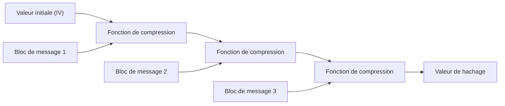
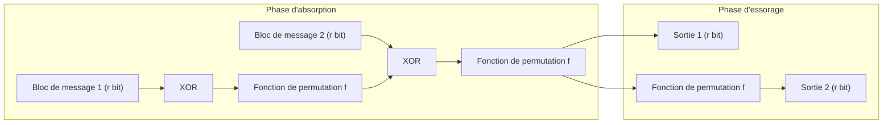

Dans la société numérique d'aujourd'hui, les fonctions de hachage cryptographique sont largement utilisées comme technologie de base pour confirmer que les données n'ont pas été falsifiées et que le correspondant est bien celui attendu. Leurs applications sont très variées : stockage de mots de passe, signatures numériques, blockchains, communications chiffrées par SSL/TLS, etc. Cet article détaille les exigences d'une fonction de hachage cryptographique, la façon dont les anciens standards MD5 et SHA-1 ont été brisés, les problèmes structurels de l'actuel standard SHA-2, et enfin la "construction en éponge" révolutionnaire de SHA-3 (Keccak), devenu le nouveau standard à l'issue de la compétition du NIST.

## Qu'est-ce qu'une fonction de hachage cryptographique ?

Une fonction de hachage prend des données de taille arbitraire (message) en entrée et produit des données de taille fixe (valeur de hachage ou condensat) en sortie. Pour un usage cryptographique, elle doit posséder trois propriétés majeures :

1. **Résistance à la préimage (Pre-image Resistance)**
   Étant donné une valeur de hachage $h$, il doit être extrêmement difficile de trouver un message d'origine $m$ tel que $H(m) = h$. Si cette condition n'est pas remplie, un mot de passe haché pourrait être inversé, par exemple.
2. **Résistance à la seconde préimage (Second Pre-image Resistance)**
   Étant donné un message $m_1$, il doit être difficile de trouver un autre message $m_2$ tel que $H(m_1) = H(m_2)$ et $m_1 \neq m_2$.
3. **Résistance aux collisions (Collision Resistance)**
   Il doit être difficile de trouver deux messages différents $m_1$ et $m_2$ quelconques tels que $H(m_1) = H(m_2)$. Ceci est essentiel pour empêcher un attaquant malveillant de créer simultanément un fichier inoffensif et un fichier malveillant ayant le même hachage afin de les substituer (par exemple pour forger une signature numérique).

En raison d'une propriété mathématique appelée attaque des anniversaires (Birthday Attack), la complexité de trouver une collision pour une fonction de hachage avec une sortie de $N$ bits est proportionnelle à $2^{N/2}$. Il faut donc une longueur de sortie suffisante pour maintenir une résistance pratique aux collisions.

## L'effondrement de MD5 et SHA-1 : Pourquoi les anciennes fonctions ont-elles été brisées ?

Parmi les fonctions de hachage les plus utilisées sur Internet dans le passé figuraient MD5 (sortie 128 bits), conçu par Ronald Rivest, et SHA-1 (sortie 160 bits), conçu par la NSA et standardisé par le NIST. Cependant, elles sont désormais déconseillées car considérées comme non sécurisées.

MD5 s'est pratiquement effondré en 2004 lorsque des chercheurs chinois ont annoncé une attaque permettant de trouver des collisions dans un temps pratique. Pour SHA-1, des vulnérabilités théoriques ont été soulignées en 2005, puis en 2017, une équipe de chercheurs de Google et du CWI Amsterdam a publié une collision réelle baptisée "SHAttered". Ils ont réussi à générer deux fichiers PDF différents ayant exactement la même valeur de hachage SHA-1.

La cause fondamentale de la rupture de ces algorithmes réside dans les faiblesses de conception de leur fonction de compression interne (par exemple, des structures où l'effet d'une différence de message sur l'état interne s'annule facilement). Cela a permis de trouver des collisions avec beaucoup moins de calculs qu'une attaque par force brute.

## Les limites de SHA-2 et de la construction de Merkle-Damgård

Suite à la compromission de MD5 et SHA-1, SHA-2, avec des longueurs de sortie plus grandes (256 bits, 512 bits, etc.) et une structure renforcée, est devenu le standard actuel. Cependant, SHA-2 présentait des problèmes de conception potentiels car il utilise la même **construction de Merkle-Damgård** que MD5 et SHA-1.

Dans la construction de Merkle-Damgård, le message d'entrée est divisé en blocs de taille fixe. Une valeur initiale (IV) et le premier bloc sont passés dans une fonction de compression pour générer un état intermédiaire. Ce processus est répété en chaîne avec l'état intermédiaire et le bloc suivant.

Bien que cette structure ait été fiable pendant de nombreuses années, on lui connaît une vulnérabilité appelée "attaque par extension de longueur" (Length Extension Attack). Si un attaquant connaît la valeur de hachage $H(M)$ et la longueur d'un message $M$, il peut facilement calculer le hachage $H(M || X)$ du message concaténé avec des données supplémentaires $X$, sans connaître le contenu de $M$. Ce problème pose un sérieux risque de sécurité dans la construction simple des codes d'authentification de message (MAC), c'est pourquoi des mécanismes comme HMAC ont été inventés.

## La compétition SHA-3 et la victoire de Keccak

Face aux inquiétudes croissantes concernant la sécurité de SHA-2 (principalement dues à des similitudes structurelles), le NIST a lancé en 2007 une compétition publique pour concevoir un standard de hachage de nouvelle génération, SHA-3. Après 64 soumissions du monde entier et plusieurs années d'évaluations rigoureuses de la cryptanalyse et des performances, **Keccak**, conçu par Guido Bertoni, Joan Daemen, Michaël Peeters et Gilles Van Assche, a été déclaré vainqueur en 2012.

La principale raison pour laquelle Keccak a été choisi comme SHA-3 est qu'il adopte un nouveau paradigme appelé **"construction en éponge" (Sponge Construction)**, totalement différent de la construction de Merkle-Damgård dont dépendaient MD5, SHA-1 et SHA-2.

## L'innovation mathématique et conceptuelle de la construction en éponge

Comme son nom l'indique, la construction en éponge se compose de deux phases : l'absorption (Absorbing) et l'essorage (Squeezing).

### Structure de l'état interne : Bitrate (r) et Capacité (c)
L'état interne de Keccak est représenté par un énorme tableau de bits (1600 bits pour SHA-3). Cet état interne est divisé en une partie **bitrate (Rate, $r$)** utilisée pour l'entrée et la sortie des données, et une partie **capacité (Capacity, $c$)** qui n'est jamais exposée directement à l'extérieur (longueur totale de l'état $b = r + c$).

La capacité $c$ agit comme une boîte noire secrète qui assure la sécurité fondamentale. La force de sécurité pour empêcher les collisions de sortie dépend approximativement de $c / 2$. Par exemple, pour SHA-3-256, $c$ est défini à 512 bits, offrant un niveau de sécurité de 256 bits.

### Phase d'absorption (Absorbing Phase)
1. Le message d'entrée est divisé en blocs de $r$ bits (incluant le padding).
2. Le premier bloc de message est combiné avec la partie de $r$ bits de l'état interne à l'aide d'un XOR (OU exclusif).
3. Une **fonction de permutation (Permutation Function $f$)** non linéaire est appliquée à l'ensemble de l'état ($r + c$ bits), ce qui mélange vigoureusement l'état interne.
4. Le bloc de message suivant est à nouveau XORé avec la partie de $r$ bits, puis la fonction $f$ est appliquée. Ceci est répété jusqu'à la fin de tous les blocs de message.

### Phase d'essorage (Squeezing Phase)
1. Une fois l'absorption terminée, la partie de $r$ bits de l'état interne est extraite pour former une partie de la sortie.
2. Si plus de sortie est nécessaire, la fonction $f$ est à nouveau appliquée pour mettre à jour l'état interne, et une nouvelle partie de $r$ bits est extraite. Ceci est répété jusqu'à atteindre la longueur de sortie requise (par exemple 256 bits ou 512 bits).

### Pourquoi la construction en éponge est-elle supérieure ?

1. **Résistance à l'attaque par extension de longueur** : Puisqu'une partie de l'état interne (la capacité $c$) est toujours cachée, un attaquant ne peut pas restaurer l'état interne entier, annulant fondamentalement l'attaque par extension de longueur qui était le point faible de la construction de Merkle-Damgård.
2. **Grande flexibilité** : En modifiant l'équilibre entre $r$ et $c$, les performances (augmenter $r$) et la sécurité (augmenter $c$) peuvent être ajustées dynamiquement. De plus, comme la phase d'essorage peut générer une séquence infinie de nombres pseudo-aléatoires tant qu'elle se poursuit, SHA-3 n'est pas seulement une fonction de hachage, mais possède la polyvalence pour être appliquée comme divers primitives cryptographiques, telles qu'un générateur de nombres pseudo-aléatoires (PRNG), un chiffrement de flux ou un code d'authentification de message (MAC).
3. **Efficacité de l'implémentation matérielle** : La fonction de permutation $f$ de Keccak est composée uniquement d'opérations logiques au niveau du bit (XOR, AND, NOT) et de rotations, ne nécessitant pas d'opérations arithmétiques complexes (comme l'addition). Cela présente l'avantage majeur de fonctionner de manière extrêmement rapide et économe en énergie, en particulier lors de l'implémentation sur du matériel (ASIC et FPGA).

## Conclusion

L'histoire des fonctions de hachage a été une bataille constante contre la cryptanalyse. La défaite de MD5 et SHA-1 est le résultat inévitable de l'évolution des ordinateurs et des faiblesses de leurs fonctions de compression internes. Bien que SHA-2 soit toujours utilisé en toute sécurité aujourd'hui, il souffre de limites de conception dues à la construction de Merkle-Damgård.

Apparus comme une réponse fondamentale à ces problèmes, SHA-3 (Keccak) et la construction en éponge n'étaient pas une simple mise à jour d'algorithme, mais une percée redéfinissant l'architecture même du hachage cryptographique. Sa conception flexible et robuste continuera de servir de pierre angulaire importante pour assurer la confiance numérique, des appareils IoT d'aujourd'hui aux systèmes cryptographiques avancés de l'ère de l'informatique quantique.
