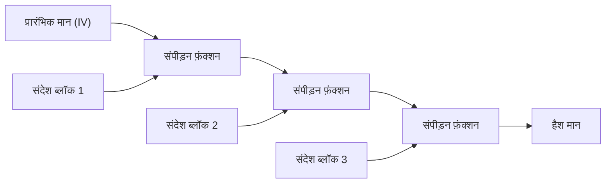

आधुनिक डिजिटल समाज में, 'क्रिप्टोग्राफ़िक हैश फ़ंक्शन' का व्यापक रूप से एक मूलभूत तकनीक के रूप में उपयोग किया जाता है। इसका उपयोग यह सत्यापित करने के लिए किया जाता है कि डेटा से छेड़छाड़ नहीं की गई है और संचार भागीदार वास्तव में वही है जिससे आप संवाद करना चाहते हैं। इसके अनुप्रयोगों की एक विस्तृत श्रृंखला है, जैसे पासवर्ड को सुरक्षित रखना, डिजिटल हस्ताक्षर, ब्लॉकचेन, और SSL/TLS का उपयोग करके एन्क्रिप्टेड संचार। इस लेख में, हम क्रिप्टोग्राफ़िक हैश फ़ंक्शंस की आवश्यकताओं से शुरू करेंगे, इस पर गहराई से विचार करेंगे कि कैसे MD5 और SHA-1, जो कभी मानक के रूप में उपयोग किए जाते थे, टूट गए थे, वर्तमान मुख्यधारा के SHA-2 के संरचनात्मक मुद्दे, और SHA-3 (Keccak) का क्रांतिकारी 'स्पंज कंस्ट्रक्शन', जो NIST प्रतियोगिता के माध्यम से एक नई पीढ़ी का मानक बन गया है।

## क्रिप्टोग्राफ़िक हैश फ़ंक्शन क्या है?

हैश फ़ंक्शन एक ऐसा फ़ंक्शन है जो इनपुट के रूप में किसी भी लंबाई का डेटा (संदेश) लेता है और आउटपुट के रूप में एक निश्चित लंबाई का डेटा (हैश मान, संदेश डाइजेस्ट) देता है। क्रिप्टोग्राफ़िक उद्देश्यों के लिए उपयोग किए जाने वाले हैश फ़ंक्शंस के लिए मुख्य रूप से निम्नलिखित तीन मजबूत विशेषताओं की आवश्यकता होती है:

1. **प्री-इमेज प्रतिरोध (Pre-image Resistance)**
   जब एक हैश मान $h$ दिया जाता है, तो मूल संदेश $m$ खोजना बेहद मुश्किल होना चाहिए ताकि $H(m) = h$ हो। यदि यह पूरा नहीं होता है, तो, उदाहरण के लिए, हैश किए गए पासवर्ड से मूल पासवर्ड का पता लगाया जा सकता है।
2. **दूसरा प्री-इमेज प्रतिरोध (Second Pre-image Resistance)**
   जब एक संदेश $m_1$ दिया जाता है, तो ऐसा दूसरा संदेश $m_2$ खोजना मुश्किल होना चाहिए कि $H(m_1) = H(m_2)$ और $m_1 \neq m_2$ हो।
3. **टक्कर प्रतिरोध (Collision Resistance)**
   कोई भी दो अलग-अलग संदेश $m_1, m_2$ खोजना मुश्किल होना चाहिए कि $H(m_1) = H(m_2)$ हो। यह एक दुर्भावनापूर्ण हमलावर को एक ही हैश मान के साथ एक 'हानिरहित फ़ाइल' और एक 'दुर्भावनापूर्ण फ़ाइल' बनाने और उन्हें स्वैप करने (उदाहरण के लिए, डिजिटल हस्ताक्षर बनाना) से रोकने के लिए आवश्यक है।

जन्मदिन हमले (Birthday Attack) नामक गणितीय गुण के कारण, $N$ बिट आउटपुट वाले हैश फ़ंक्शन के लिए टकराव खोजने की कम्प्यूटेशनल जटिलता $2^{N/2}$ के समानुपाती होती है। इसलिए, व्यावहारिक टक्कर प्रतिरोध बनाए रखने के लिए पर्याप्त लंबाई का हैश आउटपुट आवश्यक है।

## MD5 और SHA-1 का पतन: पिछले हैश फ़ंक्शन क्यों टूट गए थे?

अतीत में इंटरनेट पर सबसे व्यापक रूप से उपयोग किए जाने वाले हैश फ़ंक्शन में रोनाल्ड रिवेस्ट (Ronald Rivest) द्वारा डिज़ाइन किया गया MD5 (128-बिट आउटपुट) और NSA (अमेरिकी राष्ट्रीय सुरक्षा एजेंसी) द्वारा डिज़ाइन और NIST द्वारा मानकीकृत SHA-1 (160-बिट आउटपुट) शामिल थे। हालाँकि, अब उन्हें 'असुरक्षित' माना जाता है और उन्हें बहिष्कृत कर दिया गया है।

MD5 2004 में प्रभावी रूप से ढह गया जब चीनी शोधकर्ताओं ने व्यावहारिक समय में टकराव खोजने वाले हमले (collision finding attack) की घोषणा की। इसके अलावा, SHA-1 के लिए भी, 2005 में एक सैद्धांतिक भेद्यता का संकेत दिया गया था, और 2017 में, Google और CWI एम्स्टर्डम की शोध टीम द्वारा 'SHAttered' नामक एक वास्तविक टकराव का उदाहरण प्रकाशित किया गया था। वे बिल्कुल समान SHA-1 हैश मान के साथ दो अलग-अलग PDF फ़ाइलें जनरेट करने में सफल रहे।

इन एल्गोरिदम के टूटने का मूल कारण आंतरिक रूप से उपयोग किए जाने वाले संपीड़न फ़ंक्शन (compression function) के डिज़ाइन में कमज़ोरी थी (उदाहरण के लिए, ऐसी संरचना जो आंतरिक स्थिति पर संदेश के अंतर के प्रभाव को रद्द करना आसान बनाती है)। इसने ब्रूट-फोर्स (brute-force) हमलों की तुलना में बहुत कम गणनाओं के साथ टकराव खोजना संभव बना दिया।

## SHA-2 और Merkle-Damgård संरचना की सीमाएँ

MD5 और SHA-1 के कमज़ोर होने के जवाब में, SHA-2, जिसमें लंबी आउटपुट लंबाई (256 बिट्स, 512 बिट्स, आदि) और एक मजबूत संरचना है, वर्तमान मुख्यधारा बन गया है। हालाँकि, SHA-2 के डिज़ाइन में कुछ संभावित चिंताएँ थीं। वह यह है कि यह MD5 और SHA-1 के समान ही **Merkle-Damgård संरचना** को अपनाता है।

Merkle-Damgård संरचना में, इनपुट संदेश को एक निश्चित आकार के ब्लॉकों में विभाजित किया जाता है, और एक मध्यवर्ती स्थिति उत्पन्न करने के लिए प्रारंभिक मान (IV) और पहले ब्लॉक को संपीड़न फ़ंक्शन से गुजारा जाता है। उसके बाद, उस मध्यवर्ती स्थिति और अगले ब्लॉक को फिर से संपीड़न फ़ंक्शन के माध्यम से पारित किया जाता है, और इस प्रक्रिया को एक श्रृंखला में दोहराया जाता है।



यह संरचना कई वर्षों से विश्वसनीय रही है, लेकिन 'लेंथ एक्सटेंशन अटैक (Length Extension Attack)' नामक एक भेद्यता ज्ञात है। यह ऐसा हमला है कि यदि किसी संदेश $M$ का हैश मान $H(M)$ और $M$ की लंबाई ज्ञात हो, तो एक हमलावर आसानी से अतिरिक्त डेटा $X$ जोड़े गए $M || X$ का हैश मान $H(M || X)$ की गणना कर सकता है, बिना $M$ की सामग्री जाने। यह समस्या संदेश प्रमाणीकरण कोड (MAC) के सरल निर्माण में एक गंभीर सुरक्षा जोखिम पैदा करती है (इसे रोकने के लिए HMAC जैसी प्रणालियाँ तैयार की गई थीं)।

## SHA-3 प्रतियोगिता और Keccak की जीत

SHA-2 की सुरक्षा के बारे में बढ़ती चिंताओं (मुख्य रूप से इसकी संरचनात्मक समानता के कारण) के जवाब में, NIST ने 2007 में अगली पीढ़ी के हैश फ़ंक्शन मानक, 'SHA-3' को विकसित करने के लिए एक खुली प्रतियोगिता शुरू की। दुनिया भर से 64 प्रविष्टियाँ थीं, और कई वर्षों के कठोर क्रिप्टैनालिसिस परीक्षणों और प्रदर्शन मूल्यांकन के बाद, 2012 में गुइडो बर्टोनी (Guido Bertoni), जोन डेमेन (Joan Daemen), माइकल पीटर्स (Michaël Peeters) और गाइल्स वैन एस्चे (Gilles Van Assche) द्वारा डिज़ाइन किया गया **Keccak** विजेता के रूप में चुना गया।

Keccak को SHA-3 के रूप में चुने जाने का सबसे बड़ा कारण यह है कि इसने **'स्पंज कंस्ट्रक्शन (Sponge Construction)'** नामक एक नया प्रतिमान (paradigm) अपनाया, जो Merkle-Damgård संरचना से पूरी तरह अलग है जिस पर MD5, SHA-1 और SHA-2 निर्भर थे।

## स्पंज संरचना का गणितीय और डिज़ाइन नवाचार

स्पंज संरचना में, जैसा कि नाम से पता चलता है, दो चरण होते हैं: 'एब्जॉर्बिंग (Absorbing)' (अवशोषण) और 'स्क्वीज़िंग (Squeezing)' (निचोड़ना)।

### आंतरिक अवस्था की संरचना: बिटरेट (r) और कैपेसिटी (c)
Keccak की आंतरिक अवस्था (internal state) को एक विशाल बिट सरणी (SHA-3 के लिए 1600 बिट्स) के रूप में दर्शाया गया है। यह आंतरिक स्थिति एक **बिटरेट (Rate, $r$)** भाग में विभाजित होती है जिसका उपयोग डेटा इनपुट और आउटपुट के लिए किया जाता है, और एक **कैपेसिटी (Capacity, $c$)** भाग जो कभी भी सीधे बाहर की दुनिया के संपर्क में नहीं आता है (कुल स्थिति लंबाई $b = r + c$)।

कैपेसिटी $c$ सुरक्षा के मूल के लिए जिम्मेदार एक 'गुप्त ब्लैक बॉक्स' के रूप में कार्य करती है। आउटपुट टकरावों को रोकने के लिए सुरक्षा शक्ति मोटे तौर पर $c / 2$ पर निर्भर करती है। उदाहरण के लिए, SHA-3-256 के लिए $c = 512$ बिट्स सेट किया गया है, जो 256 बिट्स का सुरक्षा स्तर प्रदान करता है।

### एब्जॉर्बिंग चरण (Absorbing Phase)
1. इनपुट संदेश को $r$ बिट्स के ब्लॉक में विभाजित किया जाता है (पैडिंग सहित)।
2. पहले संदेश ब्लॉक और आंतरिक स्थिति के $r$ बिट भाग के बीच XOR (Exclusive OR) किया जाता है।
3. संपूर्ण ($r + c$ बिट्स) पर एक गैर-रैखिक **पर्म्यूटेशन फ़ंक्शन (Permutation Function $f$)** लागू किया जाता है, जो आंतरिक स्थिति को तीव्रता से मिलाता है।
4. अगले संदेश ब्लॉक को फिर से $r$ बिट भाग के साथ XOR किया जाता है, और फ़ंक्शन $f$ लागू किया जाता है। यह तब तक दोहराया जाता है পুনরাবৃত্তি किया जाता है जब तक कि सभी संदेश ब्लॉक समाप्त नहीं हो जाते।

### स्क्वीज़िंग चरण (Squeezing Phase)
1. अवशोषण पूरा होने के बाद, आंतरिक स्थिति का $r$ बिट भाग निकाला जाता है और आउटपुट के एक भाग के रूप में उपयोग किया जाता है।
2. यदि अधिक आउटपुट की आवश्यकता है, तो आंतरिक स्थिति को अपडेट करने के लिए फ़ंक्शन $f$ फिर से लागू किया जाता है, और नया $r$ बिट भाग निकाला जाता है। यह तब तक दोहराया जाता है जब तक कि आवश्यक आउटपुट लंबाई (उदाहरण के लिए, 256 बिट्स या 512 बिट्स) प्राप्त नहीं हो जाती।

```mermaid
graph LR
    subgraph एब्जॉर्बिंग चरण
    M1["संदेश ब्लॉक 1 (r bit)"] --> XOR1(XOR)
    XOR1 --> F1["पर्म्यूटेशन फ़ंक्शन f"]
    M2["संदेश ब्लॉक 2 (r bit)"] --> XOR2(XOR)
    F1 --> XOR2
    XOR2 --> F2["पर्म्यूटेशन फ़ंक्शन f"]
    end
    
    subgraph स्क्वीज़िंग चरण
    F2 --> Out1["आउटपुट 1 (r bit)"]
    F2 --> F3["पर्म्यूटेशन फ़ंक्शन f"]
    F3 --> Out2["आउटपुट 2 (r bit)"]
    end
```

### स्पंज संरचना बेहतर क्यों है?

1. **लेंथ एक्सटेंशन अटैक के प्रति प्रतिरोध**: चूंकि आंतरिक स्थिति का हिस्सा (कैपेसिटी $c$) हमेशा छिपा रहता है, इसलिए हमलावर पूरी आंतरिक स्थिति को पुनर्स्थापित नहीं कर सकता है, जो Merkle-Damgård संरचना की कमज़ोरी, लेंथ एक्सटेंशन अटैक को मौलिक रूप से अमान्य कर देता है।
2. **उच्च लचीलापन**: $r$ और $c$ के संतुलन को बदलकर, प्रदर्शन ($r$ को बढ़ाना) और सुरक्षा ($c$ को बढ़ाना) को गतिशील रूप से समायोजित किया जा सकता है। इसके अलावा, जब तक स्क्वीज़िंग चरण जारी रहता है तब तक यादृच्छिक संख्याओं का एक अनंत अनुक्रम उत्पन्न किया जा सकता है, इसलिए SHA-3 केवल एक हैश फ़ंक्शन तक सीमित नहीं है, बल्कि इसे छद्म-यादृच्छिक संख्या जनरेटर (PRNG), स्ट्रीम सिफर और संदेश प्रमाणीकरण कोड (MAC) जैसे विभिन्न क्रिप्टोग्राफ़िक प्रिमिटिव के रूप में लागू किया जा सकता है।
3. **हार्डवेयर कार्यान्वयन में दक्षता**: Keccak का पर्म्यूटेशन फ़ंक्शन $f$ केवल बिटवाइज़ लॉजिकल ऑपरेशन्स (XOR, AND, NOT) और रोटेशन से बना है, और इसे जटिल अंकगणितीय ऑपरेशन्स (जैसे जोड़) की आवश्यकता नहीं होती है। इसका एक बड़ा फायदा यह है कि यह विशेष रूप से हार्डवेयर (ASIC या FPGA) में लागू होने पर बहुत तेज़ी से और कम बिजली की खपत के साथ काम करता है।

## निष्कर्ष

हैश फ़ंक्शंस का इतिहास क्रिप्टैनालिसिस के खिलाफ लगातार संघर्ष रहा है। MD5 और SHA-1 की हार को आंतरिक संपीड़न फ़ंक्शन (compression function) की कमज़ोरियों और कंप्यूटरों के विकास द्वारा लाए गए अपरिहार्य परिणाम के रूप में देखा जा सकता है। यद्यपि SHA-2 का उपयोग आज भी सुरक्षित रूप से किया जा रहा है, इसमें Merkle-Damgård संरचना से उत्पन्न होने वाली डिज़ाइन सीमाएँ हैं।

इनके मूलभूत उत्तर के रूप में सामने आए SHA-3 (Keccak) और स्पंज कंस्ट्रक्शन एक साधारण एल्गोरिथम अपडेट नहीं थे, बल्कि एक सफलता थी जिसने क्रिप्टोग्राफ़िक हैश आर्किटेक्चर को फिर से परिभाषित किया। इसका लचीला और मजबूत डिज़ाइन डिजिटल विश्वास सुनिश्चित करने के लिए एक महत्वपूर्ण आधार के रूप में काम करता रहेगा, भविष्य के IoT उपकरणों से लेकर क्वांटम कंप्यूटर युग को ध्यान में रखते हुए उन्नत क्रिप्टोग्राफ़िक सिस्टम तक।
