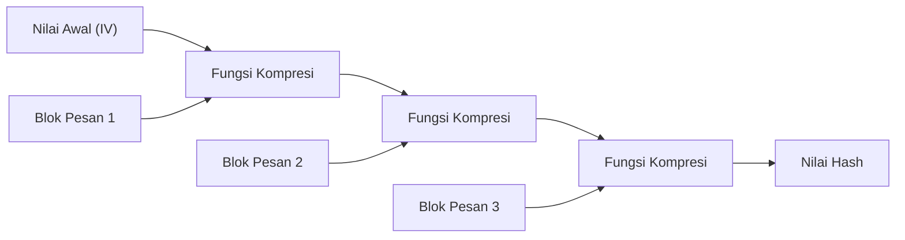
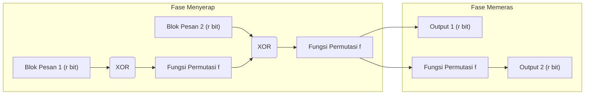

Dalam masyarakat digital modern, "fungsi hash kriptografis" digunakan secara luas sebagai teknologi dasar untuk memastikan bahwa data tidak dimodifikasi dan bahwa pihak yang berkomunikasi benar-benar merupakan pihak yang dituju. Aplikasinya sangat beragam, seperti penyimpanan kata sandi, tanda tangan digital, blockchain, dan komunikasi terenkripsi menggunakan SSL/TLS. Artikel ini akan membahas secara mendalam dimulai dari persyaratan yang dibutuhkan untuk fungsi hash kriptografis, bagaimana MD5 dan SHA-1 yang dulunya menjadi standar berhasil diretas, tantangan struktural pada SHA-2 yang saat ini menjadi arus utama, hingga "struktur spons" (sponge construction) revolusioner dari SHA-3 (Keccak) yang menjadi standar generasi baru melalui kompetisi NIST.

## Apa itu Fungsi Hash Kriptografis?

Fungsi hash adalah fungsi yang menerima panjang data (pesan) apa pun sebagai masukan dan menghasilkan data dengan panjang tetap (nilai hash, message digest) sebagai keluaran. Fungsi hash yang digunakan untuk tujuan kriptografis utamanya membutuhkan 3 karakteristik kuat berikut:

1. **Ketahanan Pra-peta (Pre-image Resistance)**
   Ketika diberikan nilai hash $h$, sangat sulit untuk menemukan pesan asli $m$ sehingga $H(m) = h$. Jika ini tidak terpenuhi, misalnya, kata sandi asli dapat dihitung balik dari kata sandi yang telah di-hash.
2. **Ketahanan Pra-peta Kedua (Second Pre-image Resistance)**
   Ketika diberikan pesan $m_1$, sulit untuk menemukan pesan lain $m_2$ sehingga $H(m_1) = H(m_2)$ dan $m_1 \neq m_2$.
3. **Ketahanan Kolisi (Collision Resistance)**
   Sulit untuk menemukan dua pesan berbeda mana pun $m_1, m_2$ sehingga $H(m_1) = H(m_2)$. Hal ini sangat penting untuk mencegah serangan di mana penyerang yang berniat jahat membuat "file tidak berbahaya" dan "file berbahaya" yang memiliki nilai hash yang sama pada saat bersamaan, lalu menukarnya (misalnya, pemalsuan tanda tangan digital).

Karena sifat matematis yang disebut Serangan Ulang Tahun (Birthday Attack), kompleksitas komputasi untuk menemukan kolisi dalam fungsi hash dengan output $N$ bit sebanding dengan $2^{N/2}$. Oleh karena itu, untuk mempertahankan ketahanan kolisi yang praktis, panjang output hash yang memadai diperlukan.

## Runtuhnya MD5 dan SHA-1: Mengapa Fungsi Hash Masa Lalu Diretas?

Fungsi hash yang dulunya paling banyak digunakan di internet termasuk MD5 (output 128-bit) yang dirancang oleh Ronald Rivest, dan SHA-1 (output 160-bit) yang dirancang oleh NSA (Badan Keamanan Nasional AS) dan distandarisasi oleh NIST. Namun, saat ini keduanya telah ditinggalkan karena dianggap "tidak aman".

MD5 pada dasarnya runtuh pada tahun 2004 ketika para peneliti dari Tiongkok mengumumkan serangan penemuan kolisi dalam waktu yang praktis. Selanjutnya, untuk SHA-1, kerentanan teoretis ditunjukkan pada tahun 2005, dan pada tahun 2017 tim peneliti dari Google dan CWI Amsterdam merilis contoh kolisi nyata yang disebut "SHAttered". Mereka berhasil menghasilkan dua file PDF berbeda yang memiliki nilai hash SHA-1 yang sama persis.

Penyebab mendasar rusaknya algoritma ini terletak pada kelemahan desain fungsi kompresi yang digunakan di dalamnya (misalnya, struktur yang memudahkan saling meniadakan efek dari perbedaan pesan pada status internal). Hal ini memungkinkan untuk menemukan kolisi dengan jumlah komputasi yang jauh lebih sedikit dibandingkan dengan serangan brute-force.

## Batasan Struktur SHA-2 dan Merkle-Damgård

Menyusul terkomprominya MD5 dan SHA-1, SHA-2 yang memiliki panjang output lebih besar (256-bit, 512-bit, dll.) dan struktur yang diperkuat telah menjadi arus utama saat ini. Namun, ada masalah laten dalam desain SHA-2. Yaitu fakta bahwa algoritma ini mengadopsi **struktur Merkle-Damgård** yang sama seperti MD5 dan SHA-1.

Dalam struktur Merkle-Damgård, pesan input dibagi menjadi blok-blok dengan ukuran tertentu, dan nilai awal (IV) serta blok pertama dilewatkan melalui fungsi kompresi untuk menghasilkan status perantara. Setelah itu, proses melewatkan status perantara dan blok berikutnya melalui fungsi kompresi diulang secara berantai.

Meskipun struktur ini telah dipercaya selama bertahun-tahun, kerentanan yang disebut "Serangan Ekstensi Panjang" (Length Extension Attack) telah diketahui. Ini berarti bahwa jika nilai hash $H(M)$ dari pesan tertentu $M$ dan panjang $M$ diketahui, penyerang dapat dengan mudah menghitung nilai hash $H(M || X)$ dari $M || X$ dengan data tambahan $X$ ditambahkan, bahkan tanpa mengetahui konten dari $M$. Masalah ini menimbulkan risiko keamanan yang serius dalam konstruksi sederhana kode otentikasi pesan (MAC) (mekanisme seperti HMAC dirancang untuk mencegah hal ini).

## Kompetisi SHA-3 dan Kemenangan Keccak

Menanggapi meningkatnya kekhawatiran tentang keamanan SHA-2 (terutama karena kesamaan struktural), NIST meluncurkan kompetisi publik pada tahun 2007 untuk menetapkan standar fungsi hash generasi baru "SHA-3". Ada 64 pengajuan dari seluruh dunia, dan setelah menjalani uji coba kriptanalisis yang ketat dan evaluasi kinerja selama beberapa tahun, **Keccak**, yang dirancang oleh Guido Bertoni, Joan Daemen, Michaël Peeters, dan Gilles Van Assche, dipilih sebagai pemenang pada tahun 2012.

Alasan terbesar mengapa Keccak dipilih sebagai SHA-3 adalah karena mengadopsi paradigma baru yang disebut **"Struktur Spons" (Sponge Construction)**, yang sama sekali berbeda dari struktur Merkle-Damgård yang menjadi sandaran MD5, SHA-1, dan SHA-2.

## Inovasi Matematis dan Desain dari Struktur Spons

Struktur spons, seperti namanya, terdiri dari dua fase: "Menyerap" (Absorbing) dan "Memeras" (Squeezing).

### Konfigurasi Status Internal: Bitrate (r) dan Kapasitas (c)
Status internal Keccak direpresentasikan sebagai susunan bit yang sangat besar (1600 bit dalam SHA-3). Status internal ini dibagi menjadi bagian **Bitrate (Rate, $r$)** yang digunakan untuk input/output data, dan bagian **Kapasitas (Capacity, $c$)** yang tidak pernah terekspos secara langsung ke luar (panjang status total $b = r + c$).

Kapasitas $c$ berfungsi sebagai "kotak hitam rahasia" yang mendasari keamanan. Kekuatan keamanan untuk mencegah kolisi output secara umum bergantung pada $c / 2$. Misalnya, pada SHA-3-256, $c$ ditetapkan ke 512 bit, memberikan tingkat keamanan 256-bit.

### Fase Menyerap (Absorbing Phase)
1. Bagi pesan input ke dalam blok-blok sebesar $r$ bit (termasuk padding).
2. Lakukan XOR (Exclusive OR) antara blok pesan pertama dan bagian $r$ bit dari status internal.
3. Terapkan **fungsi permutasi $f$** non-linier ke seluruh bagian ($r + c$ bit) untuk mengaduk status internal secara intensif.
4. Lakukan XOR lagi antara blok pesan berikutnya dengan bagian $r$ bit, dan terapkan fungsi $f$. Ulangi proses ini hingga semua blok pesan selesai.

### Fase Memeras (Squeezing Phase)
1. Setelah penyerapan selesai, ekstrak bagian $r$ bit dari status internal dan jadikan sebagai bagian dari output.
2. Jika output lebih lanjut diperlukan, terapkan fungsi $f$ lagi untuk memperbarui status internal, dan ekstrak $r$ bit baru. Ulangi proses ini hingga mencapai panjang output yang diperlukan (misalnya 256 bit atau 512 bit).

### Mengapa Struktur Spons Lebih Unggul?

1. **Ketahanan terhadap Serangan Ekstensi Panjang**: Karena bagian dari status internal (kapasitas $c$) selalu disembunyikan, penyerang tidak dapat memulihkan seluruh status internal, sehingga secara mendasar menggagalkan serangan ekstensi panjang yang menjadi kelemahan struktur Merkle-Damgård.
2. **Fleksibilitas Tinggi**: Dengan mengubah keseimbangan antara $r$ dan $c$, kinerja (dengan memperbesar $r$) dan keamanan (dengan memperbesar $c$) dapat disesuaikan secara dinamis. Selain itu, karena deret angka acak dapat dihasilkan tanpa batas waktu selama fase memeras berlanjut, SHA-3 tidak hanya terbatas pada fungsi hash, tetapi juga memiliki keserbagunaan untuk diterapkan sebagai berbagai primitif kriptografi seperti generator angka acak semu (PRNG), cipher aliran, dan kode otentikasi pesan (MAC).
3. **Efisiensi Implementasi Perangkat Keras**: Fungsi permutasi $f$ Keccak hanya terdiri dari operasi logika tingkat bit (XOR, AND, NOT) dan rotasi, dan tidak memerlukan operasi aritmatika yang kompleks (seperti penambahan). Hal ini memberikan keuntungan besar dengan beroperasi sangat cepat dan hemat daya, terutama saat diimplementasikan dalam perangkat keras (ASIC dan FPGA).

## Kesimpulan

Sejarah fungsi hash telah menjadi perjuangan terus-menerus melawan kriptanalisis. Kekalahan MD5 dan SHA-1 dapat dikatakan sebagai akibat yang tak terelakkan dari kelemahan fungsi kompresi internal dan evolusi komputer. Meskipun SHA-2 saat ini masih digunakan dengan aman, ia memiliki batasan desain karena struktur Merkle-Damgård.

SHA-3 (Keccak) dan struktur spons, yang muncul sebagai solusi mendasar untuk masalah ini, bukanlah pembaruan algoritma sederhana, tetapi merupakan terobosan yang mendefinisikan ulang arsitektur hash kriptografis itu sendiri. Desainnya yang fleksibel dan kuat akan terus berfungsi sebagai landasan penting untuk menjamin kepercayaan digital, mulai dari perangkat IoT di masa depan hingga sistem kriptografi tingkat lanjut yang mengantisipasi era komputasi kuantum.
