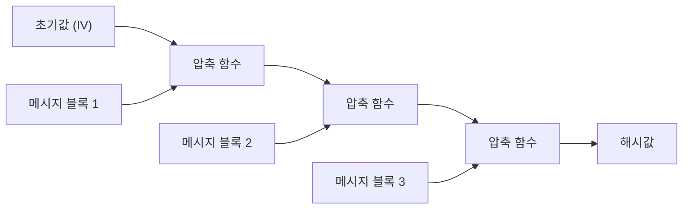
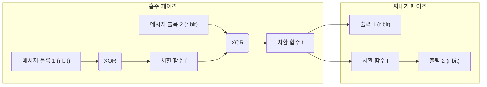

현대 디지털 사회에서 데이터가 변조되지 않았음과 통신 상대가 정말로 의도한 상대인지를 확인하기 위한 기반 기술로서 '암호학적 해시 함수'가 널리 사용되고 있습니다. 비밀번호 저장, 디지털 서명, 블록체인, SSL/TLS에 의한 암호화 통신 등 그 응용 범위는 다양합니다. 본 기사에서는 암호학적 해시 함수에 요구되는 요건부터 시작하여 과거 표준으로 사용되던 MD5나 SHA-1이 어떻게 깨졌는지, 현재 주류인 SHA-2의 구조적 과제, 그리고 NIST의 컴피티션을 거쳐 차세대 표준이 된 SHA-3(Keccak)의 획기적인 '스펀지 구조'까지 깊이 파고들어 해설합니다.

## 암호학적 해시 함수란 무엇인가?

해시 함수는 임의의 길이의 데이터(메시지)를 입력으로 받아 고정 길이의 데이터(해시값, 메시지 다이제스트)를 출력하는 함수입니다. 암호학적 용도로 사용되는 해시 함수에는 주로 다음 세 가지 강력한 특성이 요구됩니다.

1. **역상 저항성 (Pre-image Resistance)**
   해시값 $h$가 주어졌을 때, $H(m) = h$가 되는 원래 메시지 $m$을 찾는 것이 극히 어려울 것. 이것이 충족되지 않으면, 예를 들어 해시화된 비밀번호로부터 원래의 비밀번호를 역산당할 수 있습니다.
2. **제2 역상 저항성 (Second Pre-image Resistance)**
   메시지 $m_1$이 주어졌을 때, $H(m_1) = H(m_2)$이고 $m_1 \neq m_2$가 되는 다른 메시지 $m_2$를 찾는 것이 어려울 것.
3. **충돌 내성 (Collision Resistance)**
   $H(m_1) = H(m_2)$가 되는 임의의 서로 다른 두 메시지 $m_1, m_2$를 찾는 것이 어려울 것. 이는 악의적인 공격자가 같은 해시값을 갖는 '무해한 파일'과 '악의적인 파일'을 동시에 생성하여 바꿔치기하는 공격(예: 디지털 서명 위조)을 방지하기 위해 필수적입니다.

생일 공격(Birthday Attack)이라 불리는 수학적 성질로 인해, $N$ 비트 출력을 갖는 해시 함수의 충돌을 찾기 위한 계산량은 $2^{N/2}$에 비례합니다. 따라서 실용적인 충돌 내성을 유지하기 위해서는 충분한 길이의 해시 출력이 필요합니다.

## MD5와 SHA-1의 붕괴: 왜 과거의 해시 함수는 깨졌는가?

과거 인터넷상에서 가장 널리 사용되던 해시 함수로는 Ronald Rivest가 설계한 MD5(128비트 출력)와 NSA(미국 국가안보국)가 설계하고 NIST가 표준화한 SHA-1(160비트 출력)이 있습니다. 하지만 현재 이들은 '안전하지 않다'며 권장되지 않습니다.

MD5는 2004년에 중국의 연구원들에 의해 실용적인 시간 내의 충돌 발견 공격이 발표되면서 사실상 붕괴했습니다. 또한 SHA-1에 대해서도 2005년에 이론적인 취약성이 지적되었고, 2017년에는 Google과 CWI Amsterdam의 연구팀에 의해 'SHAttered'라 불리는 실제 충돌 사례가 공개되었습니다. 이들은 완전히 같은 SHA-1 해시값을 갖는 서로 다른 2개의 PDF 파일을 생성하는 데 성공한 것입니다.

이러한 알고리즘이 깨진 근본적인 원인은 내부에 사용되는 압축 함수 설계의 약점(예를 들어, 메시지의 차이가 내부 상태에 미치는 영향을 상쇄하기 쉬운 구조)에 있었습니다. 이로 인해 무차별 대입 공격(브루트 포스)보다 훨씬 적은 계산량으로 충돌을 찾아내는 것이 가능해져 버린 것입니다.

## SHA-2와 Merkle-Damgård 구조의 한계

MD5와 SHA-1의 위태화로 인해, 더 긴 출력 길이(256비트, 512비트 등)를 가지며 구조가 강화된 SHA-2가 현재의 주류가 되었습니다. 그러나 SHA-2에는 설계상의 잠재적인 우려 사항이 존재했습니다. 그것은 MD5나 SHA-1과 같은 **Merkle-Damgård(머클-담가드) 구조**를 채택하고 있다는 점입니다.

Merkle-Damgård 구조에서는 입력 메시지를 일정 크기의 블록으로 분할하고, 초기값(IV)과 첫 번째 블록을 압축 함수에 적용하여 중간 상태를 생성합니다. 그 후 해당 중간 상태와 다음 블록을 다시 압축 함수에 적용하는 과정을 연쇄적으로 반복합니다.

이 구조는 오랜 세월에 걸쳐 신뢰받아 왔지만, '길이 확장 공격(Length Extension Attack)'이라 불리는 취약성이 알려져 있습니다. 이는 어떤 메시지 $M$의 해시값 $H(M)$과 $M$의 길이를 알고 있는 경우, 공격자는 $M$의 내용을 몰라도 추가 데이터 $X$를 덧붙인 $M || X$의 해시값 $H(M || X)$를 쉽게 계산할 수 있다는 것입니다. 이 문제는 메시지 인증 코드(MAC)의 단순한 구성에서 심각한 보안 위험을 초래합니다(이를 방지하기 위해 HMAC 등의 메커니즘이 고안되었습니다).

## SHA-3 컴피티션과 Keccak의 승리

SHA-2의 안전성에 대한 (주로 구조적인 유사성에서 기인한) 우려가 커지자, NIST는 2007년에 차세대 해시 함수 표준 'SHA-3'를 제정하기 위한 공개 컴피티션을 시작했습니다. 전 세계에서 64건의 지원이 있었고, 수년에 걸친 엄격한 암호 해독의 시련과 성능 평가를 거쳐 2012년에 Guido Bertoni, Joan Daemen, Michaël Peeters, Gilles Van Assche 등이 설계한 **Keccak(케착)**이 승자로 선정되었습니다.

Keccak이 SHA-3로 선정된 가장 큰 이유는 MD5, SHA-1, SHA-2가 의존하던 Merkle-Damgård 구조와는 전혀 다른, **'스펀지 구조(Sponge Construction)'**라 불리는 새로운 패러다임을 채택했기 때문입니다.

## 스펀지 구조의 수학적·설계적 혁신성

스펀지 구조는 그 이름대로 '흡수(Absorbing)'와 '짜내기(Squeezing)'라는 두 가지 페이즈로 구성됩니다.

### 내부 상태의 구성: 비트레이트(r)와 캐퍼시티(c)
Keccak의 내부 상태는 거대한 비트 배열(SHA-3에서는 1600비트)로 표현됩니다. 이 내부 상태는 데이터의 입출력에 사용되는 **비트레이트(Rate, $r$)** 부분과, 외부에는 결코 직접 노출되지 않는 **캐퍼시티(Capacity, $c$)** 부분으로 분할됩니다(총 상태 길이 $b = r + c$).

캐퍼시티 $c$는 보안의 근간을 담당하는 '비밀의 블랙박스'로 기능합니다. 출력의 충돌을 방지하기 위한 보안 강도는 대략 $c / 2$에 의존합니다. 예를 들어 SHA-3-256에서는 $c = 512$ 비트로 설정되어 있어 256비트의 보안 수준을 제공합니다.

### 흡수 페이즈 (Absorbing Phase)
1. 입력 메시지를 $r$ 비트씩의 블록으로 분할(패딩 포함)합니다.
2. 첫 번째 메시지 블록과 내부 상태의 $r$ 비트 부분을 XOR(배타적 논리합)합니다.
3. 전체($r + c$ 비트)에 대해 비선형적인 **치환 함수(Permutation Function $f$)**를 적용하여 내부 상태를 격렬하게 뒤섞습니다.
4. 다음 메시지 블록을 다시 $r$ 비트 부분과 XOR하고 함수 $f$를 적용합니다. 이를 모든 메시지 블록이 끝날 때까지 반복합니다.

### 짜내기 페이즈 (Squeezing Phase)
1. 흡수가 완료된 후, 내부 상태의 $r$ 비트 부분을 꺼내어 출력의 일부로 만듭니다.
2. 출력이 더 필요한 경우에는 다시 함수 $f$를 적용하여 내부 상태를 갱신하고, 새로운 $r$ 비트를 꺼냅니다. 이를 필요한 출력 길이(예: 256비트나 512비트)에 도달할 때까지 반복합니다.

### 왜 스펀지 구조가 뛰어난가?

1. **길이 확장 공격에 대한 내성**: 내부 상태의 일부(캐퍼시티 $c$)가 항상 은폐되어 있기 때문에 공격자는 내부 상태 전체를 복원할 수 없으며, Merkle-Damgård 구조의 약점이었던 길이 확장 공격을 근본적으로 무효화합니다.
2. **높은 유연성**: $r$과 $c$의 비율을 변경함으로써 성능($r$을 크게 함)과 보안($c$를 크게 함)을 동적으로 조정할 수 있습니다. 또한 짜내기 페이즈를 계속하는 한 무한히 난수열을 생성할 수 있어, SHA-3는 단순한 해시 함수에 그치지 않고 의사 난수 생성기(PRNG)나 스트림 암호, 메시지 인증 코드(MAC) 등 다양한 암호 프리미티브로 응용될 수 있는 범용성을 갖추고 있습니다.
3. **하드웨어 구현의 효율성**: Keccak의 치환 함수 $f$는 비트 단위의 논리 연산(XOR, AND, NOT)과 로테이션만으로 구성되어 있어 복잡한 산술 연산(덧셈 등)을 필요로 하지 않습니다. 이로 인해 특히 하드웨어(ASIC이나 FPGA)에 구현할 때 극히 고속으로 저전력으로 동작한다는 큰 이점이 있습니다.

## 요약

해시 함수의 역사는 끊임없는 암호 해독과의 싸움이었습니다. MD5나 SHA-1의 패배는 내부 압축 함수의 약점과 컴퓨터의 진화가 가져온 필연적인 결과라고 할 수 있습니다. SHA-2는 현재도 안전하게 사용되고 있지만, Merkle-Damgård 구조에 기인한 설계상의 한계를 안고 있습니다.

이에 대한 근본적인 해답으로 등장한 SHA-3(Keccak)과 스펀지 구조는 단순한 알고리즘의 갱신이 아니라, 암호학적 해시의 아키텍처 자체를 재정의하는 돌파구였습니다. 그 유연하고 견고한 설계는 앞으로의 IoT 디바이스부터 양자 컴퓨터 시대를 내다보는 고도화된 암호 시스템에 이르기까지, 디지털의 신뢰를 담보하는 중요한 초석으로서 계속 기능할 것입니다.
