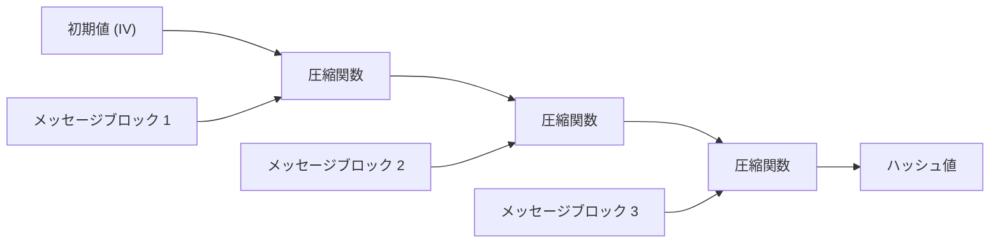
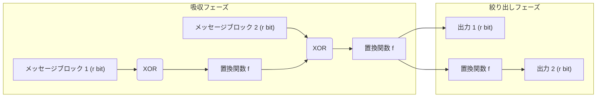

現代のデジタル社会において、データが改ざんされていないこと、そして通信相手が本当に意図した相手であることを確認するための基盤技術として「暗号学的ハッシュ関数」が広く利用されています。パスワードの保存、デジタル署名、ブロックチェーン、SSL/TLSによる暗号化通信など、その応用範囲は多岐にわたります。本記事では、暗号学的ハッシュ関数に求められる要件から始まり、かつて標準的に使われていたMD5やSHA-1がどのようにして破られたのか、現在主流であるSHA-2の構造的課題、そしてNISTによるコンペティションを経て新世代の標準となったSHA-3（Keccak）の画期的な「スポンジ構造」までを深く掘り下げて解説します。

## 暗号学的ハッシュ関数とは何か？

ハッシュ関数は、任意の長さのデータ（メッセージ）を入力として受け取り、固定長のデータ（ハッシュ値、メッセージダイジェスト）を出力する関数です。暗号学的な用途で用いられるハッシュ関数には、主に以下の3つの強力な特性が求められます。

1. **原像計算困難性 (Pre-image Resistance)**
   ハッシュ値 $h$ が与えられたとき、$H(m) = h$ となるような元のメッセージ $m$ を見つけることが極めて困難であること。これが満たされないと、例えばハッシュ化されたパスワードから元のパスワードを逆算されてしまいます。
2. **第2原像計算困難性 (Second Pre-image Resistance)**
   メッセージ $m_1$ が与えられたとき、$H(m_1) = H(m_2)$ かつ $m_1 \neq m_2$ となるような別のメッセージ $m_2$ を見つけることが困難であること。
3. **衝突耐性 (Collision Resistance)**
   $H(m_1) = H(m_2)$ となるような任意の異なる2つのメッセージ $m_1, m_2$ を見つけることが困難であること。これは、悪意のある攻撃者が同じハッシュ値を持つ「無害なファイル」と「悪意のあるファイル」を同時に作成し、すり替える攻撃（例えばデジタル署名の偽造）を防ぐために不可欠です。

誕生日攻撃（Birthday Attack）と呼ばれる数学的性質により、$N$ ビットの出力を持つハッシュ関数の衝突を見つけるための計算量は $2^{N/2}$ に比例します。したがって、実用的な衝突耐性を維持するためには、十分な長さのハッシュ出力が必要となります。

## MD5とSHA-1の崩壊：なぜ過去のハッシュ関数は破られたのか？

かつてインターネット上で最も広く使われていたハッシュ関数に、Ronald Rivestによって設計されたMD5（128ビット出力）や、NSA（米国国家安全保障局）が設計しNISTが標準化したSHA-1（160ビット出力）があります。しかし、現在ではこれらは「安全ではない」として非推奨とされています。

MD5は2004年に中国の研究者らによって実用的な時間での衝突発見攻撃が発表され、事実上崩壊しました。さらに、SHA-1についても、2005年に理論的な脆弱性が指摘され、2017年にはGoogleとCWI Amsterdamの研究チームによって「SHAttered」と呼ばれる実際の衝突例が公開されました。彼らは、全く同じSHA-1ハッシュ値を持つ2つの異なるPDFファイルを生成することに成功したのです。

これらのアルゴリズムが破られた根本的な原因は、内部で用いられている圧縮関数の設計における弱点（例えば、メッセージの差分が内部状態に及ぼす影響を相殺しやすい構造）にありました。これにより、総当たり攻撃（ブルートフォース）よりもはるかに少ない計算量で衝突を見つけ出すことが可能となってしまったのです。

## SHA-2とMerkle-Damgård構造の限界

MD5やSHA-1の危殆化を受けて、より出力長が長く（256ビット、512ビットなど）、構造が強化されたSHA-2が現在の主流となっています。しかし、SHA-2には設計上の潜在的な懸念事項が存在しました。それは、MD5やSHA-1と同じ**Merkle-Damgård（マークル・ダンガード）構造**を採用している点です。

Merkle-Damgård構造では、入力メッセージを一定サイズのブロックに分割し、初期値（IV）と最初のブロックを圧縮関数にかけて中間状態を生成します。その後、その中間状態と次のブロックを再び圧縮関数にかける、という処理を連鎖的に繰り返します。

この構造は長年にわたり信頼されてきましたが、「伸長攻撃（Length Extension Attack）」と呼ばれる脆弱性が知られています。これは、あるメッセージ $M$ のハッシュ値 $H(M)$ と $M$ の長さが分かっている場合、攻撃者は $M$ の中身を知らなくても、追加のデータ $X$ を付加した $M || X$ のハッシュ値 $H(M || X)$ を簡単に計算できてしまうというものです。この問題は、メッセージ認証符号（MAC）の単純な構成において深刻なセキュリティリスクをもたらします（これを防ぐためにHMACなどの仕組みが考案されました）。

## SHA-3コンペティションとKeccakの勝利

SHA-2の安全性に対する（主に構造的な類似性からの）懸念が高まったことを受け、NISTは2007年に新世代のハッシュ関数標準「SHA-3」を策定するための公開コンペティションを開始しました。世界中から64件の応募があり、数年にわたる厳しい暗号解読の試練とパフォーマンス評価を経て、2012年にGuido Bertoni、Joan Daemen、Michaël Peeters、Gilles Van Asscheらによって設計された**Keccak（ケチャック）**が勝者として選ばれました。

KeccakがSHA-3として選ばれた最大の理由は、MD5、SHA-1、SHA-2が依存していたMerkle-Damgård構造とは全く異なる、**「スポンジ構造（Sponge Construction）」**と呼ばれる新しいパラダイムを採用していたことです。

## スポンジ構造の数学的・設計的革新性

スポンジ構造は、その名の通り「吸収（Absorbing）」と「絞り出し（Squeezing）」の2つのフェーズから成ります。

### 内部状態の構成：ビットレート(r)とキャパシティ(c)
Keccakの内部状態は、巨大なビット配列（SHA-3では1600ビット）として表現されます。この内部状態は、データの入出力に使用される**ビットレート（Rate, $r$）**部分と、外部には決して直接露出しない**キャパシティ（Capacity, $c$）**部分に分割されます（総状態長 $b = r + c$）。

キャパシティ $c$ は、セキュリティの根幹を担う「秘密のブラックボックス」として機能します。出力の衝突を防ぐためのセキュリティ強度は、概ね $c / 2$ に依存します。例えば、SHA-3-256では $c = 512$ ビットに設定されており、256ビットのセキュリティレベルを提供します。

### 吸収フェーズ（Absorbing Phase）
1. 入力メッセージを $r$ ビットずつのブロックに分割（パディング含む）します。
2. 最初のメッセージブロックと、内部状態の $r$ ビット部分をXOR（排他的論理和）します。
3. 全体（$r + c$ ビット）に対して、非線形な**置換関数（Permutation Function $f$）**を適用し、内部状態を激しくかき混ぜます。
4. 次のメッセージブロックを再び $r$ ビット部分とXORし、関数 $f$ を適用します。これを全てのメッセージブロックが終わるまで繰り返します。

### 絞り出しフェーズ（Squeezing Phase）
1. 吸収が完了した後、内部状態の $r$ ビット部分を取り出し、出力の一部とします。
2. さらに出力が必要な場合は、再び関数 $f$ を適用して内部状態を更新し、新たな $r$ ビットを取り出します。これを必要な出力長（例えば256ビットや512ビット）に達するまで繰り返します。

### なぜスポンジ構造は優れているのか？

1. **伸長攻撃への耐性**: 内部状態の一部（キャパシティ $c$）が常に隠蔽されているため、攻撃者は内部状態全体を復元することができず、Merkle-Damgård構造の弱点であった伸長攻撃を根底から無効化します。
2. **高い柔軟性**: $r$ と $c$ のバランスを変えることで、パフォーマンス（$r$ を大きくする）とセキュリティ（$c$ を大きくする）を動的に調整可能です。また、絞り出しフェーズを続ける限り無限に乱数列を生成できるため、SHA-3は単なるハッシュ関数にとどまらず、疑似乱数生成器（PRNG）やストリーム暗号、メッセージ認証符号（MAC）など、様々な暗号プリミティブとして応用できる汎用性を持っています。
3. **ハードウェア実装の効率性**: Keccakの置換関数 $f$ は、ビット単位の論理演算（XOR, AND, NOT）とローテーションのみで構成されており、複雑な算術演算（加算など）を必要としません。これにより、特にハードウェア（ASICやFPGA）への実装において、極めて高速かつ省電力に動作するという大きな利点があります。

## まとめ

ハッシュ関数の歴史は、絶え間ない暗号解読との戦いでした。MD5やSHA-1の敗北は、内部の圧縮関数の弱点と計算機の進化がもたらした必然的な結果と言えます。SHA-2は現在も安全に利用されていますが、Merkle-Damgård構造に起因する設計上の制限を抱えています。

これらに対する根本的な解答として登場したSHA-3（Keccak）とスポンジ構造は、単純なアルゴリズムの更新ではなく、暗号学的ハッシュのアーキテクチャそのものを再定義するブレイクスルーでした。その柔軟で堅牢な設計は、今後のIoTデバイスから量子コンピュータ時代を見据えた高度な暗号システムに至るまで、デジタルの信頼を担保する重要な要石として機能し続けるでしょう。
