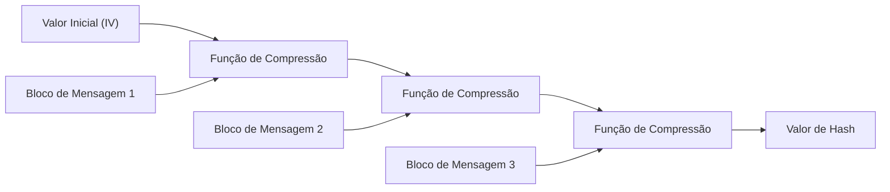
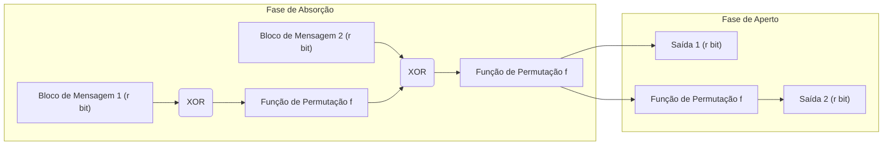

Na sociedade digital moderna, as "funções de hash criptográfico" são amplamente utilizadas como uma tecnologia fundamental para garantir que os dados não foram adulterados e que a parte com quem estamos nos comunicando é realmente quem pretendemos que seja. Suas aplicações são vastas, incluindo o armazenamento de senhas, assinaturas digitais, blockchain e comunicações criptografadas via SSL/TLS. Neste artigo, exploraremos detalhadamente os requisitos das funções de hash criptográfico, como os padrões antigos MD5 e SHA-1 foram quebrados, os problemas estruturais do atual padrão SHA-2 e a inovadora "construção de esponja" do SHA-3 (Keccak), que se tornou o padrão de nova geração após uma competição promovida pelo NIST.

## O que é uma função de hash criptográfico?

Uma função de hash é uma função que recebe dados (uma mensagem) de qualquer tamanho como entrada e gera dados de tamanho fixo (valor de hash, resumo da mensagem ou *message digest*) como saída. Funções de hash usadas para fins criptográficos devem possuir principalmente três propriedades fortes:

1. **Resistência à Pré-imagem (Pre-image Resistance)**
   Dado um valor de hash $h$, deve ser extremamente difícil encontrar a mensagem original $m$ tal que $H(m) = h$. Se isso não for satisfeito, seria possível, por exemplo, fazer a engenharia reversa de uma senha original a partir do seu hash.
2. **Resistência à Segunda Pré-imagem (Second Pre-image Resistance)**
   Dada uma mensagem $m_1$, deve ser difícil encontrar uma mensagem diferente $m_2$ tal que $H(m_1) = H(m_2)$ e $m_1 \neq m_2$.
3. **Resistência à Colisão (Collision Resistance)**
   Deve ser difícil encontrar quaisquer duas mensagens diferentes $m_1$ e $m_2$ tais que $H(m_1) = H(m_2)$. Isso é essencial para evitar ataques (como a falsificação de assinaturas digitais) em que um invasor mal-intencionado cria simultaneamente um "arquivo inofensivo" e um "arquivo malicioso" com o mesmo valor de hash para trocá-los.

Devido a uma propriedade matemática conhecida como Ataque do Aniversário (Birthday Attack), a quantidade de computação necessária para encontrar uma colisão em uma função de hash com uma saída de $N$ bits é proporcional a $2^{N/2}$. Portanto, um comprimento de saída de hash adequado é necessário para manter uma resistência à colisão prática.

## O colapso do MD5 e do SHA-1: Por que as funções de hash do passado foram quebradas?

Entre as funções de hash que já foram as mais utilizadas na internet estão o MD5 (saída de 128 bits), projetado por Ronald Rivest, e o SHA-1 (saída de 160 bits), projetado pela NSA e padronizado pelo NIST. No entanto, hoje elas são consideradas "inseguras" e obsoletas.

O MD5 entrou em colapso efetivamente em 2004, quando pesquisadores chineses publicaram um ataque de descoberta de colisão em tempo prático. Além disso, vulnerabilidades teóricas no SHA-1 foram apontadas em 2005, e em 2017, uma colisão real chamada "SHAttered" foi publicada por equipes de pesquisa do Google e do CWI Amsterdam. Eles conseguiram gerar dois arquivos PDF diferentes com o mesmo valor de hash SHA-1.

A causa raiz do colapso desses algoritmos residia em fraquezas no design de suas funções de compressão internas (por exemplo, uma estrutura que facilitava a compensação do impacto das diferenças das mensagens no estado interno). Isso possibilitou encontrar colisões com muito menos poder computacional do que o necessário para um ataque de força bruta.

## As limitações do SHA-2 e da Estrutura Merkle-Damgård

Em resposta ao comprometimento do MD5 e do SHA-1, o SHA-2, com comprimentos de saída maiores (256 bits, 512 bits, etc.) e estrutura reforçada, tornou-se o padrão atual. No entanto, havia preocupações de design subjacentes ao SHA-2. Ou seja, ele adota a mesma **estrutura Merkle-Damgård** usada no MD5 e no SHA-1.

Na estrutura Merkle-Damgård, a mensagem de entrada é dividida em blocos de tamanho fixo, e um valor inicial (IV) e o primeiro bloco são passados pela função de compressão para gerar um estado intermediário. Então, esse estado intermediário e o próximo bloco são passados novamente pela função de compressão, e esse processo é repetido em cadeia.

Essa estrutura foi confiável por muitos anos, mas é conhecida por uma vulnerabilidade chamada "Ataque de Extensão de Comprimento" (Length Extension Attack). Se o valor de hash $H(M)$ de uma mensagem $M$ e o comprimento de $M$ forem conhecidos, um invasor pode facilmente calcular o valor de hash $H(M || X)$ de $M || X$, onde $X$ são dados adicionais, sem conhecer o conteúdo de $M$. Esse problema introduz um sério risco de segurança na construção simples de Códigos de Autenticação de Mensagem (MAC) (mecanismos como o HMAC foram inventados para evitar isso).

## A Competição SHA-3 e a Vitória do Keccak

Diante das crescentes preocupações sobre a segurança do SHA-2 (principalmente devido a similaridades estruturais), o NIST iniciou em 2007 uma competição aberta para desenvolver o "SHA-3", o padrão de função de hash de nova geração. Houve 64 submissões de todo o mundo e, após anos de rigorosos testes de criptoanálise e avaliações de desempenho, o **Keccak**, projetado por Guido Bertoni, Joan Daemen, Michaël Peeters e Gilles Van Assche, foi selecionado como o vencedor em 2012.

O principal motivo pelo qual o Keccak foi escolhido como SHA-3 foi a adoção de um novo paradigma chamado **"Construção de Esponja" (Sponge Construction)**, que é completamente diferente da estrutura Merkle-Damgård da qual o MD5, SHA-1 e SHA-2 dependiam.

## A Inovação Matemática e de Design da Construção de Esponja

A construção de esponja consiste em duas fases: "Absorção" (Absorbing) e "Aperto" (Squeezing).

### A Composição do Estado Interno: Taxa de Bits (r) e Capacidade (c)
O estado interno do Keccak é representado como uma enorme matriz de bits (1600 bits no SHA-3). Este estado interno é dividido na porção **taxa de bits (Rate, $r$)**, que é usada para entrada/saída de dados, e na porção **capacidade (Capacity, $c$)**, que nunca é exposta diretamente ao exterior (comprimento total do estado $b = r + c$).

A capacidade $c$ atua como uma "caixa preta secreta" que sustenta a segurança. A força de segurança para evitar colisões na saída depende aproximadamente de $c / 2$. Por exemplo, no SHA-3-256, $c$ é definido como 512 bits, fornecendo um nível de segurança de 256 bits.

### Fase de Absorção (Absorbing Phase)
1. A mensagem de entrada é dividida em blocos de $r$ bits (incluindo o preenchimento/padding).
2. O primeiro bloco de mensagem e a porção de $r$ bits do estado interno sofrem uma operação XOR (ou exclusivo).
3. Uma **função de permutação não linear f** é aplicada a todo o estado (bits $r + c$), misturando vigorosamente o estado interno.
4. O próximo bloco de mensagem passa novamente por um XOR com a porção de $r$ bits e a função $f$ é aplicada. Isso se repete até que todos os blocos de mensagem tenham sido processados.

### Fase de Aperto (Squeezing Phase)
1. Após a conclusão da absorção, a porção de $r$ bits do estado interno é extraída e usada como parte da saída.
2. Se mais saída for necessária, a função $f$ é aplicada novamente para atualizar o estado interno, e novos $r$ bits são extraídos. Isso se repete até que o comprimento de saída necessário (por exemplo, 256 bits ou 512 bits) seja alcançado.

### Por que a construção de esponja é superior?

1. **Resistência a ataques de extensão de comprimento**: Uma vez que parte do estado interno (a capacidade $c$) está sempre oculta, os invasores não podem reconstruir todo o estado interno, neutralizando fundamentalmente o ataque de extensão de comprimento que era uma fraqueza da estrutura Merkle-Damgård.
2. **Alta flexibilidade**: Alterando o equilíbrio entre $r$ e $c$, é possível ajustar dinamicamente o desempenho (aumentando $r$) e a segurança (aumentando $c$). Além disso, como uma sequência de números aleatórios pode ser gerada infinitamente enquanto a fase de aperto continuar, o SHA-3 possui versatilidade, podendo ser aplicado não apenas como uma função de hash simples, mas também como um gerador de números pseudoaleatórios (PRNG), cifra de fluxo, código de autenticação de mensagem (MAC) e várias outras primitivas criptográficas.
3. **Eficiência na implementação de hardware**: A função de permutação $f$ do Keccak consiste apenas em operações lógicas em nível de bit (XOR, AND, NOT) e rotações, não exigindo operações aritméticas complexas (como adição). Isso traz uma grande vantagem, pois permite que opere de forma extremamente rápida e com baixo consumo de energia, especialmente quando implementado em hardware (ASICs e FPGAs).

## Conclusão

A história das funções de hash tem sido uma batalha constante contra a criptoanálise. A derrota do MD5 e do SHA-1 pode ser vista como o resultado inevitável de fraquezas em suas funções de compressão internas e da evolução do poder computacional. O SHA-2 continua sendo usado com segurança hoje, mas apresenta limitações de design decorrentes da estrutura Merkle-Damgård.

O SHA-3 (Keccak) e a construção de esponja, que surgiram como a resposta fundamental a essas questões, não foram apenas uma simples atualização de algoritmo, mas um grande avanço que redefiniu a própria arquitetura do hash criptográfico. Seu design flexível e robusto continuará a servir como uma importante pedra angular para garantir a confiança digital, desde futuros dispositivos IoT até sistemas criptográficos avançados para a era da computação quântica.
