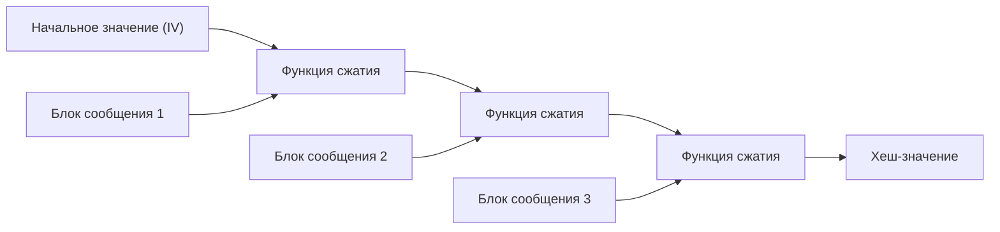
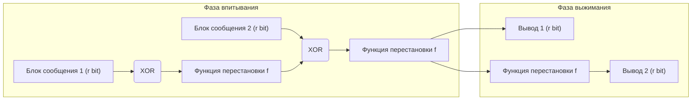

В современном цифровом обществе «криптографические хеш-функции» широко используются в качестве базовой технологии для подтверждения того, что данные не были изменены, и что сторона связи действительно является тем, кем кажется. Спектр их применения весьма широк: от хранения паролей, цифровых подписей, блокчейна до зашифрованной связи с помощью SSL/TLS. В этой статье мы подробно рассмотрим требования к криптографическим хеш-функциям, как были взломаны стандарты прошлого, такие как MD5 и SHA-1, структурные проблемы современного стандарта SHA-2, а также революционную «губчатую конструкцию» (sponge construction) SHA-3 (Keccak), ставшего стандартом нового поколения после конкурса NIST.

## Что такое криптографическая хеш-функция?

Хеш-функция принимает данные произвольной длины (сообщение) и выводит данные фиксированной длины (хеш-значение, дайджест сообщения). Хеш-функции, используемые в криптографии, должны обладать тремя ключевыми свойствами:

1. **Стойкость к поиску прообраза (Pre-image Resistance)**
   При заданном хеш-значении $h$, должно быть крайне сложно найти исходное сообщение $m$, такое что $H(m) = h$. Если это условие не выполняется, можно, например, восстановить исходный пароль из хешированного.
2. **Стойкость к поиску второго прообраза (Second Pre-image Resistance)**
   При заданном сообщении $m_1$, должно быть крайне сложно найти другое сообщение $m_2$, такое что $H(m_1) = H(m_2)$ и $m_1 \neq m_2$.
3. **Стойкость к коллизиям (Collision Resistance)**
   Должно быть крайне сложно найти два любых различных сообщения $m_1$ и $m_2$, таких что $H(m_1) = H(m_2)$. Это необходимо для предотвращения атак (например, подделки цифровых подписей), при которых злоумышленник создает «безобидный файл» и «вредоносный файл» с одинаковым хешем и подменяет их.

Согласно математическому свойству, называемому «атакой «Дня рождения» (Birthday Attack), вычислительная сложность поиска коллизии для хеш-функции с $N$-битным выходом пропорциональна $2^{N/2}$. Следовательно, для обеспечения практической стойкости к коллизиям необходима достаточная длина хеша.

## Крах MD5 и SHA-1: почему прошлые хеш-функции были взломаны?

В прошлом в интернете наиболее широко использовались хеш-функции MD5 (128-битный выход), разработанная Рональдом Ривестом, и SHA-1 (160-битный выход), разработанная АНБ США и стандартизированная NIST. Однако сегодня они считаются «небезопасными» и не рекомендуются к использованию.

В 2004 году китайские исследователи опубликовали алгоритм поиска коллизий для MD5 за практическое время, что фактически означало его крах. В 2005 году была выявлена теоретическая уязвимость и для SHA-1, а в 2017 году исследовательские команды Google и CWI Amsterdam опубликовали практический пример коллизии под названием «SHAttered». Им удалось создать два разных PDF-файла с абсолютно одинаковыми хеш-значениями SHA-1.

Основная причина взлома этих алгоритмов кроется в уязвимостях дизайна внутренних функций сжатия (например, структуры, которая позволяет компенсировать влияние разницы в сообщениях на внутреннее состояние). Это сделало возможным поиск коллизий с гораздо меньшими вычислительными затратами, чем при атаке полным перебором (brute-force).

## Ограничения SHA-2 и конструкции Меркла-Дамгарда (Merkle-Damgård)

В связи с компрометацией MD5 и SHA-1, текущим стандартом стал SHA-2, обладающий большей длиной выхода (256 бит, 512 бит и т.д.) и усиленной структурой. Однако у SHA-2 есть потенциальная структурная проблема. Она заключается в том, что в нем используется та же **конструкция Меркла-Дамгарда (Merkle-Damgård)**, что и в MD5 и SHA-1.

В конструкции Меркла-Дамгарда входное сообщение разбивается на блоки фиксированного размера, и первоначальное значение (IV) вместе с первым блоком подается в функцию сжатия для генерации промежуточного состояния. Затем это промежуточное состояние и следующий блок снова подаются в функцию сжатия, и этот процесс повторяется в виде цепочки.

Эта структура считалась надежной на протяжении многих лет, но известна уязвимость под названием «Атака удлинением сообщения» (Length Extension Attack). Она заключается в том, что если известно хеш-значение $H(M)$ для некоторого сообщения $M$ и длина $M$, злоумышленник может легко вычислить хеш-значение $H(M || X)$ для сообщения $M$, дополненного данными $X$, не зная содержимого $M$. Эта проблема создает серьезные риски для безопасности в простых схемах кодов аутентификации сообщений (MAC) (для предотвращения этого были разработаны такие механизмы, как HMAC).

## Конкурс SHA-3 и победа Keccak

В связи с растущими опасениями относительно безопасности SHA-2 (в основном из-за структурного сходства), NIST в 2007 году начал открытый конкурс на разработку нового стандарта хеш-функции «SHA-3». Было подано 64 заявки со всего мира, и после нескольких лет строгих криптоаналитических испытаний и оценок производительности, в 2012 году победителем был признан алгоритм **Keccak**, разработанный Гвидо Бертони, Йоаном Дайменом, Микаэлем Петером и Жилем Ван Ашем.

Главной причиной выбора Keccak в качестве SHA-3 стало использование совершенно новой парадигмы, называемой **«губчатой конструкцией» (Sponge Construction)**, которая радикально отличается от конструкции Меркла-Дамгарда, на которую опирались MD5, SHA-1 и SHA-2.

## Математические и дизайнерские инновации губчатой конструкции

Как следует из названия, губчатая конструкция состоит из двух фаз: «Впитывание» (Absorbing) и «Выжимание» (Squeezing).

### Структура внутреннего состояния: Битрейт (r) и Емкость (c)
Внутреннее состояние Keccak представляет собой огромный массив битов (1600 бит в SHA-3). Это внутреннее состояние разделено на часть **битрейта (Rate, $r$)**, которая используется для ввода/вывода данных, и часть **емкости (Capacity, $c$)**, которая никогда напрямую не раскрывается наружу (общая длина состояния $b = r + c$).

Емкость $c$ действует как «секретный черный ящик», обеспечивающий основу безопасности. Уровень безопасности для предотвращения коллизий на выходе примерно равен $c / 2$. Например, в SHA-3-256 емкость $c = 512$ бит, что обеспечивает 256-битный уровень безопасности.

### Фаза впитывания (Absorbing Phase)
1. Входное сообщение разбивается на блоки по $r$ бит (включая заполнение/padding).
2. Первый блок сообщения складывается по модулю 2 (XOR) с $r$-битной частью внутреннего состояния.
3. Ко всему состоянию ($r + c$ бит) применяется нелинейная **функция перестановки (Permutation Function $f$)**, которая интенсивно перемешивает внутреннее состояние.
4. Следующий блок сообщения снова складывается по модулю 2 (XOR) с $r$-битной частью, и применяется функция $f$. Это повторяется до тех пор, пока не закончатся все блоки сообщения.

### Фаза выжимания (Squeezing Phase)
1. После завершения впитывания $r$-битная часть внутреннего состояния извлекается и становится частью вывода.
2. Если требуется дополнительный вывод, снова применяется функция $f$ для обновления внутреннего состояния, и извлекаются новые $r$ бит. Это повторяется до достижения необходимой длины вывода (например, 256 бит или 512 бит).

### Почему губчатая конструкция лучше?

1. **Устойчивость к атаке удлинением сообщения**: Поскольку часть внутреннего состояния (емкость $c$) всегда скрыта, злоумышленник не может восстановить внутреннее состояние целиком, что в корне устраняет уязвимость конструкции Меркла-Дамгарда.
2. **Высокая гибкость**: Изменяя баланс между $r$ и $c$, можно динамически настраивать производительность (увеличивая $r$) и безопасность (увеличивая $c$). Кроме того, поскольку фаза выжимания может генерировать последовательность случайных чисел бесконечно долго, SHA-3 — это не просто хеш-функция, но и универсальный алгоритм, который можно использовать в качестве генератора псевдослучайных чисел (PRNG), потокового шифра, кода аутентификации сообщения (MAC) и других криптографических примитивов.
3. **Эффективность аппаратной реализации**: Функция перестановки $f$ в Keccak состоит только из побитовых логических операций (XOR, AND, NOT) и циклических сдвигов, и не требует сложных арифметических вычислений (таких как сложение). Это дает огромное преимущество, поскольку алгоритм работает очень быстро и энергоэффективно, особенно при реализации на аппаратном уровне (ASIC или FPGA).

## Заключение

История хеш-функций — это непрерывная битва с криптоанализом. Поражение MD5 и SHA-1 стало неизбежным следствием уязвимостей внутренних функций сжатия и развития вычислительной техники. Хотя SHA-2 все еще безопасно используется сегодня, у него есть структурные ограничения, обусловленные конструкцией Меркла-Дамгарда.

Появление SHA-3 (Keccak) и губчатой конструкции стало фундаментальным ответом на эти проблемы, совершив прорыв, который переопределил саму архитектуру криптографического хеширования, а не просто обновил алгоритм. Его гибкая и надежная конструкция будет продолжать служить важным краеугольным камнем доверия в цифровой среде, начиная от будущих устройств IoT и заканчивая передовыми криптографическими системами в эпоху квантовых компьютеров.
