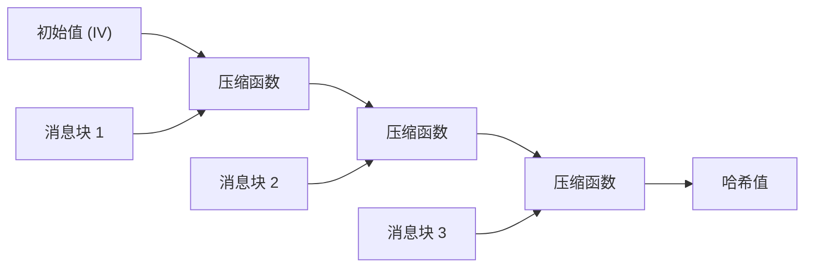
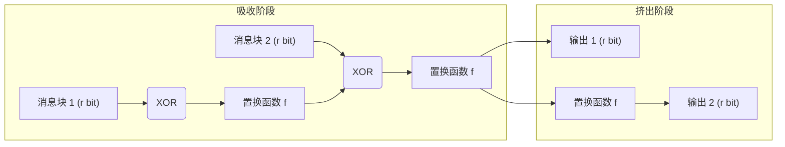

在现代数字社会中，“密码学哈希函数”被广泛用作确保数据未被篡改以及确认通信对象确实是意图对象的基石技术。从密码存储、数字签名、区块链，到基于SSL/TLS的加密通信，其应用范围十分广泛。本文将深入探讨密码学哈希函数的要求，过去作为标准使用的MD5和SHA-1是如何被攻破的，当前主流的SHA-2存在的结构性问题，以及经过NIST竞选成为新一代标准的SHA-3（Keccak）所采用的突破性的“海绵结构”（Sponge Construction）。

## 什么是密码学哈希函数？

哈希函数是一种接受任意长度的数据（消息）作为输入，并输出固定长度数据（哈希值、消息摘要）的函数。用于密码学用途的哈希函数主要需要具备以下三种强大的特性：

1. **抗原像性 (Pre-image Resistance)**
   给定一个哈希值 $h$，极难找到一个原始消息 $m$ 使得 $H(m) = h$。如果不能满足这一点，比如就可以从哈希化的密码中反推出原始密码。
2. **抗第二原像性 (Second Pre-image Resistance)**
   给定一个消息 $m_1$，极难找到另一个不同的消息 $m_2$（$m_1 \neq m_2$），使得 $H(m_1) = H(m_2)$。
3. **抗碰撞性 (Collision Resistance)**
   极难找到任意两个不同的消息 $m_1, m_2$，使得 $H(m_1) = H(m_2)$。这对于防止恶意攻击者同时创建具有相同哈希值的“无害文件”和“恶意文件”并进行替换攻击（例如伪造数字签名）是不可或缺的。

由于称为生日攻击（Birthday Attack）的数学性质，找到输出长度为 $N$ 位的哈希函数碰撞所需的计算量与 $2^{N/2}$ 成正比。因此，为了维持实用的抗碰撞性，需要足够长度的哈希输出。

## MD5与SHA-1的崩溃：过去的哈希函数为何被攻破？

曾经在互联网上被最广泛使用的哈希函数包括由Ronald Rivest设计的MD5（128位输出）和由NSA（美国国家安全局）设计、NIST标准化的SHA-1（160位输出）。然而，现在它们已被视为“不安全”而不推荐使用。

2004年，中国研究人员发表了可以在实用时间内发现MD5碰撞的攻击方法，MD5实际上宣告崩溃。此外，关于SHA-1，2005年指出了其理论上的脆弱性，2017年Google和CWI Amsterdam的研究团队公开了名为“SHAttered”的实际碰撞实例。他们成功生成了两个具有完全相同SHA-1哈希值的不同PDF文件。

这些算法被攻破的根本原因在于其内部使用的压缩函数设计存在弱点（例如，消息差异对内部状态的影响容易被抵消的结构）。这使得攻击者可以用比暴力破解（Brute Force）少得多的计算量找到碰撞。

## SHA-2与Merkle-Damgård结构的局限性

随着MD5和SHA-1的危殆化，输出长度更长（256位、512位等）、结构得到强化的SHA-2成为了当前的主流。然而，SHA-2在设计上存在潜在的隐患。那就是它采用了与MD5和SHA-1相同的 **Merkle-Damgård 结构**。

在Merkle-Damgård结构中，输入消息被分割成固定大小的块，将初始值（IV）和第一个块输入到压缩函数中生成中间状态。之后，将该中间状态与下一个块再次输入到压缩函数中，如此链式重复该过程。

这一结构多年来备受信赖，但已知存在一种被称为“长度扩展攻击（Length Extension Attack）”的脆弱性。这意味着，如果在知道某消息 $M$ 的哈希值 $H(M)$ 和 $M$ 的长度的情况下，攻击者即使不知道 $M$ 的内容，也能轻松计算出附加了额外数据 $X$ 的 $M || X$ 的哈希值 $H(M || X)$。这一问题在简单的消息认证码（MAC）构造中会带来严重的安全风险（为了防止这种情况，设计出了HMAC等机制）。

## SHA-3竞选与Keccak的胜利

由于对SHA-2安全性（主要源于结构相似性）的担忧加剧，NIST于2007年启动了公开竞选，以制定新一代哈希函数标准“SHA-3”。在来自世界各地的64个候选方案中，经过数年严格的密码分析考验和性能评估，2012年由Guido Bertoni、Joan Daemen、Michaël Peeters和Gilles Van Assche等人设计的 **Keccak** 脱颖而出成为胜者。

Keccak被选为SHA-3的最大原因在于，它采用了与MD5、SHA-1、SHA-2所依赖的Merkle-Damgård结构完全不同的，被称为 **“海绵结构 (Sponge Construction)”** 的新范式。

## 海绵结构的数学与设计革新性

顾名思义，海绵结构由“吸收（Absorbing）”和“挤出（Squeezing）”两个阶段组成。

### 内部状态的构成：比特率(r)与容量(c)
Keccak的内部状态表示为一个巨大的比特数组（在SHA-3中为1600位）。该内部状态被分为用于数据输入输出的 **比特率（Rate, $r$）** 部分，以及绝对不会直接暴露在外部的 **容量（Capacity, $c$）** 部分（总状态长度 $b = r + c$）。

容量 $c$ 作为承担安全根基的“秘密黑盒”发挥作用。防止输出碰撞的安全强度大致取决于 $c / 2$。例如，在SHA-3-256中，$c$ 被设定为512位，从而提供256位的安全级别。

### 吸收阶段 (Absorbing Phase)
1. 将输入消息分割为每块 $r$ 位的块（包含填充）。
2. 将第一个消息块与内部状态的 $r$ 位部分进行XOR（异或）运算。
3. 对整体（$r + c$ 位）应用非线性的 **置换函数（Permutation Function $f$）**，剧烈搅动内部状态。
4. 将下一个消息块再次与 $r$ 位部分进行XOR运算，并应用函数 $f$。重复此过程，直到所有消息块处理完毕。

### 挤出阶段 (Squeezing Phase)
1. 吸收完成后，取出内部状态的 $r$ 位部分作为输出的一部分。
2. 如果需要更多的输出，则再次应用函数 $f$ 更新内部状态，并取出新的 $r$ 位。重复此过程，直到达到所需的输出长度（例如256位或512位）。

### 为什么海绵结构更优越？

1. **抗长度扩展攻击**: 由于内部状态的一部分（容量 $c$）始终被隐藏，攻击者无法恢复整个内部状态，从而从根本上消除了Merkle-Damgård结构的弱点——长度扩展攻击。
2. **高灵活性**: 通过改变 $r$ 和 $c$ 的平衡，可以动态调整性能（增大 $r$）和安全性（增大 $c$）。此外，只要继续挤出阶段就能无限生成随机数列，因此SHA-3不仅限于作为哈希函数，还具有可应用于伪随机数生成器（PRNG）、流密码、消息认证码（MAC）等各种密码学原语的通用性。
3. **硬件实现的效率**: Keccak的置换函数 $f$ 仅由位运算（XOR, AND, NOT）和循环移位组成，不需要复杂的算术运算（如加法等）。这带来了一个巨大的优势：特别是在硬件（ASIC或FPGA）实现中，它可以极高速且低功耗地运行。

## 总结

哈希函数的历史是一部不断与密码破解斗争的历史。MD5和SHA-1的失败，可以说是内部压缩函数的弱点和计算机性能提升带来的必然结果。SHA-2目前仍可安全使用，但其面临着源于Merkle-Damgård结构的设计限制。

作为对这些问题的根本解答，SHA-3（Keccak）和海绵结构的出现，不仅仅是简单算法的更新，而是重新定义了密码学哈希架构本身的突破。其灵活且稳健的设计，从未来的IoT设备到面向量子计算机时代的高级加密系统，都将继续作为保障数字信任的重要基石发挥作用。
