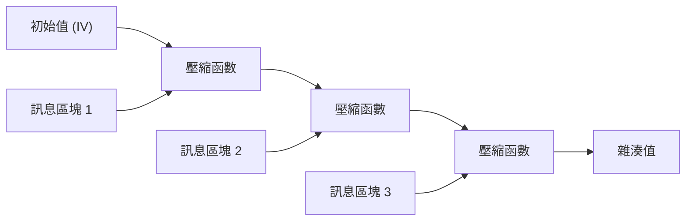
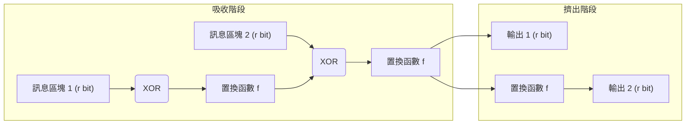

現代數位社會中，「密碼學雜湊函數」被廣泛應用，作為確認資料未遭篡改、以及確保通訊對象為真實意圖對象的基礎技術。從密碼的儲存、數位簽章、區塊鏈，到 SSL/TLS 的加密通訊，其應用範圍十分廣泛。本文將從密碼學雜湊函數所需具備的要件開始，深入探討過去曾是標準的 MD5 與 SHA-1 是如何被攻破的、目前主流 SHA-2 的結構性問題，以及經過 NIST 競賽後成為新世代標準的 SHA-3 (Keccak) 所帶來的劃時代「海綿結構」並深入解說。

## 什麼是密碼學雜湊函數？

雜湊函數是一種將任意長度的資料（訊息）作為輸入，並輸出固定長度資料（雜湊值、訊息摘要）的函數。用於密碼學用途的雜湊函數，主要必須具備以下三種強大的特性：

1. **抗原像性 (Pre-image Resistance)**
   當給定一個雜湊值 $h$ 時，要找到滿足 $H(m) = h$ 的原始訊息 $m$ 是極度困難的。如果不滿足這一點，例如被雜湊化的密碼就能夠被反推出原始密碼。
2. **抗第二原像性 (Second Pre-image Resistance)**
   當給定一個訊息 $m_1$ 時，要找到另一個滿足 $H(m_1) = H(m_2)$ 且 $m_1 \neq m_2$ 的訊息 $m_2$ 是困難的。
3. **抗碰撞性 (Collision Resistance)**
   要找到任意兩個不同的訊息 $m_1, m_2$，使得 $H(m_1) = H(m_2)$ 是困難的。這是為了防止惡意攻擊者同時建立擁有相同雜湊值的「無害檔案」與「惡意檔案」並進行掉包攻擊（例如偽造數位簽章）所不可或缺的特性。

由於一種稱為生日攻擊 (Birthday Attack) 的數學性質，要找到輸出為 $N$ 位元的雜湊函數的碰撞，其計算量與 $2^{N/2}$ 成正比。因此，為了維持實用上的抗碰撞性，需要有足夠長度的雜湊輸出。

## MD5 與 SHA-1 的崩壞：為什麼過去的雜湊函數會被攻破？

過去在網際網路上最被廣泛使用的雜湊函數，包含了由 Ronald Rivest 設計的 MD5（128 位元輸出），以及由 NSA（美國國家安全局）設計並由 NIST 標準化的 SHA-1（160 位元輸出）。然而，現在它們已被標示為「不安全」並遭棄用。

MD5 在 2004 年被中國研究人員發表了可在實用時間內發現碰撞的攻擊手法，實質上已經崩壞。此外，關於 SHA-1，在 2005 年也被指出了理論上的脆弱性，而到了 2017 年，Google 與 CWI Amsterdam 的研究團隊更公開了名為「SHAttered」的實際碰撞案例。他們成功產生了兩個具有完全相同 SHA-1 雜湊值的不同 PDF 檔案。

這些演算法被攻破的根本原因，在於其內部所使用的壓縮函數設計存在弱點（例如：訊息的差異容易在內部狀態中相互抵消的結構）。這使得攻擊者能夠以比暴力破解少得多的計算量來找出碰撞。

## SHA-2 與 Merkle-Damgård 結構的極限

在 MD5 與 SHA-1 遭到危及之後，輸出長度更長（256 位元、512 位元等）且結構獲得強化的 SHA-2 成為了現在的主流。然而，SHA-2 在設計上存在著潛在的隱憂。那就是它採用了與 MD5 及 SHA-1 相同的 **Merkle-Damgård 結構**。

在 Merkle-Damgård 結構中，會將輸入訊息分割成固定大小的區塊，並將初始值 (IV) 與第一個區塊輸入壓縮函數中以產生中間狀態。之後，再將該中間狀態與下一個區塊再次輸入壓縮函數，如此連鎖地重複進行處理。

這種結構雖然多年來備受信任，但存在著被稱為「長度延伸攻擊 (Length Extension Attack)」的已知漏洞。這是指當攻擊者知道某個訊息 $M$ 的雜湊值 $H(M)$ 以及 $M$ 的長度時，即使不知道 $M$ 的內容，也能輕易計算出在附加了額外資料 $X$ 後的 $M || X$ 的雜湊值 $H(M || X)$。這個問題在訊息鑑別碼 (MAC) 的簡單構造中會帶來嚴重的安全風險（為了防止這種情況，後來設計出了 HMAC 等機制）。

## SHA-3 競賽與 Keccak 的勝利

由於對 SHA-2 安全性的擔憂（主要是因為結構上的相似性）日益增加，NIST 在 2007 年展開了公開競賽，以制定新世代的雜湊函數標準「SHA-3」。來自世界各地的 64 件投稿，經過數年嚴格的密碼分析考驗與效能評估後，在 2012 年由 Guido Bertoni, Joan Daemen, Michaël Peeters, Gilles Van Assche 等人所設計的 **Keccak** 脫穎而出，成為最終勝出者。

Keccak 能被選為 SHA-3 的最大理由，在於它採用了一種名為 **「海綿結構 (Sponge Construction)」** 的全新典範，這與 MD5、SHA-1、SHA-2 所依賴的 Merkle-Damgård 結構截然不同。

## 海綿結構的數學與設計革新性

海綿結構，顧名思義，是由「吸收 (Absorbing)」與「擠出 (Squeezing)」兩個階段所構成。

### 內部狀態的構成：位元率 (r) 與容量 (c)
Keccak 的內部狀態被表示為一個巨大的位元陣列（在 SHA-3 中為 1600 位元）。這個內部狀態被分割為用於資料輸入輸出的 **位元率 (Rate, $r$)** 部分，以及絕對不會直接暴露於外部的 **容量 (Capacity, $c$)** 部分（總狀態長度 $b = r + c$）。

容量 $c$ 作為擔綱安全核心的「秘密黑盒子」來運作。防止輸出碰撞的安全強度，大致上取決於 $c / 2$。例如，在 SHA-3-256 中設定了 $c = 512 位元，提供了 256 位元的安全層級。

### 吸收階段 (Absorbing Phase)
1. 將輸入訊息分割為每塊 $r$ 位元的區塊（包含填充）。
2. 將第一個訊息區塊與內部狀態的 $r$ 位元部分進行 XOR（互斥或）運算。
3. 對整體（$r + c$ 位元）套用非線性的 **置換函數 (Permutation Function $f$)**，劇烈地攪拌內部狀態。
4. 再將下一個訊息區塊與 $r$ 位元部分進行 XOR 運算，並套用函數 $f$。重複此步驟直到所有訊息區塊處理完畢。

### 擠出階段 (Squeezing Phase)
1. 吸收完成後，取出內部狀態的 $r$ 位元部分作為輸出的一部分。
2. 若需要更多輸出，則再次套用函數 $f$ 以更新內部狀態，並取出新的 $r$ 位元。重複此步驟直到達到所需的輸出長度（例如 256 位元或 512 位元）。

### 為什麼海綿結構更為優越？

1. **對長度延伸攻擊的抗性**: 由於內部狀態的一部分（容量 $c$）始終被隱藏，攻擊者無法還原整個內部狀態，從根本上讓 Merkle-Damgård 結構中脆弱的長度延伸攻擊失效。
2. **高度的彈性**: 藉由改變 $r$ 與 $c$ 的比例，可以動態調整效能（增大 $r$）與安全性（增大 $c$）。此外，只要持續進行擠出階段，就能無限產生亂數序列，因此 SHA-3 不僅僅是一個雜湊函數，它還具備作為偽亂數產生器 (PRNG)、串流密碼、訊息鑑別碼 (MAC) 等各種密碼學基元來應用的泛用性。
3. **硬體實作的效率性**: Keccak 的置換函數 $f$ 僅由位元等級的邏輯運算 (XOR, AND, NOT) 與旋轉所構成，不需要複雜的算術運算（如加法等）。這帶來了巨大的優勢，特別是在硬體（ASIC 或 FPGA）實作上，能以極高的速度且低功耗的方式運作。

## 總結

雜湊函數的歷史，就是一部與密碼分析不斷對抗的歷史。MD5 與 SHA-1 的落敗，可以說是內部壓縮函數的弱點與計算機效能演進所帶來的必然結果。儘管 SHA-2 目前仍被安全地使用著，但它背負著起因於 Merkle-Damgård 結構的設計限制。

作為對這些問題的根本解答而登場的 SHA-3 (Keccak) 與海綿結構，並非只是單純的演算法更新，而是重新定義了密碼學雜湊架構本身的重大突破。其彈性且堅固的設計，從未來的 IoT 裝置到放眼量子電腦時代的先進密碼系統，將會持續作為確保數位信任的重要基石而運作。
